# ABOUT GAGGENAU

<small style="color:#888">图：Gaggenau 官方标识。图源：Gaggenau 官网素材库。</small>

## 01 开篇

在法国 Lipsheim 的工厂里，有一款烤箱的日产量通常不超过个位数。它不是限量纪念款，而是 Gaggenau 的常规产品 EB 333：门板由一整片 3 毫米厚的不锈钢板制成，门体里叠了五层玻璃，整扇门重 20 公斤；炉腔在 485℃ 下自我清洁时，门的外表面仍能保持凉感，人可以放心地把手贴上去。

一家年营收超过百亿欧元的工业集团，愿意把一款量产烤箱保持在这种手工节拍上，这件事在厨电行业近乎反常识。要解释它，得把 Gaggenau 放回三百多年的时间线里，看一条材料线索如何从铁钉、搪瓷招牌一路走到蓝色的炉腔，再看它怎样把"专业厨房"这件很重的事，嵌进一个个家庭的建筑里。

## 02 品牌概述

Gaggenau 是德国超高端嵌入式厨电品牌，1995 年起隶属博西家电（BSH），产品覆盖烤箱、蒸烤箱、灶具、排烟、冷藏与酒柜、咖啡机与洗碗机。它的核心，是把专业厨房的性能标准、手工制造的克制，以及"机器应融入建筑而非占领厨房"的信念，同时压进每一件家用产品。媒体常称它为世界上历史最悠久的厨房电器品牌；严谨地说，它 1683 年创立时是一座铁器作坊，进入炉灶领域是此后近两百年的事。

| 项目 | 内容 |
|---|---|
| 品牌名 | Gaggenau（嘉格纳）· [https://www.gaggenau.com](https://www.gaggenau.com) |
| 国家/地区 | 德国（BSH 慕尼黑总部 · 法国 Lipsheim 生产） |
| 成立时间 | 1683 年（铁器作坊起源）；1995 年并入 BSH |
| 起源与关键人物 | 巴登藩侯路德维希·威廉建立工坊；Otto von Blanquet 将公司引向炉灶；其子 Georg von Blanquet 开启嵌入式厨电时代 |
| 代表性设计人物 | Sven Baacke（全球设计负责人）；工业设计师 Alexander Stuhler；交互与界面设计师 Sören Strayle |
| 其他关键人物 | 米其林三星主厨 Marc Haeberlin（蒸烤箱研发合作）；EB 333 生产负责人 Jörg Neuner |
| 官方理念 | "Form follows function"；"traditional avant-garde（传统前卫）"；"如果厨房是家的心脏，Gaggenau 就是它的灵魂" |
| 品牌归属 | BSH 集团（2024 财年营收 153 亿欧元，全球员工逾 5.7 万人） |
| 核心业务 | 烤箱与蒸烤箱、Vario 模块化灶具、排烟、冷藏与酒柜、咖啡机、洗碗机、保温与真空抽屉 |
| 经典产品 | EB 333 烤箱、Vario 400 灶具系统、ED 220 蒸烤箱、CX 492 全表面感应灶、IK 300 对开门冰箱、Expressive / Minimalistic 系列 |

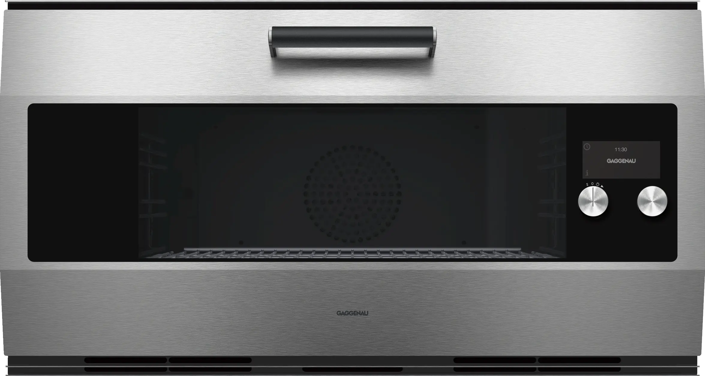

<small style="color:#888">图：EB 333 官方产品图，90 公分一体式不锈钢门面。图源：BSH 官方媒体素材（Gaggenau EB333110 产品页）。</small>

## 03 Brand 品牌：从铁钉作坊到"厨房的灵魂"

### 材料线索：从铁钉到蓝色炉腔

1683 年，黑森林边缘还是一群世代贫苦的农民。当地领主、巴登藩侯路德维希·威廉想给农民找一条生路，于是做了一件事：在 Rotenfels 建冶炼工坊，在 Gaggenau 村建锤锻与制钉作坊。公司最早的产品，是铁钉和铁锤。

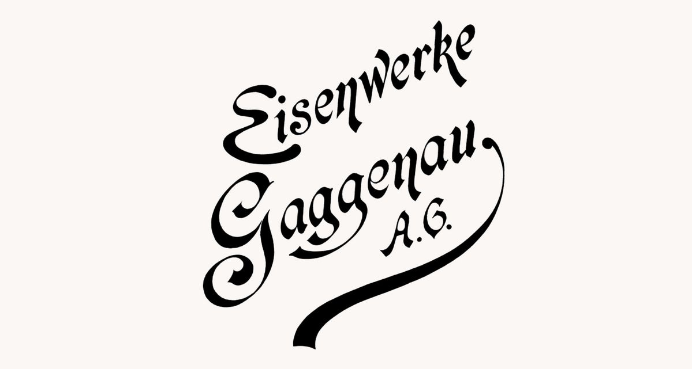

<small style="color:#888">图：官方历史页中的 1683 年公司徽章草图。图源：Gaggenau 官方品牌历史页。</small>

作坊随后从五金工具进入农用机械，又因为一项手艺找到了自己的位置：搪瓷。Gaggenau 一度为 Odol、Maggi、Stollwerck 等品牌制作耐用的搪瓷广告招牌。这项技术后来沉淀成烤箱的耐高温珐琅内壁，再演变为今天那抹标志性的蓝色炉腔。从广告招牌延伸到烹饪表面，这条材料线索被同一家公司保存了三百年，这在行业里几乎是独一份的连续性。

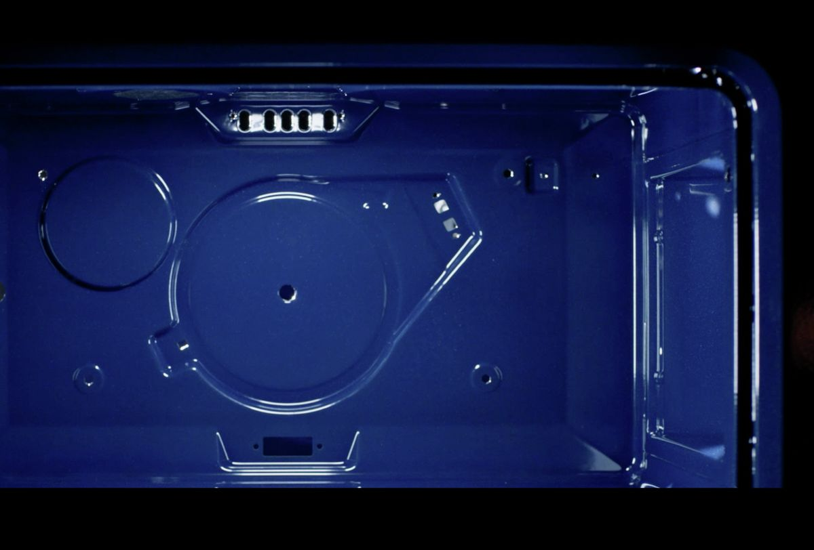

<small style="color:#888">图：官方历史页时间线的搪瓷主题图，蓝色炉腔的远祖。图源：Gaggenau 官方品牌历史页。</small>

它甚至造过自行车。到 1908 年，Gaggenau 累计卖出 25 万辆 "Badenia" 自行车。官方历史认为，这段经历让公司记住了三件事：人机工学、制造品质、有辨识度的设计。这三个词后来几乎可以概括 Gaggenau 的一切。

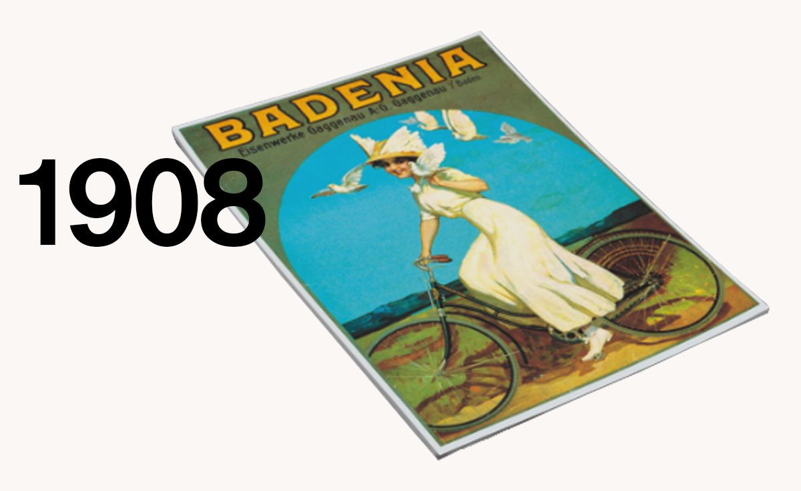

<small style="color:#888">图：1908 年 Badenia 自行车广告海报。图源：Gaggenau 官方品牌历史页。</small>

### von Blanquet 家族与"嵌入式"革命

真正把 Gaggenau 送上厨电路线的，是 von Blanquet 家族。Otto von Blanquet 接手后，公司把全部精力转向燃煤与燃气炉灶；1940 年代末开始生产经济实用的燃气炉，也第一次制造电烤箱，约 180 名工人参与生产 "Favorit" 与 "Futura" 型号。

转折发生在其子 Georg von Blanquet 手里。Georg 是痴迷烹饪的业余厨师，他对公司有一条近乎苛刻的要求：新功能必须先证明对厨师有用，必须扛得住真正的厨房，还必须好看。1956 年，Gaggenau 把第一台齐眼高的嵌入式烤箱、分体式灶具与通风电器带上了市场。今天看来理所当然的"嵌入式厨房"，在当时是把整个行业从"一件大家具"推向"一套系统"。

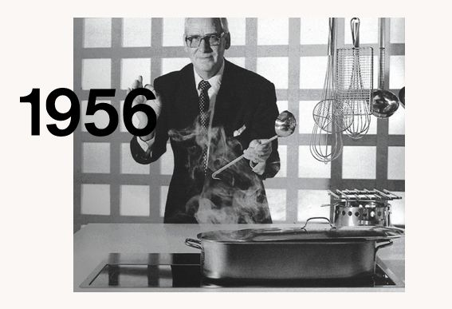

<small style="color:#888">图：官方历史页时间线的 1956 年图，嵌入式厨房的起点。图源：Gaggenau 官方品牌历史页。</small>

1960 年代末，Gaggenau 请人设计了沿用至今的标识。官方历史很坦白：这款标识和产品一样受包豪斯影响，"Form follows function"从此成为核心信念。对一家从铁匠铺走来的公司来说，这是它第一次把自己明确放进现代主义设计史。

### 系统思维：Vario 与 90 公分的烤箱

1970 年代初，第一批 28 公分宽的 Vario 灶具出现，旋钮装在台面以上；1976 年前后，Gaggenau 又把下吸式排烟引入欧洲市场。别人做一整台灶，它开始做可以自由拼装的"零件"。这种系统思维后来成为它区别于所有对手的底层结构。

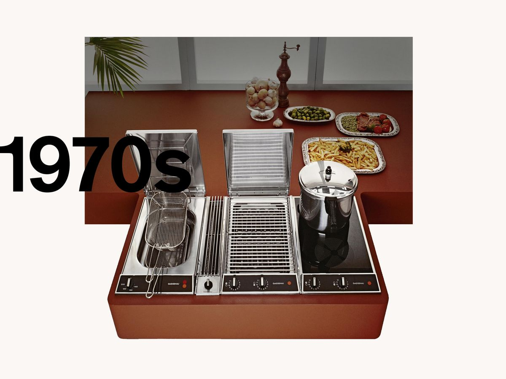

<small style="color:#888">图：官方历史页中的 1970 年代 Vario 前身。图源：Gaggenau 官方品牌历史页。</small>

1986 年是另一个分水岭：第一台 90 公分宽的烤箱进入欧洲市场，净容积 87 升，能同时放下四份烤肉。它是 Georg von Blanquet 的个人项目，灵感来自宽大厚实的美国整体炉灶，目标是让欧洲家庭也拥有"同时处理好几道菜"的体量。官方历史给它的评语很简短："很快就获得了 cult 般的地位。"此后这个词不断被用来描述这款烤箱——它从诞生起就不是大众商品，而是少数人认出的"圈子符号"。

<small style="color:#888">术语注释：cult——产品在小众圈层中被狂热追捧、近乎信仰的地位。</small>

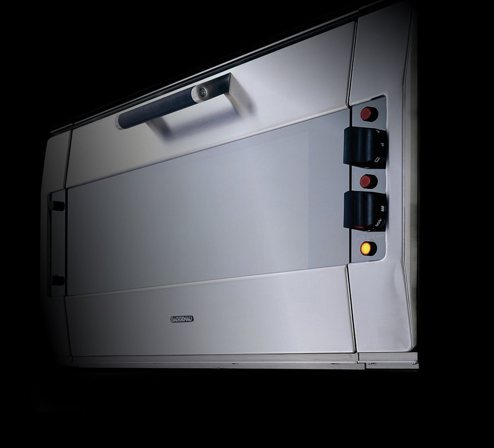

<small style="color:#888">图：官方历史页中的 1986 年 EB 300。图源：Gaggenau 官方品牌历史页。</small>

这里有一个值得研究者注意的细节：这台烤箱最初的型号名，官方自己的口径并不统一——EB 333 产品页的时间轴写 1986 年推出的是 EB 374，同页正文称其为 EB 375，公司史料又习惯用 EB 300 称呼整条产品线。可确证的只有：1986 年、90 公分宽、以美式炉灶为灵感、在欧洲市场没有先例，以及它后来三十多年几乎未做大改的生命力。

### 冷藏：IK 300 与美式启发的重做

1990 年，Gaggenau 推出 IK 300，把冷藏与冷冻分成两个独立空间、各开各的门，配五个气候区与手动湿度控制，还带一台透明冰块机。它说明 Gaggenau 对待制冷的态度和对待烤箱一致：先把某一类产品的极限研究透，再按自己的标准重做一遍。

### 集团化：1995 年并入 BSH

1995 年，Gaggenau 并入 BSH 集团，研发与生产随后整体迁往法国阿尔萨斯的 Lipsheim。

### 蒸烤箱：ED 220 与家用化的开端

1999 年，ED 220 蒸烤箱上市——据官方资料，这是全球第一台为家庭厨房工业化生产的蒸烤箱，可接水管供水，研发过程与专业厨师紧密合作，合作名单里有米其林三星主厨 Marc Haeberlin。当时蒸汽烹饪对西方家庭还很陌生，Gaggenau 赌的是"健康烹饪会成为家用需求"。二十多年后回看，这一赌成了：蒸烤箱已经成为高端厨电的标准品类。

### 后续主线：系统扩列与全球化

此后的节奏没有偏离这条主线：2012 年在米兰 Eurocucina 发布 Vario 400 灶具系统；2016 年在品牌 333 周年之际推出向 EB 300 致敬的 EB 333；2020 年代先后推出 Expressive 与 Minimalistic 两套全新系列；2026 年米兰设计周期间在 Villa Necchi Campiglio 以 Presence 装置完成整体亮相。官方历史里有一句总结，是理解这家公司最好的入口："如果厨房是家的心脏，Gaggenau 就是它的灵魂。"

## 04 Category 品类与市场：超高端嵌入式的牌桌

理解 Gaggenau，要先看它坐在哪张牌桌上。它不参加大众厨电的价格竞争，也不完全属于"高端"这个宽泛的段位——它身处超高端嵌入式细分市场：设备嵌进橱柜与建筑，由建筑师和室内设计师写进方案，客户为的不只是一台能用的机器。

### 市场规模的判断口径

据 Euromonitor 数据（经 LG 新闻稿转述），2025 年全球嵌入式厨电市场规模预计约 645 亿美元，欧洲约占四成，是最大的单一市场。更窄的"奢华厨电"细分，第三方机构 Emergen Research 给出 2025 年约 214.5 亿美元、2035 年约 377.3 亿美元的估算（年均复合增速约 5.7%）。两个数字都需要打上"方向性"标签——不同机构对奢华的定义不同，绝对值仅供参考；但"高端嵌入式的盘子远小于大众厨电、且仍在增长"这个方向是清楚的。

母公司 BSH 的体量可以说明 Gaggenau 的集团环境：2024 财年营收 153 亿欧元，全球员工逾 5.7 万人，研发投入 8.35 亿欧元、约占营收 5.5%。集团在北美的品牌组合是 Bosch、Thermador、Gaggenau 三张牌，2024 年在迈阿密与休斯顿新开体验设计中心，华盛顿特区和比佛利山随后跟进。Gaggenau 在集团里的角色是金字塔尖：负责守住超高端的天花板。

### 品类惯例

品类里有一些不成文的惯例（category codes）：一台超高端嵌入式设备应当做到齐平或近乎齐平的安装、整块金属立面而非拼接塑料、感应加热、蒸汽烹饪、App 互联。Gaggenau 不是这些惯例的发明者，但它在几条惯例上走得比同行更远：90 公分宽的烤箱体量、485℃ 自清洁、全表面感应、把蒸烤箱接上水管。

<small style="color:#888">术语注释：category codes——该品类中消费者默认接受的规则与符号。</small>

### 技术路线与行业趋势

技术路线层面，电气化是最明显的一条：感应灶正在替代燃气，全表面感应允许锅具随意摆放；蒸汽与低温烹饪把"健康"从营销词变成可验证的规格；互联让烤箱、App 与食谱库连成一体；可持续则体现为长寿、备件供应与可维修。这些变化决定了竞争的胜负手不在于"参数更多"，而在于参数能否兑现为体验，以及谁能让设备真正长进建筑里。

## 05 User 用户与场景：谁在为什么买单

Gaggenau 的用户不能只按人口统计切。真正决定购买结构的，是一个"买的人、定的人、用的人"经常不重合的三层网络。

### 决策链：买者、定者与使用者

买的人通常是高净值业主，成交发生在新建豪宅或整体翻新的厨房工程里。定的人是建筑师与室内设计师——他们不是消费者，却是最重要的把关人：设备在图纸阶段就被指定，事后更换成本极高。Gaggenau 为这个群体准备了成套的设计文件、安装规划说明和 Vario 开孔计算器，服务对象一目了然。用的人则是家庭成员、私人厨师或重度烹饪爱好者，他们关心的核心问题是：烤箱能否稳定地同时处理四份烤肉，蒸汽能否把面包表皮和水分控制在理想状态。

如果按"任务"来拆解（JTBD）：功能任务是稳定、精准、可预测的烹饪结果；情感任务是待客时的体面与自我表达；社会任务是"我的厨房被行家看见时经得起打量"。这也解释了为什么 Gaggenau 的营销不主打参数，而主打"专业厨房的标准"与"为懂的人准备"。

<small style="color:#888">术语注释：JTBD（Jobs to Be Done）——用户真正雇佣产品或服务完成的任务。</small>

### 场景与入口

与购买结构对应的使用场景有三类。第一是社交型厨房：开放式厨房在超高端住宅里是客厅的延伸，设备必须经得起被看见。第二是专业型厨房：家里请厨师，或业主本身就是重度爱好者。第三是空间工程：度假屋、酒窖、雪茄室这类项目需要设备服从空间，而不是反过来。

品牌进入用户头脑的入口（CEP）集中在几个时刻：新房交付与厨房改造的装修决策、建筑师选型阶段、逛品牌展厅的当下、在米其林餐厅或样板间里瞥见它的瞬间。这些入口都很窄、很具体，意味着品牌必须在一个高客单、长周期的决策链里持续被记住——这也是它常年经营餐厅、晚宴、葡萄酒大奖与杂志的原因。

<small style="color:#888">术语注释：CEP（Category Entry Points）——消费者在哪些购买与使用情境下会想起该品牌。</small>

## 06 Positioning 定位：一条从承诺到证据的链

Gaggenau 的定位可以用一句话立住：把专业厨房的标准搬进家庭，并让设备成为建筑的一部分，而不是房间里的家具。

它有别于对手的差异点（POD）不在单一功能，而在几件事的组合：专业级性能参数（300℃ 烤制、485℃ 自清洁、90 公分烤箱体量、全表面感应）；以手工为主的制造方式；标志性的蓝色珐琅内壁；以及 Vario 模块化系统提供的"设备由人配置"的自由。它与超高端同行必须共有的基准点（POP）也很清楚：嵌入式安装、App 互联、高端服务网络。

<small style="color:#888">术语注释：POD（Point of Difference）——品牌相对竞品独有的差异点。</small>

<small style="color:#888">术语注释：POP（Points of Parity）——消费者对这类产品的基本预期，即与竞品必须共有的基准点。</small>

真正值得拆解的是定位如何向下兑现。按"品牌承诺 → 产品承诺 → 产品原则 → 产品证据"的链条看：

- 品牌承诺：专业厨房的标准可以被带回家；
- 产品承诺：高温、蒸汽、体量与材料都要达到商用设备同级；
- 产品原则：功能先于形式，材料诚实，机器融入建筑；
- 产品证据：20 公斤重、五层玻璃的门在 485℃ 下外表面保持凉感；整片 3 毫米不锈钢门板；炉腔内的催化器过滤油烟与气味；Lipsheim 工厂里"只有一道工序是全自动的"。

这条链的意义在于：Gaggenau 的定位可以被产品当场验证。消费者摸到那扇门、转动实心不锈钢旋钮、看见蓝色珐琅内壁的时候，品牌承诺已经兑现了一部分。这是它与很多"广告型高端品牌"的根本区别，也是设计师研究它时最值得琢磨的结构。

## 07 Product 产品：组合结构与设计故事

### 家族结构：图标、前沿、中坚与系统

Gaggenau 的产品组合看似庞杂，内部其实是一套清晰的层级：一个图标产品守住传承（halo product），两条系列线覆盖不同审美，一套模块系统承接自由度，再用一圈外围产品补齐厨房的完整场景。

<small style="color:#888">术语注释：halo product（光环产品）——用来拉升整体品牌认知的形象型产品。</small>

| 层级 | 代表 | 角色 |
|---|---|---|
| 图标 | EB 333 | 光环产品，90 公分体量与手工叙事 |
| 前沿 | 400 系列（Expressive / Minimalistic） | 全新审美表达，60/76 公分 |
| 中坚 | 200 系列 | 齐平安装的"安静"选项，60 公分 |
| 系统 | Vario 400 / CX 492 | 模块自由与技术旗舰 |
| 外围 | 蒸烤箱、组合微波、冷藏酒柜、咖啡机、洗碗机、抽屉 | 完整厨房生态 |

围绕主线还有蒸烤箱、微波组合烤箱、排烟、冷藏与酒柜（双温区，5℃ 至 20℃ 可调）、全自动咖啡机（CM 系列）、洗碗机（DF 系列，400 系列带按压开门与背光）以及保温与真空抽屉。曾几何时，Gaggenau 的产品线里还有洗衣机和干衣机，如今已不在主流目录——它把边界收回到厨房本身，这一收缩本身就是产品定义策略的一部分。

### EB 333（2016）：90 公分的一扇门

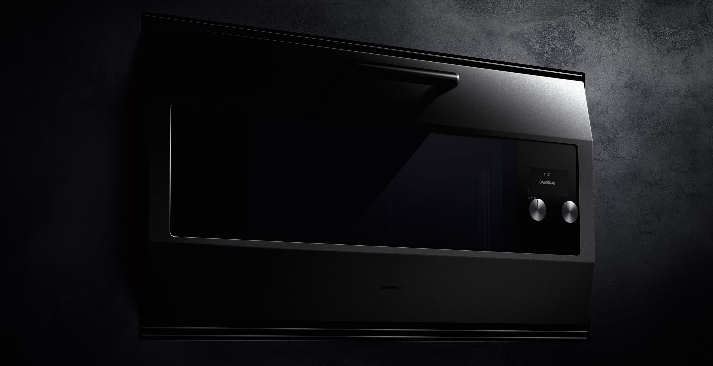

<small style="color:#888">图：EB 333 一体式门面官方主图（2400px）。图源：Gaggenau EB333 官方落地页。</small>

EB 333 的故事要从 1986 年讲起。时任掌舵人 Georg von Blanquet 从宽大厚实的美式整体炉灶获得灵感，想把那种"一次处理四份烤肉"的体量感搬进欧洲家庭。这款 90 公分烤箱以净容积 87 升进入市场，官方历史只用了"很快获得 cult 地位"来概括它的命运。它的设计超前到如此程度，以至于此后三十多年几乎没有需要改动的地方。

<small style="color:#888">术语注释：cult——产品在小众圈层中被狂热追捧、近乎信仰的地位。</small>

2016 年，恰逢品牌 333 周年，Gaggenau 推出向 EB 300 致敬的 EB 333，并专门拍摄了记录它诞生的影片。今天的 EB 333 有 17 种加热方式，温区从 30℃ 覆盖到 300℃：38℃ 发酵面团、250℃ 用烘焙石烤面包、300℃ 给肉上色、485℃ 高温自清洁。设计负责人 Sven Baacke 说它"正好站在传承与未来的中间点上"。

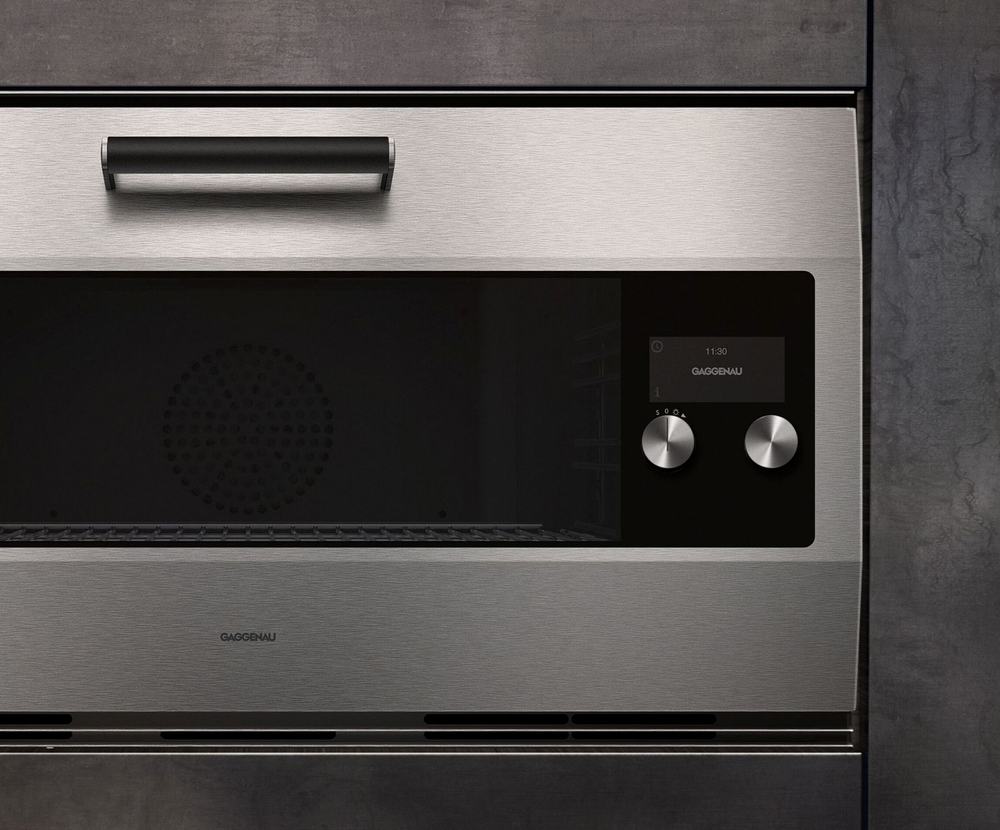

<small style="color:#888">图：EB 333 2016 年发布轮播图。图源：Gaggenau EB333 官方落地页。</small>

官方产品页：<https://www.gaggenau.com/global/appliances/ovens/eb-333>

### 型号迭代：从 EB 374 到 EB 333

研究 EB 333 最好的方式，是看它在官方页面里留下的代际证据：1986 年 EB 374（史料亦写作 EB 375 / EB 300）、1989 年 EB 378、1997 年 EB 388、2004 年 EB 388 改款、2016 年 EB 333。每一代都保持 90 公分宽度与整片金属门面，变的只是内部加热系统、界面和表面细节——这种"外壳稳定、内核换代"的节奏，是高端厨电里罕见的产品定义策略。

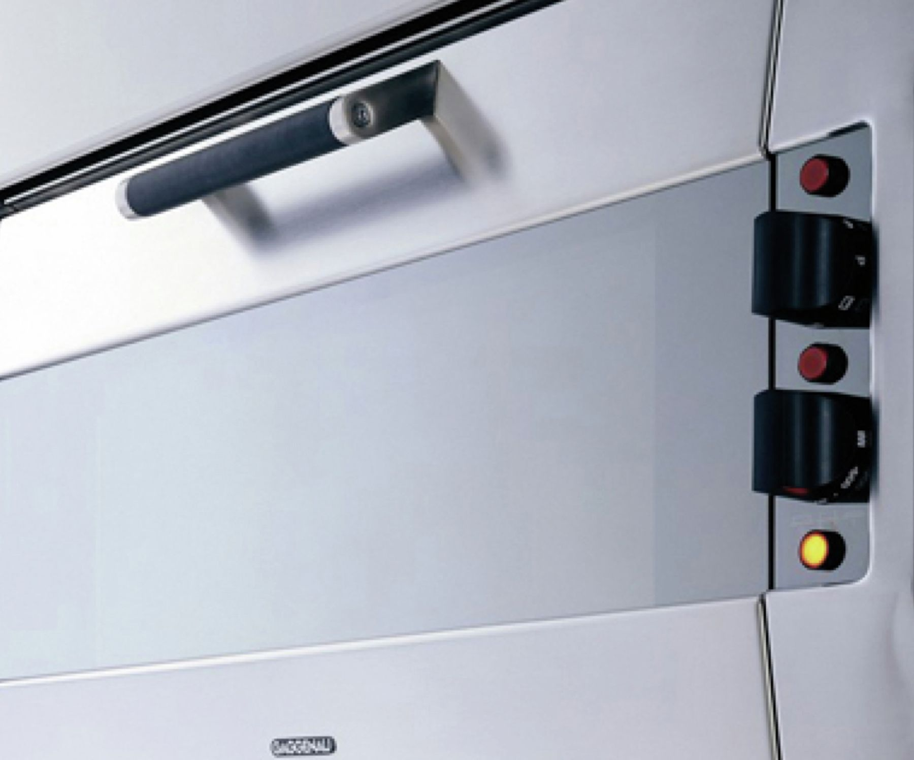
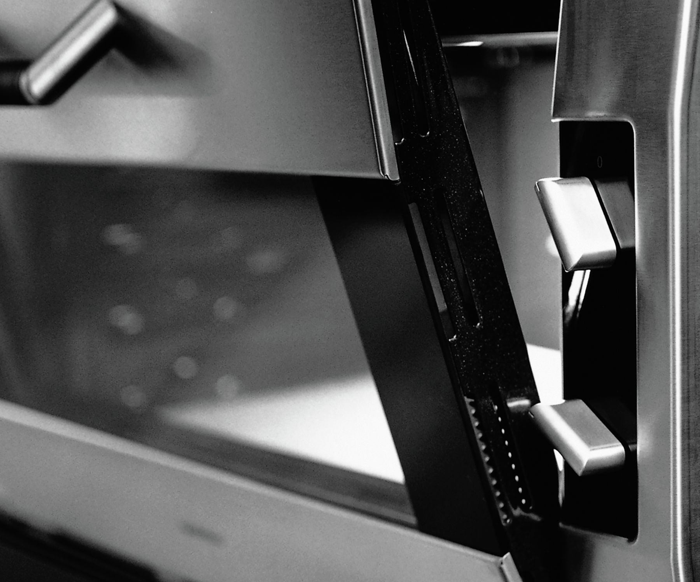
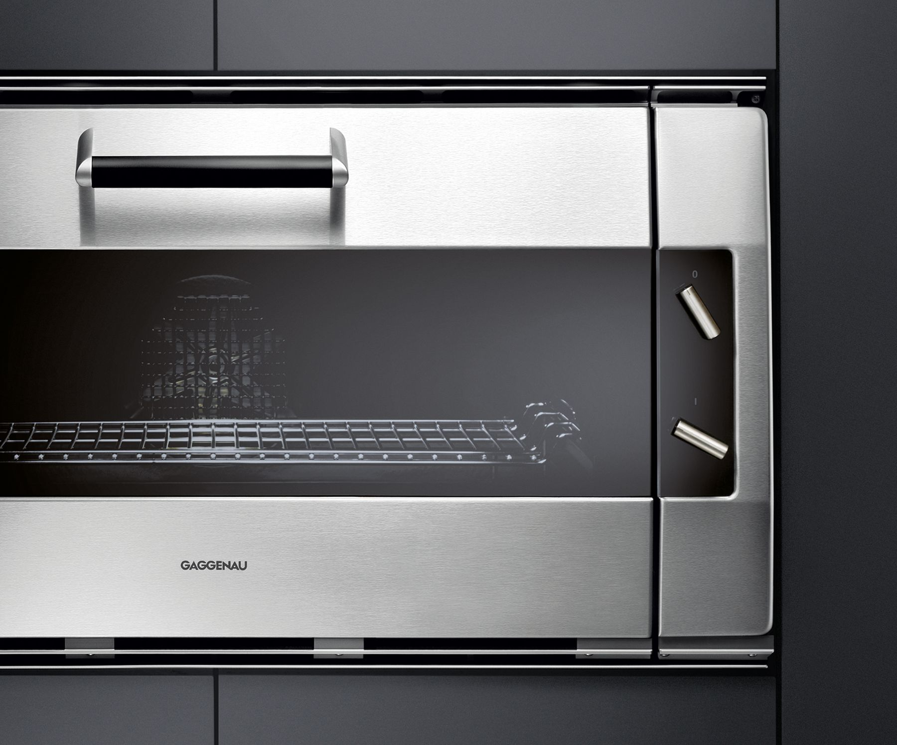

<small style="color:#888">图（从左至右）：官方落地页时间轴中的 EB 378（1989）、EB 388（1997）与 EB 388 改款（2004）。图源：Gaggenau EB333 官方落地页。</small>

### ED 220（1999）：第一次把蒸烤箱带回家

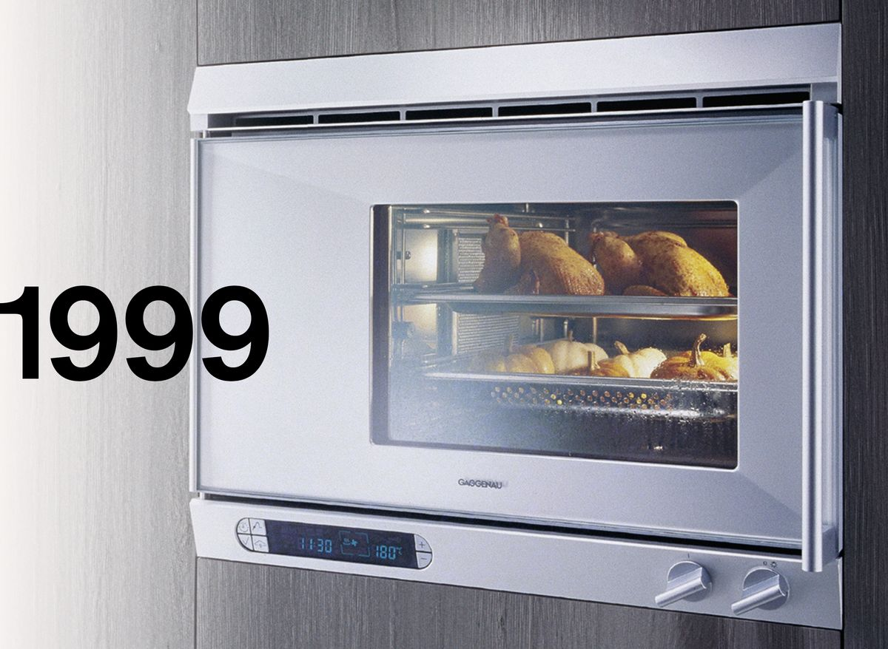

<small style="color:#888">图：官方历史页中的 1999 年 ED 220。图源：Gaggenau 官方品牌历史页。</small>

1999 年之前，蒸烤箱主要是专业厨房的设备；Gaggenau 决定把它搬进家庭。据官方资料，ED 220 是全球第一台为家庭厨房工业化生产的蒸烤箱：可接水管连续供水，用蒸汽配合热风实现低温慢煮与健康烹饪。研发过程与专业厨师紧密合作，包括米其林三星主厨 Marc Haeberlin——他在阿尔萨斯拥有传奇餐厅 Auberge de l'Ill，对蒸制的理解直接进入产品定义。

这一决策在当时是冒险的：蒸汽烹饪对西方家庭陌生，用户需要学习新的操作方式。Gaggenau 赌的是健康烹饪会变成家用需求。二十多年后回看，这一赌成了——蒸烤箱成为高端厨电的标准品类，ED 220 的定义方式（接水管、专业厨师参与、健康叙事）也被同行反复沿用。

### IK 300（1990）：把美式对开门翻译成自己的语言

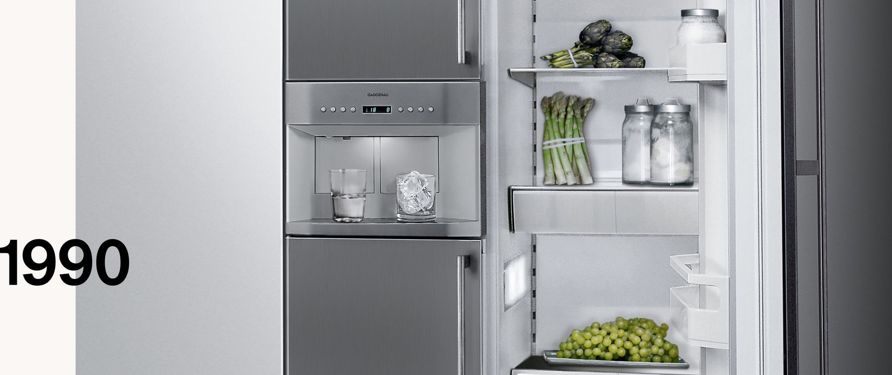

<small style="color:#888">图：官方历史页中的 1990 年 IK 300。图源：Gaggenau 官方品牌历史页。</small>

在烤箱之外，Gaggenau 用同样的方法处理过制冷。IK 300 受宽大的美式独立对开门冰箱启发，把冷藏与冷冻分成两个独立空间，各开各的门，配五个气候区和手动湿度控制，还有一台透明冰块机。它的意义不在冰箱本身，而在方法：Gaggenau 不做"美国产品的德国翻版"，而是先研究透某类产品的用户场景，再按自己的标准重做。后来的 Vario 400 冷藏系列与酒柜，都是这条路的延续。

### Vario 400（2012）：模块化的灶具系统

Vario 是 Gaggenau 自由度主张的载体。它不卖"一台灶"，而卖可以自由拼装的模块：燃气灶、感应灶、弹性感应、铁板烧、深炸锅、蒸格、炒锅、电烤架与下吸式排烟，模块宽度从 38 公分起，可组合到 90 公分（部分市场资料提到 1 米）。不用的模块用不锈钢盖板盖平，台面恢复成完整平面——设备不再是房间里的物件，而成了可以随烹饪方式改变的表面。

### CX 492（2020）：全表面感应灶

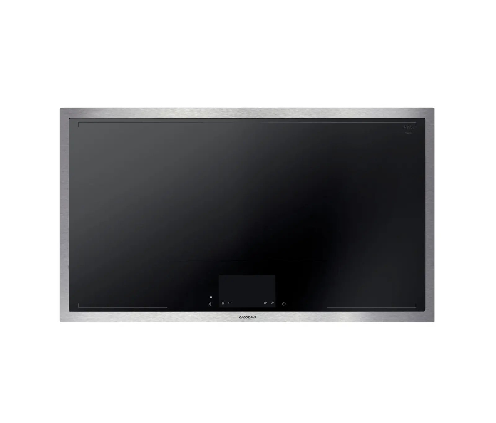

<small style="color:#888">图：CX 492 全表面感应灶产品图。图源：Architonic 产品档案（收录 Gaggenau 官方图）。</small>

CX 492 是这条路的极致：2020 年推出的 90 公分全表面感应灶，约 3200 平方厘米的台面全部是加热区，锅具放在哪里就在哪里加热，可同时容纳四只锅，不同形状的锅具无需对准区域。它的创新点不在"更大的灶"，而在重新定义了人与台面的关系——锅不再被区域约束。

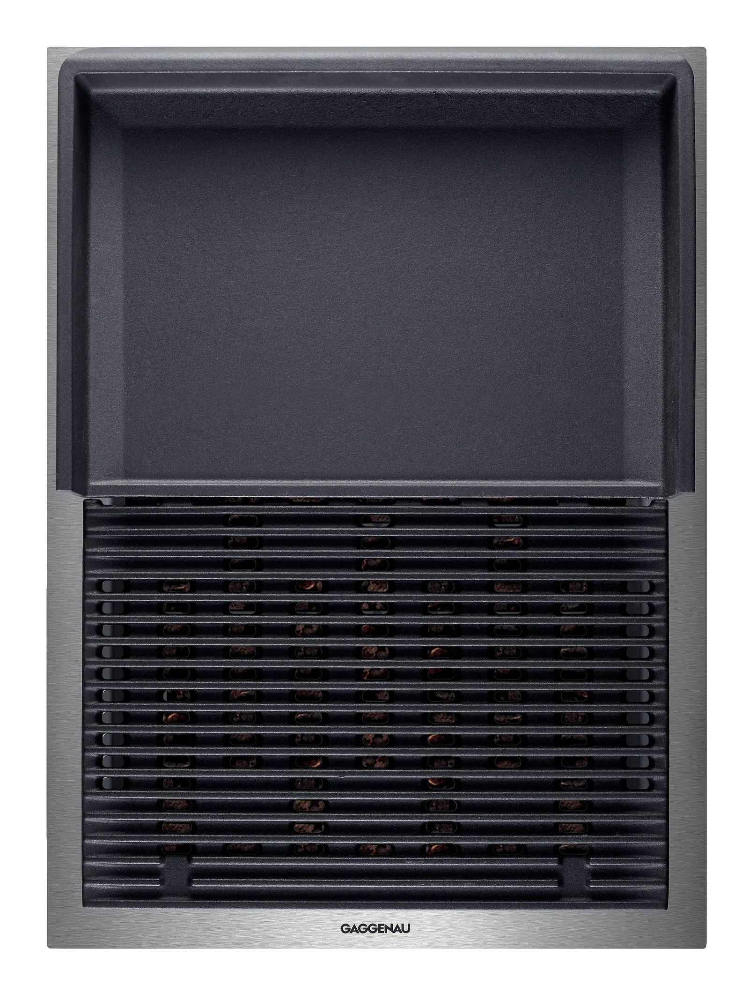

<small style="color:#888">图：400 系列灶具家族场景（非特定型号）。图源：Architonic 产品档案。</small>

### Expressive 系列（2024）：雕塑宣告存在

2020 年代中期，Gaggenau 在近二十年来首个全新嵌入式系列中一次给出两个方向。Expressive 灵感来自包豪斯与极简现代建筑，用雕塑感的双重边框把电器框出来，官方概括为"两框一圆，一件艺术品"：外框接住橱柜，内框托起烟熏玻璃与不锈钢的 passepartout，60 或 76 公分宽，凸出安装。

<small style="color:#888">术语注释：passepartout——画框式衬板，此处指烟熏玻璃与不锈钢构成的内框。</small>

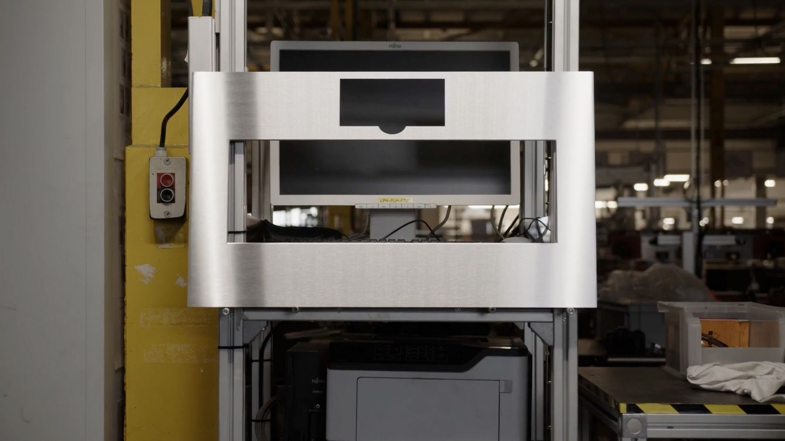

<small style="color:#888">图：Lipsheim 工厂中 76 公分 Expressive 蒸烤箱的抛光金属外壳。图源：Gaggenau 官方 Behind the scenes 页面。</small>

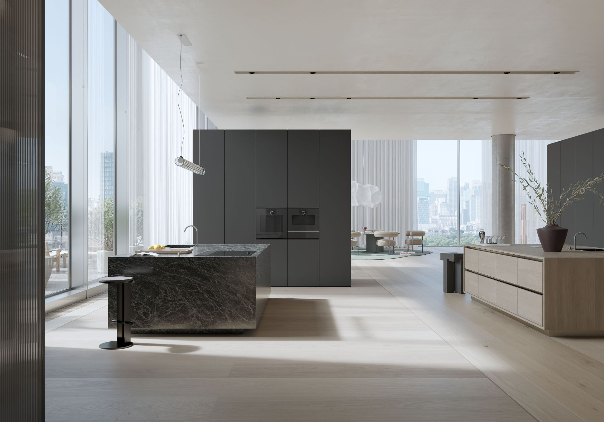

<small style="color:#888">图：Minimalistic 系列官方宣传图。图源：identity 杂志刊发的 Gaggenau 官方素材。</small>

### Minimalistic 系列（2025）：用消失证明力量

Minimalistic 则走向反面：无把手，显示器藏在烟熏玻璃后直到被激活才亮起，整块表面上唯一可见的功能件是一个由实心不锈钢铣出的圆形调节环，比例经过黄金分割推敲。交互设计师 Sören Strayle 解释保留实体环的用意：圆形是所有文化都认识的形状，人会本能地转动它，触感"几乎像一件珠宝"。

### 相同的工程内核

两个系列共用同一套工程内核——能承受 485℃ 的五层玻璃门、300℃ 底部加热——只是对"前卫"给出了两种解释：一个用雕塑宣告存在，一个用消失证明力量。

### 产品竞争力与第三方视角

如果只看官方材料，任何品牌都完美无缺。这里补充第三方视角。欧洲高端厨房经销商与媒体的普遍看法是：Gaggenau、Miele、V-ZUG 的烹饪结果都在很高水平，"差别更多在材料手感、操作方式、做工与造型"（kuechenfinder 德国厨具杂志 2026 年对比文章）。换句话说，Gaggenau 的竞争内核不是"烤得更熟"，而是把专业参数、材料厚度与手工叙事做成可感知的差异。

具体产品的专业点评也有迹可循：EB 333 被设计媒体与经销商反复称为"风格偶像"，强调它"几乎全部手工"（Design Elementi 产品档案）；Vario 400 冷藏系列获得 iF Gold，200/400 系列整体获得 Red Dot；法国财经媒体 Les Echos 报道过 Lipsheim 工厂的扩建，把它视为阿尔萨斯精密制造的代表。真实用户口碑则呈现两面：有 Houzz 用户报告自己的 Gaggenau 烤箱寿命超过了 7 年报废的 GE 与 6 年的 Thermador；也有用户抱怨某些故障"没有服务帮助根本无法解决"。产品竞争力小结：Gaggenau 的技术与体验强项真实存在，服务可达性则是它在部分市场的明确短板——这一点会在体验章节继续展开。

## 08 Aesthetics 美学：蓝色、圆与克制

Gaggenau 的美学常被一句话打发——"不锈钢和贵"。但它的审美系统其实由几组高度一致的元素构成：蓝色、圆、深色玻璃、单块金属面。这些元素单独出现都不稀奇，同时出现并坚持三十年，就构成了可被识别的品牌语言。

### 蓝：从招牌到炉腔的颜色叙事

<small style="color:#888">图：EB 333 的蓝色珐琅炉腔。图源：Gaggenau EB333 官方落地页（文件名 stage_eb_333_oven_enamel）。</small>

品牌色通常出现在 Logo 或包装上，Gaggenau 却把最有辨识度的颜色放在炉腔里。这层蓝是搪瓷工艺的视觉结果，能追到 19 世纪的广告招牌。对用户而言，每次打开炉门都会看到它；对品牌而言，它把"材料历史"变成了"日常视觉"。蓝色珐琅在高温下稳定、耐刮、易清洁，颜色本身不是装饰，而是工艺可以被看见的证据——这是美学与工程在同一处汇合的范例。

### 熄灭的界面与圆

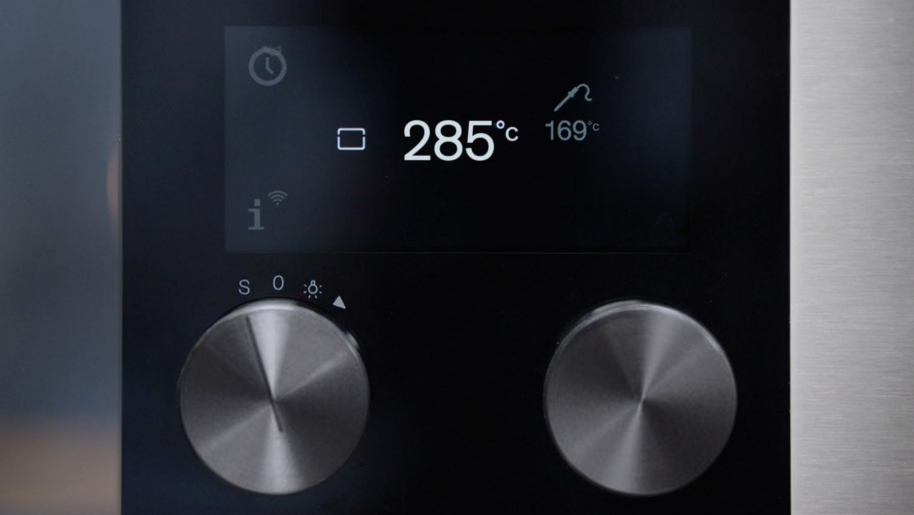

<small style="color:#888">图：EB 333 的 TFT 显示屏界面。图源：Gaggenau EB333 官方落地页。</small>

Gaggenau 对"显示"的态度值得单独解读。Minimalistic 系列的显示器藏在烟熏玻璃后，待机时整面面板只有金属与玻璃；人靠近时，屏幕才被接近感应唤醒。把"科技"藏起来、让界面主动退场，是它理解奢华的方式——信息不是被炫耀的，而是被调用的。圆环与旋钮承担了相反的职能：它们必须被看见、被触摸。一隐一显之间，品牌把"克制"做成了交互上的节奏。

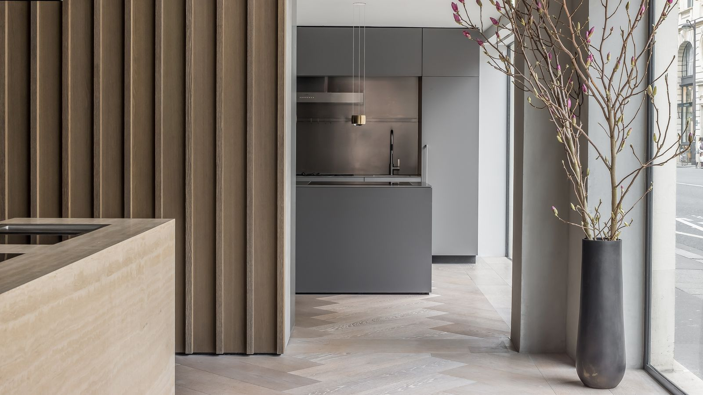

<small style="color:#888">图：Gaggenau 伦敦展厅。图源：Gaggenau EB333 官方落地页（Showroom London）。</small>

### 空间、光线与装置

展厅是 Gaggenau 美学的完整载体：产品嵌进真实厨房，光线经过设计，门可以被打开、旋钮可以被转动。2026 年米兰设计周，它在 Villa Necchi Campiglio 的 Presence 装置把新系列放进 1930 年代别墅的空间里，让电器与历史建筑对话。这类做法的美学功能不是展示机器，而是演示"设备退场后，空间还剩什么"。

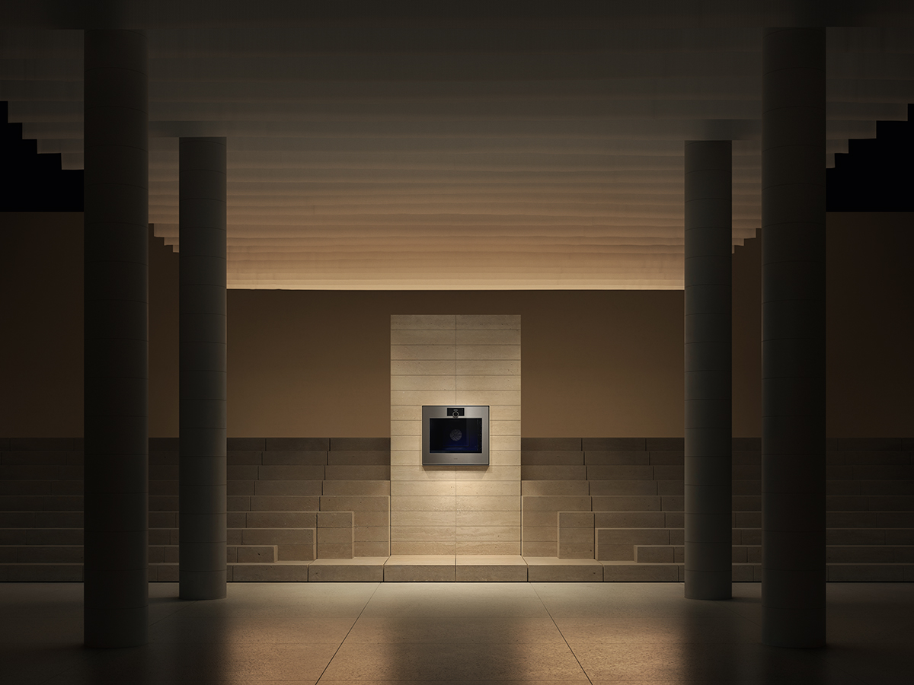

<small style="color:#888">图：Gaggenau Presence 装置现场（Villa Necchi Campiglio，2026 米兰设计周）。图源：ifdm.design 现场报道。</small>

评价：Gaggenau 的美学本质是"为在场者设计的安静"。它不靠鲜艳色彩或夸张造型夺取注意力，而是用材料厚度、表面触感和比例关系建立存在感。这种美学与它的目标场景高度匹配——在豪宅厨房里，设备越是安静，厨房越像客厅。

## 09 Design 设计：哲学、材料与工程

### 设计哲学与方法论

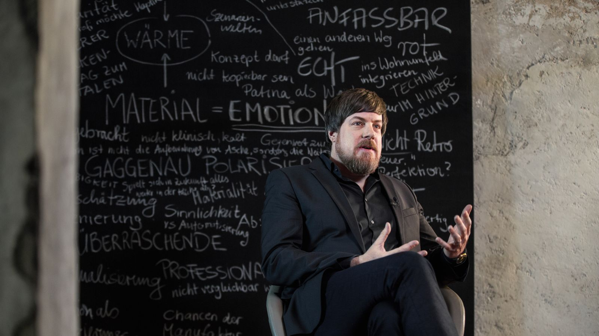

<small style="color:#888">图：Gaggenau 全球设计负责人 Sven Baacke。图源：Gaggenau EB333 官方落地页。</small>

Gaggenau 设计哲学最准确的概括，来自设计负责人 Sven Baacke 反复使用的词组：传统前卫（traditional avant-garde）——在尊重传承与走向未来之间保持平衡。

把这句话拆开看，它有明确的取舍。第一，功能先于形式，但形式不是功能的奴隶。官方历史写明"Form follows function 是核心信念"，但产品从不是功能主义的外观：90 公分门板、实心不锈钢旋钮、独立圆形调节环，都是先把工程问题解决到极限，再让形态从内部长出来。第二，专业厨房是一把尺子——Georg von Blanquet 留下的标准（对厨师有用、扛得住真厨房、还要好看）至今是底层逻辑，所以 Gaggenau 敢把 300℃ 烤制与 485℃ 自清洁写成家用烤箱的日常参数。第三，材料必须诚实：用厚度、单块料与少塑料说话。Baacke 谈 Vario 400 冷藏系列时说，打开门"几乎看不到塑料，里面全是真材实料，而且是最好的"。第四，克制本身是一种前卫：Expressive 用雕塑宣告存在，Minimalistic 用缺席寻求清晰，Alexander Stuhler 说得更直接："这个系列里，我们删掉了所有不必要的东西。"

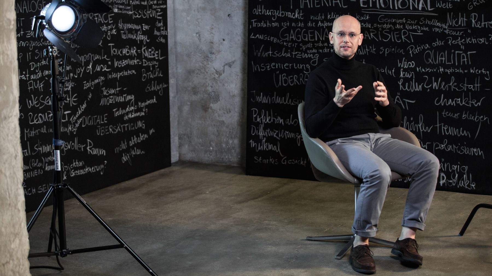

<small style="color:#888">图：Gaggenau 交互与界面设计师 Sören Strayle。图源：Gaggenau EB333 官方落地页。</small>

这套方法论还有一层容易被忽略的结构：设计团队深度参与工程决策。Strayle 关于"保留实体环"的论述表明，交互设计师有权否决"全触屏化"的行业趋势；Baacke 参与 EB 333 全部开发过程，工厂里的人在采访中直接描述设计如何影响生产节拍。设计在这里不是给工程"化妆"的部门，而是产品定义的一部分。

### 材料与成形：一整块不锈钢

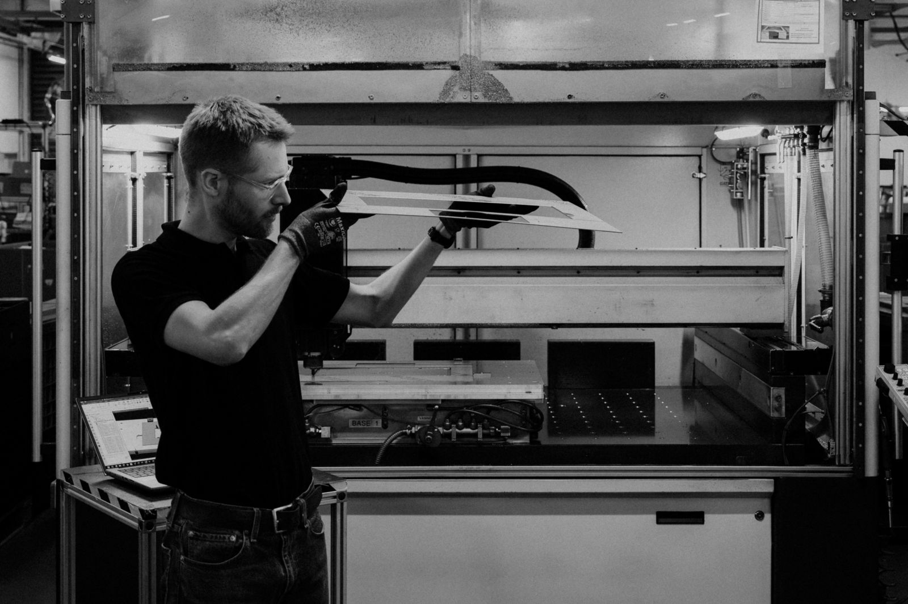

<small style="color:#888">图：Lipsheim 工厂中检查 Expressive 烤箱门板表面的场景。图源：Gaggenau 官方 Behind the scenes 页面。</small>

Gaggenau 用钢的方式值得深挖，因为它的难点不在"用不锈钢"，而在"用一整块不锈钢"。EB 333 的门板是 3 毫米单板，90 公分宽的门面要求成形后的平整度与表面一致性极高——单板越大，拉丝方向、应力变形与装配误差越难控制。这正是它坚持少分件的原因：分件可以用接缝掩盖误差，单板只能靠模具、工艺与人工打磨解决。

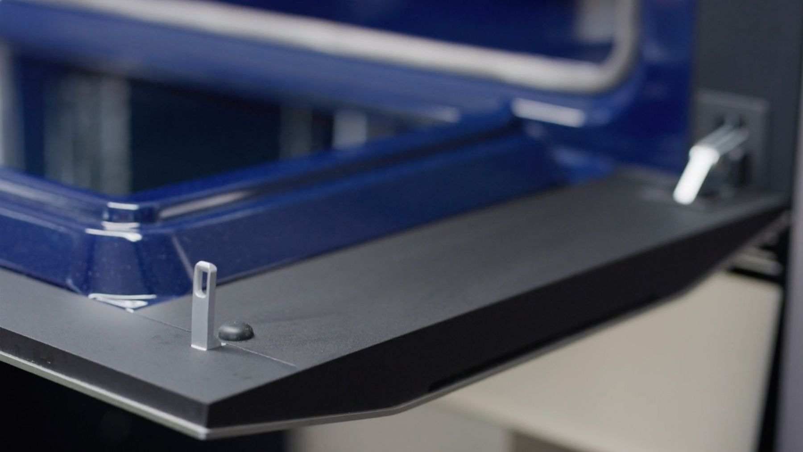

<small style="color:#888">图：EB 333 门铰链细节。图源：Gaggenau EB333 官方落地页。</small>

官方 Behind the scenes 页面提供了一组难得的工程证据：工人用游标卡尺测量控制环的直径，检查门板表面，讨论门与箱体的配合。这些画面说明，Gaggenau 的"手工"不是情怀叙事，而是质量控制流程的一部分——人手被保留在公差检查、表面目检与装配判断这些机器难以替代的位置。

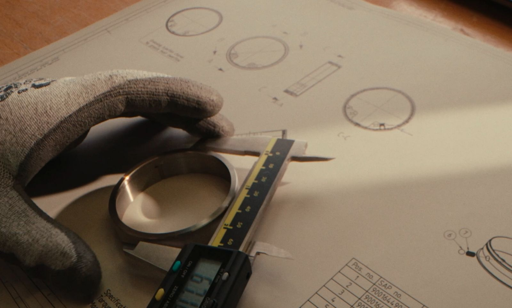

<small style="color:#888">图：Lipsheim 工人用游标卡尺测量控制环。图源：Gaggenau 官方 Behind the scenes 页面。</small>

### Lipsheim：人手与机器

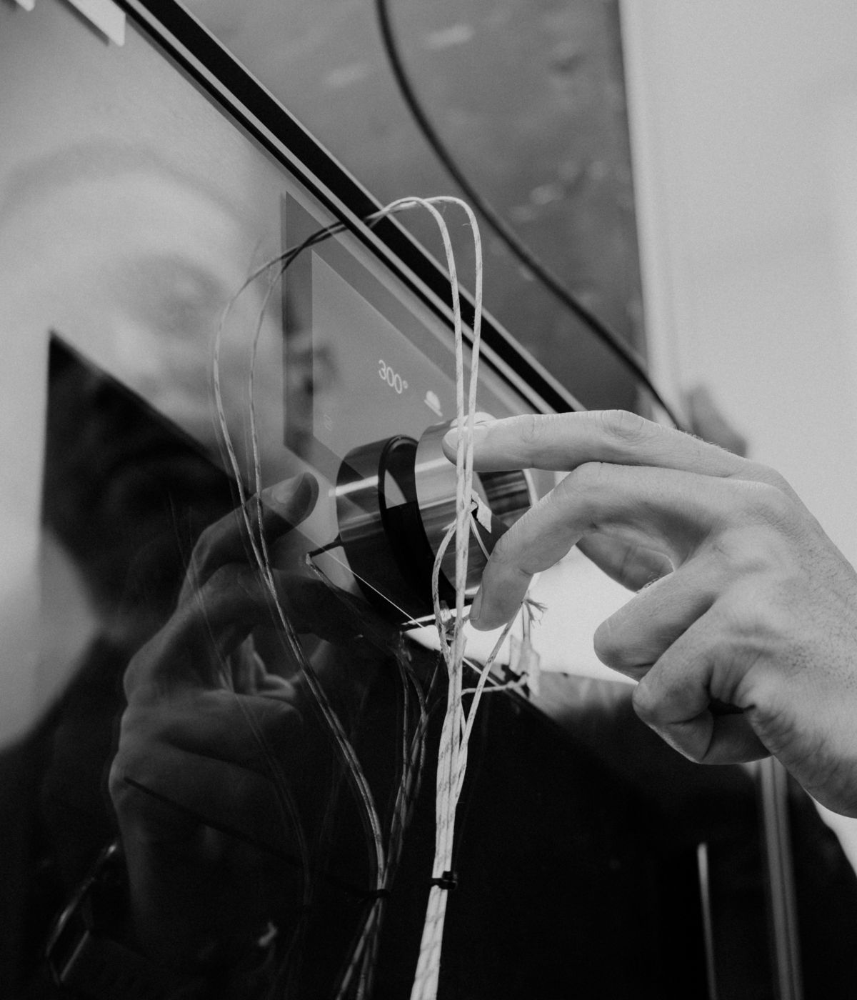

<small style="color:#888">图：Lipsheim 工人测试 Expressive 系列烤箱控制环。图源：Gaggenau 官方 Behind the scenes 页面。</small>

Lipsheim 工厂约有 350 名技术工人，官方工艺文章的描述是"几乎每台机器旁都有人把不锈钢喂进去，或接手下一道手工工序"。负责 EB 333 生产的 Jörg Neuner 给出了更具体的数字："我们只有一道工序是全自动的，其余环节始终有人参与，或者纯粹是手工。"EB 333 日产量通常不超过个位数，官方明确把它归因于门板手工打磨与装配的节拍。

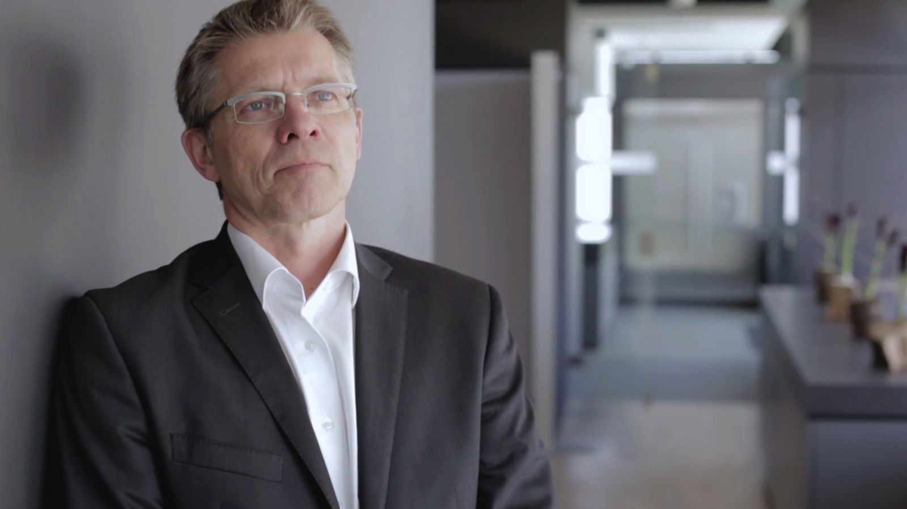

<small style="color:#888">图：Gaggenau 品牌中心负责人 Jörg Neuner。图源：Gaggenau EB333 官方落地页。</small>

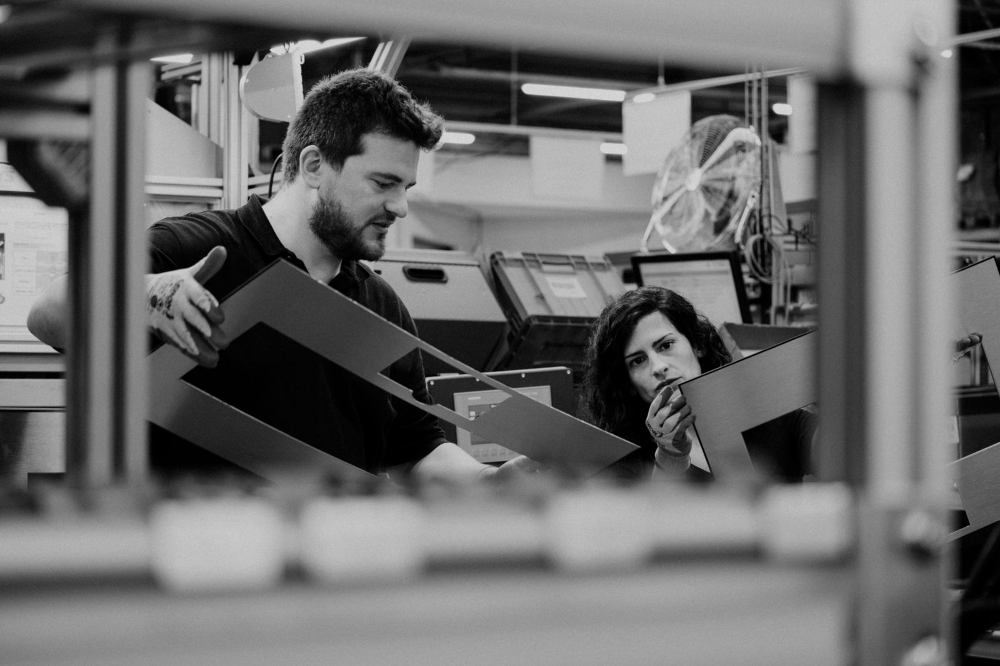

<small style="color:#888">图：Lipsheim 工厂中讨论 Expressive 烤箱门板的场景。图源：Gaggenau 官方 Behind the scenes 页面。</small>

把手工与自动化放在一起看，才能理解 Gaggenau 的制造决策：它不拒绝自动化，而是把自动化用在性能攸关的工序（激光切割、双层拉丝、热加工），把判断性工作留给人工（表面检查、装配、调校）。这种分工的代价是产量低、成本高，收益是每台设备的表面与公差都有"人的注视"背书。对一个把"手工"写进品牌承诺的公司来说，这是逻辑自洽的生产组织方式。

### 人机与温度：门、环与隔热

工程上最值得分析的三件事是门、环与温度。门：20 公斤的五层玻璃门要缓开缓闭，结构上靠铰链阻尼实现，手感接近汽车车门而不是橱柜门；五层玻璃之间是隔热层，确保 485℃ 自清洁时外表面安全。环：实心不锈钢铣出的调节环要"像珠宝"，公差与表面处理决定触感；旋钮与环的阻尼曲线决定操作反馈。温度：300℃ 底部加热、485℃ 热解自清洁配合加热催化器过滤油烟气味——这些参数背后是隔热、散热、催化材料与安全标准的一整套工程系统。

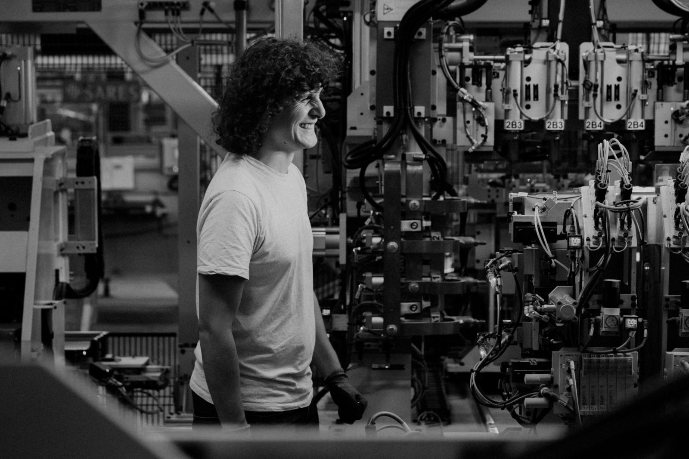

<small style="color:#888">图：工人穿行于 Lipsheim 工厂设备之间。图源：Gaggenau 官方 Behind the scenes 页面。</small>

### 品牌侧依据与判断 → 设计变量

| 品牌侧依据与判断 | 对应的设计变量 |
|---|---|
| 超高端定位 | 材料等级（整板不锈钢、实心旋钮）、比例与体量（90 公分门）、装配精度 |
| 专业厨房标准 | 性能提示（300℃、485℃、五层玻璃）、结构可靠性、可读的参数界面 |
| 传统前卫哲学 | 造型的二元选择：显性（边框雕塑）与隐性（齐平、隐藏显示） |
| 材料诚实 | CMF 克制：少塑料、单块料、蓝色珐琅内壁 |
| 建筑融合 | 齐平安装、无把手、下吸式排烟、待机界面熄灭 |
| 手工制造 | 可感知的工艺痕迹：拉丝方向、铣削圆环、门的重量与阻尼 |
| 模块系统 | Vario 开孔与组合逻辑、盖板、38 公分起的宽度模数 |

## 10 Experience 体验：从图纸到维修

对超高端品牌来说，广告之外的体验往往才是信任的真正来源。Gaggenau 的体验链从购买之前就开始了。

### 指定与到店

建筑师与设计师拿到的不是宣传页，而是设计文件、安装说明、Vario 开孔计算器这类工程资料；设备在购买之前，已经作为建筑元素进入设计流程。到店环节，Gaggenau 的经营方式是"亲手验证"——官方邀请顾客到门店打开一扇烤箱门、转动一个实心不锈钢旋钮。它不是让销售讲参数，而是让手先说话。

### 安装与上手

嵌入式设备对安装精度要求高，蒸烤箱要接水管，Vario 模块要按开孔组合。上手的门槛则集中在界面：TFT 显示屏与 Home Connect App 承担自动程序、食谱与远程控制。Minimalistic 的接近感应显示把"设备安静"贯彻到待机状态——机器不主动打扰，等人靠近才回应。这套交互哲学对初次使用者有学习成本，但对目标用户（愿意为专业结果付费的人）来说，学习本身是获得掌控感的过程。

### 清洁与维护

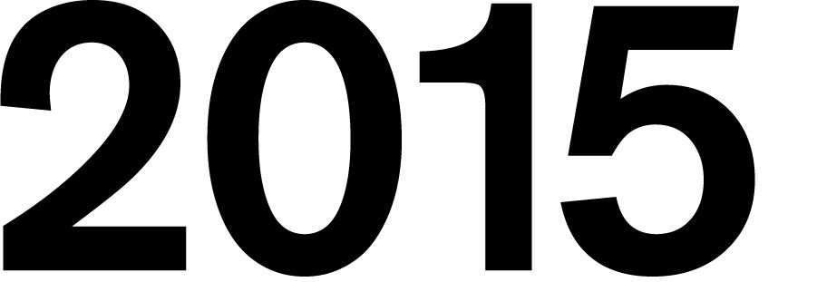

<small style="color:#888">图：官方历史页中的 2015 年蒸汽清洁系统。图源：Gaggenau 官方品牌历史页。</small>

清洁是超高端用户最不愿意做的家务，Gaggenau 把两个方案做成了产品功能：烤箱用 485℃ 热解自清洁配合催化器，蒸烤箱用清洁盒一键启动自动清洁程序。2015 年引入的蒸汽清洁系统让蒸烤箱的维护从"拆洗"变成"按键"。这些功能的意义不止于方便——它们决定了设备能否长期保持出厂状态，直接影响品牌最看重的长寿叙事。

### 长期持有与服务口碑

北美版有限保修期为自交付起 730 天（官方手册口径），使用手册写明正品备件自产品上市起最长供应 15 年。这个承诺不如 Miele 的"20 年等效使用测试"响亮，但方向一致：长寿是被政策托底的，而不只是广告词。

口碑需要两面呈现。正面：长期用户报告 Gaggenau 烤箱寿命超过同期购买的 GE 与 Thermador；多位用户在厨房论坛称赞其感应灶"改变烹饪习惯"。负面：个别用户遇到需要服务介入的故障时，抱怨"没有服务帮助根本无法解决"，还有人引用第三方调研称其一年故障率约 2.9%（单条用户转述，可信度低）。体验评价：Gaggenau 的产品体验设计完整且自洽，从图纸到清洁都有章法；但在服务网络密度不足的市场，承诺与兑现之间会出现裂缝——这正是超高端品牌最常见的软肋。

## 11 Competition 竞品：同一张牌桌

### 集团内外的坐标系

Gaggenau 属于 BSH 集团：2024 财年营收 153 亿欧元，品牌组合包括全球性的 Bosch、Siemens、Gaggenau 与区域性的 Neff、Thermador 等。Gaggenau 于 1995 年加入，Neff 于 1982 年，Thermador 于 1998 年被收购。在北美，集团只打 Bosch、Thermador、Gaggenau 三张牌——Gaggenau 负责欧式超高端嵌入式，Thermador 负责美式奢华炉具，两者在集团内部分工明确，但也在同一批高净值客户身上形成内部竞争。

### 直接竞品

**Miele** 最常被拿来对比。它同样来自德国、同样强调耐久，但走"全品类 + 长期主义"路线：Generation 7000 系列宣称按 20 年等效使用测试，烤箱做 2160 小时耐久试验，还有 Dialog 电磁波烤箱这类独家技术。气质差异在于：Miele 讲"耐用与精确"，像一个可靠的管家；Gaggenau 讲"专业厨房与建筑"，像一个把设备做成建筑构件的工匠。

**V-ZUG** 是瑞士选手，成立逾 110 年，强项是蒸汽与织物护理：RefreshButler（2014 年）用蒸汽、热风与光刷新衣物，PowerSteam 是当家技术。它把自己讲成"精确、透明、可持续"的瑞士制造，与 Gaggenau 在蒸烤箱上正面相遇，但气质更内敛、更偏工程可信度。

**Sub-Zero / Wolf** 是美国的奢华标准答案：Sub-Zero 以双系统制冷起家，宣称发明了嵌入式冰箱品类；Wolf 强在专业级炉具与烹饪。有趣的是，Gaggenau 的 EB 300 当年正是受美式炉具体量启发——两家在"大"这件事上走了相反的路：Wolf 把美式专业炉具做成旗帜，Gaggenau 把美式体量翻译成 90 公分嵌入式烤箱。

**Thermador** 是集团内部镜像：1916 年创立，1998 年加入 BSH，同年推出沿用至今的 Star 星形燃烧器，宣称首创专业级炉具。它在美国市场地位稳固，讲的是美式奢华炉具的语言。

**La Cornue** 是另一条路线：1908 年由 Albert Dupuy 在巴黎创立，1964 年推出 Château 系列，按订单在法国手工打造，以定制珐琅颜色闻名，2015 年随 AGA Rangemaster 归入 Middleby。它是"炉具即家具"的极致，重装饰与传承；Gaggenau 的"重"在工程与建筑，两者在收藏级厨房里偶尔同台。

**Bora** 值得单独一提：2007 年它以"灶具 + 下吸排烟一体"革命了欧洲排烟方式，直接切进 Gaggenau Vario 下吸排烟的腹地。第三方测试中，Bora 的噪音表现（约 41–69 分贝）通常优于 Gaggenau Vario 400 下吸排烟（约 56–75 分贝），这是一条需要正视的产品层竞争线。

### 同场景的关联品牌

同档位、常与 Gaggenau 出现在同一套方案里的关联品牌构成理解它的坐标系：Liebherr 的冷藏与酒柜常与 Gaggenau 烹饪设备搭配；Bulthaup、Poggenpohl 这类顶级橱柜品牌是它的"宿主"；Dornbracht、Grohe 的龙头五金与它共享同一批设计师与业主。Gaggenau 不是孤立地卖一台机器，而是在一整套豪宅厨卫生态里占位——这也是它的竞品分析必须延伸到"搭配场景"的原因。

## 12 Strategy 战略：保护、改变、扩张与风险

把前文证据串起来，可以给出有依据的战略判断。以下结论按置信度标注。

### 保护

Gaggenau 一直在保护传承资产：90 公分烤箱体量、蓝色珐琅内壁、以手工为主的制造、Vario 的模块自由。EB 333 以 333 周年之名重生、Expressive 与 Minimalistic 共用 EB 系工程内核，都是"老资产换新形态而不换内核"的动作。判断置信度高——这些资产都直接对应官方历史与产品结构中的可验证事实。

### 改变

服务可达性是明确需要修正的环节。Houzz 等社区的用户投诉集中指向"维修依赖服务网络、部分地区响应慢"，这与官方 15 年备件承诺形成落差。另一处需要观察的变化是品牌叙事与产品现实的匹配：当它强调"手工"时，必须在全球服务体验上维持同等水准，否则最贵的那部分溢价会失去支撑。判断置信度中——口碑证据为个体样本，但方向一致。

### 扩张

增长路径在北美与亚洲：BSH 在北美为 Gaggenau 铺设体验与设计中心（迈阿密、休斯顿已开，华盛顿特区、比佛利山在建），中国市场承担 BSH 高端卡位任务。产品侧，蒸汽、全表面感应与互联是未来几年的技术主线；Minimalistic 代表的"隐性奢华"审美，正是针对东亚与极简主义市场的结构性回应。判断置信度中——扩张方向来自集团公开财报与门店计划，市场反应有待时间验证。

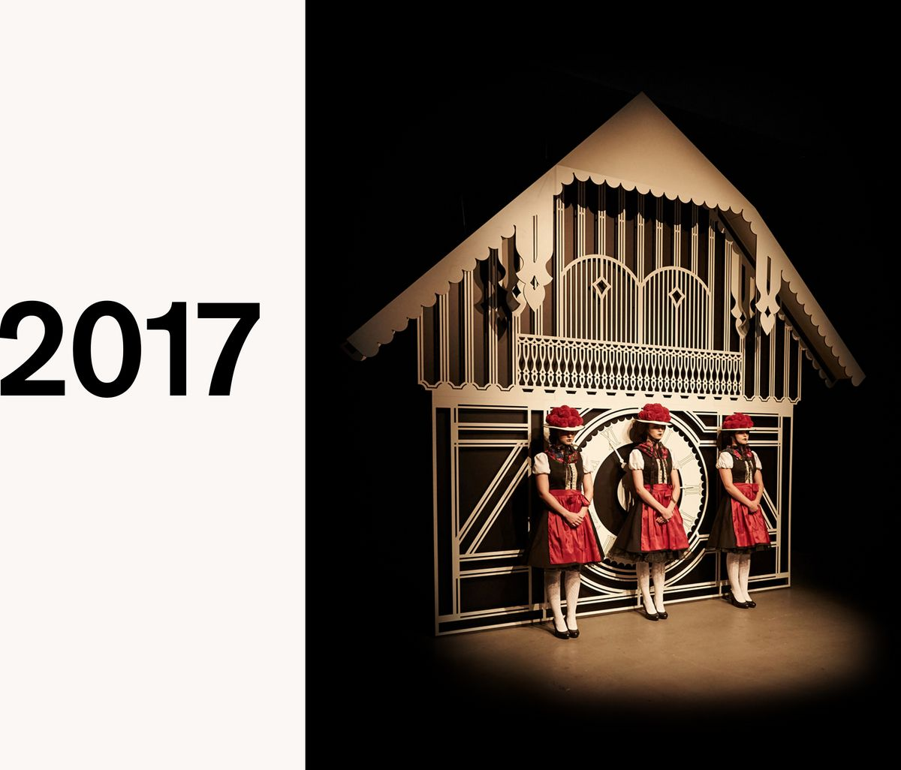

<small style="color:#888">图：官方历史页中的 Restaurant 1683。图源：Gaggenau 官方品牌历史页。</small>

### 风险

可验证的风险有四项：豪宅与翻新工程的周期波动直接冲击基本盘（BSH 2024 财报把地产低迷列为嵌入式业务压力来源）；Bora 在灶具下吸细分上持续进攻；集团内部 Thermador 在美国与它共享同一批高净值客户；洗衣与干衣产品线退出后，单一厨房场景意味着抗周期能力有限。此外，EB 333"日产量个位数"的手工叙事一旦被市场解读为供应瓶颈，可能限制增长——这是品牌资产与产能约束之间的张力，判断为值得跟踪的方向性风险。

## 13 视频与访谈资料

- EB 333 诞生过程影片（官方灵感页内嵌）：<https://www.gaggenau-asia.com/experience/inspiration>
- Behind the scenes：Lipsheim 工厂工匠访谈：<https://www.gaggenau-asia.com/experience/inspiration/behind-the-scenes>
- Gaggenau Presence 装置（2026 米兰设计周，Dezeen 视频）：<https://www.dezeen.com/2026/04/21/gaggenau-presence-installation-milan-design-week-2026-video/>
- Expressive 系列设计师访谈（Gaggenau Magazine）：<https://www.gaggenau-themagazine.com/design/the-gaggenau-expressive-series-designers-interview>
- Minimalistic 系列设计师访谈（Gaggenau Magazine）：<https://www.gaggenau-themagazine.com/design/the-gaggenau-minimalistic-series-designers-interview>
- Sven Baacke 谈 Vario 400 冷藏系列（IndesignLive）：<https://www.indesignlive.com/people/5-minutes-sven-baacke-head-design-gaggenau>
- Gaggenau 工艺专题（Gaggenau Magazine）：<https://www.gaggenau-themagazine.com/design/gaggenau-craftsmanship-dedicated-to-excellence-since-1683>

## 14 来源与延伸阅读

**官方**

- Gaggenau 官方品牌历史（Heritage）：<https://www.gaggenau-asia.com/experience/the-difference-is/heritage>
- EB 333 官方产品页：<https://www.gaggenau.com/global/appliances/ovens/eb-333>
- 400 系列烤箱官方页：<https://www.gaggenau.com/global/appliances/ovens/400-series>
- 200 系列烤箱官方页：<https://www.gaggenau.com/global/appliances/ovens/200-series>
- Vario 400 灶具系列官方页：<https://www.gaggenau.com/ca/en/appliances/cooktops/400-series/10_master_appliances_cooktops_400_series>
- Expressive 系列官方页：<https://www.gaggenau.com/global/appliances/ovens/expressive-series>
- Gaggenau 性能理念页：<https://www.gaggenau.com/us/about-us/the-difference-is/performance>
- Gaggenau 企业简介：<https://www.gaggenau.com/press/company-profile>

**集团与档案**

- BSH 2024 财年新闻稿（153 亿欧元营收）：<https://press.bsh-group.com/pressreleases/bsh-increases-turnover-to-15-punkt-3-billion-euros-in-2024-and-sets-the-course-for-further-growth-3380438>
- BSH 里程碑档案（EB 300，1986）：<https://wiki.bsh-group.com/en/wiki/Special:MobileDiff/401>
- BSH 蒸烤箱档案（ED 220，1999）：<https://wiki.bsh-group.com/de/wiki/Spezial:Meine_Sprache/Gaggenau_Dampfbackofen>
- Gaggenau 公司资料与里程碑事实表（2019 PDF）：<https://media3.bsh-group.com/Documents/MCDOC03053117_Gaggenau_PI_Company_profile_2019.pdf>

**设计媒体与奖项**

- Vario 400 冷藏系列 iF Gold：<https://ifdesign.com/en/winner-ranking/project/vario-cooling-400-series/231555>
- Gaggenau 200/400 系列 Red Dot：<https://www.red-dot.org/ko/project/gaggenau-product-family-series-200-400-20122>
- Vario 400 于 Eurocucina 2012（Frame）：<https://frameweb.com/article/gaggenau-at-the-eurocucina-milan>
- CX 492 产品档案（Architonic）：<https://www.architonic.com/en/product/gaggenau-full-surface-induction-cooktop-400-series-cx-492/20267693>
- EB 333 产品档案（Design Elementi）：<https://designelementi.it/en/products/gaggenau-ovens/>
- Presence 装置报道（ifdm）：<https://ifdm.design/2026/04/20/presence-gaggenau-at-villa-necchi-campiglio/>
- Minimalistic 系列设计师阐述（identity）：<https://identity.ae/the-gaggenau-minimalistic-series-two-lines-one-circle-a-statement/>
- Lipsheim 工厂（Les Echos）：<https://www.lesechos.fr/2000/10/gaggenau-muscle-son-site-francais-753411>

**第三方测评、口碑与市场**

- 全球嵌入式厨电市场 645 亿美元（Euromonitor，经 LG 新闻稿转述）：<https://www.asiae.co.kr/lang/print.htm?idxno=2025022008321125076&lang=en>
- 奢华厨电市场估算（Emergen Research，方向性）：<https://www.emergenresearch.com/industry-report/luxury-kitchen-appliance-market>
- Gaggenau 与 Miele、V-ZUG 对比（kuechenfinder 德语评测）：<https://magazin.kuechenfinder.com/lohnt-sich-gaggenau-was-du-vor-dem-kauf-wirklich-wissen-musst/>
- 高端厨电对比（bulthaup Bastille）：<https://www.bulthaup-bastille.fr/electromenager-haut-de-gamme-cuisine/>
- 下吸排烟噪音对比（第三方）：<https://hobsonschoice.squarespace.com/learning-hub/which-kitchen-extractor-fan-is-best-for-my-project>
- 用户长帖与口碑（Houzz）：<https://www.houzz.com/discussions/2815205/help-me-pick-a-convection-oven>
- 用户长帖与口碑（Houzz UK）：<https://www.houzz.co.uk/discussions/6377832/gaggenau-appliances-any-feedback-from-owners>

## 15 分析附录

### 产品组合矩阵

| 层级 | 系列 / 型号 | 角色 | 关键特征 |
|---|---|---|---|
| 图标 | EB 333 | Hero / Halo | 90 公分、17 种加热方式、30–300℃、485℃ 自清洁、日产个位数 |
| 前沿 | 400 系列 Expressive | 旗舰 | 60/76 公分、19 种加热方式、双框一圆、凸出安装 |
| 前沿 | 400 系列 Minimalistic | 旗舰 | 60/76 公分、齐平、Onyx/Sterling、无把手、悬浮圆环 |
| 中坚 | 200 系列 | 走量核心 | 60 公分、13 种加热方式、三色、齐平 |
| 系统 | Vario 400 | 模块系统 | 38 公分起拼装、燃气/感应/铁板烧/蒸/炸/烤/下吸 |
| 系统 | CX 492 | 技术旗舰 | 90 公分全表面感应、约 3200 cm² 加热区、四锅同时 |

### CMF 速查

| 维度 | 内容 |
|---|---|
| 标志色 | 蓝色珐琅炉腔内壁（搪瓷血统） |
| 200 系列 | Anthracite、Metallic、Silver |
| Minimalistic | Onyx（沉）、Sterling（略亮），带金属微粒 |
| Expressive | 烟熏玻璃 + 不锈钢 passepartout |
| 标志材料 | 3 毫米不锈钢单板、五层玻璃门、实心不锈钢旋钮、铣削圆环 |
| 标志工艺 | 激光切割、双重拉丝、手工打磨门板、催化搪瓷 |

### 竞品对照（品牌层）

| 品牌 | 出身 | 招牌 | 与 Gaggenau 的差异 |
|---|---|---|---|
| Miele | 德国 | 全品类、20 年测试、Dialog 烤箱 | 耐用精确 vs 专业厨房与建筑 |
| V-ZUG | 瑞士 | 蒸汽、RefreshButler | 更内敛的工程可信度 |
| Sub-Zero / Wolf | 美国 | 双系统制冷、专业炉具 | 美式体量 vs 欧式嵌入式 |
| Thermador | 美国（BSH） | Star 燃烧器、专业炉具 | 集团内部的美式镜像 |
| La Cornue | 法国 | Château 定制珐琅炉具 | 装饰与传承 vs 工程与建筑 |
| Bora | 德国 | 灶具下吸一体 | 在排烟细分上正面进攻 |

### 证据登记（示例）

| 结论 | 证据 | 来源类型 | 置信度 |
|---|---|---|---|
| 1986 年首台 90 公分烤箱 | EB 333 产品页时间轴 + BSH 里程碑 | 官方 | 高 |
| 最初型号名（EB 300/374/375）口径不一 | 官方页面内部表述矛盾 | 官方 | 中（已如实标注） |
| ED 220 为"首台家用工业化蒸烤箱" | 官方 Heritage + BSH 档案 | 官方 | 高（官方口径） |
| 全球嵌入式市场 645 亿美元（2025） | Euromonitor 经 LG 转述 | 第三方 | 中（方向性） |
| 奢华厨电 214.5 亿美元（2025） | Emergen Research | 第三方估算 | 低（口径不一） |
| 一年故障率 2.9% | 单一用户转述 | 用户 | 低 |
| 烤箱寿命超过 GE / Thermador | 单个长期用户自述 | 用户 | 低（个体体验） |
| 服务响应慢 | Houzz 用户反馈 | 用户 | 中（样本有限） |
