# ABOUT GESSI

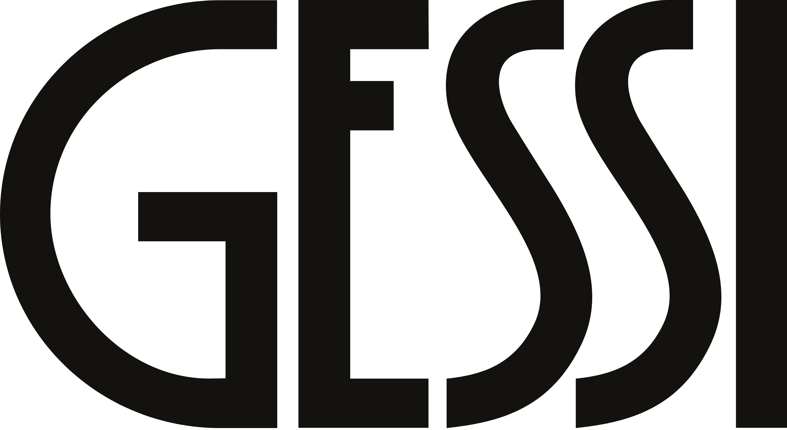

目录

|  |  |
|---|---|
| [01 开篇](#01-开篇) | [09 Design 设计：把手工藏进工业体系](#09-design-设计把手工藏进工业体系) |
| [02 品牌概述](#02-品牌概述) | [10 Experience 体验：从 Casa Gessi 到二十年之后](#10-experience-体验从-casa-gessi-到二十年之后) |
| [03 Brand 品牌：父子创业与"私人健康"的确立](#03-brand-品牌父子创业与私人健康的确立) | [11 Competition 竞品：同一张牌桌上的龙头品牌](#11-competition-竞品同一张牌桌上的龙头品牌) |
| [04 Category 品类与市场：卫浴五金的牌桌与口径](#04-category-品类与市场卫浴五金的牌桌与口径) | [12 Strategy 战略：保护、改变、扩张与风险](#12-strategy-战略保护改变扩张与风险) |
| [05 User 用户与场景：谁在决定一间浴室](#05-user-用户与场景谁在决定一间浴室) | [13 视频与访谈资料](#13-视频与访谈资料) |
| [06 Positioning 定位：把龙头做成一种生活方式](#06-positioning-定位把龙头做成一种生活方式) | [14 来源与延伸阅读](#14-来源与延伸阅读) |
| [07 Product 产品：从出水位置到一整套系列](#07-product-产品从出水位置到一整套系列) | [15 分析附录](#15-分析附录) |
| [08 Aesthetics 美学：水滴、编织金属与珍珠](#08-aesthetics-美学水滴编织金属与珍珠) |  |

## 01 开篇

2000 年代初，意大利卫浴行业对水龙头的默认想象还是"立在台面上的阀门"。Gessi 的设计团队追问了一个听起来多余的问题：水应该从哪里出来——台面、地面、墙面，还是天花板？这个问题带来的结果是 Rettangolo 系列：出水点可以贴着台面、从地面起立、从墙里出来，甚至从天花落下。一个出水位置的自由，后来变成品牌最稳定的技术语言之一。

二十多年后，同一家公司把"水"换成了"蒸汽"：2026 年米兰设计周，Gessi 在曼佐尼街（Via Manzoni）的两处空间里发布了 Rituale del Vapore——一套把蒸汽带进护发、护肤与美妆流程的家用仪式系统，并把它归入"长期主义"（Longevity）的命题。产品仍是龙头与淋浴，但它讨论的对象已经从五金变成了日常健康。

这中间的距离，是一家 1992 年由父亲与儿子在皮埃蒙特瓦尔塞西亚（Valsesia）创立的公司，如何把自己从"龙头制造商"重新定义为"私人健康公司"的过程。它现在的规模是：2024 年营业额 2.77 亿欧元、海外占比 80%、厂区坐落在 150 万平方米的绿色园区里。

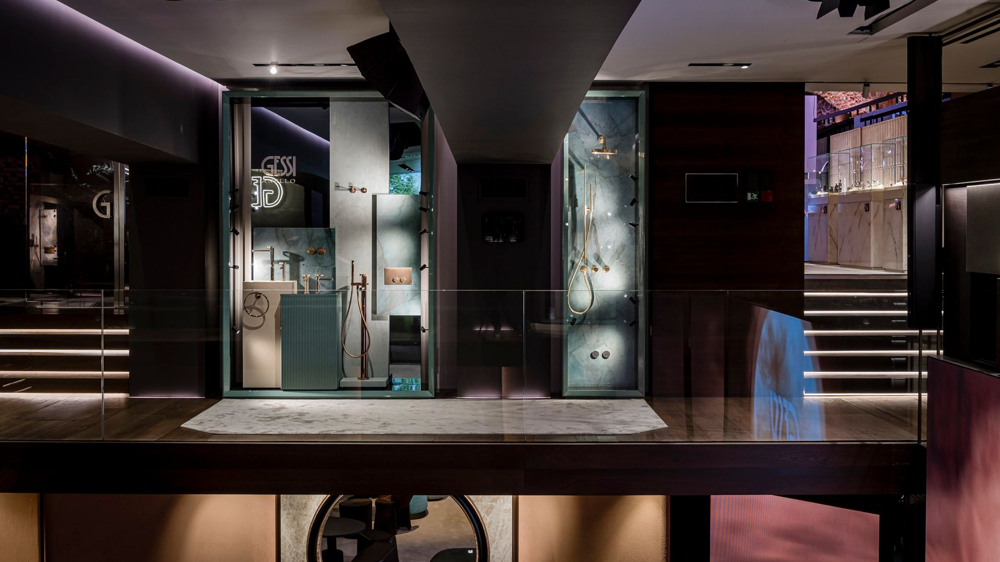

*图：Casa Gessi 空间中的产品陈列，产品以珠宝式展示方式呈现。图源：GESSI 官网 Casa Gessi Milano 页面。*

## 02 品牌概述

Gessi 是意大利高端卫浴与"私人健康"（Private Wellness）品牌，1992 年由 Umberto Gessi 与其子 Gian Luca Gessi 在皮埃蒙特大区韦尔切利省的 Serravalle Sesia 创立，总部与生产基地设在自有的 Parco Gessi 园区。它的产品覆盖卫浴龙头与配件、淋浴与健康系统、厨房水系统、感应龙头、户外与家居装饰，核心主张是把浴室从"功能空间"改写成居住中最私密、也最被精心对待的空间。

| 项目 | 内容 |
|---|---|
| 品牌名 | Gessi · [https://www.gessi.com](https://www.gessi.com) |
| 国家/地区 | 意大利（皮埃蒙特大区 韦尔切利省 Serravalle Sesia，Parco Gessi 园区） |
| 成立时间 | 1992 年（据行业媒体 2013 年报道"创立 20 年"；官网表述为三十余年） |
| 创始人 | Umberto Gessi 与其子 Gian Luca Gessi |
| 代表性设计人物 | 内部团队 Gessi Style Studio（负责人 Luca Bresciani 与 Sara Ferrari）；合作设计师 Kengo Kuma（Incastri）、Prospero Rasulo（Rettangolo、Goccia）、Lázaro Rosa-Violán（Venti20）、Michael Vincent UY（Ventaglio） |
| 其他关键人物 | Gian Luca Gessi（家族第二代，2026 年进入 Altagamma 基金会董事会）；Andrea Portigliotti（2024 年起任首席商务官） |
| 官方理念 | "私人健康"（Private Wellness）；"Crafting beauty, creating value"；"technologically handcrafted"（技术上手工制造的物件） |
| 品牌归属 | 家族企业（Gessi S.p.A.；集团历史上包含 San Marco Rubinetterie 与 Ceramiche Appia Nuova 等品牌；注册资本 1,000 万欧元） |
| 核心业务 | 卫浴龙头与配件、私人健康与淋浴系统、厨房水系统、感应龙头、户外、家居装饰 |
| 经典产品 | Rettangolo、Goccia、Habito、Venti20（2020）、Perle（2023）、Jacqueline（2023）、Incastri（2024，Kengo Kuma）、Inverso（2024）、Ventaglio（2024）、Vita Gessi（2024）、Immersiva（2025） |

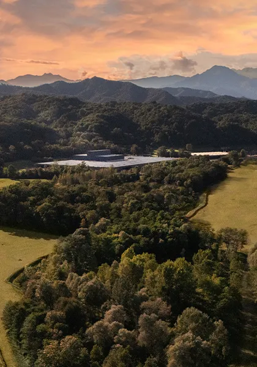

*图：Parco Gessi 园区中的公司建筑外观。图源：GESSI 官网公司页。*

## 03 Brand 品牌：父子创业与"私人健康"的确立

### 1992 年：父子创业

行业媒体在 2013 年的报道中给出清晰的时间坐标：Gessi 由 Umberto Gessi 与其子 Gian Luca Gessi 创立，2012 年公司刚庆祝过"创立二十周年"，据此推算品牌始自 1992 年。公司在官网的自我表述与之一致——"三十多年来，Gessi 一直在创造浴室、厨房与健康领域的龙头与配件"。创立地点 Serravalle Sesia 属于瓦尔塞西亚谷地，这里长期以金属加工与纺织业为生，后来成为品牌叙事中反复出现的"血统"来源：官网把"地域即身份"写成了公司的第一句自我定义。

### 2000 年代：重新定义"水从哪里来"

官网上关于 Rettangolo 的表述是理解品牌技术路线的入口：在 2000 年代，龙头还是"搁在台面上的阀门"，Gessi 决定重新追问水的出口位置——台面、地面、墙面或天花板。这个追问产生了可贴台面安装、落地安装、壁出与顶出的完整系统，也让产品第一次真正进入建筑师的立面与剖面图纸。此后 Gessi 的产品线基本沿着这条路径展开：先改变水与空间的关系，再在其上叠加材料、表面与感官体验。

### 2012 年：出口导向的规模节点

2013 年的行业媒体报道给出了这个阶段的财务切面：集团 2012 年合并营收 1.157 亿欧元，比 2011 年的 1.124 亿欧元增长 3%，集团 EBITDA 为 1,400 万欧元，海外销售约占七成。同一篇报道提到两个更能说明行业地位的细节：集团覆盖了意大利该品类出口的 13%，是意大利该领域的最大出口商；品牌在四年里投入 3,500 万欧元用于设备与新技术。报道同时说明了战略转向——面对意大利建筑业下滑（该行业在意大利下降约 30%），公司把重心压向 contract（工程项目）渠道。

### 2013 年：曼佐尼街的"秘密花园"

同一年，Gessi 在米兰时尚区边缘的曼佐尼街 16 号开出第一个品牌空间：一座旧电影院被改造成 1,500 平方米、多层的展示与体验场所，由内部创意团队 Gessi Style Studio 设计，负责人是 Luca Bresciani 与 Sara Ferrari，主题定为"secret garden"，用意是把米兰的空间与皮埃蒙特的 Parco Gessi 连接起来。这个项目确立了品牌此后的零售逻辑：不做传统展厅，而是做可供设计师、经销商与私人客户停留、试用与社交的"城市据点"。

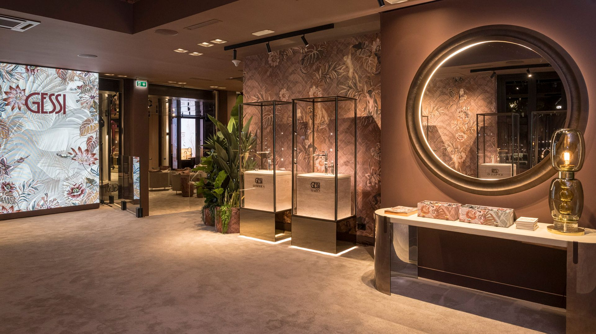

*图：Casa Gessi 米兰空间的迎宾休息区，产品以博物馆与珠宝店混合的方式陈列。图源：GESSI 官网 Casa Gessi Milano 页面。*

### 2023—2024 年：Haute Culture 与手工工艺的高点

2023 年，品牌推出两条被归入 Haute Culture（高级文化）线的系列：Perle 与 Jacqueline。前者的官方描述强调穆拉诺玻璃、天然石材与意大利金属工艺的结合；后者被称为"第一个也是唯一一个使用真竹材制作的系列"，并强调每一件都经过接近高级定制的手工流程，无法与批量生产兼容。2024 年，品牌继续扩展这条线：与日本建筑师隈研吾（Kengo Kuma）合作的 Incastri 系列正式发布，灵感来自日本传统的木构件咬合（Chidori）；同年，Casa Gessi New York 在 SoHo 的拉法叶街 214 号开幕，那栋新古典建筑曾是发电站、后来成为艺术家住所，五层空间全部用于呈现品牌。

### 2024—2026 年：数字界面的规模验证

2024 年的 Vita Gessi 是品牌在"厨房水系统"上的一次技术押注：官方称其为第一款带数字界面的厨房龙头，把用水量控制与操作体验集成到同一套界面里，并在同年进入 ADI 设计索引（2024 年共 241 件产品与服务入选）。2025 年，品牌连续第八年被评为 Deloitte Private 的"最佳管理公司"（Best Managed Companies），并被 Mediobanca 的《意大利主要企业》研究列入"最具活力的八家企业"之一——该研究覆盖 1,084 个集团与 2,358 家公司。2026 年米兰设计周，品牌把主题定为"长期主义"，在家居与健康之间发布 Rituale del Vapore，同时在曼佐尼街形成了两个品牌空间并列的格局。

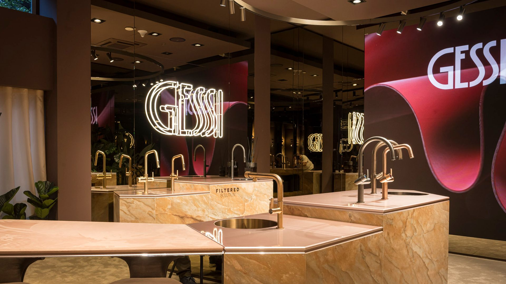

*图：Casa Gessi 米兰内的厨房空间，用于呈现厨房水系统与同系列材料。图源：GESSI 官网 Casa Gessi Milano 页面。*

## 04 Category 品类与市场：卫浴五金的牌桌与口径

### 品类的定义与边界

Gessi 所处的品类通常被归为"卫浴五金与配件"（bathroom fittings），但它实际横跨三个相邻市场：卫浴龙头与淋浴系统、厨房水系统、以及以淋浴与蒸汽为核心的"私人健康"设备。三者的共性是与水、热、电和人体日常动作直接接触，因而对材料、机构与安全性要求高；差别在于决策场景——卫浴偏设计驱动，厨房偏功能与效率驱动，健康系统则带有健康消费的属性。

### 市场规模的判断口径

与多数细分品类一样，卫浴五金缺乏统一的公开统计口径：行业统计通常把龙头、配件与陶瓷、家具合并为"卫浴"整体。因此本章以品牌自述与第三方商业媒体、评级机构的数据为主，并标注来源性质。

可核查的数据有三组。第一组是公司的经营规模：官网在 2025 年 11 月的新闻中引用 Mediobanca 的研究，公布 2024 年营业额 2.77 亿欧元，同比增长 24%，海外占比 80%。第二组是更早的历史坐标：2012 年集团合并营收 1.157 亿欧元，海外约七成，集团覆盖意大利该品类出口的 13%（行业媒体 2013 年报道）。第三组来自第三方评价：Deloitte Private 在 2025 年连续第八年把 Gessi 评为意大利最佳管理公司之一；Mediobanca 的《意大利主要企业》研究在 1,084 个集团与 2,358 家公司中把它列入最具活力的八家企业。三组数据分别代表公司自述、行业媒体与独立机构，方向一致。

### 价格带与产品分层

品牌不公开价目表，产品按项目报价。从产品结构可以判断它的价格带：主线产品使用金属本体与多道表面处理，Haute Culture 系列引入穆拉诺玻璃、天然石材、真竹与手工流程，成本结构明显高于规模化龙头；同时品牌在合同项目、酒店与游艇上提供工程级方案。品牌的分层方式是"三条线并行"：以 Haute Culture 系列承担形象与手工价值，以 Iconic 系列（Rettangolo、Goccia、Venti20、Habito 等）承担长期销售，以空间系统（淋浴、蒸汽、厨房水系统）承担技术与客单价的扩张。

### 品类惯例与技术趋势

过去二十年，这个品类出现了六条趋势，Gessi 在其中多条上有对应的产品。第一是出水位置的自由化：从台面安装走向落地、壁出与顶出（Rettangolo）。第二是表面与纹理的设计化：从单一镀铬走向磨砂、哑光、拉丝与图案化处理（编织金属系列 Habito 与 Inverso 分别提供 6 种图案、13 种饰面）。第三是健康化：淋浴系统从"洗浴工具"变成带色光、蒸汽与香氛的体验设备（私人健康线）。第四是智能化：恒温、感应与数字界面进入龙头（Vita Gessi）。第五是材料叙事：玻璃、石材、竹材与皮革被引入五金（Perle、Jacqueline）。第六是渠道体验化：品牌用城市据点（Casa Gessi）替代传统展厅。

### 渠道结构

品牌的渠道由三层组成：以 Casa Gessi 与 Atelier Gessi 命名的城市品牌空间（米兰、纽约、伦敦、迪拜等），负责体验、设计与咨询；各国的经销商与专业渠道（官网设有面向从业者的 Area Pro，提供产品检索、配置与商务支持）；以及面向酒店、度假村、住宅开发与游艇的 contract 团队，配套"设计与咨询服务"。

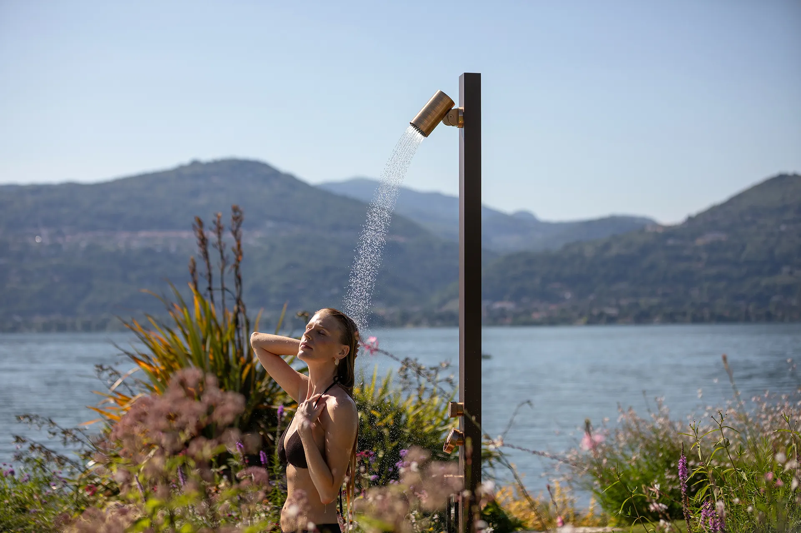

*图：户外系列（Ranco）在泳池与花园场景中的应用。图源：GESSI 官网户外系列页。*

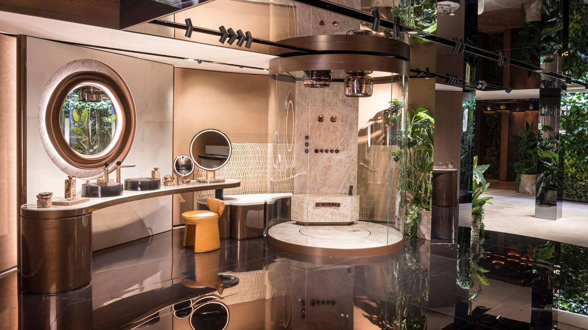

*图：2026 年米兰设计周期间 Casa Gessi 空间的长期主义主题陈列。图源：GESSI 官网 Casa Gessi Milano 页面。*

## 05 User 用户与场景：谁在决定一间浴室

### 决策链：设计师、开发商、运营商与终端用户

高端卫浴的采购链条比表面看到的更长。建筑师或室内设计师决定出水位置、龙头高度、饰面与整体材质关系；开发商或酒店运营商决定品牌与预算；经销商与施工方完成深化、供货与安装；终端用户直到入住才开始与产品发生每天的身体接触。Gessi 的产品与渠道设计针对这条链条做了三件事：把出水位置做成可选项，让设计师可以按立面关系选择（Rettangolo 的台面、落地、壁出与顶出）；把品牌空间做成设计咨询场所（Atelier Gessi Dubai 由专门的建筑师与室内设计师团队提供咨询）；把专业渠道单独做成 Area Pro，提供产品检索与商务支持。

### 用户分层与核心任务

按任务划分，品牌面对四类客户。第一类是高端住宅业主与设计师，要解决的问题是"浴室要像私人 SPA，而不是卫生间的升级版"；第二类是酒店与度假村，关注批量一致性、耐久性、维护成本与体验记忆点；第三类是游艇与海上项目，对材料耐蚀、重量与安装条件要求最苛刻；第四类是商业与公共项目（办公、俱乐部、医疗康养），需要在规范、运营与美学之间取得平衡。

> 术语注释：JTBD——用户任务，指用户"雇佣"一件产品去完成的具体事情。

从 JTBD 的角度看，Gessi 的产品承担三类任务：完成取水与洗浴（龙头、淋浴、蒸汽系统）、把浴室变成可停留的空间（色光、蒸汽、气味与触感）、以及通过材料与工艺表达身份（Haute Culture 系列的手工与稀有材料）。

### 场景与项目案例

品牌公开的项目清单覆盖住宅、酒店、商业、游艇与康养五类，地域从中东到北欧。几个可核查的例子：雅典的 Conrad Athens, The Ilisian 酒店；德国康斯坦茨的 Buff Medical Resort（医疗康养）；意大利撒丁岛的 W Sardinia 酒店；沙特阿拉伯的 Desert Rock Resort 与 Sheybarah Resort、迪拜的 Bab Al Shams Desert Pool Villas；安道尔的 La Querola d'Ordino。

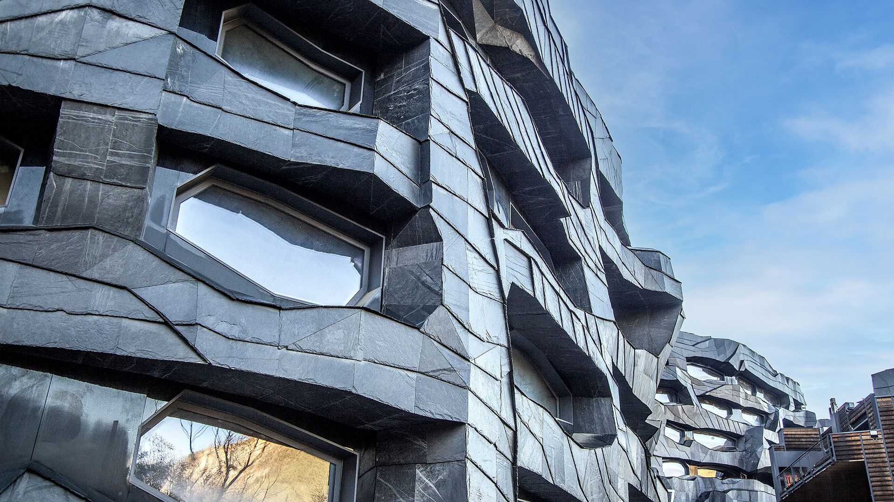

*图：安道尔 La Querola d’Ordino 度假住宅项目内景。图源：GESSI 官网项目案例页。*

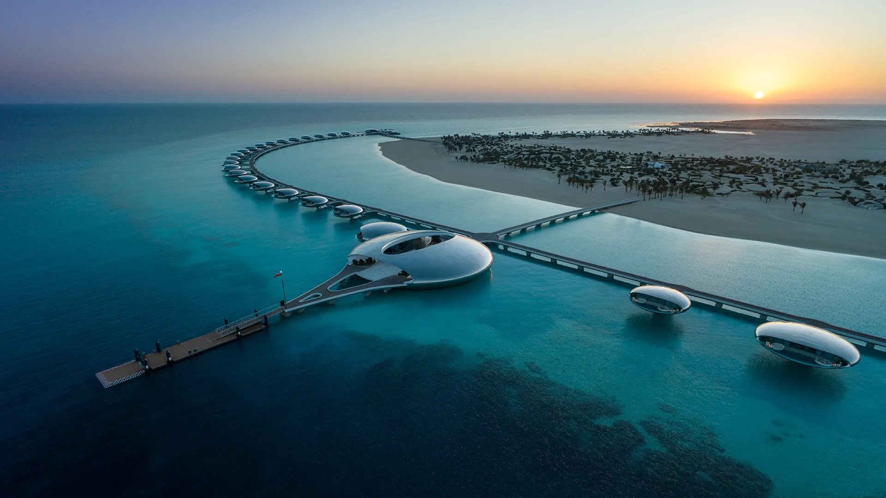

*图：沙特阿拉伯 Sheybarah Resort 项目中的浴室空间。图源：GESSI 官网项目案例页。*

> 术语注释：contract——面向酒店、办公、住宅开发与游艇等项目的定制供货渠道。

### 购买与使用入口

> 术语注释：CEP——购买与使用入口，指触发用户进入某个品类的具体情境。

按 CEP 梳理，触发品牌生意的入口有五类：设计周与城市设计活动（米兰、纽约、伦敦、哥本哈根等地）；Casa Gessi 与 Atelier Gessi 的到店体验；样板房与酒店工程招标；游艇与私人项目；以及设计师在方案阶段的指定。品牌近年把大量资源投向第一与第二类：2026 年米兰设计周同时在曼佐尼街布置两处空间，并与 Altagamma 的"Icons of Italy"项目一起在纽约展出。

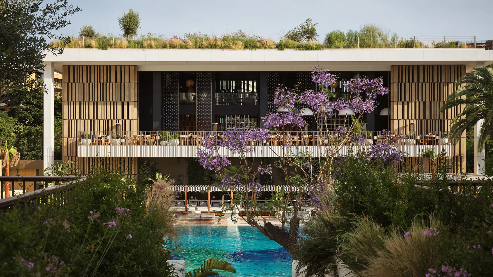

*图：希腊雅典 Conrad Athens, The Ilisian 酒店项目中的浴室空间。图源：GESSI 官网项目案例页。*

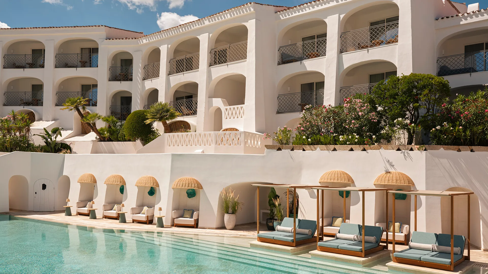

*图：意大利撒丁岛 W Sardinia 酒店项目内景。图源：GESSI 官网项目案例页。*

## 06 Positioning 定位：把龙头做成一种生活方式

### 参照系与目标人群

Gessi 的参照系不是"五金货架"，而是私人健康与奢侈品。官网在介绍品牌时使用的措辞是"私人健康领域的标杆品牌，成功把浴室提升为居住中最重要的空间"，并把体验定义为一种"奢华生活方式"（A LUXURY LIFESTYLE EXPERIENCE）。参照系一旦换成生活方式品牌，评价标准就从"出水量与耐用性"扩展到感官、仪式、材料与文化。

目标人群因此明确：愿意为浴室空间单独投入预算的高端业主、以体验为卖点的酒店与度假村、以及需要在方案中表达材料品味的建筑师与设计师。

### 差异点与基准点

> 术语注释：POD——差异点，指品牌相对竞品被感知到的独特优势。

差异点可以归为五条，并各有证据。第一是"私人健康"的完整叙事：品牌不只是卖龙头，还提供带色光与蒸汽的淋浴系统、以及 2026 年发布的蒸汽护理仪式（Rituale del Vapore），把产品线组织成一套日常健康流程。第二是手工与小批量的高级文化系列（Haute Culture）：Perle 使用穆拉诺玻璃与天然石材，Jacqueline 是全行业唯一使用真竹材的系列，且官方明确说明其工艺无法与量产兼容。第三是表面与纹理体系：编织金属在 Habito 上提供 6 种图案与 13 种饰面，构成可识别的材质签名。第四是出水位置的技术自由：从台面、地面、墙面到天花板的完整安装方式。第五是城市据点式的零售网络（Casa Gessi 系列），把展示、设计咨询与文化活动放在同一处历史建筑里。

> 术语注释：POP——基准点，指该品类中必须达到的行业共识项。

基准点同样清楚：意大利制造、ISO 9001/14001/45001 三重体系认证（品牌自 1996 年起持有 ISO 9001）、完整的产品认证与市场准入文件、覆盖高端市场经销网络、以及可被行业引用的设计与可持续记录。

### 定位陈述与证据链

把上述内容压缩成一句话：Gessi 定位为"以私人健康为叙事的高端水空间品牌"，它销售的是被设计过的日常仪式，而不只是龙头与花洒。

承诺与证据的对应关系可以直接列出：健康承诺对应淋浴与蒸汽系统、2026 年的 Rituale del Vapore 与长期主义主题；手工承诺对应 Haute Culture 系列与穆拉诺玻璃、竹材、石材质地；技术承诺对应出水位置系统、数字界面的 Vita Gessi 与感应产品线；可持续承诺对应 150 万平方米园区、ISO 14001/45001、以及与德勤合作编制、用水彩插画呈现的《可持续性手册》；组织承诺对应连续多年的 Deloitte Best Managed Companies 与 Mediobanca"最具活力八家企业"评价。

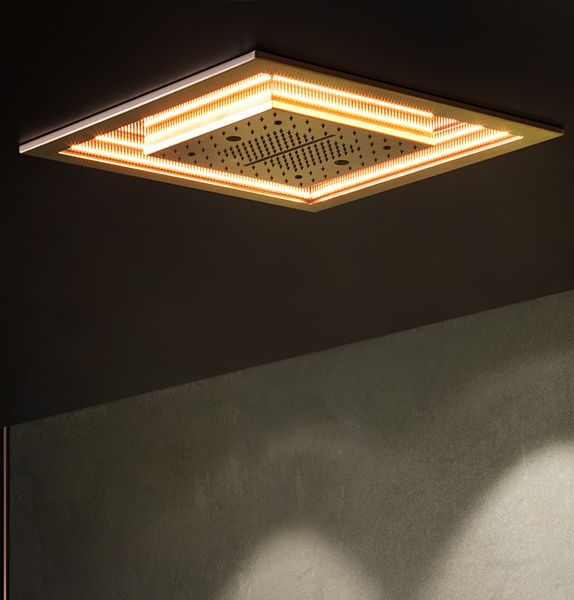

*图：私人健康（Private Wellness）产品线在空间中的呈现。图源：GESSI 官网私人健康页面。*

## 07 Product 产品：从出水位置到一整套系列

### 产品组合与命名逻辑

品牌的产品目录按场景分为六块：Bath（卫浴龙头、淋浴、冲水面板、配件）、Private Wellness（健康与淋浴系统）、Kitchen（厨房水系统）、Sensor Taps（感应龙头）、Outdoor（户外系列）与 Home Decor（家居装饰）。在此之上，品牌用"Haute Culture"这一命名把手工与稀有材料的高端系列单独划分出来——它既是一组产品，也是一种品牌叙事：官方把它描述为"关于美的文化与个人福祉"，产品则承担把这种叙事变得可触摸的责任。

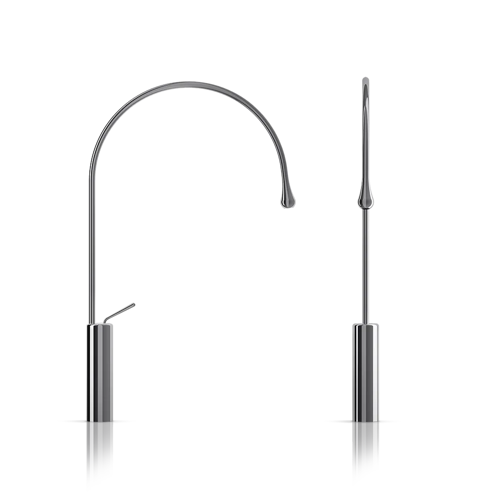

*图：Goccia 系列产品，以水滴形态为原型（Gessi 与 Prospero Rasulo 合作）。图源：GESSI 官网 Goccia 系列页。*

### Rettangolo（2000 年代）：把出水点从台面解放出来

Rettangolo 是品牌技术语言的起点。官方的表述是：在 2000 年代，当龙头还被理解为"搁在台面上的阀门"时，Gessi 重新追问水应当从哪里流出——台面、地面、墙面还是天花板。这一追问的结果是一套可贴台面、落地、壁出与顶出的安装体系，出水的位置从此成为设计变量。系列由艺术家出身的设计师 Prospero Rasulo 参与完成，他 1953 年生于马泰拉地区，1980 年毕业于米兰布雷拉美术学院，此后长期在舞台装置、公共艺术与产品设计之间工作。

从产品定义的角度看，这一步让龙头第一次真正进入建筑图纸：当出水点可以在剖面上移动时，五金就变成了空间界面的一部分。

### Venti20（2020）：把"咆哮的二十年代"做成饰面

Venti20 由西班牙室内设计师 Lázaro Rosa-Violán 及其 LRV Studio（2002 年成立于巴塞罗那）设计，名字指向 1920 年代。产品的官方描述强调"以色泽之美激发想象"，把装饰性饰面与纯净形体结合。2022 年 10 月，美国管道与五金行业在纽奥良举行的第 21 届年度会议与产品展上，把这个系列评为"年度产品"（Water Delivery Product of the Year 类别），同届入选的还有 Gessi 316 厨房龙头。

这个系列的策略意义在于：它证明品牌可以在不改变机构的前提下，通过饰面与色彩体系创造新品，从而覆盖更广的设计口味。

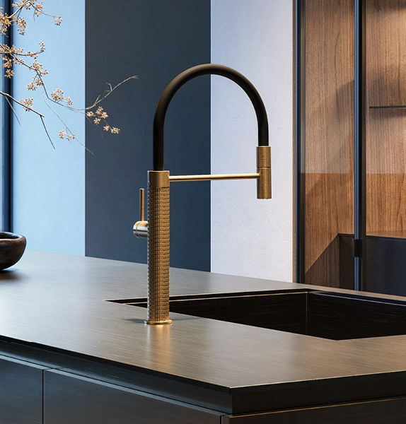

*图：GESSI 316 厨房龙头系列。图源：GESSI 官网厨房系列页面。*

### Perle（2023）：穆拉诺玻璃、石材与"珍珠"

Perle 属于 Haute Culture 系列，官方把它描述为"完美的精髓"：以珍珠这一自然界最纯粹的形式为灵感，每一颗"珍珠"由穆拉诺玻璃、天然石材与意大利金属手工制作。2024 年，这个系列获得 iF DESIGN AWARD（产品类，全球申报近 11,000 件、来自 72 个国家、132 位评审），同年 12 月又获得美国《Interior Design》杂志的 Best of Year Award；2026 年 4 月，Perle 被选入第 29 届金圆规奖（XXIX ADI Compasso d'Oro）公开展览。

Perle 的行业意义不在技术参数，而在材料边界：它把玻璃与石材这类"脆弱或沉重"的材料带进了每日使用的水龙头体系，并用手工流程保证一致性。

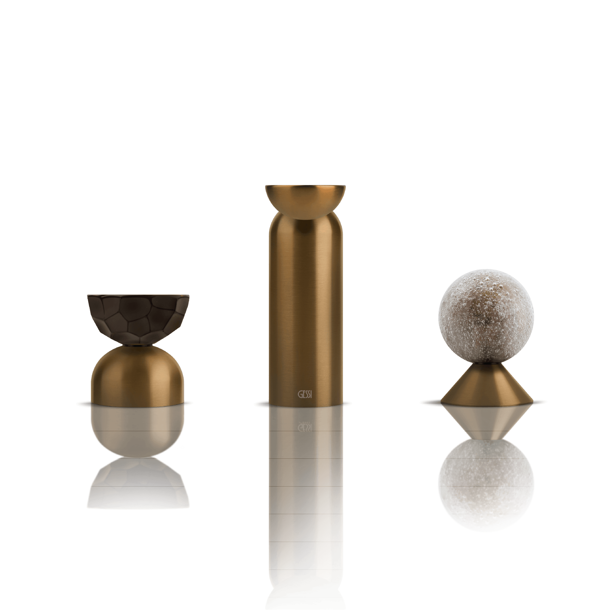

*图：Perle 系列产品，球形把手与金属主体的组合。图源：GESSI 官网 Perle 系列页面。*

### Jacqueline（2023）：全行业唯一使用真竹材的系列

Jacqueline 同样属于 Haute Culture。官方的表述很直接：这是第一个也是唯一一个使用真竹材制作的系列；每件产品都经过接近高级定制的手工流程，因此"与批量生产不相容"。产品页面还描述了竹材筛选的过程——需要时间、经验与眼光，因为每一段的色泽与质地都不同。

这条产品线解释了品牌的工艺策略：批量产品用工业体系保证精度与交期，高端系列则用人工与稀有材料制造不可复制的差异，两者共用同一套品牌语言。

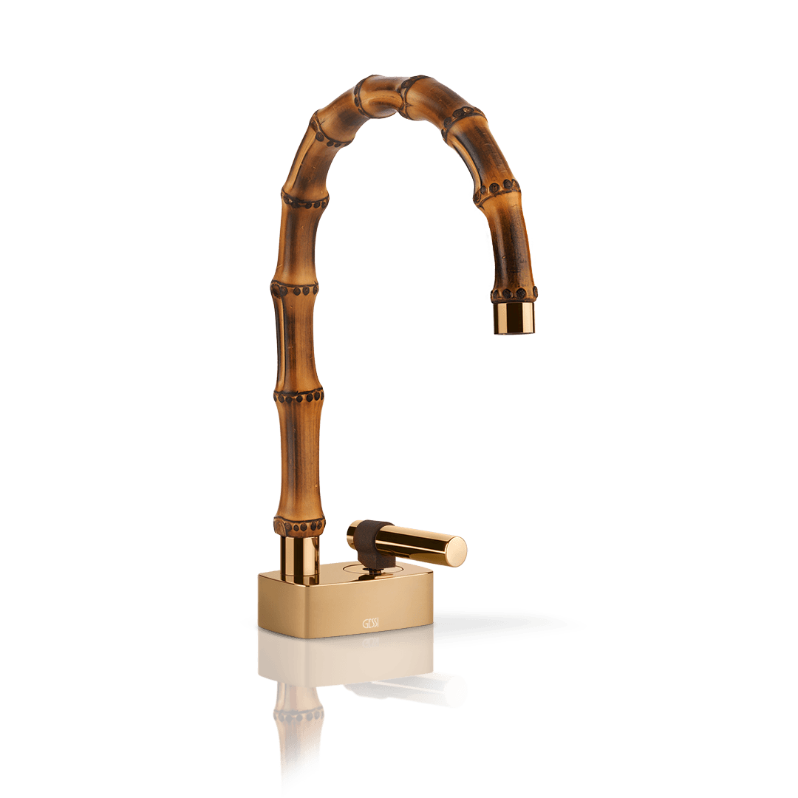

*图：Jacqueline 系列产品，竹材与金属的结合。图源：GESSI 官网 Jacqueline 系列页面。*

### Incastri（2024）：隈研吾与日本木构的咬合

Incastri 是品牌与日本建筑师隈研吾（Kengo Kuma）合作的结果。官方说明灵感来自日本传统的"千鸟"（Chidori）咬合工艺——通过构件的衔接、交叉与叠加形成结构，并把这套逻辑转译为浴室产品。品牌在 2024 年 5 月发布 Incastri 的 Joinery 新作，2025 年 4 月把同一语言扩展到厨房。

这是品牌少见的与外部建筑师的大型合作：它带来的不是单一造型，而是把"咬合"这一构造逻辑变成系列的设计语法，也把品牌的语言从意大利材料传统延伸到东亚木构传统。

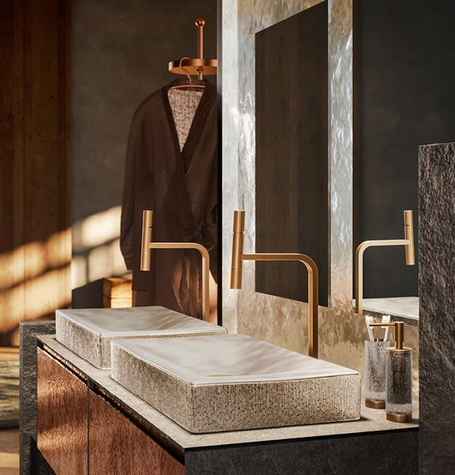

*图：Incastri 系列产品主图。图源：GESSI 官网 Incastri 系列页面。*

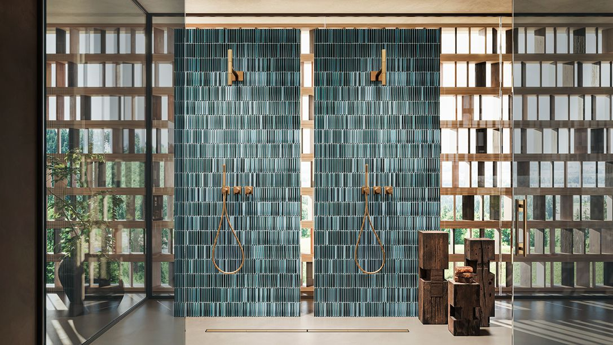

*图：Incastri 系列在浴室场景中的组合细节。图源：GESSI 官网 Incastri 系列页面。*

### Inverso（2024）与 Ventaglio（2024）：两种几何趣味

Inverso 把品牌的两个基本几何（矩形与圆形）合成一个形体：圆柱主体立在方形底座上，配极薄出水嘴与带装饰的把手，官方称其把手开启方式在人体工学上做了新的处理。Ventaglio 则由常驻米兰的菲律宾建筑师与室内设计师 Michael Vincent UY 设计，以折扇为原型，用渐进展开的构件呼应折扇的动作。

两者共同说明品牌的系列策略：在成熟机构的基础上，用几何与工艺做出可辨识的差异，同时保持与既有产品线共用安装标准。

### Vita Gessi（2024）：第一款带数字界面的厨房龙头

Vita Gessi 的关键词是"多功能"。官方称其为第一款带数字界面的厨房龙头，把用水量优化与操作体验集成在同一套界面里。2024 年，它入选 ADI 设计索引（当年共 241 件产品与服务），同系列还获得 iF 设计奖；2025 年 5 月，品牌在 Casa Gessi 内开设了以 Vita Gessi 命名的咖啡空间，把产品放进真实的餐饮场景。

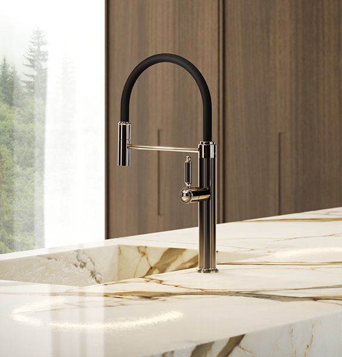

*图：Venti20 厨房系列，与卫浴同名的系列在厨房场景中的延续。图源：GESSI 官网厨房系列页。*

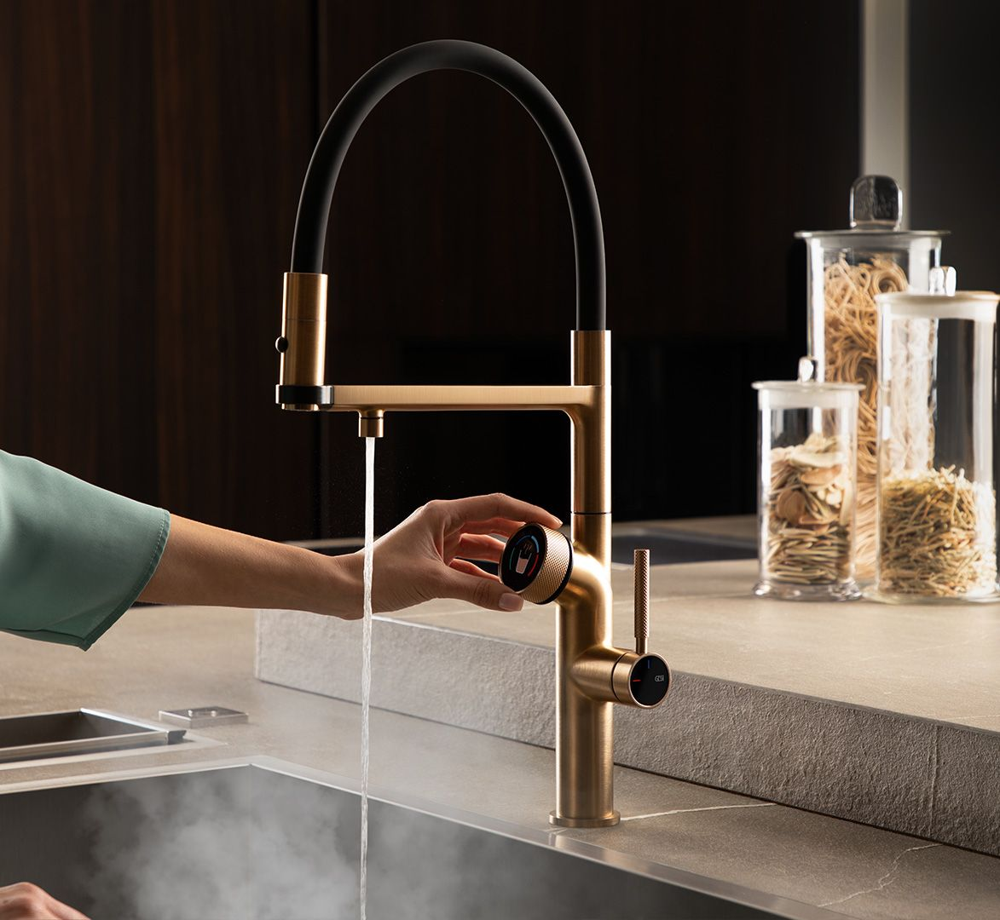

*图：Vita Gessi 厨房水系统。图源：GESSI 官网厨房系列页面。*

### Immersiva（2025）：把色光与蒸汽做成一套系统

Immersiva 属于私人健康线，2025 年入选 ADI 设计索引。官方描述它"把技术变成情感体验"，灵感来自现代的曲线数字系统，柔和的出水与操控界面与材料、细节相互作用；它出自 Haute Culture 体系，因而在工艺与材料上延续同一套标准。

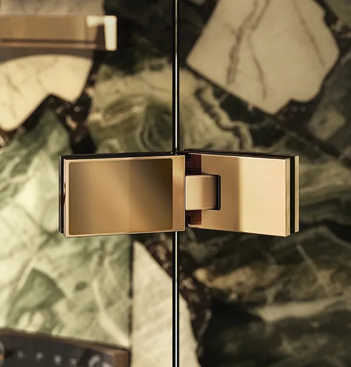

*图：Glass Connection 系列产品，属于私人健康线的玻璃材质方案。图源：GESSI 官网私人健康页。*

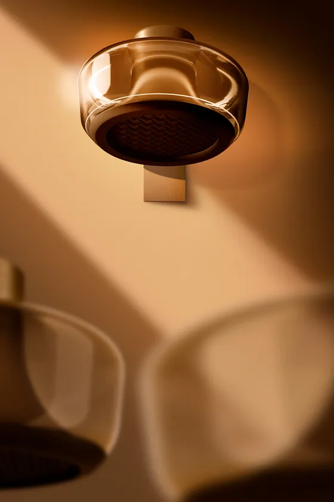

*图：Sensazioni 系列产品，用于呈现淋浴系统中的感官设计。图源：GESSI 官网私人健康页。*

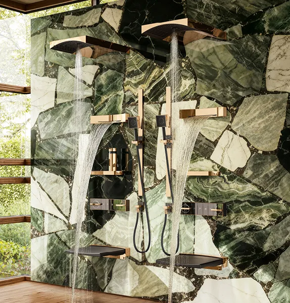

*图：Immersiva 系列在浴室空间中的呈现。图源：GESSI 官网私人健康页面。*

### 产品小结与第三方评价

把产品线放在一起看，Gessi 的策略可以概括为"一个机构体系，三种价值层"。机构体系指可共用安装与出水标准的金属本体；三种价值层分别是：以 Rettangolo、Goccia、Habito 为代表的长期销售层，以 Venti20、Inverso、Ventaglio 为代表的饰面与几何层，以 Perle、Jacqueline、Incastri、Immersiva 为代表的手工与工艺层。第三方的评价也集中在第三层：iF、Best of Year、ADI 设计索引与金圆规奖展览的入选记录，都指向那些在材料与工艺上做出差异的系列。

## 08 Aesthetics 美学：水滴、编织金属与珍珠

### 视觉识别与传播语言

品牌的视觉语言以字标与产品特写为核心：官网与图册大量使用深色背景上的材质特写，让饰面、纹理与反射成为画面主角；传播内容按"我们的世界""项目案例"" Casa & Atelier "组织，把产品放进建筑与生活叙事。品牌的出版物（如《可持续性手册》）甚至采用水彩插画来呈现通常被视为纯技术的议题，这种处理方式与产品线的"手工艺叙事"一致。

### 形态与比例

形态上，品牌围绕几个基本几何展开：水滴（Goccia）、矩形（Rettangolo）、折扇（Ventaglio）、咬合构件（Incastri）、球体（Perle）。这些形体的共同点是几何感强、细节控制在比例与接缝上，而不是依靠装饰。产品在空间中通常不做视觉中心，而是通过出水方式与材质与建筑对话——这也解释了品牌为什么重视"出水位置"这种看似技术性的问题。

### 色彩与材料情绪

色彩与材料是品牌最外显的美学资产。编织金属（woven metal）在 Habito 上提供 6 种图案与 13 种饰面，在 Inverso 上以 Diamantato 与 Rigato 纹理延续；饰面体系覆盖磨砂、哑光、拉丝与彩色处理。Haute Culture 系列则把材料推向更稀有的方向：穆拉诺玻璃的透明与色彩、天然石材的纹理、真竹的天然色差。

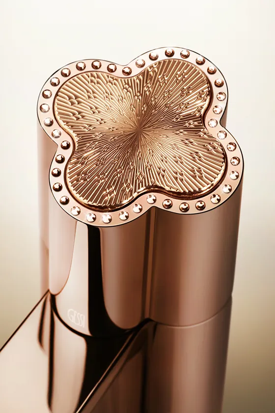

*图：Ludovica 系列产品，展示金属与几何形体的组合。图源：GESSI 官网卫浴系列页。*

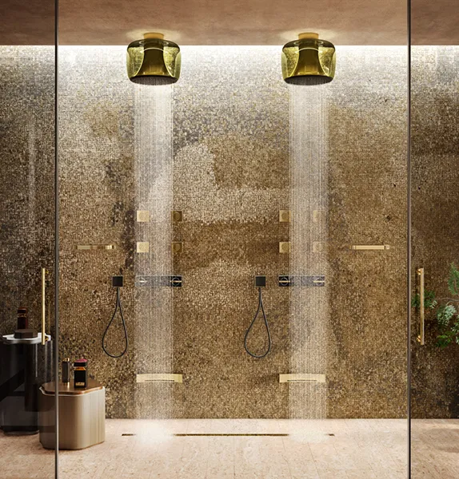

*图：饰面与材料的细节呈现。图源：GESSI 官网私人健康页面。*

### 光与空间

光在品牌的产品与空间里有三种角色。第一是产品表面的反射：金属与玻璃在浴室照明下形成层次。第二是产品发光：淋浴与健康系统内置的色光（chromotherapy）把光变成体验的一部分。第三是空间的光：Casa Gessi 的选址与改造常常保留历史建筑的结构与光线，例如米兰的旧电影院与纽约的前发电站，产品的展示方式更接近美术馆与珠宝店。

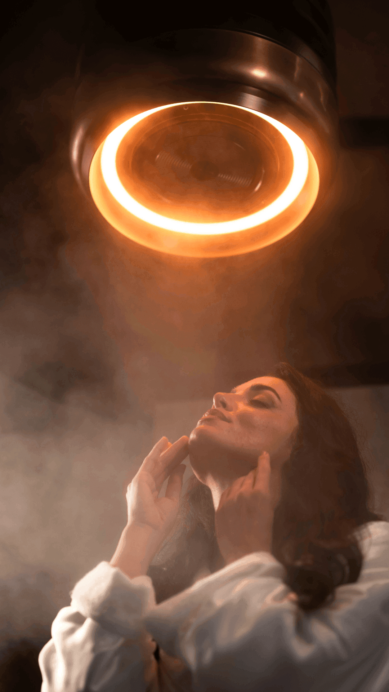

*图：Casa Gessi 米兰空间中的主题陈列与灯光。图源：GESSI 官网 Casa Gessi Milano 页面。*

### 感官与叙事基调

品牌最独特的美学主张是把"时尚"的语言搬进浴室：Habito 的官方描述直接用裁缝（tailoring）作比喻——"正如裁缝围绕人量体裁衣，Habito 优雅地为居住中最私密的空间穿衣"。Jacqueline 则把竹材与高级定制的工序放在一起讲。2026 年的 Rituale del Vapore 更进一步，把蒸汽写进护发与护肤流程，让浴室承担美妆与护理的仪式。

> 术语注释：Haute Culture——Gessi 对自家中手工与稀有材料系列的命名，借用"高级定制"的说法。

### 美学评价

Gessi 的美学可以概括为"把工业五金做成可穿戴的材料体验"。支持这一判断的依据是具体的：它用编织金属与饰面系统建立可识别的表面语言；用穆拉诺玻璃、石材与竹材把五金推到接近珠宝的工艺层级；用 Casa Gessi 的城市据点把产品放进历史建筑的光线与空间中；再用"私人健康"的叙事把这一切组织成日常仪式。代价同样存在：手工系列的成本与交期远高于常规产品，稀有材料的日常维护（石材、竹材、玻璃）需要更明确的护理指引，而强烈的材料表现也要求室内设计在使用时保持克制，否则容易喧宾夺主。

## 09 Design 设计：把手工藏进工业体系

### 设计哲学：水、空间与健康的三层设计

Gessi 眼中的设计首先是一种塑造生活主张的手段，其次才是产品外观。官网把品牌描述为"私人健康领域的标杆"，并把产品目标写成"设计一种可以居住、可以穿戴、可以呼吸的风格"（a design to live, wear, and breathe）。这句话解释了它在三个层面上做设计的方式：水如何进入空间（出水位置与机构）、空间如何被材料定义（饰面与纹理）、以及人在其中如何度过时间（淋浴、蒸汽与护理仪式）。

在功能、形式、情感与技术之间，它的站位由三条取舍构成。第一，机构先于造型：Rettangolo 的出发点不是形状，而是"水该从哪里出来"这一功能问题，造型是它的结果。第二，工业化与手工并存且互不迁就：品牌用"technologically handcrafted"（技术上手工制造的物件）形容自己的产品，同时明确 Haute Culture 系列的关键工序"与批量生产不相容"，也就是说，它不试图用工艺妥协换取规模，而是把两种生产逻辑分层放置。第三，时间维度上押注耐久与仪式：官网把可持续定义为"一种既能满足当下需求、又不损害后代满足自身需求能力的发展模式"，并把蒸汽、护理与长期健康写进 2026 年的产品主题。

### 组织与设计力量：内部工作室加外部设计师

品牌的设计能力由一个内部工作室与一组长期合作的外部设计师共同构成。内部以 Gessi Style Studio 为核心，行业媒体在 2013 年报道米兰空间时点名其负责人为 Luca Bresciani 与 Sara Ferrari，此后品牌的城市空间与大量系列延续这一内部设计语言。外部合作名单覆盖不同传统：意大利艺术家出身的设计师 Prospero Rasulo（Rettangolo、Goccia）、西班牙室内设计师 Lázaro Rosa-Violán（Venti20）、日本建筑师隈研吾（Incastri）、常驻米兰的菲律宾建筑师 Michael Vincent UY（Ventaglio）。

这种结构的效果是：内部掌握材料、机构与制造语言，外部带来文化与地域的差异；代价是系列之间的风格跨度较大，需要靠统一的材料体系（编织金属、饰面）与空间语言把产品重新收拢。

### CMF：编织金属与饰面体系

品牌最稳定的视觉资产是"编织金属"（woven metal）：Habito 系列把这一语言整理为 6 种图案与 13 种饰面，官方把图案命名为 Cesello、Trame、Rigato、Intreccio、Diamantato 等；Inverso 继续使用 Diamantato 与 Rigato 纹理。除了金属，品牌在材料上还有三条扩展线：玻璃（穆拉诺手工玻璃）、石材（天然石材与大理石）、竹材（Jacqueline 的整根真竹）。此外还有哑光、磨砂、拉丝与彩色饰面，用于覆盖从冷色调到暖金属色的整段区间。

这些材料的组合逻辑与浴室环境直接相关：潮湿与温差要求材料稳定，日常清洁要求表面不易留痕，而设计价值则来自纹理在光下的变化。

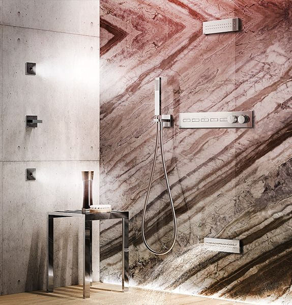

*图：编织金属纹理在产品表面的呈现。图源：GESSI 官网产品页面。*

### 制造：Parco Gessi 与"公司绿洲"

品牌的总部与生产基地位于 Serravalle Sesia 的 Parco Gessi，占地约 150 万平方米，环绕绿地。官网上对这个园区的描述包含两个技术与文化细节：一是"公司绿洲"（company-oasis）项目——在被开采过的采石场场址上以低影响建筑重建生产设施，并修复古旧废弃建筑；二是把园区本身当作质量的一部分，认为生产环境与产品品质互为条件。体系认证方面，品牌自 1996 年起持有 UNI EN ISO 9001 认证，并同时持有 ISO 14001（环境）与 ISO 45001（职业健康与安全），官网称其为"同时获得质量、安全与环境保护三重认证"的少数企业之一。

### 可持续：一本用手绘呈现的量化手册

2024 年 11 月，品牌在 Parco Gessi 发布《可持续性手册》（Sustainability Book）。这份文件的两个特征值得注意：方法论由德勤参与，保证数据与核算框架的严谨性；呈现方式使用水彩插画，把通常被视为纯技术的内容转译为可阅读的叙事。手册报告的是 2023 年的活动与结果，覆盖环境、经济、组织、文化与社会五个方面的责任，并特别关注对所在地区与社区的影响。品牌对可持续的定义也写得很明确：它把可持续称为一种"文化"，而不是合规清单。

### 人机与工程：三个技术战场

从工程角度看，品牌的技术积累集中在三处。第一是水路与出水位置：从台面、落地、壁出到顶出的完整安装体系，要求对水压、坡度、安装深度与预埋件做系统化处理。第二是交互与数字化：Vita Gessi 把数字界面引入厨房龙头，官方称其为第一款带数字界面的厨房龙头，目标是把用水量控制与操作体验整合；感应龙头系列则把开关动作从"触摸"变成"靠近"。第三是感官技术：私人健康线把色光（chromotherapy）、蒸汽与不同出水模式组合成体验，2026 年的 Rituale del Vapore 把蒸汽延伸到护发与护肤流程。

这些技术有一个共同点：它们都要求在设计阶段介入建筑与管线，而不是在装修完成后才选择产品。

### 品牌侧依据与设计变量

| 品牌侧依据 | 对应的设计变量 | 产品证据 |
|---|---|---|
| 浴室是居住中最私密、最值得被设计的空间 | 出水位置自由、成套空间方案 | Rettangolo 的台面／落地／壁出／顶出 |
| 材料是品牌的语言 | 编织金属图案与饰面体系 | Habito（6 图案、13 饰面）、Inverso |
| 手工不可被量产替代 | 小批量手工系列、稀有材料 | Perle（穆拉诺玻璃与石材）、Jacqueline（真竹） |
| 设计需要外部文化输入 | 与建筑师、室内设计师合作 | Incastri（隈研吾）、Ventaglio（Michael Vincent UY） |
| 健康是可以被设计的日常 | 色光、蒸汽与护理流程 | Immersiva、Rituale del Vapore |
| 可持续需要被量化与讲述 | 手册、认证与园区改造 | Sustainability Book、ISO 9001/14001/45001 |

## 10 Experience 体验：从 Casa Gessi 到二十年之后

### 了解与选购

潜在客户接触品牌的路径包括官网、品牌空间、经销商与项目渠道。官网为专业用户设置了 Area Pro 分区，提供产品检索、配置工具与商务支持；面向普通用户则提供系列页面、图册与配置器。价格不在公开渠道，产品按项目报价，Haute Culture 系列更是逐件报价。

### 到店：以历史建筑为载体的城市据点

品牌把零售空间命名为 Casa Gessi（品牌之家）与 Atelier Gessi（工作室），选址偏好有历史与建筑价值的地段。已公开的节点包括：2013 年米兰曼佐尼街 16 号的旧电影院（1,500 平方米，主题"secret garden"）；2024 年 5 月纽约 SoHo 拉法叶街 214 号（新古典建筑，曾是发电站与艺术家住所，五层空间）；2024 年 11 月迪拜设计区的 Atelier Gessi Dubai（以设计咨询为核心，配有专家建筑师与室内设计师团队）；2026 年米兰设计周期间，曼佐尼街形成两个品牌空间并列的格局，其中一处以 Casa Gessi Haute Culture 命名。

这种模式的功能不只是陈列：它把材料样本、配置工具与设计咨询放在同一处，让设计师可以在现场完成选型。

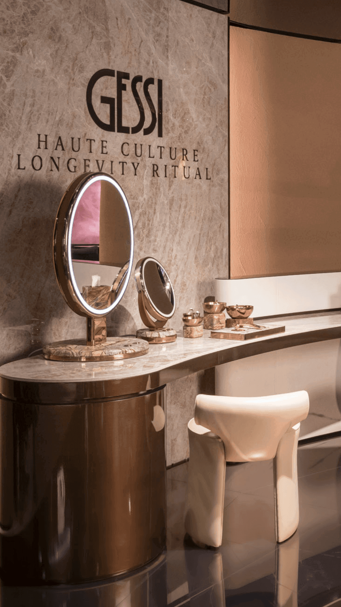

*图：Casa Gessi 米兰空间的外观与入口陈列。图源：GESSI 官网 Casa Gessi Milano 页面。*

### 定制与咨询

2025 年 12 月，品牌在米兰设立 Gessi Consulting，把设计咨询作为独立服务对外提供；迪拜的 Atelier 也以"从概念到细节选择"的咨询流程作为核心卖点。这类服务的对象主要是设计师与开发商：他们需要的不只是产品目录，而是在材料搭配、出水位置、空间动线与维护成本上的判断。

### 安装与维护

产品对安装条件的要求高于常规五金：落地与顶出龙头的出水位置需要与土建、给排水与地暖协调；带数字界面或色光的产品需要预留电气；感应产品需要电源与调试。日常维护方面，金属饰面与编织纹理需要按品牌建议清洁，穆拉诺玻璃、天然石材与竹材则有各自的护理限制。官网与经销商会提供安装与维护文件，这也是品牌坚持"专业渠道 + 品牌空间"结构的原因。

### 长期持有

从公开信息可以判断品牌的长期策略：以认证体系（ISO 9001 自 1996 年）保证工艺一致性；以金属本体与可更换部件延长使用周期；以手册形式公开环境与组织绩效；以手工系列承接"传家"叙事的品牌价值。需要说明的是，品牌未公开统一的质保年限与备件供应承诺，这些信息需向经销商或品牌方确认。

### 体验断裂点

以下问题来自公开信息与产品结构，属于可验证的体验弱点。价格与交期不透明是第一条：官网不提供价格与标准交期，手工系列的交期更长。第二条是复杂度：六个产品线与大量饰面组合，缺少专业顾问时容易在选型阶段迷失，Haute Culture 系列尤其如此。第三条是安装与维护的专业门槛：出水位置、色光、蒸汽与数字界面都需要电气与土建配合，石材与竹材的护理要求也高于常规金属。第四条是渠道依赖：最终体验取决于当地经销商与施工方的能力，品牌空间的示范效果不一定能在所有市场复制。第五条是系列跨度：由于外部设计师众多，系列之间风格差异较大，整宅统一需要额外的设计协调。

## 11 Competition 竞品：同一张牌桌上的龙头品牌

### 品牌归属与行业坐标

Gessi 是家族企业，历史上集团还包含 San Marco Rubinetterie 与 Ceramiche Appia Nuova 等品牌。它的行业坐标可以用三句话描述：在意大利本土，它是该品类最大的出口商之一（2012 年覆盖意大利该品类出口约 13%）；在国际高端市场，它与德国与北欧的设计型龙头品牌直接竞争；在规模上，它比多数同价位竞争对手更大——2024 年营业额 2.77 亿欧元，是同类意大利设计品牌的数倍。

### 品牌层：三类对手

第一类是德国与北欧的设计型龙头品牌。Dornbracht 以奢华淋浴、龙头与水槽系列为定位，强调系列完整与工艺；VOLA 以 1968 年以来的丹麦极简语汇与埋墙系统著称，两者都以建筑师与高端项目为主要客户。与它们相比，Gessi 的差异在于更广的产品跨度（卫浴、健康、厨房、户外）与更强的零售与叙事资产（Casa Gessi、Haute Culture）。

第二类是意大利本土竞品。Fantini 与 Zucchetti 在高端住宅与酒店市场活跃，CEA 以不锈钢与精密加工见长（本库已有专档）。这些品牌的产品语言各有侧重，但渠道规模与全球零售布局通常小于 Gessi。

第三类是"整体浴室"与浴室家具品牌（如以陶瓷、浴缸与浴室家具为主业的品牌）。它们与 Gessi 在整间浴室的方案层相遇：Gessi 提供水与淋浴系统，对方提供陶瓷与柜体，二者既竞争也常在同一个项目里配合。

### 产品层：四类直接对位

第一类是龙头本体：Rettangolo、Goccia、Habito、Inverso 等对位各家的高端系列，竞争点在造型延续性、饰面体系与出水位置自由度。

第二类是健康与淋浴系统：Immersiva 与相关色光、蒸汽产品对位高端淋浴系统品牌，竞争点在体验整合度（光、水、蒸汽、香氛）与安装复杂度。

第三类是厨房水系统：Vita Gessi 与 Gessi 316 对位厨房龙头品牌与净水设备品牌，竞争点在界面体验与节水表现。

第四类是城市零售：Casa Gessi 与 Atelier Gessi 对位其他品牌的旗舰展厅，竞争点在选择的历史建筑、空间叙事与咨询能力。

### 中国市场的对照

品牌在中国市场的公开动作以设计周与经销商渠道为主，官网提供多语言版本与面向专业人士的 Area Pro。它的机会在于高端酒店与住宅对"意大利设计 + 健康体验"的认可；挑战在于本地高端五金品牌的交付速度与价格优势，以及进口产品在交期与售后上的天然劣势。需要提醒的是，中文语境中"Gessi"的品牌认知度高于产品线认知度，客户往往知道它做龙头，但未必了解它还覆盖健康系统、厨房与户外。

### 竞争小结

Gessi 的护城河由四部分组成：一是叙事（私人健康与美容仪式），二是材料与工艺（编织金属、玻璃、石材、竹材），三是零售与体验网络（Casa Gessi），四是规模与合规（2.77 亿欧元营收、80% 出口、三重体系认证、连续获得 Deloitte 与 Mediobanca 认可）。相对短板同样明确：产品线复杂、价格与交期不透明、对渠道与安装的依赖较深，而且高端手工系列难以快速放量。

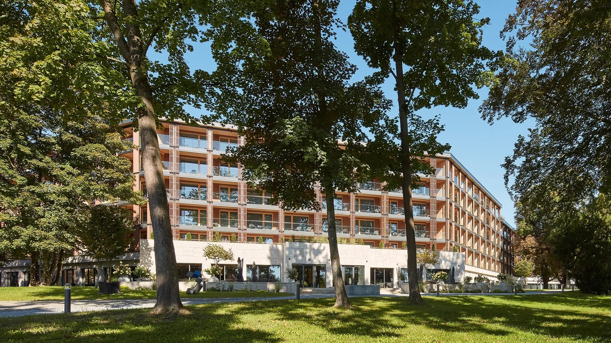

*图：德国康斯坦茨 Buff Medical Resort 项目中的康养空间。图源：GESSI 官网项目案例页。*

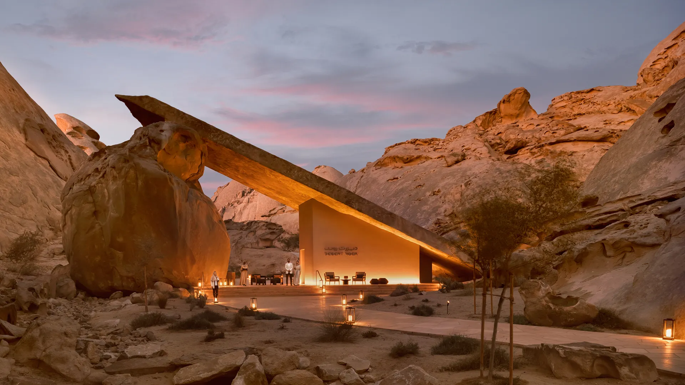

*图：沙特阿拉伯 Desert Rock Resort 项目内景。图源：GESSI 官网项目案例页。*

## 12 Strategy 战略：保护、改变、扩张与风险

### 保护：已经成立的高价值资产

**"私人健康"叙事（置信度：高）。** 品牌把浴室定义为居住中最私密、最值得被设计的空间，并用淋浴系统、色光、蒸汽与 2026 年的 Rituale del Vapore 把这个主张变成产品。这套叙事让品牌脱离了"五金比价"的语境，也支撑了更高的价格带。

**材料与工艺资产（置信度：高）。** 编织金属图案与饰面体系（Habito 的 6 图案、13 饰面）、穆拉诺玻璃与石材（Perle）、真竹（Jacqueline）构成可识别的材质语言，其中部分工艺被官方明确描述为无法与量产兼容。

**规模与出口结构（置信度：高）。** 2024 年营业额 2.77 亿欧元、同比增长 24%、海外占比 80%，说明品牌在多个市场同时具备渠道能力与产品适配能力，规模也让它在研发与设备投入上具备余量（2012 年前的四年即投入 3,500 万欧元用于设备与新技术）。

**零售与体验网络（置信度：高）。** Casa Gessi 与 Atelier Gessi 的选址偏好历史建筑（米兰旧电影院、纽约前发电站、迪拜设计区），把展示、咨询与文化活动整合在同一空间，是高端五金里少见的自有零售资产。

**治理与外部认可（置信度：中高）。** 连续多年获得 Deloitte Private 的 Best Managed Companies 评价，在 Mediobanca《意大利主要企业》研究（1,084 个集团、2,358 家公司）中被列入最具活力的八家企业，并在 2026 年加入 Altagamma 基金会董事会，构成品牌在企业层面的信誉资产。

**认证与可持续记录（置信度：中高）。** 自 1996 年起持有 ISO 9001，并同时持有 ISO 14001 与 ISO 45001；2024 年与德勤合作发布《可持续性手册》，用水彩插画呈现量化结果，属于行业里少见的公开披露方式。

### 改变：需要修正的环节

**价格与交期的可预期性（置信度：中）。** 官网不提供价格与标准交期，手工系列按件报价且交期更长。对设计师与开发商而言，方案阶段缺少数量级判断会削弱比选效率；提供配置分级与参考交期会直接改善决策体验。

**产品线与命名的复杂度（置信度：中）。** 六个产品线、多条材质与饰面体系、以及 Haute Culture 与 Iconic 的双层命名，对非专业用户并不友好；中文市场尤其缺少体系化的产品说明。

**财务与运营信息披露（置信度：中）。** 品牌目前的经营数据主要通过新闻稿与第三方研究间接披露（如 2024 年营收与出口占比），缺少像部分同业那样的系统年度报告，这会限制媒体与渠道对其稳健性的引用。

**手工系列的维护与售后说明（置信度：中）。** 石材、竹材与手工玻璃在潮湿环境中的长期护理要求高于金属件，官方目前以便于传播的叙事为主，护理与备件信息需要通过经销商获取。

**中国市场的内容与认知（置信度：中）。** 中文语境中品牌认知集中在"意大利龙头"，对私人健康、厨房水系统与户外线的了解有限；缺少本地化的技术内容与项目案例，会限制其在本地高端项目里的议价空间。

### 扩张：增长方向与机会

**健康与长期主义（置信度：中高）。** Rituale del Vapore 把蒸汽引入护发、护肤与美妆流程，配合"长期主义"主题，指向一个正在增长的健康消费市场；这类产品的单价与复购潜力都高于传统龙头。

**厨房水系统（置信度：中高）。** Vita Gessi 以数字界面与节水为卖点进入厨房场景，并获得 ADI 设计索引与 iF 奖项；厨房水系统的客单价与更新频率高于卫浴配件，且能与既有厨房品牌渠道协同。

**工程与酒店渠道（置信度：高）。** 公开项目覆盖酒店、度假村、康养与住宅（Conrad Athens、W Sardinia、Buff Medical Resort、Desert Rock、Sheybarah、Bab Al Shams、La Querola d'Ordino 等），contract 自 2012 年起即为核心战略方向；酒店与度假村项目对品牌体验的放大效应强。

**地理扩张（置信度：中高）。** 北美（纽约 SoHo 品牌空间与 Bloomingdale's 等零售合作）、中东（迪拜设计区 Atelier、沙特项目）与亚洲（设计周与经销商网络）是近年公开动作集中的区域，出口占比 80% 说明组织结构已适应海外为主。

**咨询服务产品化（置信度：中）。** 2025 年在米兰设立 Gessi Consulting，迪拜 Atelier 提供由建筑师与室内设计师主导的咨询，把"选型支持"变成可单独交付的服务，有助于提升项目中标率与客户黏性。

### 风险：可验证的威胁与约束

**宏观与建筑周期（置信度：中）。** 品牌的增长与高端住宅、酒店投资周期高度相关。2012 年的历史经验显示，本土建筑业下滑会直接冲击需求，当时的应对是转向海外与 contract——这意味着它对全球周期同样敏感。

**原材料与能源成本（置信度：中）。** 产品以黄铜、不锈钢与多种贵金属饰面为主，材料与能源成本占比高；饰面工艺（如 PVD 与电镀）对能源与环保合规要求高，成本压力会传导到价格与交期。

**手工系列的产能与成本（置信度：中）。** Haute Culture 系列依赖手工与小批量工艺，官方明确其"与量产不相容"，因此难以通过规模摊薄成本，交期与合格率也是约束。

**设计仿制与渠道乱价（置信度：中，方向性）。** 编织金属与系列形态属于易被模仿的视觉资产，全球市场存在外观近似产品；品牌未公开其在知识产权维权的具体投入，此项判断依据产品特征与行业惯例。

**家族治理与传承（置信度：中，方向性）。** 品牌为家族企业，第二代人现在同时承担经营与行业公共角色（如 Altagamma 董事会）。治理结构的平稳过渡对长期战略的连续性有直接影响。

**零售网络的成本与复制难度（置信度：中）。** Casa Gessi 依赖历史建筑的区位与改造投入，单店成本高；在更多城市复制同一体验需要更强的组织能力与本地伙伴。

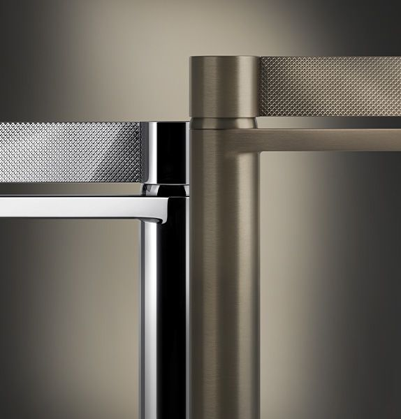

*图：Inverso 系列产品与编织金属纹理。图源：GESSI 官网产品页面。*

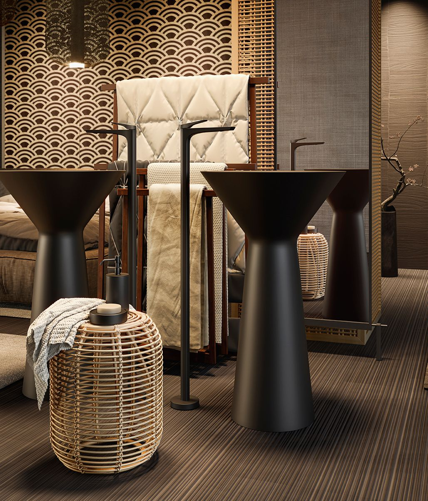

*图：Ventaglio 系列产品（Michael Vincent UY 设计）。图源：GESSI 官网产品页面。*

## 13 视频与访谈资料

品牌的内容资产集中在官网的新闻与活动栏目、品牌空间的活动现场，以及各系列页面内嵌的产品影片。整理如下：

- 官网新闻与活动（News & Events）：按新闻、活动、奖项、产品四类归档，覆盖 2023 年至今的发布会、设计周与获奖记录。https://www.gessi.com/en/news-and-events
- 米兰设计周系列影片（2024／2025／2026）：每年的主题发布与空间记录，2026 年的主角是 Rituale del Vapore 与长期主义主题。https://www.gessi.com/en/news-and-events/haute-culture-longevity-ritual
- Master Gessi Summer Excellence（2025／2026）：面向设计师与从业者的培训与交流项目。
- Casa Gessi 城市空间影片：纽约 SoHo（2024）、迪拜设计区（2024）、伦敦（2026）等开幕与活动记录。
- 《可持续性手册》（Sustainability Book，2024）：以德勤方法学为基础、水彩插画呈现的可持续报告，可在官网图册栏目浏览。https://www.gessi.com/en/our-world/sustainability
- 图册与杂志（Catalogues）：Bathroom Digest 2026、Haute Culture Book 2026、各系列目录与厨房杂志等 PDF。https://www.gessi.com/en/catalogues
- 需要说明的是，本次研究未直接访问品牌的视频平台官方频道；上述影片以官网页面内嵌或图册 PDF 形式存在，如需完整片源清单，建议向品牌新闻联络人索取媒体资料包。

## 14 来源与延伸阅读

### 官方资料

- 品牌官网：https://www.gessi.com/en
- 公司介绍（品牌定位、园区、认证体系、招聘）：https://www.gessi.com/en/our-world/the-company
- 可持续（定义与《可持续性手册》）：https://www.gessi.com/en/our-world/sustainability
- 产品线：卫浴 https://www.gessi.com/en/bath ；私人健康 https://www.gessi.com/en/private-wellness ；厨房 https://www.gessi.com/en/kitchen ；感应龙头 https://www.gessi.com/en/sensor-taps ；户外 https://www.gessi.com/en/outdoor
- 代表系列：Goccia https://www.gessi.com/en/bath/goccia ；Incastri https://www.gessi.com/en/bath/incastri ；Perle https://www.gessi.com/en/haute-culture/perle ；Jacqueline https://www.gessi.com/en/haute-culture/jacqueline ；Venti20 https://www.gessi.com/en/bath/venti20 ；Inverso https://www.gessi.com/en/bath/inverso ；Ventaglio https://www.gessi.com/en/bath/ventaglio
- 项目案例：https://www.gessi.com/en/projects/references ；设计咨询与项目服务：https://www.gessi.com/en/projects/services-and-consulting
- 品牌空间：Casa Gessi Milano https://www.gessi.com/en/casa-gessi-milano ；Casa Gessi Haute Culture https://www.gessi.com/en/casa-gessi-haute-culture
- 关键新闻：2024 年营业额与 Mediobanca 评价 https://www.gessi.com/en/news-and-events/gessi-nella-top-otto-aziende-mediobanca ；Deloitte Best Managed 2025 https://www.gessi.com/en/news-and-events/gessi-best-managed-companies-award-2025 ；ADI 设计索引 2025（Immersiva）https://www.gessi.com/en/news-and-events/adi-design-index-2025 ；Vita Gessi 入选 ADI 2024 https://www.gessi.com/en/news-and-events/vita-gessi-selected-for-the-adi-design-index-2024 ；Perle 参展金圆规奖 https://www.gessi.com/en/news-and-events/perle-compasso-doro ；iF 设计奖 2024（Perle）https://www.gessi.com/en/news-and-events/if-design-award-2024 ；Best of Year（Perle）https://www.gessi.com/en/news-and-events/best-of-year-awards
- 图册下载：https://www.gessi.com/en/catalogues

### 第三方媒体与机构

- Pambianco News（2013 年 7 月 12 日）：《Gessi nel 2012 oltre i 115 milioni. E punta al contract》——提供 2011／2012 年营收、EBITDA、出口占比、出口份额与设备投资等数据。https://www.pambianconews.com/2013/07/12/gessi-nel-2012-supera-i-110-milioni-e-punta-al-contract-130320/
- Pambianco News（2013 年 3 月 15 日）：米兰曼佐尼街空间开幕报道，含 Gessi Style Studio 负责人 Luca Bresciani 与 Sara Ferrari 的信息。https://www.pambianconews.com/2013/03/15/a-due-passi-da-montenapo-il-secret-garden-di-gessi-122309/
- Mediobanca《Le Principali Società Italiane》（2025 年版，经品牌新闻引用）：1,084 个集团、2,358 家公司的样本，Gessi 列入最具活力的八家企业。
- Deloitte Private Best Managed Companies（2025 年，经品牌新闻引用）：连续多年入选。
- iF International Forum Design（2024）：Perle 获 iF DESIGN AWARD 产品类奖项，全球申报近 11,000 件、来自 72 个国家、132 位评审。
- ADI 设计索引（2024／2025）：Vita Gessi 与 Immersiva 分别入选。
- 《Interior Design》Best of Year Awards（2024 年 12 月）：Perle 获奖。

### 竞品官方资料

- Dornbracht（德国，奢华卫浴与厨房龙头）：https://www.dornbracht.com/en
- VOLA（丹麦，自 1968 年）：https://en.vola.com/
- Fantini（意大利，高端龙头）：https://www.fantini.it/
- Zucchetti（意大利，高端龙头）：https://www.zucchettidesign.it/en/
- CEADESIGN（意大利，不锈钢龙头与健康设备，本库另有专档）：https://www.ceadesign.it/en

### 中文资料

- 中文第三方内容以设计周报道、经销商与家居媒体为主，缺少系统性的品牌研究；本报告中的沿革、财务与可持续信息均来自品牌官网与上述第三方来源，建议中文传播时以官网英文内容为准。

## 15 分析附录

### 产品组合矩阵

| 场景 | 代表系列 | 功能定位 | 关键设计点 | 备注 |
|---|---|---|---|---|
| 卫浴龙头 | Rettangolo、Goccia、Habito、Inverso、Venti20、Ventaglio | 台盆、浴缸、淋浴龙头与配件 | 出水位置自由（台面／落地／壁出／顶出）、编织金属图案 | 长期销售与形象系列并行 |
| 高端手工系列（Haute Culture） | Perle、Jacqueline、Ludovica、Riflessioni、Pelle、Sensazioni、Glass Connection | 手工与稀有材料系列 | 穆拉诺玻璃、天然石材、真竹、手工流程 | 官方称部分工艺与量产不相容 |
| 私人健康 | Immersiva、HI-FI、Shower G、Ventaglio 淋浴套件 | 淋浴与健康系统 | 色光、蒸汽、多模式出水 | 2026 年新增 Rituale del Vapore |
| 厨房水系统 | Vita Gessi、Gessi 316、Habito Kitchen、Incastri Kitchen | 厨房龙头与饮水系统 | 数字界面与节水、多功能出水 | Vita Gessi 入选 ADI 2024 |
| 感应龙头 | Sensor Taps 系列 | 公共与商业场景 | 感应开关与免接触 | 对应规范与卫生需求 |
| 户外 | Ranco 等户外系列 | 花园与泳池 | 耐候金属本体 | 面向别墅与度假项目 |
| 家居装饰 | Home Decor 系列 | 镜子、配件与收纳 | 与龙头共用饰面 | 延伸浴室整体感 |

### CMF 与材料速查

| 类别 | 内容 | 说明 |
|---|---|---|
| 编织金属 | Habito（Cesello、Trame、Rigato、Intreccio、Diamantato 等 6 种图案、13 种饰面）、Inverso（Diamantato、Rigato） | 品牌最具辨识度的表面语言 |
| 金属饰面 | 磨砂、哑光、拉丝、彩色与金属色饰面 | 覆盖冷灰到暖金属色区间 |
| 手工玻璃 | 穆拉诺手工玻璃（Perle） | 与珠宝工艺相关的手工流程 |
| 天然石材 | 大理石与天然石材（Perle 及浴室台盆系列） | 纹理与色调随材料变化 |
| 竹材 | 真竹（Jacqueline） | 官方称全行业首个也是唯一使用真竹的系列 |
| 其他材料 | 皮革、布纹、树脂与陶瓷件 | 用于配件与台盆等 |

### 竞品对照

| 维度 | Gessi | Dornbracht | VOLA | 意大利高端同业（Fantini／Zucchetti／CEA 等） |
|---|---|---|---|---|
| 品牌定位 | 私人健康与生活方式品牌 | 奢华卫浴与厨房龙头 | 丹麦极简与埋墙系统 | 高端龙头与卫浴五金 |
| 产品跨度 | 卫浴、健康、厨房、感应、户外、家居装饰 | 卫浴与厨房龙头、水槽 | 龙头与配件 | 通常以龙头与配件为主 |
| 手工／稀有材料 | 有（Haute Culture：玻璃、石材、竹） | 有限 | 有限 | 有限（CEA 以不锈钢工艺为主） |
| 零售网络 | Casa Gessi／Atelier Gessi 城市据点 | 旗舰展厅与经销商 | 经销商与设计渠道 | 展厅与经销商 |
| 规模（公开数据） | 2024 年 2.77 亿欧元，出口 80% | 未在本次研究核实 | 未在本次研究核实 | 规模通常小于 Gessi |
| 可持续披露 | 有《可持续性手册》与三重体系认证 | 有相关报告 | 有相关举措 | 以认证为主 |

### 定位图（表格化）

| 坐标维度 | 低 | 中 | 高 | Gessi 位置 |
|---|---|---|---|---|
| 空间主张强度 | 单品供货 | 成套卫浴 | 生活方式与健康叙事 | 高 |
| 材料稀有度 | 常规金属饰面 | 多饰面体系 | 玻璃／石材／竹等手工材料 | 高 |
| 出水位置自由度 | 台面为主 | 台面＋壁出 | 台面／落地／壁出／顶出 | 高 |
| 零售体验 | 经销商为主 | 品牌展厅 | 历史建筑中的品牌之家 | 高 |
| 出口依赖 | 本地为主 | 出口 30—50% | 出口 60% 以上 | 高（80%） |
| 价格带 | 中高端 | 高端 | 奢侈与定制 | 奢侈 |

### 证据登记

| 结论 | 证据 | 来源 | 来源类型 | 置信度 |
|---|---|---|---|---|
| 1992 年由 Umberto Gessi 与其子 Gian Luca Gessi 创立 | 行业媒体 2013 年 7 月报道（"创立二十年"并点名父子二人） | Pambianco News | 第三方媒体 | 中高 |
| 总部与生产基地位于 Serravalle Sesia 的 Parco Gessi，园区约 150 万平方米 | 官网公司页与页脚注册信息（P.IVA 02235360027、REA VC-184137、注册资本 1,000 万欧元） | 官网 | 官方 | 高 |
| 2012 年集团合并营收 1.157 亿欧元、EBITDA 1,400 万欧元、海外约七成、覆盖意大利该品类出口 13% | 行业媒体 2013 年报道 | Pambianco News | 第三方媒体 | 中高 |
| 2024 年营业额 2.77 亿欧元、同比增长 24%、海外占比 80% | 官网 2025 年 11 月新闻（引用 Mediobanca 研究） | 官网 | 官方（引用第三方研究） | 高 |
| 被 Mediobanca 列入"最具活力的八家企业"（样本 1,084 个集团、2,358 家公司） | 官网新闻（2025-11） | 官网 | 官方（引用第三方研究） | 高 |
| 连续多年获 Deloitte Private Best Managed Companies | 官网新闻（2025-10） | 官网 | 官方（引用第三方评选） | 高 |
| 自 1996 年起持有 ISO 9001，并持有 ISO 14001 与 ISO 45001 | 官网公司页 | 官网 | 官方 | 高 |
| Perle 获 iF DESIGN AWARD 2024（产品类）与 Best of Year 2024，并参展第 29 届金圆规奖 | 官网三则新闻（2024-03、2024-12、2026-04） | 官网 | 官方（引用第三方奖项） | 高 |
| Vita Gessi 为第一款带数字界面的厨房龙头，入选 ADI 设计索引 2024 | 官网新闻（2024-11） | 官网 | 官方 | 高 |
| Immersiva 入选 ADI 设计索引 2025 | 官网新闻（2025-10） | 官网 | 官方 | 高 |
| Incastri 与隈研吾合作，灵感来自日本千鸟咬合工艺（2024 年发布，2025 年扩展至厨房） | 官网 Incastri 系列页与两则新闻 | 官网 | 官方 | 高 |
| Jacqueline 为全行业首个使用真竹的系列，工艺与量产不兼容 | 官网 Jacqueline 系列页与新闻（2024-05） | 官网 | 官方 | 高 |
| Venti20 由 Lázaro Rosa-Violán 设计，2022 年获美国"年度产品"（Water Delivery 类别） | 官网新闻（2022-12）与系列页 | 官网 | 官方 | 高 |
| Casa Gessi New York 于 2024 年 5 月在 SoHo 拉法叶街 214 号开幕（五层，前发电站建筑） | 官网新闻（2024-05） | 官网 | 官方 | 高 |
| 米兰品牌空间于 2013 年在曼佐尼街 16 号开幕（1,500 平方米，旧电影院，Gessi Style Studio 设计） | 行业媒体 2013 年 3 月报道 | Pambianco News | 第三方媒体 | 中高 |
| 《可持续性手册》于 2024 年 11 月发布，方法学由德勤参与，呈现 2023 年数据 | 官网新闻（2024-11） | 官网 | 官方 | 高 |
