# ABOUT OIKOS

*图：Oikos 官方标识（红灰配色，左侧为图形标记），字标下方为意大利语说明"Architetture d'ingresso"。图源：Oikos 官网素材库。*

目录

|  |  |
|---|---|
| [01 开篇](#01-开篇) | [09 Design 设计：齐平的门与藏起来的五金](#09-design-设计齐平的门与藏起来的五金) |
| [02 品牌概述](#02-品牌概述) | [10 Experience 体验：从图纸到十年之后](#10-experience-体验从图纸到十年之后) |
| [03 Brand 品牌：从威尼斯门厂到入口建筑](#03-brand-品牌从威尼斯门厂到入口建筑) | [11 Competition 竞品：同一张牌桌上的对手](#11-competition-竞品同一张牌桌上的对手) |
| [04 Category 品类与市场：装甲门的牌桌与口径](#04-category-品类与市场装甲门的牌桌与口径) | [12 Strategy 战略：保护、改变、扩张与风险](#12-strategy-战略保护改变扩张与风险) |
| [05 User 用户与场景：谁在决定一扇门](#05-user-用户与场景谁在决定一扇门) | [13 视频与访谈资料](#13-视频与访谈资料) |
| [06 Positioning 定位：把门放进建筑里](#06-positioning-定位把门放进建筑里) | [14 来源与延伸阅读](#14-来源与延伸阅读) |
| [07 Product 产品：六条线、一堵墙与一套电子系统](#07-product-产品六条线一堵墙与一套电子系统) | [15 分析附录](#15-分析附录) |
| [08 Aesthetics 美学：齐平、无螺钉与威尼斯的秩序](#08-aesthetics-美学齐平无螺钉与威尼斯的秩序) |  |

## 01 开篇

2020 年，迪拜落成了一扇 11 米高的门。它不是旋转门，也不是几块板拼起来的幕墙，而是一整扇装甲门体：包裹着背光缟玛瑙的饰面，靠一套隐藏的竖轴系统开合，通电后由地面电机驱动。站在它前面，人的比例尺会立刻失效——这扇门比三层楼还高，却在关闭时与两侧墙面齐平，看不到铰链，看不到螺钉，也看不到把手。

欧洲的装甲门行业长期以另一套逻辑运行：门越安全越厚重，越厚重越显眼，C 型钢、外露铰链、粗壮门框是安全感的视觉证明。Oikos 选择的方向正好相反——把安全性全部留在结构里，把可见的部分做成一整面与建筑同色的"墙"。这扇 11 米高的门，就是这种思路走到极致的样子。

要理解一家威尼斯乡间的工厂为什么会做出这样的产品，需要往回看三十多年：看 1990 年代它如何在消防与安防标准之间找到位置，看 2005 年一根竖轴如何把"入户门"改写成"入口建筑"，再看它怎样把工厂、展厅、竞赛、歌剧与评审团编进同一套品牌叙事。

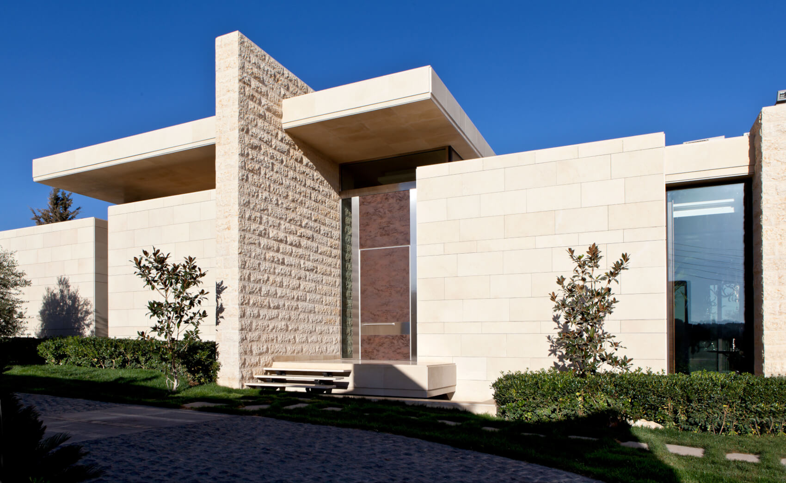

*图：Synua 竖轴装甲门在别墅入口的实景，门体与两侧墙体齐平。图源：Oikos 官网项目图（Amman 项目）。*

## 02 品牌概述

Oikos 是意大利威尼托大区的高端装甲入户门制造商，1990 年成立于威尼斯省 Gruaro，产品覆盖装甲入户门、室内安全门、门墙一体系统、饰面系统与电子门禁。它的核心是把安防标准、五金工程与建筑外观整合成一件产品：门体、门框、墙面、把手与门禁系统共用一套视觉与工程语言，目标是让入户门在关闭时消失于建筑立面，在开启时以机械动作被感知。

| 项目 | 内容 |
|---|---|
| 品牌名 | Oikos（Oikos Venezia）· [https://oikos.it](https://oikos.it) |
| 国家/地区 | 意大利（威尼托大区 Gruaro，威尼斯省） |
| 成立时间 | 1990 年 5 月 5 日（Oikos Venezia S.r.l.） |
| 创始人 | 公开资料有限：官方只记创立年份与现任管理层，未系统披露创始团队；现任总裁 Mario Biancolin（2025 年 35 周年访谈受访人） |
| 代表性设计人物 | 米兰设计组合 Adriani & Rossi（2007 年设计 Tekno 系列）；色彩设计顾问 Francesca Valan（2016 年公司大会演讲嘉宾） |
| 其他关键人物 | 总裁 Mario Biancolin；"Osteria dell'Architetto" 发起人 Fiorenzo Valbonesi 与 Roberto Bosi；威尼斯卡福斯卡里大学艺术与文化管理实验室团队（长期研究合作） |
| 官方理念 | "Architetture d'ingresso"（入口建筑）；"Made in Italy Entrances. Designed by You."；"Arsenalità"（兵工厂精神） |
| 品牌归属 | 独立私营企业（Oikos Venezia S.r.l.，注册资本 79 万欧元，未见集团控股披露） |
| 核心业务 | 装甲入户门与室内安全门、竖轴／隐藏铰链／滑动三类开启系统、门墙一体系统（Synua Wall System）、饰面与型材系统（Skydoors）、电子门禁（Arckey） |
| 经典产品 | Synua（2005）、Synua Wall System（2006）、Tekno（2007）、Evolution（2008）、Vela（2009）、Project（2015）、Nova（2017）、Skydoors（2022） |

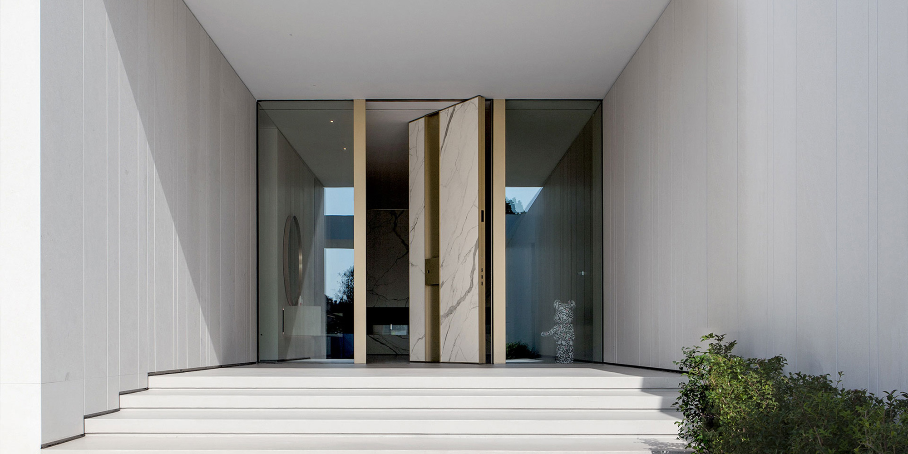

*图：Synua 门体整体外观，门面与两侧墙体处于同一平面。图源：Oikos 官网产品页（Synua）。*

## 03 Brand 品牌：从威尼斯门厂到入口建筑

### 命名与起点：Oikos 与 Gruaro

品牌名来自希腊语 oikos，意为"家"，也包含家庭与栖居的含义。官方把这一命名解释成一种自我约束：既然名字指的就是"家"，产品就必须围绕住在里面的人来定义。1990 年 5 月 5 日，公司在威尼斯省 Gruaro 成立，最初的产品线就是装甲入户门。1991 年首次参加行业重要的 SAIE 展（后发展为 MADE Expo），1992 年取得防盗等级 3 级与 4 级认证，1994 年成为第一家为装甲门做隔音测试的公司，1997 年迁入 Gruaro 的新生产基地。

这段早期经历解释了两件事：一是公司从第一天起就在"认证"这条线上做投入，2001 年通过 ISO 9001，2004 年通过 ISO 14001；二是它习惯把内部标准设在行业标准之上——隔音测试在当时并不是装甲门的必选项，Oikos 主动做了。

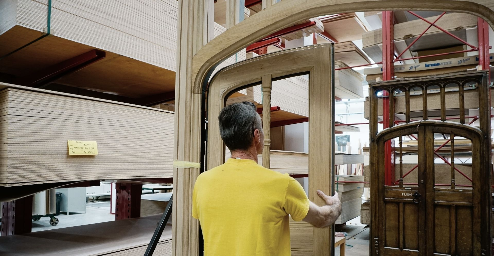

*图：Oikos 官网"公司"页主图，可见厂区建筑与入口场景。图源：Oikos 官网公司页。*

### 2005：一根竖轴把门改写成建筑

真正的分水岭是 2005 年的 Synua。这款产品的做法在当时的欧洲装甲门行业并不常见：门体不再靠侧边的铰链挂在门框上，而是在门扇的上、下端各设一根隐藏的、可调节的支轴，整扇门绕竖直轴旋转开合。业内把这种开启方式称作"bilico"（竖轴回转）。它带来三个直接结果：门可以做得极大（标准尺寸上限 3000 × 6200 毫米）；关闭时门体与墙面齐平；因为没有侧边铰链，门缝与五金都从立面上消失。

2006 年，Synua Wall System 把这种"齐平"从一扇门扩展到一整面墙：门体与可拼接的墙板使用同一套饰面与构造语言，正面看过去是连续的一堵墙，只有在一扇门动作时，墙才会打开。这一步把公司从"卖门"推进到"做入口空间"，也解释了它后来为什么会用一个建筑术语来定位自己——"入口建筑"。

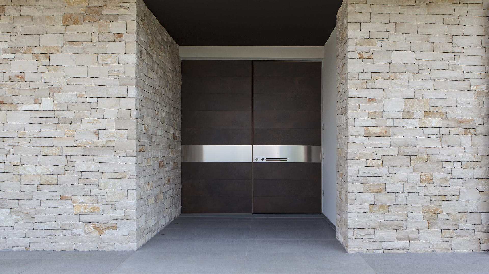

*图：Synua Wall System 门墙一体系统正面视角，门缝与墙板拼缝处在同一套秩序里。图源：Oikos 官网产品页（Synua）。*

### 产品家族的扩列：从一扇门到六条线

此后的十几年，Oikos 按"开启方式 + 安装方式"两个维度把产品线铺开。2007 年与米兰设计组合 Adriani & Rossi 合作推出 Tekno，用完全隐藏的铰链实现 100° 开启；2008 年推出 Evolution，面向传统入户门需求；2009 年推出 Vela——据官方表述，这是第一款滑动式装甲门；2015 年推出 Project，把安全门做进室内，可以构成一间 panic room；2017 年在巴黎 Batimat 展上发布 Nova，第一款全玻璃的大尺寸装甲门。

每一款产品都在处理同一组矛盾：安全需要厚度与重量，设计需要轻薄与连续；两者只能靠工程解决，不能靠取舍回避。Vela 的门扇需要先向上抬起再横移，公司为此开发了磁悬浮与自动升降结构；Nova 要用玻璃承担装甲门的角色，就必须把玻璃做成夹层安全玻璃，并把框架做成断热结构。

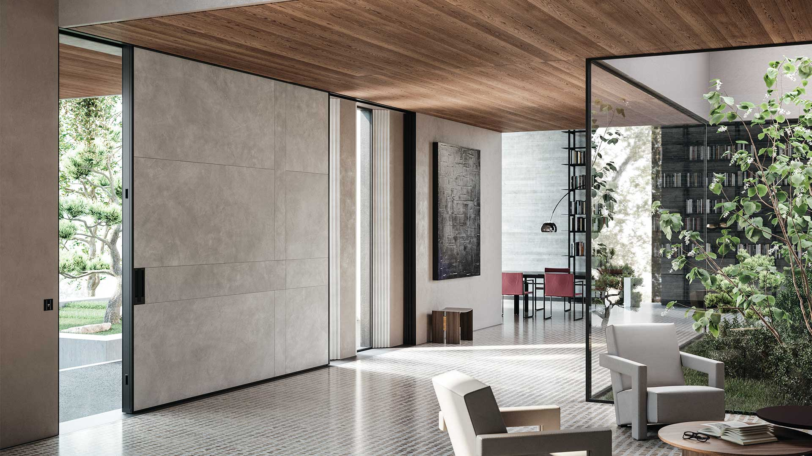

*图：Vela 滑动门整体外观，地面无轨道、无门槛。图源：Oikos 官网产品页（Vela）。*

### 从产品到文化：Arsenalità 与 35 年

2014 年，公司在威尼斯兵工厂（Arsenale）举办大型活动，同时启用新的品牌主张 "Architetture d'ingresso"。这个地点并非随机选择：威尼斯兵工厂是中世纪欧洲规模最大的工业组织之一，公司据此造了一个词——arsenalità，用来描述"工业组织的精密 + 手工技艺的讲究"这一组合，并把它作为身份标签写进官网、画册与厂房命名。

> 术语注释：arsenalità——Oikos 自造词，指威尼斯兵工厂式的工业组织与手工技艺合为一体的生产模式。

此后，文化投入与商业动作交织推进：2018 年在威尼斯 Scuola Grande di San Rocco 用两天时间接待约 1500 名建筑师，嘉宾包括建筑师 Stefano Boeri 与艺术评论家 Philippe Daverio；2019 年展厅改造出 "NO LIMITS" 区域，并落地常设展 "Tracce di design"；2022 年发起国际竞赛 DoorScape；2024 年在厂区内举办歌剧晚会；2025 年 5 月 5 日以集体参观威尼斯美术学院的方式庆祝 35 周年，同年首次参加米兰国际家具展（Salone del Mobile）。

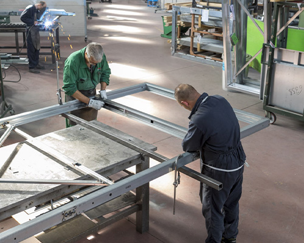

*图：官网"兵工厂精神"页面中的金属加工场景。图源：Oikos 官网（Arsenalità 页面）。*

### 国际化：迪拜、巴黎与经销网络

出口从 2009 年开始提速，2015 年在迪拜与纽约设立办公室，2022 年在迪拜 Al Quoz 开出第一家单一品牌展厅 "Oikos Atelier Dubai"，2026 年 6 月 30 日在巴黎近郊 Freneuse 的 Europrotect 空间开出第二家海外展厅。按 Archiproducts 品牌页的表述，公司目前在全球有 100 多家经销商。中东与北美是两条重点线路：中东以超大门洞与定制饰面为主，北美则依靠抗飓风与防火认证进入当地规范体系。

## 04 Category 品类与市场：装甲门的牌桌与口径

### 品类的定义与技术口径

欧洲语境里的"装甲门"（porta blindata / security door）并不是普通防盗门的放大版，它依据 EN 1627 系列标准按抗入侵时间与工具等级分级，家用产品通常落在 2 级到 4 级之间。Oikos 全线以 3 级起步，Vela 标配达到 4 级，Evolution 也可选配 4 级——4 级意味着测试中会使用锤、凿、斧、剪与电钻等工具，持续 30 分钟。与之配套的还有一组常被消费者忽略的口径：隔声以分贝计，隔热以 U 值计，气密与水密按 0 到 4 级、0 到 9 级分级，抗风压按 0 到 5 级分级，防火以 EI 加分钟数表示。

这些数值决定了产品的物理结构：等级越高，门扇内部的加强结构、锁点数量与门框刚度要求越高，门体越重。也正因为数值体系明确，产品差异往往不体现在"能不能防"，而体现在"在达到防护等级的同时，还能不能保持形体的完整"。

### 市场规模的判断口径

装甲门这个细分品类缺少统一的公开市场口径。意大利门窗行业协会（UNICMI）与行业媒体的公开数据多以"门窗系统"整体统计，装甲门只作为其中一个子项出现；不同机构对"装甲门"的定义（是否包含防火门、是否包含室内安全门）也不一致。因此本节不引用单一数字作为结论。

可作为方向性参考的是品牌自述与行业媒体的历史记录：据行业媒体 Guidafinestra 2008 年的报道，Oikos 在 2006 年的营业额为 950 万欧元，年产能约 12,000 樘，公司自述占据意大利高端市场 30% 的份额；同期 Synua 的年产量预计从 2006 年的 500 樘增长到 2008 年的 4000 樘。这些数字具有明确的时点（2006—2008 年）与来源性质（品牌自述经行业媒体报道），只能用于判断当年的量级与增长节奏，不能外推为今天的市场结构。

### 价格带与产品分层

Oikos 官网的选购指南曾公开列出五条产品线的起步价（目录价）：Evolution 1,600 欧元起、Project 1,850 欧元起、Tekno 2,200 欧元起、Evolution 3TT 2,550 欧元起、Synua 5,600 欧元起。指南同时说明，最终价格取决于饰面、尺寸与电子配件，需逐案报价。这组价格对应的是"基础版本 + 标准饰面"，而实际项目中常见的背光缟玛瑙、天然石材、定制把手与自动化系统会显著抬高总价。

在意大利本土市场，这组价格把 Oikos 放在与大众防盗门品牌明显不同的位置：大众品牌的成品门价格通常在其起步价之下，而 Oikos 的入门系列已经进入"设计门"区间的下沿，Synua 的起步价则直接进入高端定制区间。

### 品类惯例与技术趋势

观察这个品类的近十年变化，可以看到六条清晰的技术趋势：门洞尺寸持续放大，从标准 900 × 2100 毫米走向 3 米以上的层高门洞；门体与墙面的关系从"贴在墙上"变成"与墙齐平"，进而出现门墙一体化系统；外露五金持续减少，螺钉、铰链、把手都在被并入门体；玻璃从配角变成主角，出现在门扇、侧窗与上亮；电子门禁与机械锁并行，指纹、卡片、密码与手机应用成为常见选项；热工、防火与抗飓风等法规要求，把门逐步纳入建筑外围护系统的整体性能评估。

Oikos 的产品线基本上按这六条趋势逐年展开：Synua 对应大尺寸与齐平，Tekno 与 Project 对应隐藏五金，Nova 对应玻璃化，Vela 对应滑动与无门槛，Arckey 对应电子化，Tekno 3TT 与抗飓风、防火认证对应法规化。

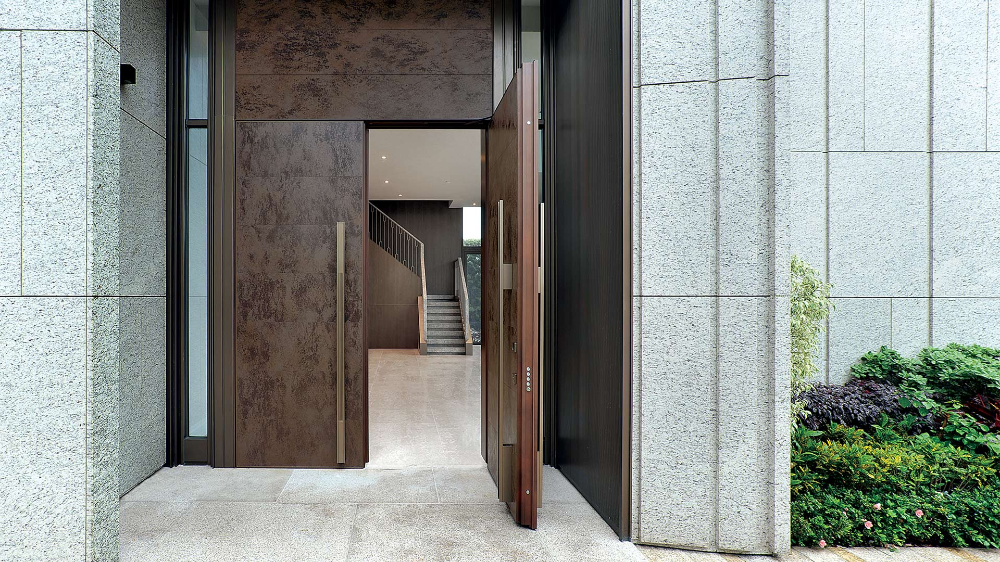

*图：香港某住宅项目的 Tekno 双扇门，门面采用锈蚀耐候钢饰面，两侧带玻璃侧窗。图源：Oikos 官网产品页（Tekno）项目图。*

### 渠道结构

装甲门不能像家具一样在卖场里直接被搬走，它的销售结构天然偏"项目制"。Oikos 的渠道由三层构成：一是遍布全球的经销商网络，负责本地测量、报价与安装；二是面向建筑师的直接沟通渠道，官网设有建筑师专区，提供设计支持、技术文件与培训；三是自有的单品牌展厅（Atelier），承担展示、选材、培训与文化活动的功能。展会与竞赛构成第四层触达，用以接触建筑师群体与新市场。

## 05 User 用户与场景：谁在决定一扇门

### 决策链：业主、建筑师、经销商与安装方

装甲门的购买决策很少由一个人完成。典型的链条是：建筑师或室内设计师确定门洞尺寸、立面关系与饰面基调；业主确定预算、安防等级与使用偏好；经销商完成现场测量与报价；安装团队决定最终的使用体验。Oikos 的产品设计对这种结构做了明确回应：官网把"libertà e personalizzazione"（自由与定制）单列一章，允许由设计师出图、由工厂实现，"Designed by You" 这句主张直接写进了品牌签名。

这一结构也带来一个隐含风险：品牌与最终使用者之间隔着一层经销商，体验的一致性依赖渠道能力。

### 用户分层与核心任务

把用户按任务而非人口统计拆分，可以得到四类人。第一类是豪宅业主，他们要解决的问题是"入口既要安全，又不能像保险柜"，同时希望门与建筑立面保持同一套审美；第二类是建筑师与室内设计师，他们需要一件可以被写进图纸、并且真的能按图实现的产品，尺寸与饰面自由度是核心诉求；第三类是开发商与工程方，他们更关注防火、抗风压、气密水密等法规指标与批量一致性；第四类是机构客户，包括博物馆、历史建筑与酒店，他们面对的是"既要满足现代的安防与节能要求，又要保留原有建筑语言"的复合问题。

> 术语注释：JTBD——用户任务，指用户"雇佣"一件产品去完成的具体事情。

从 JTBD 的视角看，Oikos 的产品覆盖了三个任务：守住边界（安防与防火）、延续建筑（立面与饰面的连续性）、简化动作（无门槛、无钥匙、自动开合）。

### 使用场景与购买入口

入户之外，Oikos 的产品还进入了几个不太显眼的场景。Project 这类室内安全门把场景推进到住宅内部，官方明确把它与 panic room 的用法联系起来——外观与普通室内门无异，关上之后构成一间可短时避险的房间。

> 术语注释：panic room——住宅内可在紧急情况下短时避险的安全房间。

另一类场景来自气候与法规。Synua 与 Tekno 的抗飓风认证针对的是佛罗里达等飓风高发地区的建筑规范，其测试包含所谓"导弹测试"，即模拟飓风卷起的碎片撞击；防火认证（EI 60、EI 120、UL 120）则对应欧盟与北美的建筑规范要求。这些场景决定了产品必须同时通过多套体系认证，而不是只在一个市场里合格。

> 术语注释：CEP——购买与使用入口，指触发用户进入某个品类的具体情境。

按 CEP 的框架梳理，触发 Oikos 生意的入口主要有五类：新建独栋住宅与别墅、既有住宅改造、豪宅装修升级、酒店与商业空间工程、境外项目（中东、北美、欧洲）。

### 需要"不可能尺寸"的委托

客户委托中最能说明品牌能力边界的，是那些尺寸与形制超常规的项目。2020 年迪拜的项目把一扇 Synua 门墙系统做到 11 米高，全自动运行，饰面为背光缟玛瑙；2016 年公司为英国伊普斯威奇的 Christchurch Mansion 博物馆复刻了一座 18 世纪门廊的形制，并把这次委托改编成舞台剧在自家工厂演出。前者验证的是工程上限，后者验证的是历史形制的还原能力。

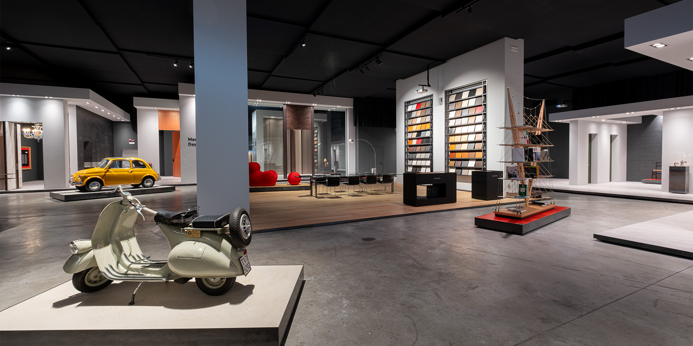

*图：Oikos 位于威尼斯 Gruaro 的展厅全景，产品与饰面陈列在空间内。图源：Oikos 官网展厅页面。*

## 06 Positioning 定位：把门放进建筑里

### 目标人群与参照系

Oikos 的定位参照系不是"防盗门货架"，而是"入口建筑"。它在官网反复使用一句话来界定这个参照系：入口空间是建筑与周边环境的一部分，而不是内与外之间的分界线。参照系一旦换成建筑，竞争对手就从防盗门品牌扩展到建筑师眼里的立面与五金方案，评价标准也从"抗破坏时间"扩展到"型材精度、接缝处理、材质表现与墙面关系"。

### 差异点与基准点

> 术语注释：POD——差异点，指品牌相对竞品被感知到的独特优势。

Oikos 的差异点有四个，且都能落到具体证据上。第一是大尺寸与齐平：Synua 标准尺寸上限 3000 × 6200 毫米，Nova 上限 3200 × 6200 毫米，Vela 上限 3750 × 5000 毫米，且均为与墙齐平的安装方式。第二是"无可见螺钉"这一硬性规则：官网把它写成"irrinunciabile"（不可让步），覆盖门体、门框与自动化组件。第三是可定制的开启方式与饰面：同一门洞可以在竖轴、隐藏铰链、外露铰链与滑动四种逻辑中选择，饰面覆盖木、漆、玻璃、岩板、石材、金属与皮革。第四是"门墙一体"：Synua Wall System 把门与墙面做成同一套系统，这是多数装甲门品牌没有的产品形态。

> 术语注释：POP——基准点，指该品类中必须达到的行业共识项。

它的基准点同样清楚：防盗等级 3 级以上、多点锁具、通过 ISO 9001 与相关产品认证、提供安装与售后。这些不是加分项，而是入场券；在高端市场，缺一项就会被建筑师从图纸里划掉。

### 定位陈述与证据链

把上述内容压缩成一句话：Oikos 定位为"能够按建筑师图纸实现的入口建筑产品"，服务愿意为尺寸自由、立面连续与材质表现支付溢价的私人业主与项目市场。

承诺到证据的链条可以直接对照：安全承诺对应 3 级与 4 级防盗认证、EI 60／EI 120／UL 120 防火认证、Miami-Dade 抗飓风认证；设计承诺对应 ADI 设计索引收录与金圆规奖荣誉提名；定制承诺对应六条产品线、七条以上饰面体系与以图纸为导向的定制流程；制造承诺对应全部工序在 Gruaro 厂内完成、ISO 9001 与 ISO 14001；文化承诺对应 DoorScape 竞赛、卡福斯卡里大学合作与持续十余年的建筑师活动。

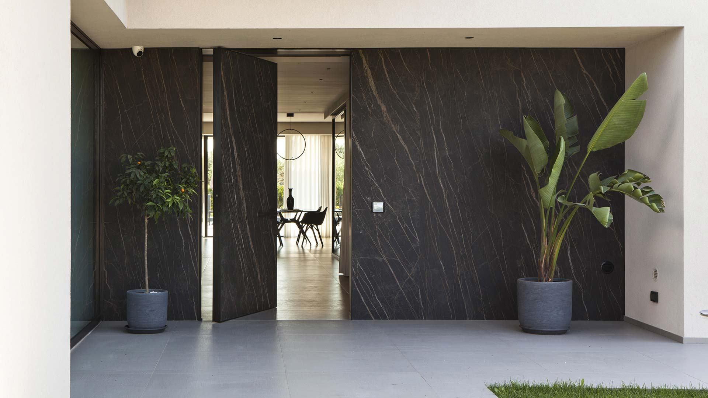

*图：Synua Wall System 落地后的入口实景，门体与墙面为同一饰面与同一平面。图源：Oikos 官网产品页（Synua）项目图。*

## 07 Product 产品：六条线、一堵墙与一套电子系统

### 产品组合与命名：开启方式决定家族

Oikos 的产品分类不使用价格或尺寸，而用开启方式作为第一层分类：竖轴（porte a bilico）对应 Synua 与 Nova；隐藏铰链（cerniere a scomparsa）对应 Tekno 与 Project；外露铰链（cerniere a vista）对应 Evolution；滑动（porte scorrevoli）对应 Vela。型号命名基本为无实义的专有名词，用户记住的是"门怎么开"，而不是数字序列。

第一层分类之外还有两条横向产品：Synua Wall System 是可拼接的墙板系统，可与任意门线组合，构成门墙一体；Skydoors 是 2022 年推出的铝制饰面系统，用竖向线条统一门体与墙面。第三层是电子与配件：Arckey 门禁系统、五种把手／门把形式、门槛套件（Mose 与 Dam）与地面密封条。

| 产品线 | 开启方式 | 标准尺寸上限 | 防盗等级 | 隔声 | 主要角色 |
|---|---|---|---|---|---|
| Synua | 竖轴回转 | 3000 × 6200 毫米 | 3 级 | 38 dB | 旗舰：大尺寸与门墙一体 |
| Nova | 竖轴回转（玻璃） | 3200 × 6200 毫米 | 3 级 | 38 dB | 旗舰：玻璃入口 |
| Vela | 滑动（升降 + 横移） | 3750 × 5000 毫米 | 4 级 | 42 dB | 技术旗舰：滑动与无门槛 |
| Tekno | 隐藏铰链 | 单扇 1300 × 3000 毫米 | 3 级 | 43 dB | 主力：走量与法规项目 |
| Project | 隐藏铰链（室内） | 1030 × 2400 毫米 | 3 级 | 36 dB | 细分：室内安全门 |
| Evolution | 外露铰链 | 按项目定制 | 3 级起 | — | 入门：传统入户门 |

### Synua（2005）：一根竖轴撑起的大尺寸

Synua 要解决的问题很具体：当门洞做到 3 米宽、6 米高时，侧边铰链的受力方式已经不再成立——门扇太重，铰链一侧的框体会被拉变形，开启时门扇还会划出一条巨大的弧线，占用入口空间。公司的解法是把转动中心移到门扇的竖直轴上：上、下端各一根隐藏的、可调节的支轴，门扇绕轴旋转，开启轨迹对空间更友好，视野也更完整。

官方对这项技术的描述集中在三处细节：支轴的调节能力（保证门扇与墙体长期保持同一平面）、门扇的一体化饰面（整片单板或按客户图纸分格），以及可选的自动化（地面电机驱动，最大门重 560 公斤）。地面电机是一个容易被忽略的工程选择：把驱动力放在地面而不是上方，门体上方就不需要额外的机械悬挂结构，立面上也就不会多出任何构件。

这款门很快成为公司增长的发动机。据行业媒体 Guidafinestra 2008 年的报道，Synua 的年产量从 2006 年的约 500 樘增长到 2007 年的 1500 樘，公司当时预计 2008 年达到 4000 樘，并把它的出现视为"给装甲门行业划出一条新路"——在安全属性之外，第一次附上了强烈的设计标签。

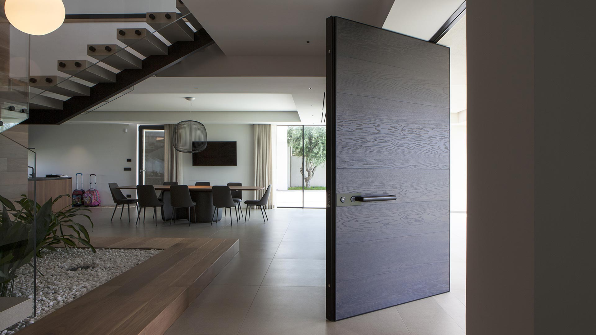

*图：Synua 开启过程，门扇绕竖直支轴转动，入口通透度明显提高。图源：Oikos 官网产品页（Synua）。*

官方产品页：[https://oikos.it/it/prodotti/porte-a-bilico/synua/](https://oikos.it/it/prodotti/porte-a-bilico/synua/)

### Synua Wall System（2006）：门与墙用同一种语言

Synua 上市一年后，公司推出 Synua Wall System：用可拼接的分格墙板把门体两侧、甚至整个入口立面统一起来，墙板与门体共享同一套饰面与构造。这样一来，入口立面上不再有"门"这个视觉元素，只剩下一面墙与一条几乎不可见的门缝。

从产品策略看，SWS 是把单件产品变成系统的一次尝试：门只卖一次，墙板按延米计算，同一套饰面体系可以覆盖更大的建筑表面积。它同时把安装难度转移到了土建精度上——门墙齐平的前提是墙体本身足够平整，这也解释了公司为什么要在项目流程里保留可行性研究环节。

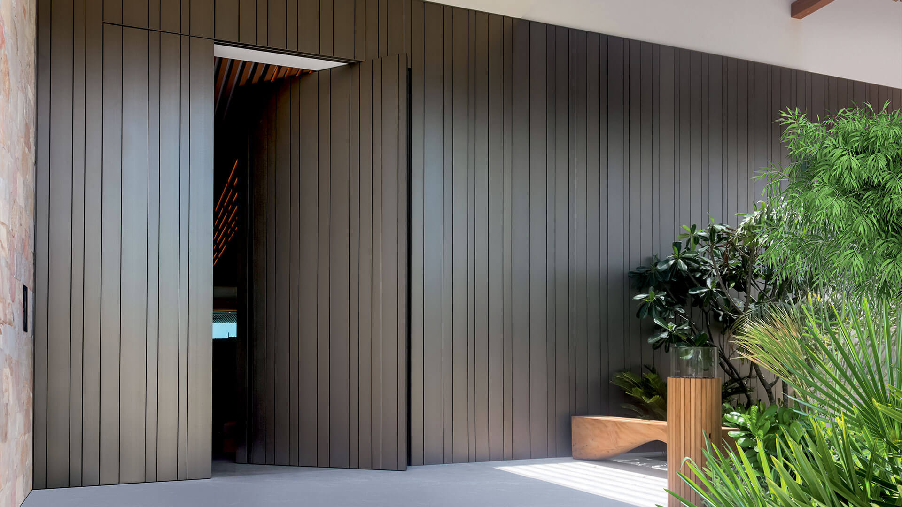

*图：Synua 采用竖向线条饰面时的整体效果，线条贯穿门体与两侧墙面。图源：Oikos 官网产品页（Synua）。*

官方产品页：[https://oikos.it/it/prodotti/porte-a-bilico/synua/](https://oikos.it/it/prodotti/porte-a-bilico/synua/)

### Tekno（2007）：让铰链从视野里消失

Tekno 把难题换到了门缝上：门要开合就必须有铰链，而铰链是立面上最容易被看见的五金。Oikos 的方案是把铰链完全藏进门体与门框的腔体内，门关闭时看不到任何铰链痕迹，开启角度可达 100°。这款产品由米兰设计组合 Adriani & Rossi 设计。

Tekno 的技术难度不在"藏"，而在"藏了之后还能调"。隐藏铰链缺乏外部调节空间，门扇下垂后不易校正，因此铰链的可调性成为产品寿命的关键。官网强调铰链完全隐形且可调节，并把门框与门体全部覆盖拉丝钢色阳极氧化铝型材，依旧维持"无可见螺钉"的规则。这款产品在 2012 年进入 ADI 设计索引。

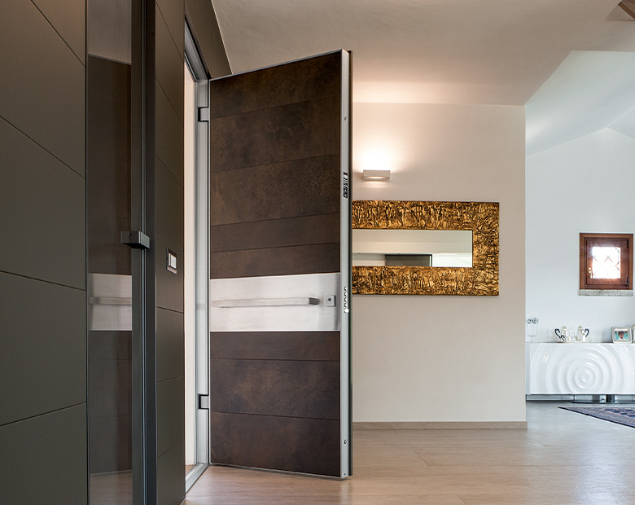

*图：Tekno 门体外观，门框与门面为同色铝型材，闭合状态下看不到铰链与螺钉。图源：Oikos 官网产品页（Tekno）。*

官方产品页：[https://oikos.it/it/prodotti/cerniere-a-scomparsa/tekno/](https://oikos.it/it/prodotti/cerniere-a-scomparsa/tekno/)

### Evolution（2008）：传统入户门的现代化底座

Evolution 是六条线里最"传统"的一条：外露铰链、可配矩形或拱形上亮、可配侧窗、单扇或双扇。它承担的是市场覆盖面——把品牌的饰面体系与安防标准，放进那些不需要极端尺寸、但希望外观与建筑风格匹配的项目里。官网的选购指南把它列为价格最低的一条线，起步价 1,600 欧元。

它的价值不在技术，而在体系：Evolution 的用户可以与 Tekno、Project 共享同一套饰面与色彩，从而在一栋建筑里实现入户门与室内门的一致性。2015 年公司为它增加了断热桥版本 Evolution 3TT，把能耗与结露问题纳入产品范围。

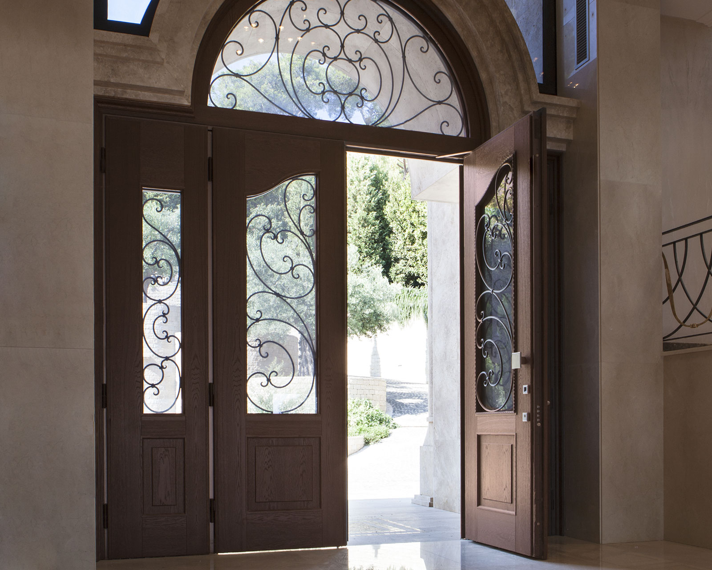

*图：Evolution 系列门体外观，外露铰链与木质饰面。图源：Oikos 官网产品页（Evolution）。*

官方产品页：[https://oikos.it/it/prodotti/cerniere-a-vista/evolution/](https://oikos.it/it/prodotti/cerniere-a-vista/evolution/)

### Vela（2009）：第一款滑动装甲门

滑动门在住宅里的常见问题是门槛与轨道：轨道要落在地上，门槛会挡住无障碍通行，也打断地面材质。Vela 的做法是把升降、横移与密封三件事拆开：门扇先被抬起（磁悬浮结构，藏在门框内部，官方表述为适用于 120 公斤以上的大尺寸门扇），再横向滑动，关闭时通过一套隐形的地面闭锁机构落地压紧。结果是地面既没有轨道也没有门槛，而防盗等级做到了 4 级，隔声 42 dB。

它也是 Oikos 第一条取消传统钥匙与锁孔的产品：开门依靠手机应用、PIN 码、卡片或指纹。指纹识别器既可以做在门把手里，也可以单独安装在相邻墙面甚至其他房间，官方给出的最远距离是 8 米。2025 年，这款产品在慕尼黑 BAU 展上正式上市，成为公司当年的主打新品。

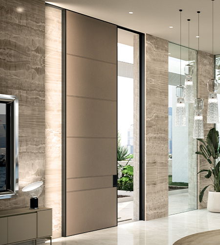

*图：Vela 地面细节，关闭状态下的门扇与室内地面直接相接，无轨道与门槛。图源：Oikos 官网产品页（Vela）。*

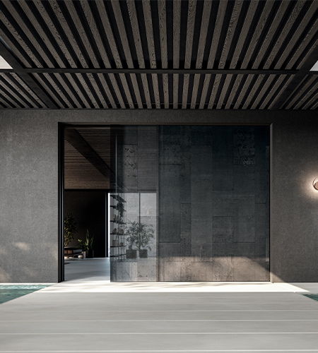

*图：Vela 升降结构图，磁悬浮组件隐藏在门框内部。图源：Oikos 官网产品页（Vela）。*

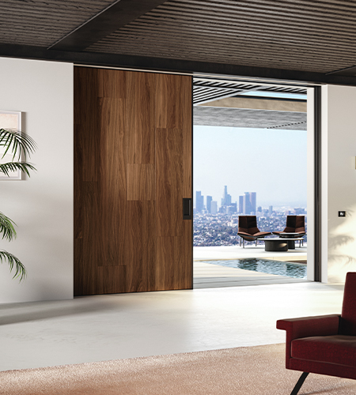

*图：Vela 地面闭锁机构示意，闭锁装置隐藏在门扇内部。图源：Oikos 官网产品页（Vela）。*

官方产品页：[https://oikos.it/it/prodotti/porte-scorrevoli/vela/](https://oikos.it/it/prodotti/porte-scorrevoli/vela/)

### Project（2015）：把安全门搬进室内

Project 把同一套工程能力搬到室内：门体最大约 1 米宽、2.4 米高，使用隐藏铰链，防火 EI 30，隔声 36 dB（可升级至 40 dB），外观上尽量不区别于普通室内门。它的目标用户是需要在住宅内部设置安全区间的业主——官方直接把它与 panic room 的用法关联：一间房可以与住宅其他部分断开，构成短暂的避险空间。

> 术语注释：panic room——住宅内可在紧急情况下短时避险的安全房间。

这条线的战略意义大于销量意义：它把品牌的安防能力从"入户"延伸到"户内"，把一次交易从一扇门扩展为一套空间分级方案。

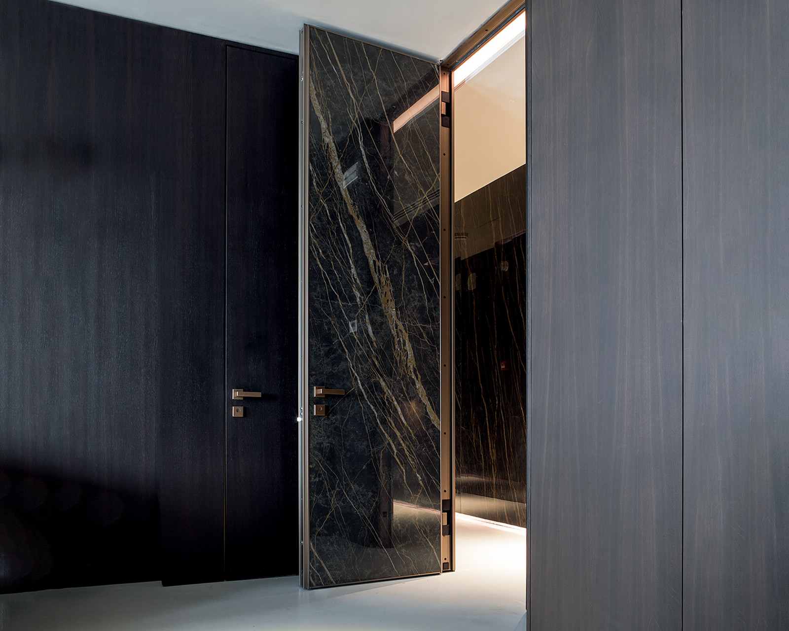

*图：Project 室内安全门，外观与常规室内门一致。图源：Oikos 官网产品页（Project）。*

官方产品页：[https://oikos.it/it/prodotti/cerniere-a-scomparsa/project/](https://oikos.it/it/prodotti/cerniere-a-scomparsa/project/)

### Nova（2017）：全玻璃的大尺寸装甲门

Nova 处理的是装甲门与玻璃之间看似不可调和的矛盾：玻璃要通透，安防要抗打击。公司的做法是三层叠加——结构上用竖轴系统与钢制承重框架支撑大尺寸门扇；玻璃使用夹层安全玻璃，官方称同时具备防弹与抗锤击性能；框架与门扇标配断热桥结构，以控制结露与热损失。官方给出的标准上限是 3200 × 6200 毫米，Interni 杂志的报道提到单扇玻璃门可做到 3.5 米宽、6.3 米高。

这款产品的设计意图在官方表述里很明确："门不再只是把外面的世界关上，而是朝向外部世界的开口"。2018 年，Nova 进入 ADI 设计索引。

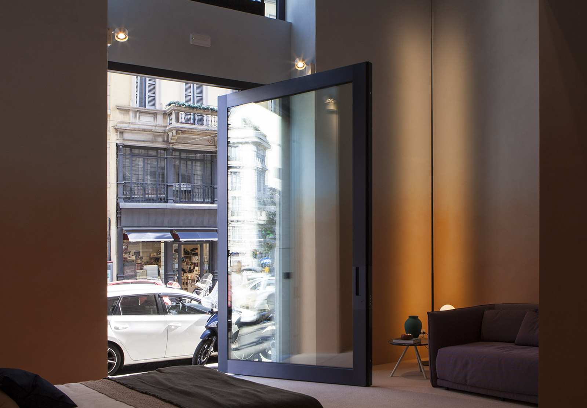

*图：Nova 玻璃门整体外观，可见门扇、侧窗与门框的连续关系。图源：Oikos 官网产品页（Nova）。*

官方产品页：[https://oikos.it/it/prodotti/porte-a-bilico/nova/](https://oikos.it/it/prodotti/porte-a-bilico/nova/)

### Tekno 3TT（2023）：断热桥与能耗账

3TT 指的是门框与门扇上的断热桥结构。Oikos 先在 2015 年把这项技术用在 Evolution 上，2019 年推出 Synua 3TT，2023 年补齐 Tekno 3TT。对装甲门来说，断热桥的意义有两层：一是降低传热系数（官方数据从 1.6 降到 1.3 甚至 1.0），二是消除室内侧的结露与冷桥，这两点直接决定门在寒冷地区的可用性。

公司在这个方向上的认证路线也说明了市场意图：Tekno 与 Evolution 被纳入意大利 CasaClima 能效体系的合作产品，同时满足防火与抗飓风认证，可在同一产品上组合多套规范。

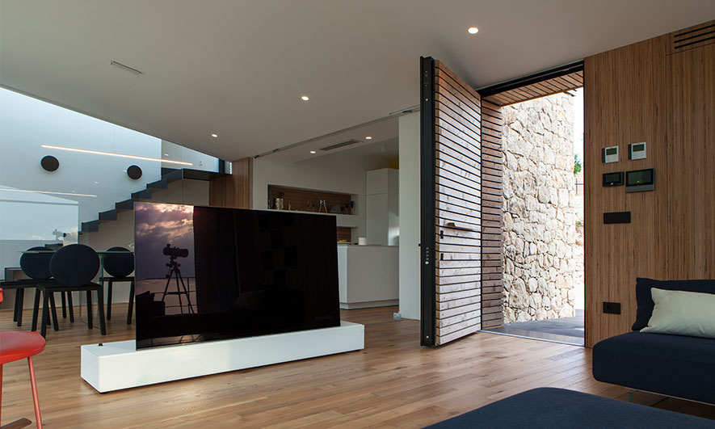

*图：Tekno 3TT 门框断热桥构造，隔热材料嵌在金属型材之间。图源：Oikos 官网新闻《Nasce Tekno 3TT》。*

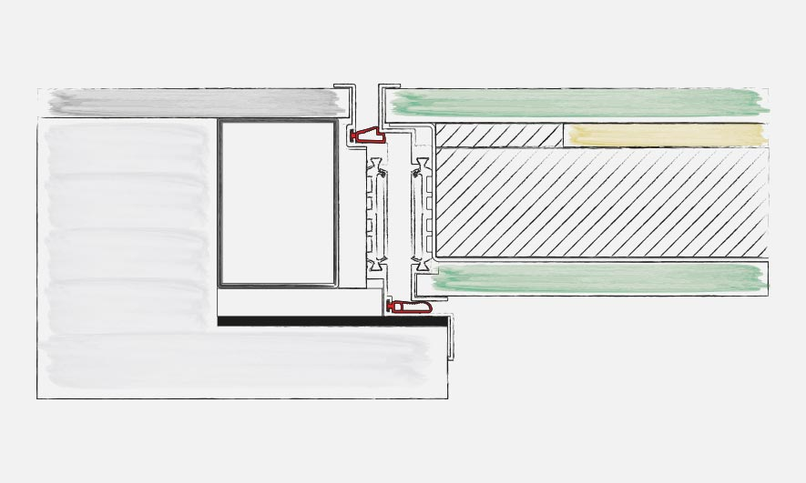

*图：Tekno 3TT 的门体剖面与尺寸技术图。图源：Oikos 官网新闻《Nasce Tekno 3TT》。*

官方新闻页：[https://oikos.it/it/news/nasce-tekno-3tt-la-porta-blindata-a-taglio-termico/](https://oikos.it/it/news/nasce-tekno-3tt-la-porta-blindata-a-taglio-termico/)

### Arckey（2015）：把锁变成门的一部分

机械锁是装甲门上最难"藏起来"的部件。Arckey 的思路是把它电子化并并入门体：电控锁体隐藏在门内，用户通过手机应用、卡片、触控键盘或指纹开门，应用支持远程开门、用户管理与出入记录。2015 年 11 月，这套系统在巴黎 Batimat 展首次公开，随后成为全系产品的选配，并在 Vela 上成为唯一的开门方式。

从产品逻辑上看，Arckey 解决的是外观一致性问题：当门禁不再需要钥匙孔、不需要外露把手、不需要额外面板时，立面才真正只剩下面板与饰面。

从产品逻辑上看，Arckey 解决的是外观一致性问题：当门禁不再需要钥匙孔、不需要外露把手、不需要额外面板时，立面才真正只剩下面板与饰面。

官方新闻页：[https://oikos.it/it/eventi/arckey-la-serratura-al-servizio-dellarchitettura/](https://oikos.it/it/eventi/arckey-la-serratura-al-servizio-dellarchitettura/)

### 第三方评价与专业媒体评价

行业与设计媒体对 Oikos 的评价集中在"把设计引入装甲门"这一判断上。Interni 在关于 Nova 的深度报道中写道，这款门"不只是像其他装甲门那样把世界关在门外，而是朝向外部世界的一个开口"，并把它的关键特征概括为"整体齐平、极简风格与对色彩的细致研究"。门窗行业媒体 Guidafinestra 在报道公司 2025 年首次参加米兰国际家具展时，用了"不只是优秀制造商，而是真正的设计诠释者"这样的表述，并提到展会官方把它认定为"生产设计的品牌"。Archiproducts 的品牌页把公司定义为"高端细分市场的行业领导者"，并注明其获得过金圆规奖荣誉提名。

需要区分的是评价与事实：以上均为第三方媒体表述，可用于判断品牌在行业中的公众形象，但不能替代产品参数本身。

### 产品小结：六条线的分工与边界

六条产品线的关系可以用一句话概括：Synua 与 Nova 用竖轴解决"大"，Vela 用滑动解决"无障碍"，Tekno 与 Project 用隐藏铰链解决"干净"，Evolution 用外露铰链解决"覆盖面"。它们的边界同样清晰：需要极限尺寸与齐平时，选择收窄到 Synua 与 Nova；需要最高安防等级时，Vela 标配 4 级，Evolution 可选配 4 级；预算有限或需要传统形制时，Evolution 是入口。

真正构成技术壁垒的不是单项参数，而是四类能力的组合：大尺寸门体的结构控制、齐平安装的精度控制、隐藏五金的可调性设计，以及电子系统与门体的整合。这四项能力中任何一项单独都不难找到替代方案，同时具备并在同一个项目里组合，是它与多数同行拉开差距的地方。

## 08 Aesthetics 美学：齐平、无螺钉与威尼斯的秩序

### 视觉识别与传播语言

Oikos 的标识是一个稳定的字标，深色与浅色两个版本用于不同底色物料，字标下方长期跟随意大利语定位语 "Architetture d'ingresso"。2021 年，公司更新了整体形象系统，把出版物分成三个系列：l'atelier（工作室）、l'archivio（档案）与 l'arsenale（兵工厂）。这三个名字本身构成了品牌的叙事结构——把产品目录、项目档案与饰面系统分别对应到"创作、记忆、生产"三种角色上，而不是并列成三本产品册。品牌签名 "Made in Italy Entrances. Designed by You." 则把设计的所有权明确交给客户与建筑师。

### 形态与比例：门如何从立面上消失

Oikos 的形态语言围绕两个几何规则建立。第一是齐平：门体表面与相邻墙面处于同一平面，误差以毫米计，这条规则决定了门框的构造方式与安装工艺。第二是通高与贯通：门把、把手与门缝都倾向于做成通长的竖线，从地面延伸到门洞顶部，让入口获得纵向的完整比例。当这两条规则同时成立时，视觉上就出现"墙上有缝、缝能开合"的效果——门的存在感被压到最低，取而代之的是墙面的完整。

*图：Skydoors 饰面系统在入口立面上的纵向线条秩序。图源：Oikos 官网新闻《Skydoors，垂直线条》。*

### 色彩与材料情绪

Oikos 的饰面体系是理解其审美取向的最快路径。木饰面分室内与室外两套（室内含多种胡桃、红木、樱桃、柚木与橡木，室外含奥库梅、栗木、花旗松与松木），另有 "Legno Vivo" 户外饰面系列；漆面覆盖 RAL 色卡、孔开放漆与金属漆；玻璃分亮光与哑光两套色系；岩板系列（Laminam）提供耐候钢、石灰、氧化色与天然大理石纹；铝饰面提供金、铜、铂金、海银、烟灰、沙与冰等一系列金属色；"Fashion" 系列提供树脂板、黄铜与皮革；"The Natural Stone" 系列使用天然石材，包括背光缟玛瑙、阿拉伯斯卡多与蓝方钠石。

这套色板的共同倾向是低饱和、哑光、带材质纹理：即便使用金色与铜色，也多为"古铜""烟灰"这类被压暗的处理，而不是明亮的高抛光。2026 年米兰国际家具展期间，公司推出 "Patinati Graffiati"（刮擦般的包浆）新饰面，把触感作为当年的研究主题，进一步印证了这条审美路线。

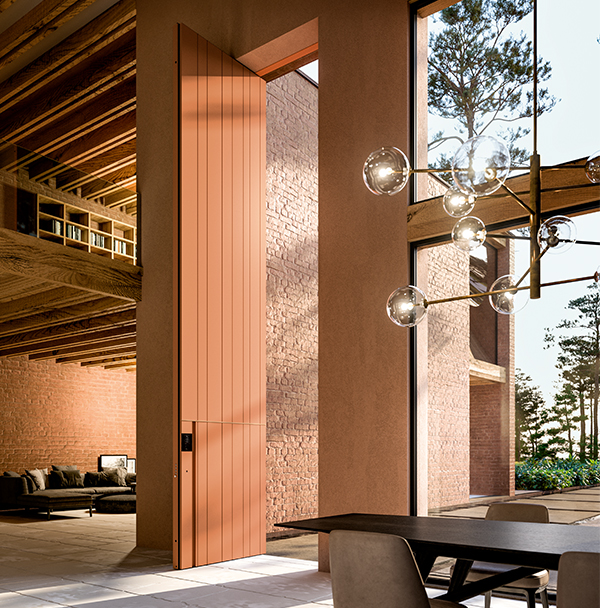

*图：Skydoors 饰面局部，可见竖向分格与表面色差控制。图源：Oikos 官网新闻《Skydoors，垂直线条》。*

### 光与空间

光在 Oikos 的产品里有两重角色。第一重是穿透：Nova 用整面玻璃把外部景观引入入口，官方表述为"把景观带进室内"。第二重是发光：2020 年迪拜项目与 2026 年米兰展台上的 Synua 都使用了背光缟玛瑙饰面，门体在关闭状态下变成一块发光的墙面，这是把门当作光的装置来处理的做法。

在展示空间上，公司同样按建筑尺度思考。威尼斯总部展厅包含产品陈列、材料墙与常设展区；2018 年在 Scuola Grande di San Rocco 接待建筑师、2023 年在 Fondazione Querini Stampalia 的 Scarpa 展区举办 DoorScape 获奖展，都选择具有建筑史意义的场地作为品牌舞台。2026 年米兰国际家具展的 200 平方米展台上，Synua 与菲亚特 500、Vespa 并列展出，把产品放进"意大利设计史"的语境里。

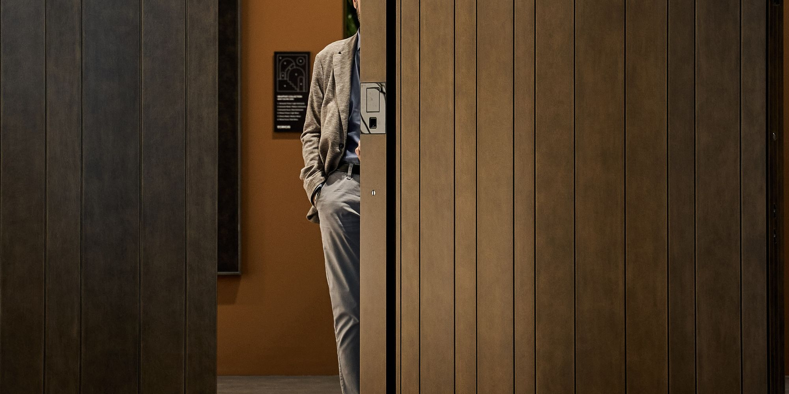

*图：Salone del Mobile 2026 展台现场，Synua 以背光缟玛瑙饰面呈现。图源：Oikos 官网新闻《Oikos al Salone del Mobile 2026》。*

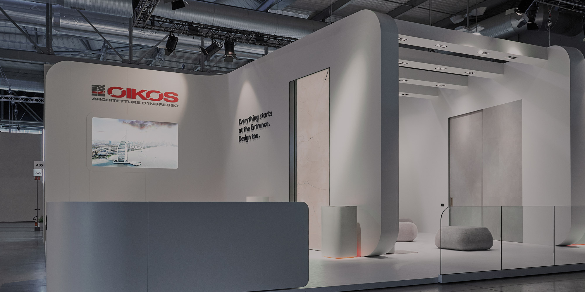

*图：2025 年首次参展时的展台全景，Synua 与 Vela 同时展出。图源：Oikos 官网新闻《Oikos al Salone del Mobile 2025》。*

### 触感、声音与机械感官

装甲门是重物，用户对它的第一印象来自动作本身：门扇被抬起时的轻微悬浮感、滑动时的阻力曲线、关闭时落地压紧的那一刻。Vela 在官方物料里把这一层写成了核心卖点：磁悬浮使门扇减少摩擦，滑行更顺滑；地面闭锁让最后一下有明确的落点。隔音数据（38 至 43 dB）则决定了关门之后空间的声音变化，这是居住在临街或临海住宅的业主最直接能感知到的差异。

把手是另一处触感设计。公司为不同产品提供五种把手形式，其中包括内嵌式斜面的 "scivolo" 设计（官网称其为专利方案）与通高型 "Ceg""Cortina" 门把。室内把手 "Sonia" 采用带沟槽的直线条处理，另有加入"梳齿"细节的版本，官方解释这是对威尼斯本地手工传统的引用。

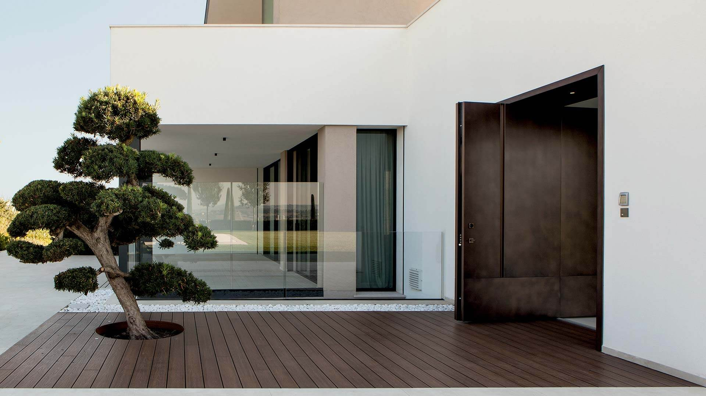

*图：Synua 在私人住宅入口的实景，通高把手与门面线条构成统一秩序。图源：Oikos 官网产品页（Synua）项目图。*

### 叙事基调：兵工厂、裁缝与歌剧

Oikos 的品牌叙事有三条稳定的线索。第一条是兵工厂：借用威尼斯 Arsenale 的工业组织传统，把"工业化 + 手工技艺"包装成一个自造概念 arsenalità。第二条是裁缝：官方在描述木工车间时写"饰面板就像一件要穿上的衣服，我们像裁缝一样量体、选料、缝制"，把定制的复杂过程翻译成一种熟悉且带人情味的比喻。第三条是文化演出：公司长期用歌剧、建筑讲座与历史建筑场景做活动载体，2024 年在厂区内举办歌剧晚会，2026 年把建筑师带到威尼斯救主节现场。

> 术语注释：arsenalità——Oikos 自造词，指威尼斯兵工厂式的工业组织与手工技艺合为一体的生产模式。

### 美学评价

Oikos 的审美路线可以概括为"把门做成墙面的一部分，再用一两个材质细节让人认出它不是墙"。支持这一判断的依据是具体的：齐平安装与通高线条减少了视觉噪音，低饱和饰面与哑光表面降低了产品在空间里的存在感，而背光石材、通高把手与细窄门缝又确保入口不至于失去识别度。

这条路线也有代价。第一，墙面越干净，施工误差越无处可藏——一旦墙面不平或门缝不均，瑕疵在齐平的立面上会立刻放大。第二，饰面体系覆盖面极广（木、漆、玻璃、岩板、金属、石材、皮革），如果没有设计师参与，用户很容易在数百种组合里失去判断，最终效果取决于经销商与门店的审美水平。第三，低调的形态需要更大的尺寸与更好的工艺才能"立住"，这使得审美与预算强绑定：同样一条产品线，做在 2.4 米门洞与 6 米门洞上的视觉说服力并不相同。

## 09 Design 设计：齐平的门与藏起来的五金

### 设计哲学：门是入口空间，不是五金组合

Oikos 眼中的设计首先是一件解决问题的工具，其次是一种主张生活方式的声明。公司页对这两层意思都有直白的表述：一方面把设计定义为把"看似不可能的入口"变成现实——官网写着"有时你渴望的正是看起来不可能的事"，并称公司的工作就是把这些入口建筑真实造出来；另一方面把入口定义为空间而非边界——"不只是内与外、公共与私密之间的分界线，而是充满意义、能够塑造空间、摆脱传统门概念的入口场景"。

在功能、形式、情感、人与时间之间，它的站队可以落到三个具体决定上。安全不参与取舍：防盗等级、防火与抗风压认证是底线，不会为了外观妥协；形式服从"消失"：可见的五金、螺钉与把手被逐项移除，直到立面上只剩饰面；时间维度上选择可调与可维护：支轴与铰链都保留调节能力，门槛套件做成可替换模块，电子锁体做成可升级系统。第三条最容易被忽略，却是这个品类里最现实的工程选择——一扇重达数百公斤的门，如果无法在数年后校正，就无法长期保持齐平。

### 设计权的分配：让设计师画，工厂来实现

Oikos 的定制流程里有一条明确的权力分配。公司页写道："很多时候我们让设计师来画，其余的交给我们"（意大利语原文：spesso lasciamo che siano i progettisti a disegnare, a tutto il resto ci pensiamo noi）。这句话的解释是公司把设计阶段的自由度交给外部建筑师，把工程实现、供应商协调与技术风险留在内部：官网说明项目设计办公室负责从对接供应商到解决技术问题的全部实施阶段。

这种安排在高端住宅与项目中很有效——建筑师要的是"能按图实现"，工厂要的是可控的工艺窗口。品牌签名 "Designed by You" 正是这套分工的对外表述。

### 信念的来源

这套信念有三个来源。第一是威尼斯的兵工厂传统：公司把威尼斯 Arsenale 的工业组织视为范本，认为"艺术品的诞生来自完美的工业组织与高质量的手工制作的结合"，并由此造出 arsenalità 一词。第二是裁缝式的手工观：官网在描述木工车间时写道，"饰面板就像一件要穿上的衣服，我们是裁缝，仔细量体、提出并搭配面料，为每一个人缝制他自己的衣服"。第三是外部的知识与文化输入：公司与威尼斯卡福斯卡里大学合作超过十年，把艺术与文化管理研究引入企业实践；与帕多瓦大学合作改进企业绩效；在色彩领域邀请色彩设计师 Francesca Valan 参与趋势研究，2016 年公司大会上她主讲了色彩演变与未来二十年的色彩预测。

*图：公司文化项目海报，主题为 Carlo Scarpa 的课程与讲座。图源：Oikos 官网新闻《Carlo Scarpa，Francesco Dal Co 的一课》。*

### CMF：饰面体系背后的决策逻辑

Oikos 的饰面不是"选色"，而是一套与室内装修材料同步的体系。官方把饰面分成若干条线（Piano、Fugato、A settori、Custom、Skydoors、Legno Vivo、Massello、Pantografato），每条线对应一种面层逻辑：整片平面、分缝、分格拼板、客户图纸、竖向铝线条、户外活性木、实木与雕刻。材料层面覆盖木、漆、玻璃、岩板、天然石材、铝、黄铜与皮革。

这些选择背后有三条明确依据。其一是室内材料的同步：岩板与天然石材在室内墙面与台面上成为主流后，门面材料随之同步，目的是让门与室内空间共用一套材质语言。其二是内外有别的耐候逻辑：外饰面使用奥库梅、栗木、花旗松等耐候木材（奥库梅本身是船舶用材）与耐候钢，内饰面可以自由使用皮革、黄铜与高光漆。其三是色彩体系的控制：漆面给出 RAL 色卡与金属漆两组选择，同时用哑光与孔开放工艺压低饱和度，避免门在立面上过于抢眼。

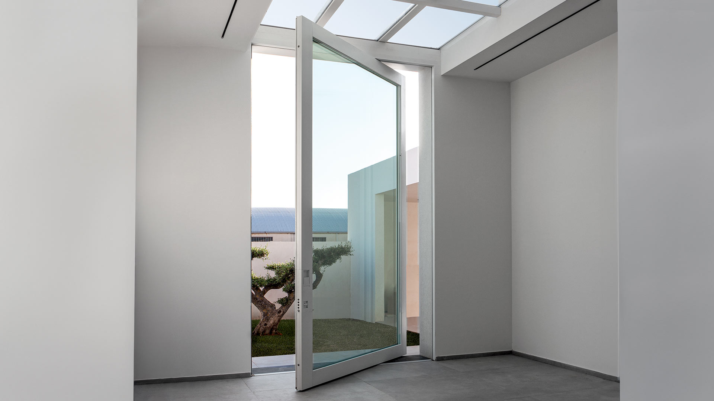

*图：Nova 玻璃门室内视角，门体与室内墙面形成连续界面。图源：Oikos 官网产品页（Nova）。*

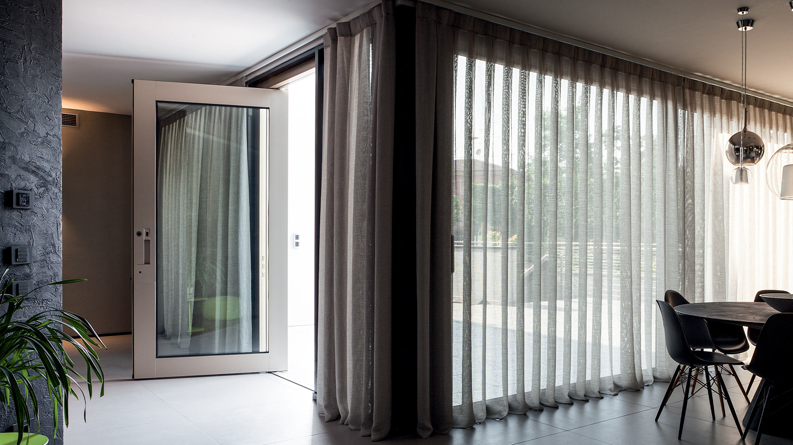

*图：Nova 系列金色饰面配件与玻璃门体的组合。图源：Oikos 官网产品页（Nova）。*

### 制造：三道工序与一座新厂房

Oikos 的制造逻辑是"全部内制"：金属加工与焊接（Officina）、饰面板制作（Falegnameria）、装配（Assemblaggio）三道工序全部在 Gruaro 厂区完成。官方给出的理由很直接：极端定制要求对生产过程的直接控制，以及足够的手工能力，才能保证每一件既独特又精确。

装配环节的组织方式值得注意：官方描述为"一件一件、一个零件接一个零件"地手工装配，同时用自动化搬运系统承担繁重搬运，把需要精度的工作留给工匠的手。这种"重活交给机器、精活留给人"的分工，是它在规模化与定制之间找到的平衡点。生产设备方面，Interni 的报道提到金属结构使用激光加工、涂装使用环保水性漆；公司在认证页列出 EN 71-3（玩具安全标准的涂料有害物质要求），用来说明水性漆不释放有害物质。

厂区的命名沿用了威尼斯造船业的词汇：Tesa del Favaro、Tesa del Marangon，以及 2026 年 3 月 14 日启用的 Tesa delle Galeazze。"Galeazza"是威尼斯共和国的大型桨帆战船，新厂房专门用于生产超大尺寸门，内部同时设置了员工餐厅与可转换为技术交流场地的空间。

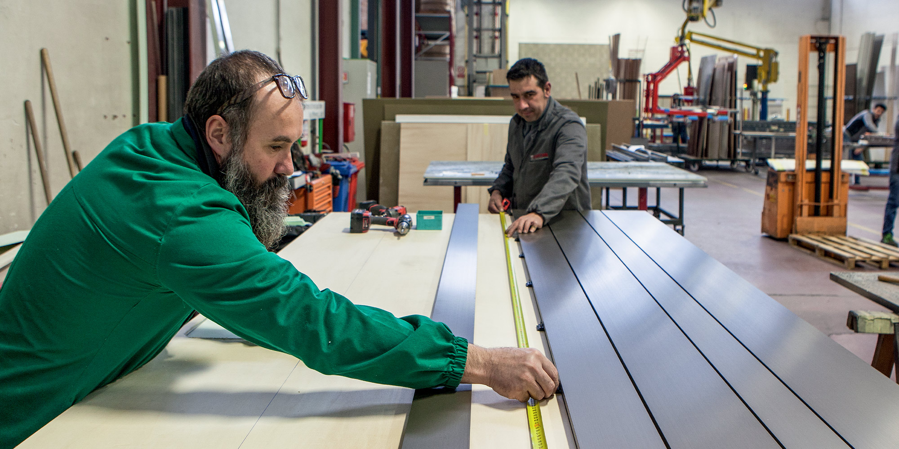

*图：官网手工艺主题图片，展示厂内的制作场景。图源：Oikos 官网首页。*

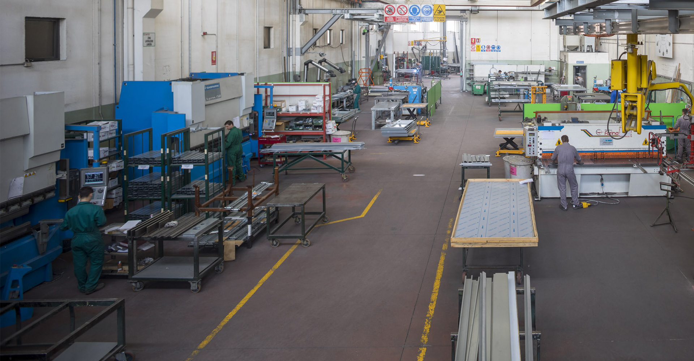

*图：官网"内部生产"主题图片，对应金属加工、木工与装配三类工序。图源：Oikos 官网公司页。*

### 人机与设计工程

把产品拆到动作层，可以看到若干被反复优化的工程点。

开启机构方面，Synua 的竖轴支轴可调节并可隐藏，配合地面电机可驱动 560 公斤门体；Tekno 与 Project 的隐藏铰链可调，开启角度 100°；Vela 采用磁悬浮升降（官方说明适用于 120 公斤以上门扇）加横向电机滑动，并配有藏在门扇内的地面闭锁机构。

密封与地面处理方面，标准配置为地面挡风条，用于关闭门扇与地面之间的缝隙；需要更高性能时可选 Kit Mose（可见门槛，适用于地面不平或材质交接处）或 Kit Dam（隐形门槛，要求地面平整无高差）。

热工、防火与抗风方面，3TT 断热桥结构把传热系数从 1.6 降到 1.3 至 1.0；防火可选 EI 60、EI 120 与 UL 120；抗飓风按 Miami-Dade 认证要求测试，官方给出的抗风压指标为 LMI ±65 PSF。

电子方面，Arckey 把锁体电机、控制模块与识别设备整合进门体或周边墙面；指纹识别模块可外置到 8 米以内，为"门面上不出现任何识别装置"提供可能。

这些工程点的共同目标是让"重、笨、显眼"的装甲门在行为上变得轻、静、无感；代价则集中在造价、安装精度与后期服务上。

### 品牌侧依据与设计变量

| 品牌侧依据 | 对应的设计变量 | 产品证据 |
|---|---|---|
| 入口属于建筑而非门本身 | 门体与墙面齐平、门墙一体系统 | Synua、Synua Wall System |
| 立面上不应出现五金与螺钉 | 隐藏铰链、隐藏支轴、内嵌把手、隐藏式门禁 | Tekno、Project、Arckey |
| 门要能长期保持齐平 | 可调支轴与可调铰链、可替换门槛套件 | Synua 支轴、Tekno 铰链、Kit Mose／Dam |
| 大尺寸门洞需要新的受力方式 | 竖轴回转、地面电机、钢制承重框架 | Synua（最大 3000 × 6200 毫米）、Nova |
| 通行不应有门槛障碍 | 磁悬浮升降、无轨道滑动、地面闭锁 | Vela |
| 节能与结露必须解决 | 断热桥型材与门扇结构 | Evolution 3TT、Synua 3TT、Tekno 3TT |
| 同一建筑内风格需要统一 | 统一饰面体系与色彩系统 | 木、漆、玻璃、岩板、石材、金属、皮革饰面 |
| 文化与设计能力需要被行业认可 | 参与设计索引与设计竞赛生态 | ADI 设计索引收录、金圆规奖荣誉提名 |

## 10 Experience 体验：从图纸到十年之后

### 了解与选购

潜在客户的第一次接触通常发生在三个位置：品牌官网的产品与项目页、经销商的展厅，以及建筑师的设计方案。官网提供了相当完整的信息层级——产品页按"详情／技术规格／形制／饰面／选配／项目案例"分栏，另设技术专区（Sezione Tecnica）、常见问题与钥匙复制入口。价格不在页面上，官方在选购指南里提示最终价格取决于饰面、尺寸与电子配件，需要与经销商逐案确认。

### 到店：威尼斯、迪拜与巴黎

公司把自有展厅命名为 Atelier，而非 showroom。威尼斯总部展厅除产品陈列外，还包含材料区与常设展 "Tracce di design"，官方把它描述为"意大利制造博物馆"；迪拜 Atelier 于 2022 年在 Al Quoz 开幕，官方说明它复制了威尼斯总部的展示区域，并兼具文化空间功能；巴黎 Atelier 于 2026 年 6 月在 Freneuse 的 Europrotect 空间开幕，开幕活动请来威尼斯制桨师 Saverio Pastor 现场演示传统桨架雕刻。

> 术语注释：remèr——威尼斯方言，指制作船桨与桨架的手艺人。

到店体验的重点是材料：门在项目中是"看图选材"的产品，只有摸到岩板、木饰面与金属的实际表面，才能判断它与建筑的匹配度。

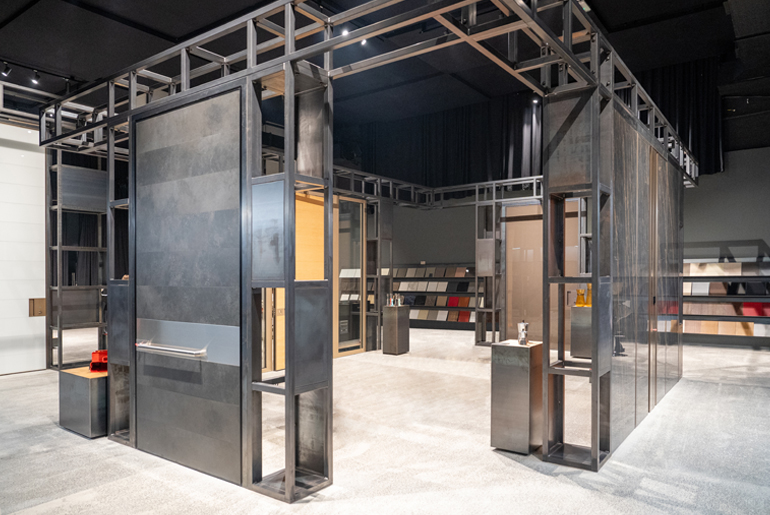

*图：迪拜 Atelier 展厅内部，展示区复制了威尼斯总部的陈列逻辑。图源：Oikos 官网 Atelier Dubai 页面。*

### 定制的实际流程

官方把项目流程拆成四段：设计师提出入口建筑的设想；公司技术顾问把需求转化为具体项目方案；项目设计办公室负责实施阶段，包括对接供应商与解决技术问题；生产全部在厂内完成，安装由内部技术团队与本地合作方执行。这一流程的关键在于第二段——把设想变成可制造的方案，期间需要确认门洞尺寸、墙体平整度、地面高差、开启方向与电子系统的布线条件。

### 安装与钥匙管理

安装是这个品类里风险最高的环节。产品页对钥匙管理有明确说明：所有门出厂时附带施工钥匙，供生产验证与安装人员使用；业主钥匙则始终密封在专用盒中交付。这个细节反映了工程门类产品的现实——安装与调试过程中必须有人能开门，但最终控制权必须完整交回业主。

### 日常使用与电子系统

使用层面，机械系列继续沿用钥匙与把手；电子化系列则通过 Arckey 与手机应用（iOS 与 Android 均可下载）完成开门、用户管理与出入记录查询。Vela 完全取消传统钥匙，靠手机、PIN 码、卡片或指纹开门，另可设置为门内按钮自动开合、或升降自动而横移手动等不同组合。

### 维护、维修与长期持有

长期持有的关键变量有三个。第一是五金的可调性，决定门在数年之后能否保持齐平；第二是地面与密封件的更换便利性，挡风条与门槛套件属于可替换模块；第三是电子系统的可持续性——应用、指纹模块与电控锁体需要长期的技术支持。公司在官网提供了清洁与润滑的保养指引、钥匙复制服务入口，以及技术专区供安装方查询参数。

### 体验断裂点

以下问题来自公开信息与产品结构本身，属于可验证的体验弱点。

价格不透明是最直接的一条：官网不公开最终价格，用户必须依赖经销商报价，跨市场比价困难。第二条是渠道依赖：测量、安装与本地服务由经销商或合作方执行，若渠道能力不足，产品的高精度设计会被安装误差抵消——齐平安装的容差极小，这一点在墙面不平的旧房改造中尤其明显。第三条是电子依赖：Vela 完全依赖电子开门，一旦断电、模块故障或应用停止维护，用户需要依赖备用方案，官方并未公开完整的断电应急说明。第四条是交付周期与定制复杂度：全部工序内制、门体为单件生产，交期与修改弹性都受工厂排产限制。第五条是信息不对称：饰面体系庞大（数百种组合），缺少统一的可视化工具时，用户很难在订购前准确预判成品效果。

## 11 Competition 竞品：同一张牌桌上的对手

### 品牌归属与行业坐标

Oikos 是一家独立私营企业，没有可披露的集团母公司。这一点在竞争上有两面性：决策快、品牌叙事统一，但缺少集团在采购、渠道与工程资源上的规模支持。它的行业坐标可以用三句话定位：在意大利本土，它是"设计导向的专精品牌"，销量远小于大众装甲门厂商；在高价值住宅与项目中，它与意大利头部品牌及欧洲设计型品牌正面竞争；在出口市场，它依靠认证体系（防火、抗飓风）与定制能力进入当地规范与设计圈层。

### 品牌层：意大利阵营

意大利装甲门市场的规模玩家是 Dierre，其官网自述为"全球装甲门、室内门与外部门窗系统的领导者"，产品覆盖装甲门、室内门、滑动门与防火门，走的是全品类、全渠道路线；它在价格、渠道覆盖与交货速度上占据优势，但在超大门洞与门墙一体这类极端定制上并非主打。Mottura 以锁具与安防五金起家，装甲门产品强调锁具技术与安防系统整合；Di.Bi.、Koblenz 等品牌在中端到高端住宅市场形成密集竞争带。这一阵营的共同点是价格与量产效率，对应的采购逻辑通常是"按预算选一樘安全的门"。

### 品牌层：欧洲设计型阵营

在设计与定制这一侧，德国的 Biffar 是直接对手：其官网强调"获奖设计 + 无可妥协的安全"，产品线覆盖入户门、窗与雨棚，拥有多项专利安全方案与设计奖项，客户结构同样偏建筑师与高端业主。斯洛文尼亚的 Pirnar 以设计型入户门见长，玻璃与铝的组合同样面向现代住宅。与它们相比，Oikos 的差异集中在两点：门墙一体系统（Synua Wall System）与竖轴大尺寸门（Synua、Nova）的尺寸上限，以及在意大利本土建筑文化项目中的持续存在感。

### 产品层：四类直接对位

第一类是大尺寸竖轴门：Oikos Synua 与 Nova 对位欧洲设计型品牌的大尺寸铝合金或玻璃门；Oikos 的优势是尺寸上限与齐平构造，劣势是价格与交期。

第二类是隐藏铰链门：Tekno 对位各家隐藏铰链产品；Oikos 的加分项是防火等级（EI 90／EI 120／UL 120）与 ADI 设计索引背景。

第三类是滑动门：Vela 在"入户滑动 + 无门槛 + 4 级防盗"这个组合上少见对手，多数滑动门产品用于室内或非安防场景。

第四类是电子门禁：Arckey 面对的是专业锁具与门禁厂商，如意大利的 Iseo 等（行业媒体曾报道其面向装甲门的电机锁产品）。专业厂商在锁体技术与认证上积累更深，Oikos 的优势在于把门禁与门体外观整合为一体。

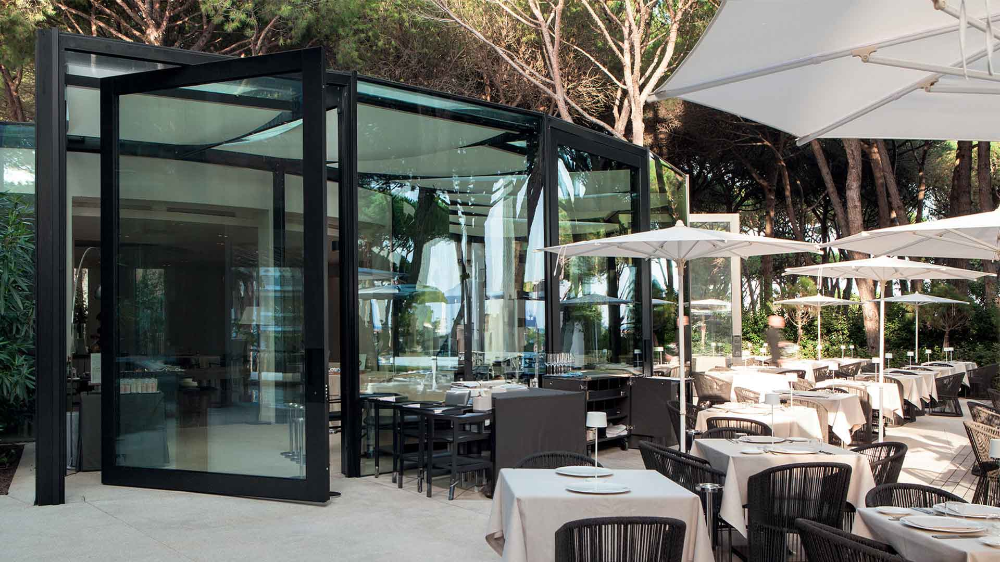

*图：耶索洛一处酒店项目中的 Nova 玻璃竖轴门，门体与建筑立面连续。图源：Oikos 官网产品页（Nova）项目图。*

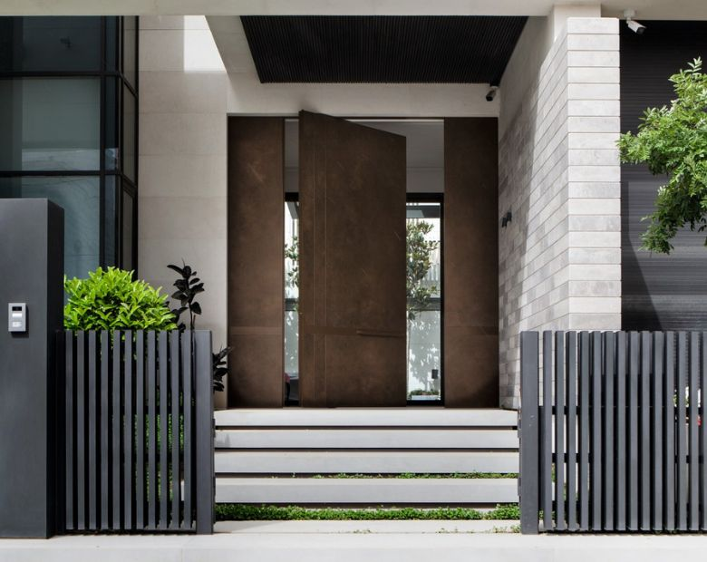

*图：亚洲项目的 Synua 竖轴门外观。图源：Oikos 官网项目案例（亚洲项目）。*

### 中国市场的对照

在中国高端入户门与别墅门市场，竞争结构完全不同：主流玩家以规模化制造与智能锁整合为主，产品卖点集中在锁芯等级、指纹识别与结构加固，价格带分布广泛。进口品牌在这个市场里通常以"意大利设计"为标签进入豪宅渠道。需要提醒的是，中文语境里"OIKOS"这个名字存在同名混淆：除意大利入户门品牌外，还有意大利涂料企业 Oikos Group、上海一家女装品牌 OIKOS、以及生态学期刊 Oikos 等主体使用相同或近似名称，这会影响搜索与品牌认知的有效性。

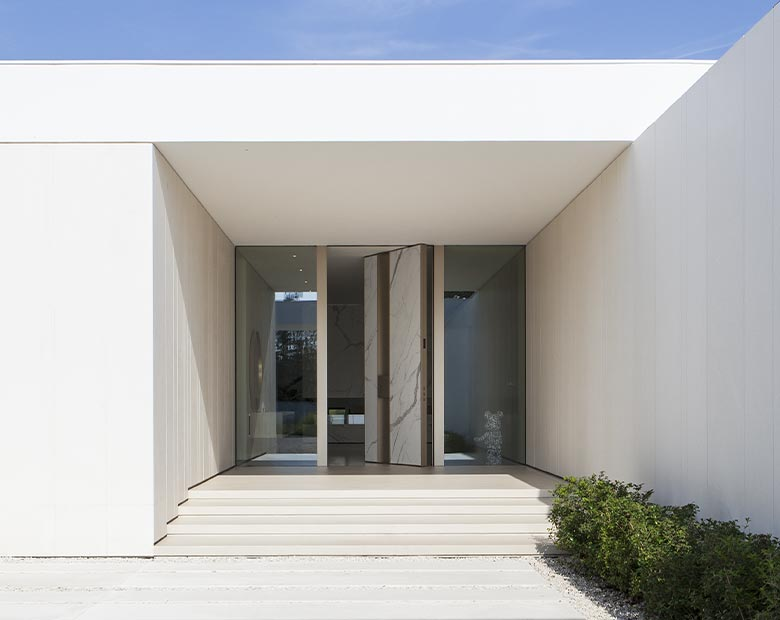

*图：意大利项目的 Synua 门体外观，出于街道视角的立面整体关系。图源：Oikos 官网项目案例（意大利）。*

### 竞争小结

Oikos 的竞争位置可以用"两端夹击"来描述：来自大众阵营的品牌在价格、交期与渠道覆盖上远优于它；来自欧洲设计型品牌的对手在品牌知名度与区域服务网络上与它相当或更强。它的护城河是"极端定制的交付能力 + 门墙一体的产品形态 + 意大利制造的文化叙事"这三者的组合，其中任何一项都可被单独模仿，但三者同时具备需要长期的工艺与渠道积累。

| 维度 | Oikos | Dierre 类大众高端品牌 | Biffar／Pirnar 等欧洲设计型品牌 |
|---|---|---|---|
| 定位 | 极端定制的入口建筑 | 全品类安全门 | 设计型入户门 |
| 尺寸上限 | 最大 3750 × 6200 毫米级 | 标准门洞为主 | 中大尺寸 |
| 门墙一体 | 有（Synua Wall System） | 少见 | 少见 |
| 电子门禁 | 自有 Arckey，可无钥匙 | 多与第三方锁具整合 | 多与第三方锁具整合 |
| 文化资产 | 竞赛、大学合作、建筑文化活动 | 规模与渠道 | 设计奖项 |
| 主要短处 | 价格高、交期长、渠道依赖 | 极端定制能力有限 | 区域性服务网络 |

## 12 Strategy 战略：保护、改变、扩张与风险

### 保护：已经成立的高价值资产

**内制工艺与兵工厂叙事（置信度：高）。** 全部工序在 Gruaro 厂内完成，配合 ISO 9001、IFT 抽检与自有培训体系，是"能按图实现"的物质基础。围绕威尼斯兵工厂构建的 arsenalità 概念，把这套生产能力转译成可传播的文化资产，厂房命名（Tesa del Favaro、Tesa del Marangon、Tesa delle Galeazze）与产品册体系（l'atelier、l'archivio、l'arsenale）都与之一致。

**竖轴大尺寸技术（置信度：高）。** Synua 与 Nova 的尺寸上限与齐平构造在同类产品中处于上限位置，且已有 11 米高自动化门墙系统的落地案例。这项能力不是单点专利，而是结构、五金、安装与运输的组合，短期难以被复制。

**门墙一体系统（置信度：中高）。** Synua Wall System 把门与墙面统一为同一套构造与饰面，形成区别于"门 + 门套"的结构性差异，也提高了单项目的客单值。

**设计与奖项资产（置信度：中高）。** 官方记录显示 Tekno 进入 2012 年 ADI 设计索引，"Facciata libera"进入 2016 年索引，Nova 进入 2018 年索引，Synua 与 Vela 获金圆规奖荣誉提名（2011 年，官方时间轴与 Archiproducts 品牌页均有一致记载）。

**建筑师社群与文化项目（置信度：中）。** DoorScape 国际竞赛、与 Casabella Formazione 合作的 Osteria dell'Architetto 巡讲、Oikos Experience（威尼斯救主节）、大学合作与歌剧晚会构成了持续十余年的行业关系网，其作用是让品牌长期出现在设计决策者的视野里。

### 改变：需要修正的环节

**价格与规格透明度（置信度：中）。** 官网不公开价格，技术参数分散在产品页与图册中，选购指南里的价格信息时点不明。对以建筑师为主的目标客户而言，缺少可下载的结构化参数表与配置工具，会增加方案阶段的不确定性。可行的做法是把尺寸上限、性能组合与饰面可用性整理成可查询的配置器。

**电子系统的可用性与应急方案（置信度：中）。** Vela 取消了传统钥匙，官方未公开断电、模块故障或应用停止维护时的应急开门方式与备用机械方案。对高端住宅客户，这是决策阶段必然会被问到的问题。

**渠道体验的一致性（置信度：中）。** 齐平安装与隐藏五金的容差极小，最终体验高度依赖安装方的水平。公司已有 Oikos Academy 培训体系，若能进一步把安装验收标准、经销商能力分级与售后响应时间公开化，可以直接降低体验波动。

**品牌识别的一致性（置信度：中）。** 在全球范围内，"Oikos"这个名字同时被生态学期刊、乳制品品牌、涂料企业与服装品牌使用；中文语境里也存在同名主体。品牌在搜索与社交媒体上的可见度会被稀释，需要通过官方账号标识、中文品牌说明页与商标策略主动区分。

### 扩张：增长方向与机会

**地理扩张（置信度：中高）。** 路径清晰：2022 年迪拜 Atelier、2026 年巴黎 Atelier，官方明确表示将继续在重要城市布点。海湾地区（迪拜、利雅得、科威特、阿曼）已有展会与项目积累，北美则以防火与抗飓风认证作为进入规范体系的通道。

**从门到入口整体方案（置信度：中高）。** 2025 年米兰国际家具展上，公司首次展出面向入口空间的家具配件线；Skydoors 把业务从门扩展到墙面饰材；Project 把业务从入户扩展到宅内安全空间。三者共同指向"入口空间整体解决方案"的定位延伸。

**工程与酒店渠道（置信度：中）。** 公开项目包含威尼斯 Palazzina Grassi 五星酒店、特拉维夫住宅塔楼、香港住宅项目、美国印第安纳与塞浦路斯私人住宅，说明产品已具备工程采购所需的认证与批量交付记录。

**中国高端住宅市场（置信度：中，方向性）。** 中文行业内容把 OIKOS 描述为面向豪宅的意大利入户门品牌，产品在大平层与别墅渠道具备认知基础。进入这一市场的主要障碍不是产品，而是品牌名称混淆、跨境交付周期与本地安装能力。

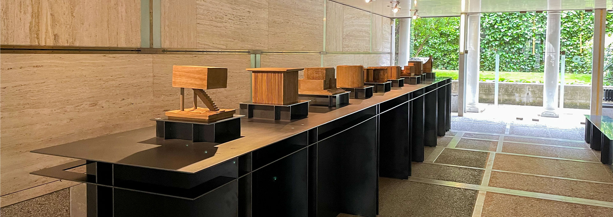

*图：DoorScape 竞赛获奖项目展示，获奖作品在 Fondazione Querini Stampalia 展出。图源：Oikos 官网新闻《DoorScape 竞赛结果》。*

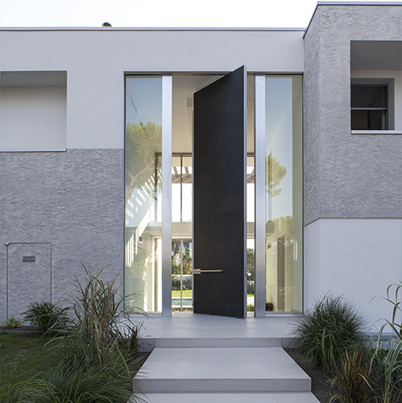

*图：Synua 应用于大尺寸门洞的项目实景。图源：Oikos 官网项目案例（Albarella）。*

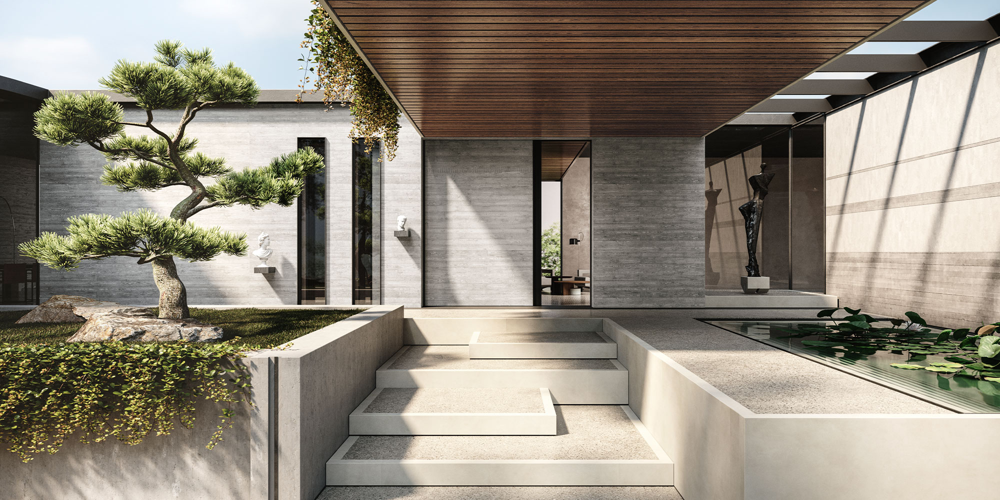

*图：Vela 官方主图，门体处于半开启滑动状态。图源：Oikos 官网首页横幅。*

### 风险：可验证的威胁与约束

**需求端受建筑周期与补贴政策影响（置信度：中）。** 意大利门窗行业的市场波动与建筑补贴政策高度相关，行业媒体长期把"建筑补贴"列为市场关键变量。高端定制门的客户对利率与资产价格的敏感度更高，订单波动可能放大。

**产能与交期的结构性约束（置信度：中）。** 单件生产、全部内制的模式带来质量优势，也限制了弹性。2008 年行业媒体记录的产能约为年产 12,000 樘，此后未见公开更新数据；超大门与复杂饰面会进一步占用产能。

**单点生产与物流（置信度：中）。** 全部生产集中在 Gruaro 一处厂区，超过 6 米的门体在国际运输、吊装与现场安装上都有特殊要求，交付链条长，任何一环出问题都会直接影响工期与口碑。

**电子化带来的可靠性与安全新风险（置信度：中）。** 当门禁与手机应用、云服务、无线识别绑定时，产品的生命周期不再只取决于机械寿命，还取决于软件维护与信息安全。这一维度在传统装甲门行业里普遍缺少公开的承诺。

**来自两端的竞争压力（置信度：中）。** 大众品牌持续向上延伸产品线与设计能力，欧洲设计型品牌持续强化大尺寸与定制能力，Oikos 的差异需要靠持续的产品迭代与文化存在感来维持。

**同名主体造成的品牌风险（置信度：中）。** 详见"改变"一节，在中文与英文检索环境中，品牌名与多个无关主体共享，可能造成认知混淆甚至被误认为其他品类。

## 13 视频与访谈资料

官方视频资产主要集中在品牌的 YouTube 频道与官网视频栏目。本次研究期间频道页面无法直接读取内容，以下条目依据官方新闻页与 Archiproducts 品牌页的记载整理：

- Oikos 官方 YouTube 频道（oikosvideo2）：https://www.youtube.com/user/oikosvideo2
- 《Oikos Experience Redentore》完整版影片：记录公司邀请国际建筑师参与威尼斯救主节的活动，见 Archiproducts 品牌页视频栏
- 《Grand Opening Oikos Atelier Dubai》：迪拜单品牌展厅开幕影片
- 《Oikos | No Limits Entrance Architectures. Explore. Believe. Create.》：品牌形象片
- 《NOVA. Landscape inside》：Nova 玻璃门系列短片
- Arckey 门禁系统发布影片（2015 年巴黎 Batimat 展，见官网新闻《Arckey，为建筑服务的锁》）
- Vela 上市影片（2025 年慕尼黑 BAU 展与官网新闻《门滑动，是为了改变入口的规则》）
- 2025 年米兰国际家具展现场采访：总裁 Mario Biancolin 谈公司三个关键节点（1990 年创立、2005 年 Synua、2025 年参展），见官网新闻《Oikos Venezia 的 35 年》
- 2016 年公司大会舞台剧《Slo-Dor》：以伊普斯威奇博物馆 18 世纪门廊复刻项目为题材，由威尼斯卡福斯卡里大学艺术与文化管理实验室制作，见 Guidafinestra 报道
- 2025 年 Carlo Scarpa 专题讲座（Francesco Dal Co 主讲）、Osteria dell'Architetto 建筑巡讲系列视频与 Effetto Rinascimento 系列讲座，见官网 magazine 栏目

## 14 来源与延伸阅读

### 官方资料

- Oikos 官网首页（意大利语）：https://oikos.it/it/
- Oikos 公司页（品牌故事、时间线、社会责任、认证、性能）：https://oikos.it/it/azienda/
- 产品总览与六条产品线：https://oikos.it/it/prodotti/ ；Synua：https://oikos.it/it/prodotti/porte-a-bilico/synua/ ；Nova：https://oikos.it/it/prodotti/porte-a-bilico/nova/ ；Vela：https://oikos.it/it/prodotti/porte-scorrevoli/vela/ ；Tekno：https://oikos.it/it/prodotti/cerniere-a-scomparsa/tekno/ ；Project：https://oikos.it/it/prodotti/cerniere-a-scomparsa/project/ ；Evolution：https://oikos.it/it/prodotti/cerniere-a-vista/evolution/
- 文化页（价值观、Arsenalità、展厅、培训）：https://oikos.it/it/cultura/ ；Arsenalità：https://oikos.it/it/cultura/arsenalita/ ；展厅：https://oikos.it/it/cultura/showroom/ ；Oikos Academy：https://oikos.it/it/cultura/formazione/
- 建筑师专区（流程、定制自由、支持与培训）：https://oikos.it/it/architetti/
- 技术专区：https://oikos.it/it/sezione-tecnica/
- 杂志与新闻（35 周年、Salone del Mobile 2025／2026、Tesa delle Galeazze、Skydoors、Tekno 3TT、选购指南第 3 篇"费用"、巴黎 Atelier、Osteria dell'Architetto、Oikos Experience Redentore）：https://oikos.it/it/magazine/
- 迪拜 Atelier 页面：https://oikos.it/it/atelier-oikos-dubai/

### 设计媒体与奖项

- Interni（Mondadori）关于 Nova 的深度报道与"一瞥"栏目：https://www.internimagazine.it/approfondimenti/inchieste/oikos-venezia/
- Interni 关于 Oikos 与 Sky Arte 合作项目的新闻：https://www.internimagazine.it/news/people/oikos-e-sky-arte-presentano-skyline-architetti-per-milano/
- Archiproducts 品牌页（公司简介、系列、图册、视频、金圆规奖荣誉提名徽章）：https://www.archiproducts.com/en/oikos
- ADI 设计索引（官方时间轴与产品页记载的收录年份：Tekno 2012、Facciata libera 2016、Nova 2018）

### 行业与市场

- Guidafinestra 公司页：https://www.guidafinestra.it/aziende/oikos-venezia-srl/
- Guidafinestra 关于 2025 年首次参加米兰国际家具展的报道：https://www.guidafinestra.it/oikos-debutta-al-salone-del-mobile-con-le-sue-architetture-dingresso/
- Guidafinestra 关于投资计划与当年财务数据的报道（2008 年）：https://www.guidafinestra.it/prodotti/oikos-piano-di-investimenti/
- Guidafinestra 关于 2016 年公司大会的报道（舞台剧《Slo-Dor》与色彩设计师演讲）：https://www.guidafinestra.it/porte-antieffrazione-la-convention-oikos-va-in-scena/
- UNICMI（意大利金属结构、围护与门窗行业协会）：https://www.unicmi.it/ ——该协会公开数据以门窗系统整体为主，未提供装甲门的单独统计口径

### 竞品官方资料

- Dierre：https://www.dierre.com/
- Mottura：https://www.mottura.it/
- Biffar：https://www.biffar.de/
- Pirnar：https://www.pirnar.com/

### 中文资料与同名提示

- 中文行业内容（今日头条，2020 年）以"意大利品牌 OIKOS｜亿万豪宅的高端入口"为题介绍该品牌，强调 Synua 系列的安防等级与定制能力（第三方内容，仅作市场认知参考）
- 同名主体：意大利涂料企业 Oikos Group（https://www.oikos-group.it ，始自 1984 年）；上海 OIKOS 女装品牌；生态学期刊 Oikos（Wiley）；乳制品品牌 Oikos（达能）。检索与传播时需注意区分

## 15 分析附录

### 产品组合矩阵

| 产品线 | 首发年份 | 开启机制 | 关键工程点 | 性能要点（官方数据） | 目标角色 |
|---|---|---|---|---|---|
| Synua | 2005 | 竖轴回转 | 隐藏可调支轴、地面电机（最大 560 公斤）、可选断热桥 | 防盗 3 级、隔声 38 dB、传热 1.6（3TT 1.3–1.0）、防火 EI 60／EI 120／UL 120、抗飓风 LMI ±65 PSF | 旗舰：大尺寸与门墙一体 |
| Synua Wall System | 2006 | 与门共用 | 可拼接分格墙板与门体同饰面 | 继承 Synua 性能 | 门墙一体系统 |
| Tekno | 2007 | 隐藏铰链（100°） | 可调隐形铰链、拉丝钢色铝型材 | 防盗 3 级、隔声 43 dB、防火 EI 90／EI 120／UL 120、单扇最大 1300 × 3000 毫米 | 主力走量产品 |
| Evolution | 2008 | 外露铰链 | 上亮、侧窗、双扇等形制 | 促销级起点，可选 3TT 断热版本 | 入门与传统形制 |
| Vela | 2009（2025 正式上市） | 滑动（升降 + 横移） | 磁悬浮、电动滑动、地面闭锁、无门槛无轨道、无钥匙 | 防盗 4 级、隔声 42 dB、传热 1.3、水密 7A、抗风 C5、最大 3750 × 5000 毫米 | 技术旗舰：无障碍入口 |
| Project | 2015 | 隐藏铰链（室内） | 隐形铰链、可组成 panic room | 防盗 3 级、隔声 36（可选 40）dB、防火 EI 30、最大 1030 × 2400 毫米 | 室内安全门 |
| Nova | 2017 | 竖轴回转（玻璃） | 钢制承重框架、断热桥标配、夹层安全玻璃 | 防盗 3 级、隔声 38 dB、玻璃板块最大 2200 × 3400 毫米、门体最大 3200 × 6200 毫米 | 玻璃入口 |
| Skydoors | 2022 | 饰面系统 | 竖向铝线条，可覆盖门体与墙面 | 与门体性能叠加 | 饰面与立面统一 |
| Arckey | 2015 | 电子门禁 | 电控锁体、应用、卡片、键盘、指纹（可外置至 8 米） | 与门体性能叠加 | 门禁与外观整合 |

### CMF 与饰面速查

| 类别 | 代表项 | 使用位置 |
|---|---|---|
| 室内木饰面 | 胡桃（Tanganica／Canaletto）、红木、樱桃、柚木、橡木（多档色差与锯切方式） | 门体内侧、室内门 |
| 室外木饰面 | 奥库梅（含漆面版本）、栗木、花旗松、松木 | 门体外侧 |
| 户外活性木 | Legno Vivo 系列（铅灰、石膏白、珍珠母、玛瑙灰、烟草、古橡木等） | 外立面与户外环境 |
| 漆面 | RAL 色卡（如 9010、9016、7035、9006）、孔开放漆、金属漆（金、铜、铂金、烟灰、海银） | 门体内外 |
| 玻璃 | 亮光与哑光两套色系（白、灰、烟、铜、金、铂金、黑） | 门扇、侧窗、上亮 |
| 岩板 | 耐候钢、石灰、氧化色、大理石纹（Noir Desir、Statuario、Piasentina、Ardesia 等） | 门面大板 |
| 天然石材 | The Natural Stone 系列（背光缟玛瑙、阿拉伯斯卡多、Blue Sodalite、Sahara Noir 等） | 高端门面 |
| 金属 | 铝（金、铜、铂金、海银、烟灰、Cosmo、沙、冰）、做旧黄铜、Cor-ten | 门面与型材 |
| 其他 | 树脂板（Trespa）、皮革（米色、托斯卡纳植鞣、红色） | 门面与把手 |
| 2026 新增 | Patinati Graffiati（刮擦包浆质感饰面） | 门面与墙面 |

### 定位图（表格化）

| 坐标维度 | 低 | 中 | 高 | Oikos 位置 |
|---|---|---|---|---|
| 尺寸自由度 | 标准门洞 | 2 米级 | 3 米以上至 6 米级 | 高 |
| 定制深度 | 目录选型 | 尺寸与饰面可选 | 按图纸定制（含客户出图） | 高 |
| 安防等级 | 2 级 | 3 级 | 4 级 | 3 级起步，Vela 标配 4 级、Evolution 可选配 4 级 |
| 立面整合度 | 独立门体 | 齐平安装 | 门墙一体系统 | 高（Synua Wall System） |
| 价格带 | 千欧元以下 | 1,600–3,000 欧元 | 5,000 欧元以上起 | 中高至高 |
| 电子化程度 | 机械锁 | 电子锁可选 | 无钥匙 + 应用与生物识别 | 高（Vela、Arckey） |

### 证据登记

| 结论 | 证据 | 来源 | 来源类型 | 置信度 |
|---|---|---|---|---|
| 1990 年 5 月 5 日成立于 Gruaro，产品为装甲入户门 | 官网公司页时间线与页脚工商信息（P.IVA 02740570276、REA VE-237501） | oikos.it | 官方 | 高 |
| 2005 年推出 Synua，竖轴回转、与墙齐平 | 官网公司页时间线、Synua 产品页技术说明 | oikos.it | 官方 | 高 |
| 尺寸上限：Synua 3000 × 6200、Nova 3200 × 6200、Vela 3750 × 5000 毫米 | 三条产品页"最大可实现尺寸"段落 | oikos.it | 官方 | 高 |
| Vela 为 4 级防盗、隔声 42 dB、无门槛无轨道、无传统钥匙 | Vela 产品页性能表与功能段落 | oikos.it | 官方 | 高 |
| 全部生产工序在 Gruaro 厂内完成 | 公司页"内部生产"段落、Arsenalità 页三道工序说明 | oikos.it | 官方 | 高 |
| 2026 年 3 月 14 日启用新厂房 Tesa delle Galeazze，用于超大尺寸门 | 官网新闻《Tesa delle Galeazze 新厂房启用》 | oikos.it | 官方 | 高 |
| 2026 年 6 月 30 日巴黎 Atelier 开幕 | 官网新闻《威尼斯遇见巴黎》 | oikos.it | 官方 | 高 |
| 金圆规奖荣誉提名（Synua／Vela）与 ADI 设计索引收录 | 官网时间线；Archiproducts 品牌页徽章"ADI Compasso d'Oro - Honorable Mention"；产品页标注索引年份 | oikos.it、Archiproducts | 官方 + 第三方 | 中高 |
| 全球 100 多家经销商 | Archiproducts 品牌页公司简介 | Archiproducts | 第三方 | 中 |
| 迪拜 11 米高全自动 Synua 门墙系统 | 官网时间线（2020 年）；Archiproducts 公司简介 | oikos.it、Archiproducts | 官方 + 第三方 | 中 |
| 价格起点（Evolution 1,600／Project 1,850／Tekno 2,200／Evolution 3TT 2,550／Synua 5,600 欧元） | 官网杂志《选购指南第 3 篇：费用》 | oikos.it | 官方（发布时点不明） | 中低 |
| 2006 年营收 950 万欧元、年产能约 12,000 樘、自述高端份额 30% | Guidafinestra 2008 年报道 | Guidafinestra | 第三方（引品牌自述） | 低（历史数据） |
| Nova 单扇玻璃门可达 3.5 × 6.3 米，专利可调竖轴机构 | Interni 关于 Nova 的深度报道 | Interni | 第三方 | 中 |
| Tekno 由米兰设计组合 Adriani & Rossi 设计 | 官网公司页时间线（2007 年条目） | oikos.it | 官方 | 中 |
| 品牌名与多个无关主体共用（涂料、期刊、服装、乳品） | 各主体官网与检索结果 | 多来源 | 第三方 | 中 |
| 装甲门缺乏统一公开市场口径 | UNICMI 公开页面以门窗系统整体统计 | UNICMI | 行业机构 | 中 |
