# ABOUT RIMADESIO

*图：Rimadesio 官方标识，取自官网结构化数据中的品牌标志文件。图源：Rimadesio 官网。*

目录

|  |  |
|---|---|
| [01 开篇](#01-开篇) | [09 Design 设计：一个设计师、一套系统与一座玻璃工厂](#09-design-设计一个设计师一套系统与一座玻璃工厂) |
| [02 品牌概述](#02-品牌概述) | [10 Experience 体验：从 3D 图纸到十年之后](#10-experience-体验从-3d-图纸到十年之后) |
| [03 Brand 品牌：从布里安扎的一间作坊到系统供应商](#03-brand-品牌从布里安扎的一间作坊到系统供应商) | [11 Competition 竞品：同一张牌桌上的系统供应商](#11-competition-竞品同一张牌桌上的系统供应商) |
| [04 Category 品类与市场：隔断系统的牌桌与口径](#04-category-品类与市场隔断系统的牌桌与口径) | [12 Strategy 战略：保护、改变、扩张与风险](#12-strategy-战略保护改变扩张与风险) |
| [05 User 用户与场景：谁在决定一面墙](#05-user-用户与场景谁在决定一面墙) | [13 视频与访谈资料](#13-视频与访谈资料) |
| [06 Positioning 定位：把家具做成建筑系统](#06-positioning-定位把家具做成建筑系统) | [14 来源与延伸阅读](#14-来源与延伸阅读) |
| [07 Product 产品：四条产品线与被藏起来的五金](#07-product-产品四条产品线与被藏起来的五金) | [15 分析附录](#15-分析附录) |
| [08 Aesthetics 美学：细边框、反射面与低声的设计](#08-aesthetics-美学细边框反射面与低声的设计) |  |

## 01 开篇

1992 年，一家位于米兰北部布里安扎家具产业区的小公司推出了一套滑动面板系统，面板用玻璃，结构用铝。当时意大利家具行业的材料语言几乎完全由木材主导，玻璃与铝出现在住宅隔断上，属于异类。这套系统叫 Siparium，三十多年后仍然留在品牌的产品目录里。

更不寻常的是设计端的安排。从 1980 年代末至今，Rimadesio 的产品系列基本由同一位设计师完成——建筑师朱塞佩·巴武索（Giuseppe Bavuso）。在一个靠设计师联名与轮换制造新鲜感的行业里，一家年营业额超过 8000 万欧元、产品覆盖门、隔断、衣柜、书架与家具配件的公司，长期维持"一人设计、内制生产"的结构。

这种结构解释了 Rimadesio 产品的一些共同特征：门框薄到只留一条线，轨道藏进天花板或墙体，柜体的安装不靠预先打孔，隔断可以在同一套饰面语言里从一扇门延伸成一整面墙。理解这家公司，需要沿着"材料—系统—渠道"三条线索走一遍：为什么在 1956 年选择玻璃和铝，为什么产品要以系统而非单件来组织，以及为什么它在 2008 年危机中选择向上走而不是降价。

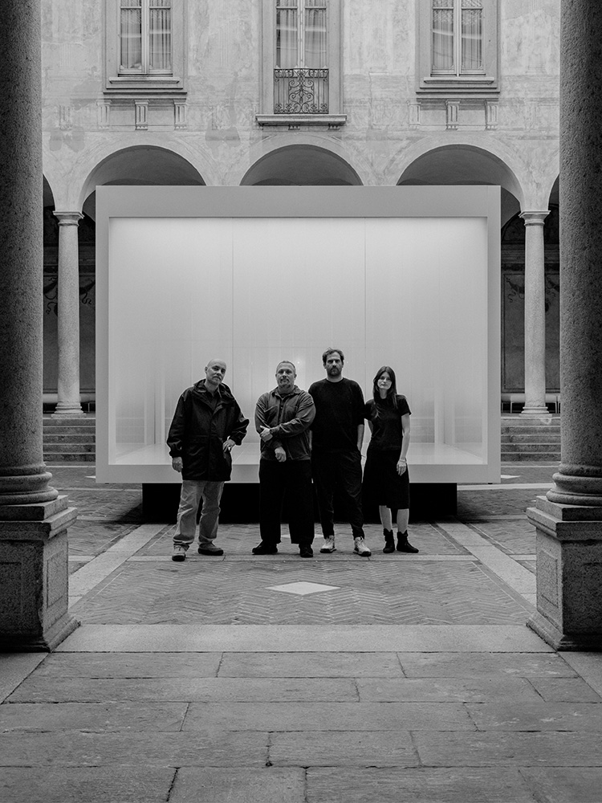

*图：2026 年米兰设计周期间，Rimadesio 在米兰 Palazzo Isimbardi 呈现的七十周年项目 Becoming。图源：Rimadesio 官网新闻《Becoming — Palazzo Isimbardi》。*

## 02 品牌概述

Rimadesio 是意大利高端室内分隔系统与定制家具制造商，1956 年成立于布里安扎的 Giussano，产品覆盖门与滑动系统、隔断与门墙一体系统（boiserie）、日间与夜间家具系统、办公系统以及家具配件。它的核心是把"分隔空间"这件事当成一套可组合、可定制、饰面统一的系统来做：门、墙板、书柜、衣柜与配件共享同一套铝型材、同一套色彩体系与同一种几何逻辑，从而让一个空间的所有界面由同一家工厂、同一套语言完成。

| 项目 | 内容 |
|---|---|
| 品牌名 | Rimadesio · [https://www.rimadesio.it](https://www.rimadesio.it) |
| 国家/地区 | 意大利（伦巴第大区 布里安扎 Giussano，蒙扎-布里安扎省） |
| 成立时间 | 1956 年 |
| 创始人 | 公开资料有限：官方未系统披露创立者姓名，品牌名与两位创立者姓氏及所在城镇的关联说法普遍流传但本次研究未取得可核实来源；企业现由 Malberti 家族管理 |
| 现任负责人 | Davide Malberti（所有者兼首席执行官，意大利语 titolare e amministratore delegato）；Luigi Malberti（首席财务官） |
| 代表性设计人物 | Giuseppe Bavuso（建筑师、设计师，1980 年代末加入，此后长期是品牌唯一的产品设计师）；Paolo Mojoli（1995 年起负责品牌形象与传播） |
| 其他关键人物 | Juma（策划 2026 年七十周年项目 Becoming）；Encor Studio（创作装置 Aedes Memoriae）；R Studio（设计迈阿密旗舰店） |
| 官方理念 | "为空间分隔与室内建筑化定义提供系统"（sistemi per la suddivisione degli ambienti e la definizione architettonica degli interni）；设计"不喧哗，低声说话"；核心原则为品质、形式纯粹与耐久 |
| 品牌归属 | 独立家族企业（Rimadesio S.p.A.，税号 00685930968，总部 Via Furlanelli 96, Giussano） |
| 核心业务 | 平开门与滑动门系统、玻璃与铝制滑动面板、Modulor 门墙一体饰面系统、日间系统（书架、组合柜、边柜、展示柜）、夜间系统（衣柜、衣帽间、抽屉柜、书桌）、办公系统、家具配件（桌椅、地毯、镜子、置物架） |
| 经典产品 | Siparium（1992）、Zenit（1998）、Velaria、Moon、Daimon（2017）、Modulor、Self、Cover、Maxi、Air System 与 Air Syncro（2025）、Hedon（2025）、Lambda 桌 |

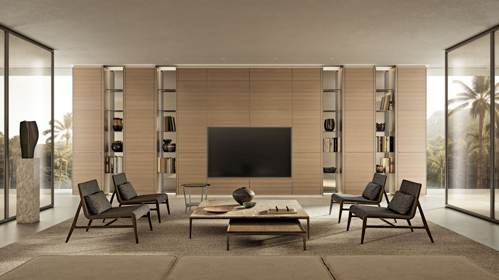

*图：Modulor 饰面系统在室内空间中的应用，门体与墙板共用同一套饰面与线条。图源：Rimadesio 官网产品页（Modulor Boiserie）。*

## 03 Brand 品牌：从布里安扎的一间作坊到系统供应商

### 1956 年：在木材主导的年代选择玻璃与铝

Rimadesio 成立于 1956 年，厂址在米兰以北的 Giussano，属于意大利家具产业的布里安扎产区。按公司自己的叙述，它"始终扎根于界定布里安扎家具产业区的工业脉络之中"。在当时的意大利家具行业，木材是绝对主流；这家公司却把玻璃与铝作为主要材料，并在后续几十年里围绕这两种材料建立起工艺与供应链——这也是它后来能在较薄的边框、透明度与结构刚度上做文章的物质前提。

### 1986 年的一次晚餐与一位设计师的长期加盟

公司的产品语言在 1980 年代末定型。据设计师本人回忆，他 1986 年在科隆的一次晚餐上认识了 Davide Malberti，两人当时是桌上最年轻的两位，随后开始合作设计一批以玻璃为主的小型配件；大约两年后，他提出了一套滑动面板集的设计方案——按他的说法，那在当时是一个相当大胆的系统，后来成为品牌的转折点。

这位设计师就是 Giuseppe Bavuso。他此后成为 Rimadesio 事实上的唯一产品设计师，并持续三十余年。他自己解释这种安排在行业里不寻常：原因在于挑战的复杂度——他们从引入门与滑动面板这类新品类开始，在几乎全行业使用木材的年代主推玻璃与铝，并在此基础上建立了一套可识别、极简但富有表现力的产品语言。1995 年，他把 Paolo Mojoli 引荐给公司，后者此后长期负责品牌形象与传播，这被 Bavuso 视为品牌成功的支点之一。

### 1992 年：Siparium 与第一代滑动系统

1992 年问世的 Siparium 是第一套玻璃与铝结合的滑动面板系统，至今仍在产品目录中。它的意义有两层：在材料层面，它把玻璃从"窗的附属"变成可移动的空间构件；在产品层面，它让公司意识到可以围绕滑动机构、型材与饰面建立一套可扩展的平台，而不必依赖单件家具的更新换代。此后出现的 Velaria、Daimon、Maxi、Air 与 Air Syncro，都可以看作这条技术路线的延伸。

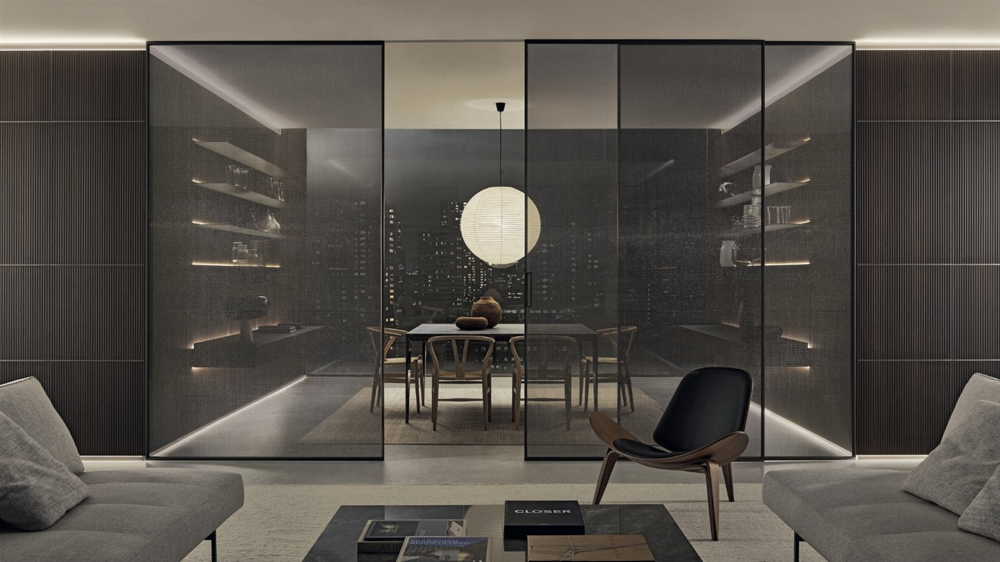

*图：Velaria 滑动门系统，铝制结构边框做到较薄，以突出玻璃本身的观感。图源：Rimadesio 官网产品页（Velaria）。*

### 1998 年：从书架到衣帽间

1998 年的 Zenit 系统最初被定义为书架或衣帽间系统，特点是立柱与地面、天花固定后，附件可以自由布置与调整。它在 2018 年做了外形与功能上的更新，官方在介绍中强调其"自由组织附件"的能力。Zenit 确立了品牌的另一条思路：同一套结构逻辑可以服务于展示（书架）与储藏（衣帽间）两种功能，从而进入卧室与更私密的居住场景。

### 1995–2012 年：形象、渠道与米兰旗舰店

设计之外，公司在这个阶段建立了两种能力。第一是品牌形象与传播的统一：1995 年起的形象负责人、随后的画册与展览体系，让产品摄影与空间呈现形成了稳定风格。第二是渠道：2003 年开出第一家米兰单一品牌展厅，Bavuso 把它视为"公司已经拥有足以独立面对市场的识别度"的证明；2012 年，公司在米兰 Via Visconti di Modrone 开出直营旗舰店，800 平方米、两层空间，从拿到场地到在米兰设计周开幕只用了三个月。同年，行业财经媒体记录了公司在 2011 年的经营表现——净利润增长 180%，标题写的是"Rimadesio 用利润对抗危机"。

### 2008 年危机中的选择：不降价，向上走

2008 年金融危机之后，部分经销商建议公司开发更容易负担的产品线。公司管理层与实际决策者的判断正相反：他们决定继续此前在品质与设计上的路线，而不是向下延伸价格带。Bavuso 在 2019 年的访谈里回顾这件事时说得很直白——"我们从未有过怀疑，也从未做出妥协，到目前为止事实站在我们这边"。此后十年的数据支持了这一选择：2015 年营业额 3340 万欧元创下当时纪录，2018 年超过 6100 万欧元，2021 年 6690 万欧元，2023 年 8470 万欧元，2024 年约 8600 万欧元。

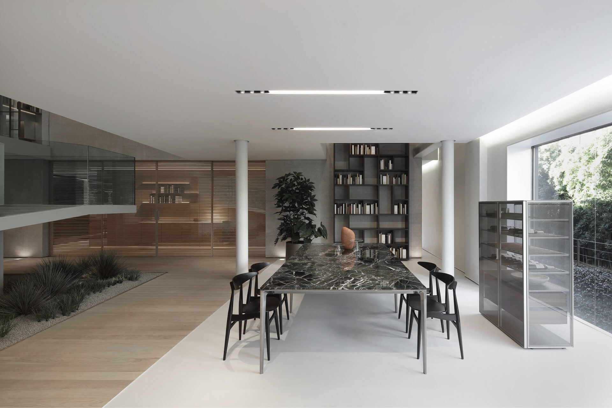

*图：Rimadesio 位于 Giussano 的总部地面层空间，包含生产与展示功能。图源：Rimadesio 官网总部页面。*

### 2026 年：七十年与 Becoming

2026 年是品牌成立七十周年。公司以 "BECOMING" 为主题，在米兰设计周期间把庆典扩展成一套开放的城市叙事：Palazzo Isimbardi 庭院中的装置 Aedes Memoriae（由 Encor Studio 创作）与沉浸式影像空间 R-Paradigm（由 Juma 策展），米兰旗舰店则承担"系列"这一层——用新品与饰面更新呈现当下。公司在介绍中强调，Davide 与 Luigi Malberti 在活动中谈的是"家族与长期关系的价值"，并把七十年定义为"一个仍在进行中的过程"。

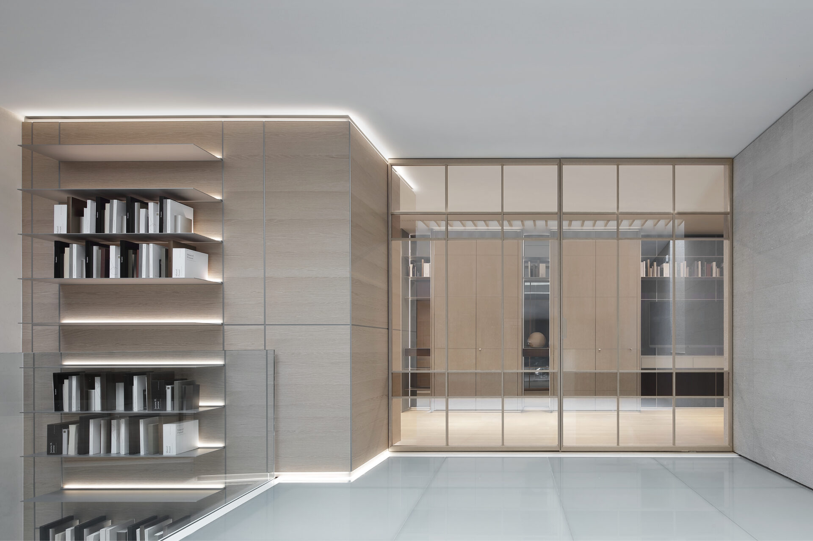

*图：总部上层空间，用于展示与接待，是品牌长期执行的空间语言。图源：Rimadesio 官网总部页面。*

## 04 Category 品类与市场：隔断系统的牌桌与口径

### 品类的定义与边界

Rimadesio 所在的品类常被简称为"门与隔断"，但它的产品结构更接近"室内界面系统"：平开门（含与墙齐平的门）、滑动门与面板、可移动隔断、门墙一体的饰面系统（boiserie）、以及与这些系统共用型材与饰面的柜体与配件。品类的边界因此横跨三个传统分类——家具、门窗、室内装修材料，这也是它与其他家具品牌的差别：一半产品要在工地现场与土建配合安装，另一半可以按家具的方式交付。

对这一定位的直接证据来自公司的自我描述：Rimadesio 说自己在做的是"空间分隔与室内建筑化定义的系统"，并把这套系统同时投向住宅、办公、零售与酒店项目。

### 市场规模的判断口径

这个细分市场缺少权威的独立统计口径。意大利家具产业协会（FederlegnoArredo）与门窗行业协会（UNICMI）的公开数据分别覆盖"家具"与"门窗及外围护"，两者的统计边界都不包含"室内隔断系统"这一交叉品类。因此本节以公司自身披露的经营数据作为主要口径，并明确其为品牌自报数据。

按公司公开数据：2024 年营业额约 8600 万欧元，其中意大利 32%、海外 68%；2024 年营收同比增长 3%、订单增长 10%；单一品牌展厅贡献约 50% 的营业额；全球有 90 多家以 Rimadesio 为品牌的展厅。2026 年上半年，公司录得 4930 万欧元的销售规模，同比增长约 6%。把这几组数字放在一起，可以判断出两件事：这是一家以出口为主的超高端系统供应商，且它的增长主要来自渠道（单一品牌店）而非价格带扩张。

### 价格带的判断

公司不公开价目表，产品按项目报价：门与面板按尺寸、饰面与轨道系统计价；Modulor 等系统按延米与模块计价；家具配件按型号计价。可从公开信息推断的定位是：其价格带处于意大利家具市场的最高区间之一，与 Poliform、Molteni&C、Lualdi 等品牌的高端线同区，明显高于规模化木门与隔断产品。这个判断的依据是产品结构（定制尺寸、玻璃与铝、专利机构）与渠道结构（单一品牌展厅为主），而非公开报价。

### 品类惯例与技术趋势

过去二十年，室内分隔系统这个品类出现了五条清晰的技术趋势。第一是无框化：从可见门套、宽边框走向极窄边框与齐平安装。第二是玻璃化：从木门为主转向玻璃门与玻璃隔断，配套的玻璃加工能力成为门槛。第三是滑动与移门比例上升：在有限面积中获得可变空间，滑动机构的顺滑度与静音成为竞争点。第四是系统化：门、隔断、墙板、柜体共用型材与饰面，减少现场拼接差异。第五是可持续材料与工艺：水性漆、可回收铝与玻璃、再生材料饰面成为高端品牌的必备项。

Rimadesio 在这五条趋势上都有对应的产品与技术：Velaria 与 Daimon 对应极窄边框与玻璃；Air 与 Air Syncro 对应双向开合与同步滑动；Modulor 对应门墙与柜体的系统化；Terrae 与 Ecolorsystem 对应可持续饰面与工艺。

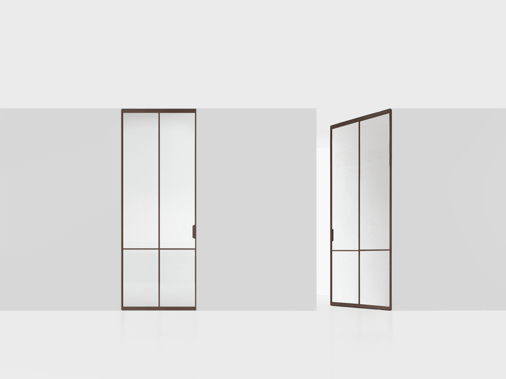

*图：官方首页滑动门栏目主图，展示门体与墙面、地面之间的关系。图源：Rimadesio 官网首页。*

### 渠道结构

Rimadesio 的渠道由三层构成：以 90 多家单一品牌展厅为主干（含米兰、迈阿密等直营旗舰店），辅以各国精选经销商，再通过建筑与室内设计专业渠道（Design Week 展会、R-Academy 培训、与设计院校及建筑师的合作）接触决策者。公司把展厅网络视为品牌价值的放大器：据其 2024 年披露，单一品牌店贡献了一半营业额，而这一比例在十年前"不可想象"。

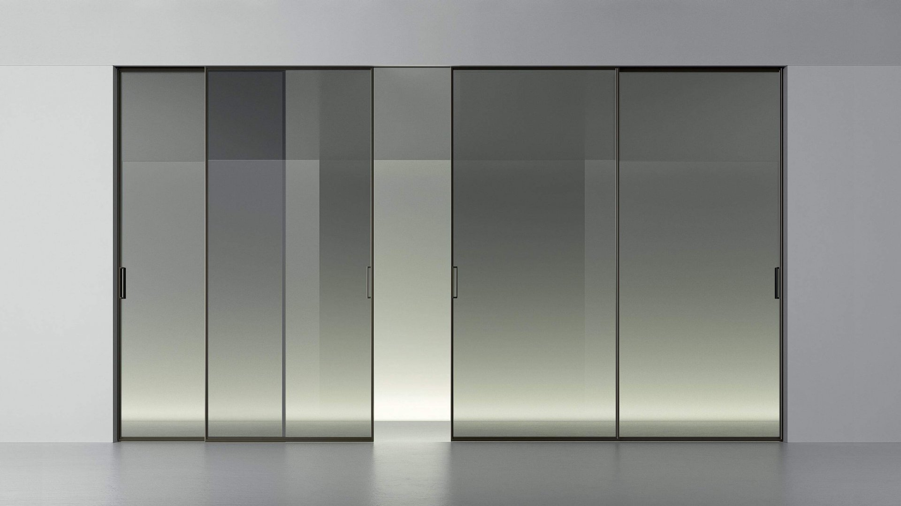

*图：Velaria 系统在展厅环境中的呈现方式，产品与建筑界面被处理成同一套语言。图源：Rimadesio 官网产品页（Velaria）。*

## 05 User 用户与场景：谁在决定一面墙

### 决策链：设计师、业主、经销商与安装方

室内分隔系统的采购是一个多方决策过程。建筑师与室内设计师决定空间划分、门洞尺寸与饰面基调；业主（或开发商）决定预算与档次；本地经销商完成测量、报价与安装；系统整合的成败最终落在安装方手里。Rimadesio 的产品设计对这种结构有明确回应：全部产品都按定制尺寸生产（意大利语 su misura），官网提供二维与三维文件下载，公司在米兰等旗舰店内设置 R-Academy 培训空间，专门用于让设计师、经销商与技术人员掌握系统的技术要点。

### 用户分层与核心任务

按任务而非人群画像划分，Rimadesio 面对四类客户。第一类是高端私人住宅的业主与设计师，要解决的问题是"空间既要有分区，又不能被实体墙割裂"；第二类是开发商与工程方，需要的是可批量交付、能满足国际规范、且与样板间风格一致的整宅系统；第三类是酒店与商业空间，关注耐久、声学与维护；第四类是游艇与特殊空间项目，对重量、尺寸与安装条件的要求更极端。

> 术语注释：JTBD——用户任务，指用户"雇佣"一件产品去完成的具体事情。

从 JTBD 的角度看，Rimadesio 的产品承担三件事：把空间分开（分区与遮蔽）、让空间看上去更大（玻璃与通高）、让整宅界面统一（同一套型材与饰面贯穿门、墙、柜）。

### 场景与项目案例

公开项目中可以看到这套系统在真实场景里的用法。迪拜棕榈岛的 Muraba Residences 由 RCR Arquitectes 设计（该事务所 2017 年获普利兹克奖），共 51 套公寓，Rimadesio 提供了 320 组系统组合；迪拜 Bvlgari Resort 由 Antonio Citterio Patricia Viel 设计，公司为其提供整套系统；迈阿密 Sunny Isles 的 Turnberry Ocean Club Residences（2026 年官方项目文章）使用了 Modulor 饰面系统、Dress Bold 衣帽间、Self Bold 柜体与 Moon 门；迈阿密 Ritz-Carlton 公寓项目则以光线、比例与材料为核心。这些案例说明，公司的实际订单结构里，工程与高端住宅并重，且往往以"整宅系统"而非单件产品成交。

> 术语注释：contract——面向酒店、写字楼、住宅开发等工程项目的定制供货渠道。

### 购买与使用入口

> 术语注释：CEP——购买与使用入口，指触发用户进入某个品类的具体情境。

按 CEP 梳理，触发 Rimadesio 生意的入口主要有五类：米兰设计周与各地设计周期间的新品发布、单一品牌展厅的到店体验、设计师在方案阶段的指定、开发商样板房与工程招标、以及既有客户的空间改造与增补。公司近年把大量资源投在第三与第四类入口上——与建筑师的持续关系维护、对设计院校与展会的支持、以及对工程项目的直接介入。

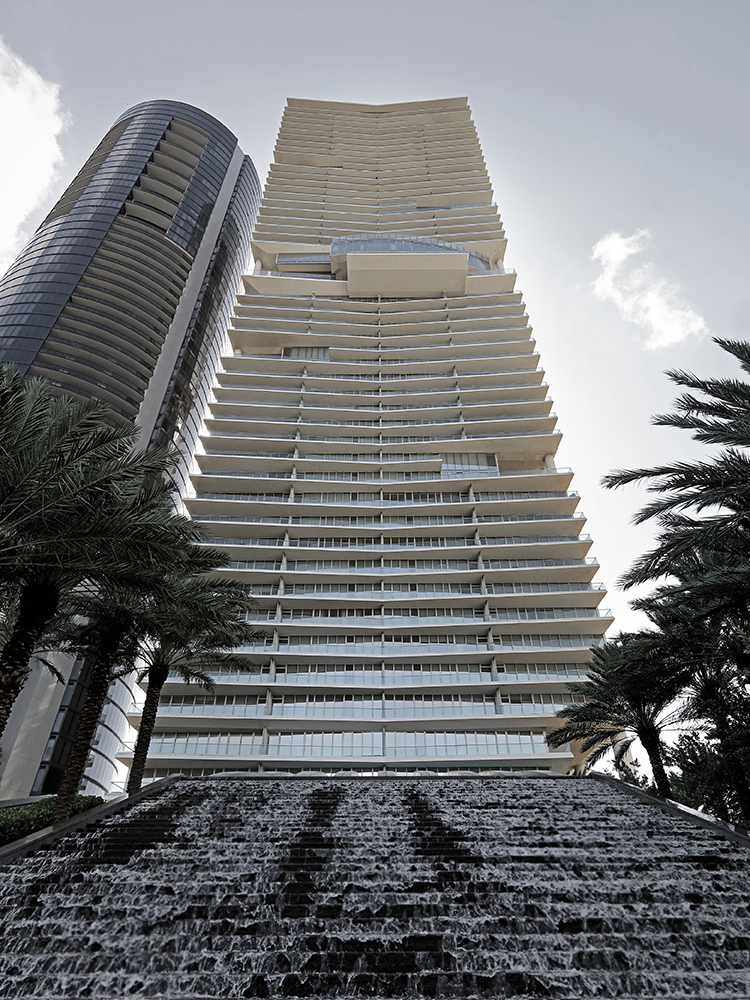

*图：迈阿密 Sunny Isles 的 Turnberry Ocean Club Residences 项目，使用了 Modulor、Dress Bold、Self Bold 与 Moon 等系统。图源：Rimadesio 官网新闻《Turnberry Ocean Club Residences》。*

## 06 Positioning 定位：把家具做成建筑系统

### 参照系与目标人群

Rimadesio 的参照系不是"家具货架"，而是室内建筑。它的产品被同时放进两个比较体系：与家具品牌相比，它提供的是界面与系统而非单件家具；与门窗品牌相比，它提供的是家具级的饰面与设计自由度。这种双重身份决定了它的目标人群——愿意为"整套空间语言的一致性"付费的业主与设计师，而不是按单件比价的消费者。

### 差异点与基准点

> 术语注释：POD——差异点，指品牌相对竞品被感知到的独特优势。

它的差异点可以归纳为四条，且都能落到证据上。第一是设计语言的连续性：从 1980 年代末至今，公司产品基本由 Giuseppe Bavuso 一人设计，1995 年起 Paolo Mojoli 负责形象与传播，这种长期稳定的组合让几十个产品系列共享同一种几何与材料逻辑。第二是玻璃与铝的工艺纵深：公司自建玻璃加工工厂，2023—2024 年投产的 4.0 玻璃厂区面积 6350 平方米，包含自动上下料、机器人切割、水刀加工与钢化，并配套污水微滤循环系统。第三是系统化程度：Modulor 把门、滑动面板、墙板、书桌与柜体整合进同一套饰面体系，门可以隐形于墙面，柜体可以与墙面共用饰面。第四是可定制的精度：Hedon 衣帽间的墙板高度可按毫米定制，上限 3894 毫米，宽度提供 800、960、1280 毫米三种模块。

> 术语注释：POP——基准点，指该品类中必须达到的行业共识项。

基准点同样清楚：意大利制造、全定制尺寸、丰富的饰面选择、可核查的设计奖项、覆盖全球主要城市的展厅网络。缺任何一项，品牌都无法进入高端设计师的候选清单。

### 定位陈述与证据链

把上述内容压缩成一句话：Rimadesio 定位为"用统一型材与饰面语言解决室内分隔与收纳的超高端系统供应商"，它的客户买到的是一整套空间语言，而不是若干件家具。

承诺与证据的对应关系可以直接列出：设计与工艺承诺对应 ADI 设计索引收录（Maxi、Modulor、Francis）、德国设计奖（Maxi 2023、Air System 2025、Lambda 2026）、AZ Awards 2020（Modulor）与 Interior Design Best of Year 2017（Daimon）；可持续承诺对应自有光伏与储能系统、水性漆工艺、铝与玻璃回收体系以及 2025 年推出的再生矿物饰面 Terrae；交付承诺对应 90 多家单一品牌展厅与 R-Academy 培训体系；制造承诺对应 30,000 平方米总部与 100% 内制生产。

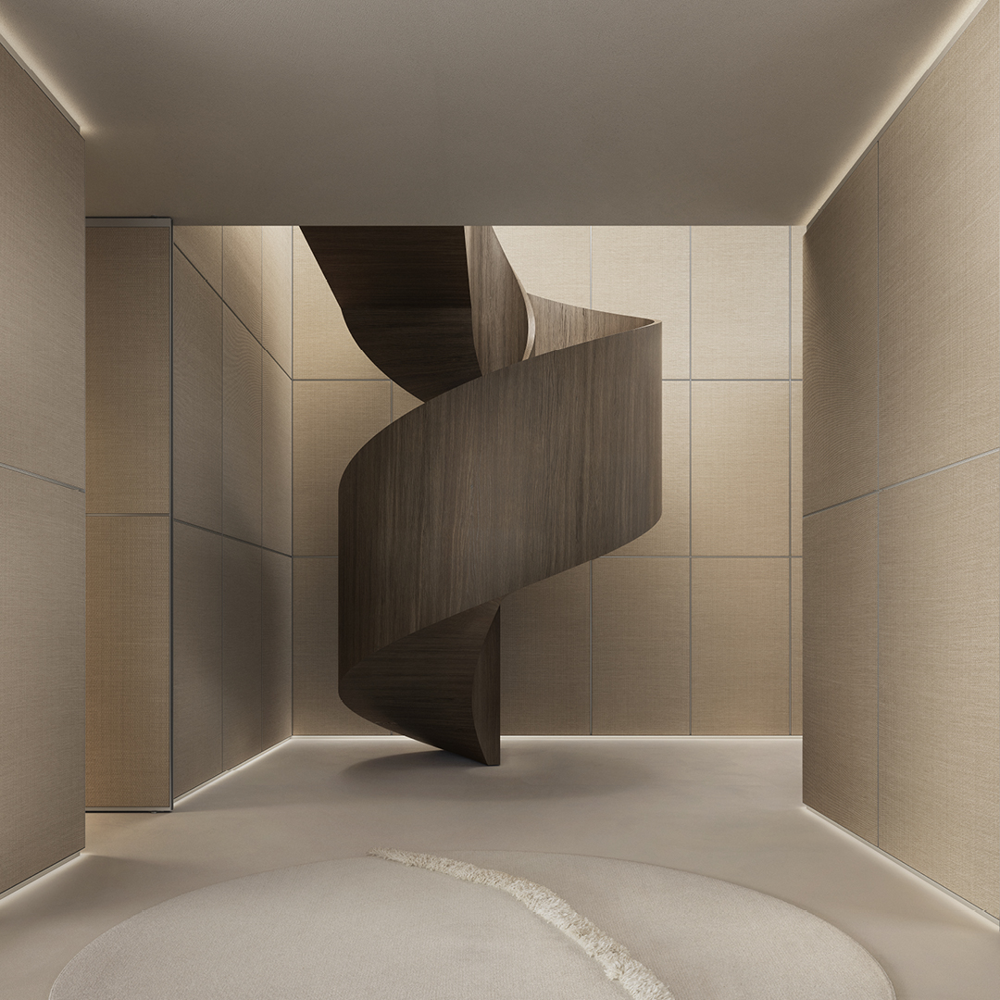

*图：Modulor 系统中门体与墙板的分缝关系。图源：Rimadesio 官网产品页（Modulor Boiserie）。*

## 07 Product 产品：四条产品线与被藏起来的五金

### 产品组合与命名：四层结构

Rimadesio 的产品目录按四层组织。第一层是门（Porte）：与墙齐平的平开门、双向开合门、常规平开门与隐形滑动门。第二层是面板与隔断（Pannelli）：滑动面板、隐形滑动面板、Syncro 同步系统、隔断系统、折叠门（Libro）、以及配 Rimadesio 轨道的隐形滑动门。第三层是系统（Sistemi）：日间系统（书架、组合柜、边柜、展示柜、吧柜、电视柜）、夜间系统（衣柜、衣帽间、抽屉柜、书桌、床头柜）与办公系统（工作台、会议桌、隔断、柜体）。第四层是配件（Complementi）：桌、几、椅、凳、扶手椅、展示柜、抽屉柜、镜、置物架、地毯与坐墩。

型号命名以专有名词为主（Velaria、Moon、Daimon、Modulor、Hedon），只在少数结构件上使用数字编号（如玻璃色号 63 灰、结构色 304 铂金、型材 83 铅灰）。这种命名让产品在经销与设计师沟通中更容易被记住，但也要求品牌提供完整的选型手册——公司因此在官网提供二维、三维文件与图册下载。

### Siparium（1992）：把玻璃变成会移动的墙

Siparium 是品牌第一套玻璃与铝结合的滑动面板系统，1992 年推出，至今仍在产品目录中。它的做法是把结构压缩到面板边缘：铝型材只承担结构、滑动与连接的职责，视觉主体留给玻璃。设计师本人把它称为"绝对创新的项目"，并认为此后出现的门、书架、衣帽间、柜体与配件系列，都在延续它确立的思路。

从工程角度看，Siparium 的关键在于轨道与面板的连接方式：面板需要在地面与天花板之间保持垂直、平行与可调节，同时保证长期滑动不产生偏移。这套逻辑后来被公司反复复用与改良，形成今天按墙面、天花板与嵌入式安装分类的轨道体系。

官方产品页：[https://www.rimadesio.it/it/prodotto/siparium/](https://www.rimadesio.it/it/prodotto/siparium/)

### Zenit（1998）：同一套结构里的书架与衣帽间

Zenit 在 1998 年被设计为书架或衣帽间系统：立柱从地面到天花板固定，附件（层板、抽屉、挂衣杆、篮筐）可以按需要布置与调整。官方在 2018 年的更新中强调，这一系统允许"最大自由度的附件组织"，并在当年为其补齐了新的饰面与功能。

Zenit 是理解 Rimadesio 产品哲学的入口：同一套受力与连接结构，可以通过更换附件在展示（书架）与储藏（衣帽间）之间切换；同一套饰面语言，可以覆盖客厅、卧室与工作室。产品的"平台化"在这条线上体现得最直接。

官方产品页：[https://www.rimadesio.it/it/prodotto/zenit/](https://www.rimadesio.it/it/prodotto/zenit/)

### Daimon（2017）：来自日本隔障的滑动面板

Daimon 在 2017 年米兰国际家具展上首次展出，灵感来自日本传统隔障（障子与襖的分隔逻辑）：垂直的铝制肋条与双层夹胶玻璃上的水平装饰线条交叉，形成格栅般的图案。它的评价来自第三方：2017 年 12 月，美国《Interior Design》杂志在第 12 届 Best of Year Awards 中把它评为建筑设计类产品（Architectural Product），颁奖礼在纽约由 Frank Gehry 设计的 IAC 大楼举行。

产品的价值不只在于图案：双层夹胶玻璃上的装饰层被夹在玻璃之间，不会被磨损或污染，这是"装饰在材料内部"的做法，也是品牌在玻璃工艺上的一个技术声明。

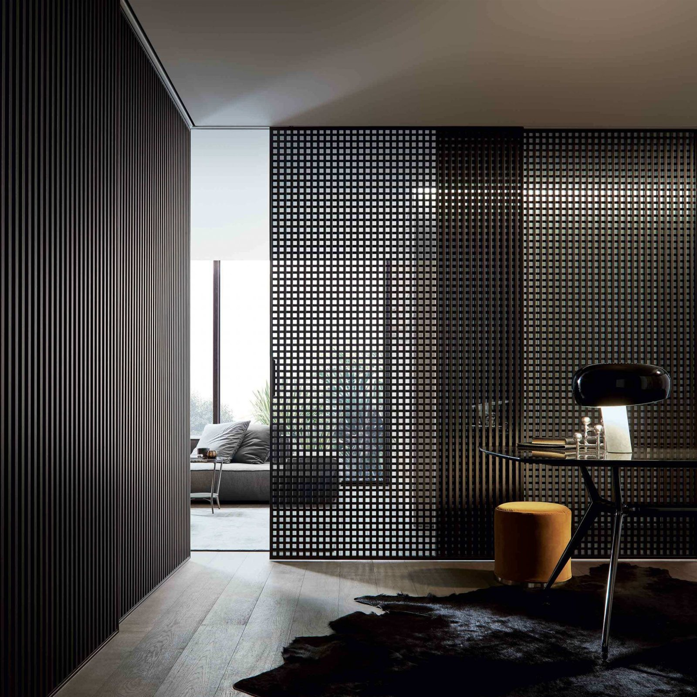

*图：Daimon 滑动面板，垂直铝肋与玻璃内的水平装饰线构成格栅。图源：Rimadesio 官网产品页（Daimon）。*

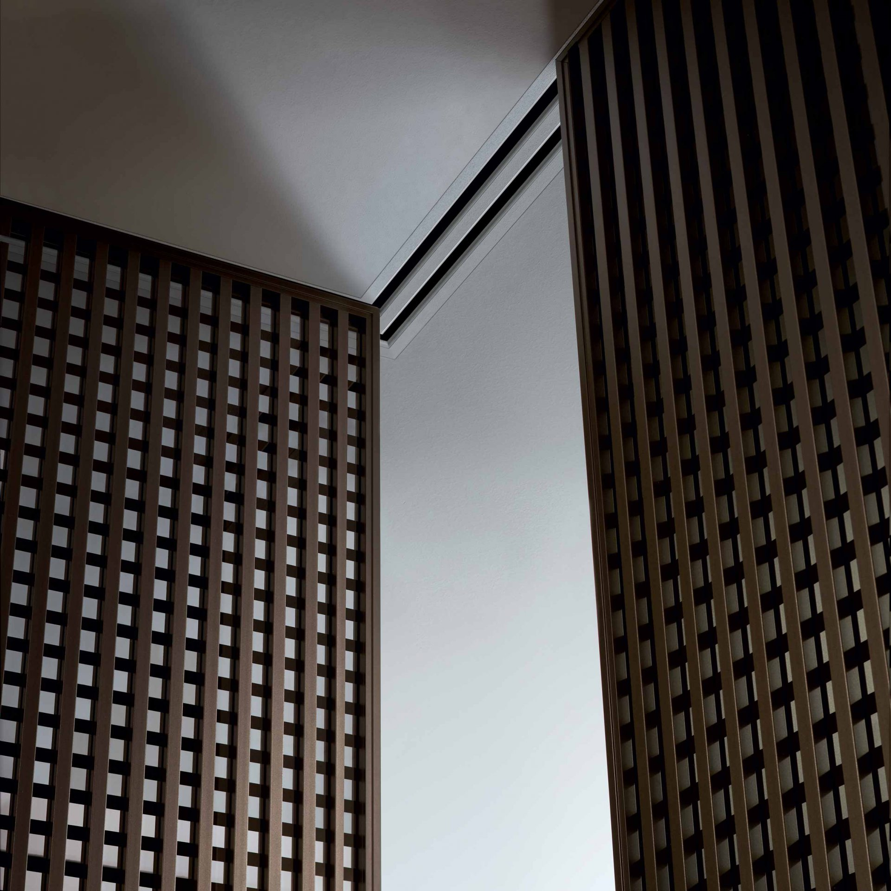

*图：Daimon 面板与同色轨道的衔接细节。图源：Rimadesio 官网产品页（Daimon）。*

官方产品页：[https://www.rimadesio.it/it/prodotto/daimon/](https://www.rimadesio.it/it/prodotto/daimon/)

### Moon（2018 系列更新）：与墙齐平的门

Moon 是品牌的齐平门方案：门扇与墙面处于同一平面，靠一圈极薄的门框轮廓实现，去掉门扇与门套之间的挡边，从而支持"推或拉"的开合方式；门把手同样是薄壁铝压铸件，内部嵌入与门扇同色的玻璃、Litech（复合材料）、仿皮或木皮嵌件，使把手在视觉上"隐形"。2018 年，公司为这一系列补充了双扇版本、岩板饰面与固定门板的专利固定系统。

这扇门的设计重点在"取消"：取消挡边、取消把手的存在感、取消门与墙之间的视觉断裂。它的代价是对门洞精度与安装的要求更高，也解释了品牌为什么要在展厅内设立培训体系。

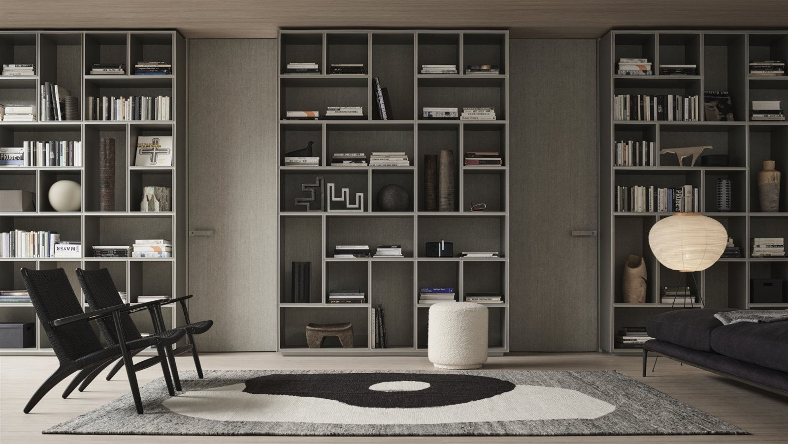

*图：Moon 门扇与墙面齐平安装的效果。图源：Rimadesio 官网产品页（Moon）。*

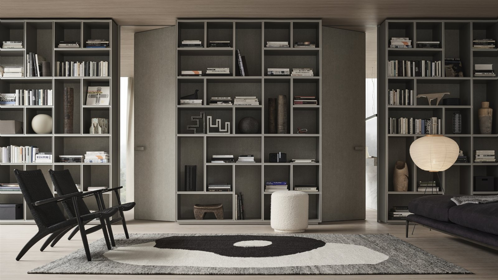

*图：Moon 门体的把手与饰面组合，把手嵌件与门扇保持同一材料语言。图源：Rimadesio 官网产品页（Moon）。*

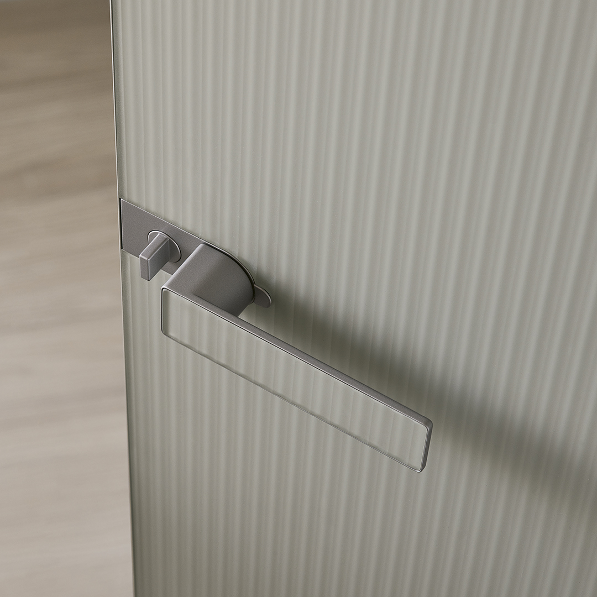

*图：Moon 系列把手、磁力锁与门板边缘细节。图源：Rimadesio 官网产品页（Moon）。*

官方产品页：[https://www.rimadesio.it/it/prodotto/moon/](https://www.rimadesio.it/it/prodotto/moon/)

### Modulor（2020 饰面更新）：门、墙与柜共用一套饰面

Modulor 是品牌的饰面与门墙系统：以可拼接的模块化面板覆盖整面墙，并在其中整合门（推拉或平开）、通行开口、悬浮配件与柜体。2020 年，公司为系统增加了 Sahara 热处理橡木饰面，此时系统已提供 97 种饰面；2024 年 11 月，Modulor 入选 ADI 设计索引；此前在 2020 年，它还获得了加拿大《AZURE》杂志 AZ Awards 的建筑产品类评委奖与公众选择奖（该届共有 47 个国家的 1241 件作品参赛）。

系统能力可以从官方描述看出：面板提供五种材料（玻璃、漆面、岩板、织物、木皮与仿皮），共 98 种饰面；可以整合全部 Rimadesio 滑动面板（Graphis 型号除外）；可以实现整面墙的连续效果；可以根据设计图纸完全定制。

官方产品页：[https://www.rimadesio.it/it/prodotto/modulor-boiserie/](https://www.rimadesio.it/it/prodotto/modulor-boiserie/)

### Velaria（2020 收藏册收录）：细边框滑动门

Velaria 是品牌滑动门的代表型号之一，核心特征是把铝制结构边框做到极薄，以最大化玻璃的表现力；面板全部按尺寸定制，可搭配墙面、天花板与嵌入式三类轨道，轨道与型材可以做成与门体同色，或预留现场喷涂以与吊顶一致。品牌在 2017 年对滑动系统做过一次整体升级：轨道增加隐形黑色饰面，新增盖板型材，机械件进一步轻量化与精准化。

这类产品体现的是同一件事：把机械部分尽量收进建筑构件里，让可动的部分看起来只有玻璃。

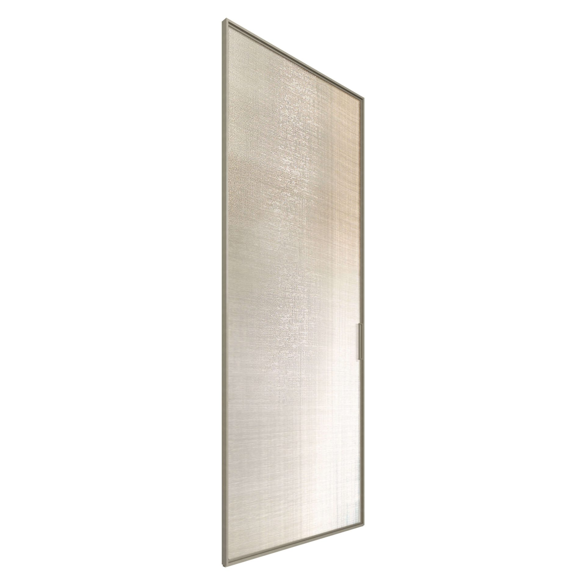

*图：Velaria 门板与铝制结构的比例关系。图源：Rimadesio 官网产品页（Velaria）。*

官方产品页：[https://www.rimadesio.it/it/prodotto/velaria/](https://www.rimadesio.it/it/prodotto/velaria/)

### Cover（2022 新版门扇）：把柜体做成轻结构

Cover 是柜体系统，2022 年 9 月推出了新版门扇：门扇上加入水平铝制横梁，既强化结构也形成节奏；同时提供无把手的按压开启，以及在横梁内嵌铝制把手的方案。系统的立式版本 Cover Freestanding 带侧板与背板，可以做线性或转角组合，背板与门内侧的完整处理使它也适合作为隔墙使用，并能在其中整合通行开口。内部配件通过卡接方式固定在立柱上，不使用外露螺钉，可以自由调整。

官方产品页：[https://www.rimadesio.it/it/prodotto/cover/](https://www.rimadesio.it/it/prodotto/cover/)

### Air System（2025）：固定面板与双向门

Air System 在 2025 年获得德国设计奖（German Design Award）"优秀产品设计：建筑与构件"类别奖项。它是固定面板系统的扩展：面板可以居中布置或嵌入壁龛，与双向开合门组合，形成直线、转角或 T 形布局，覆盖住宅、零售与办公空间。系统提供 Grid、Plus、Pure、Regular 四种视觉配置，材料与饰面可按项目选择。

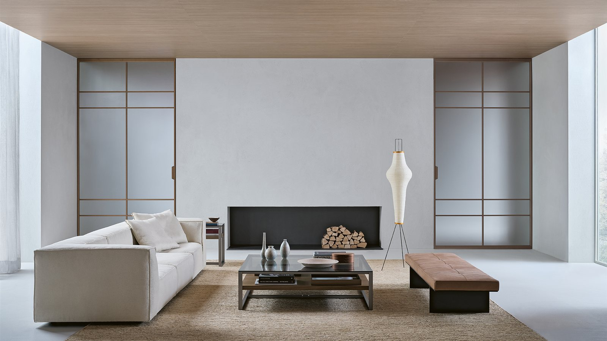

*图：Air 门与隔断系统在室内空间中的应用。图源：Rimadesio 官网产品页（Air）。*

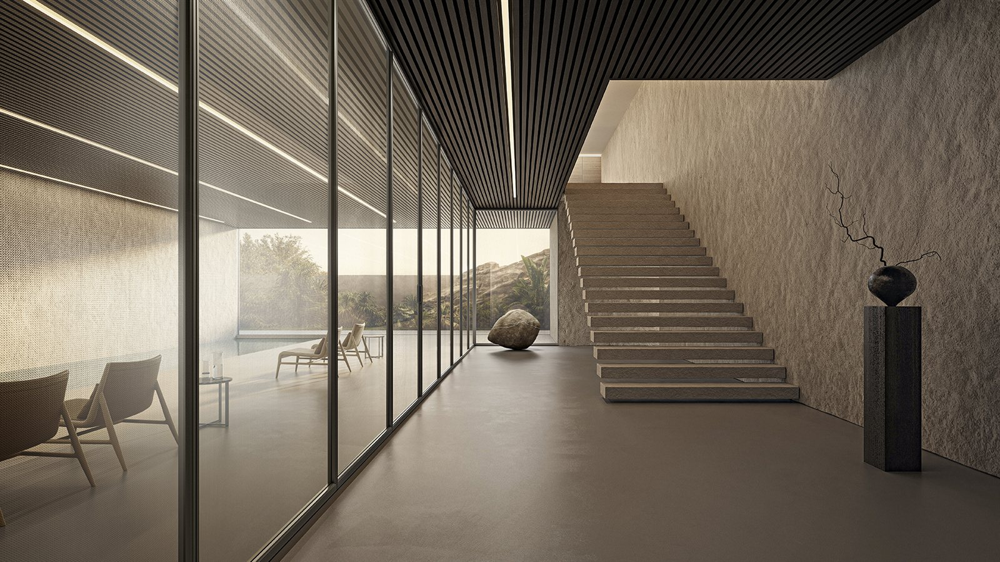

*图：Air System 的固定面板与门体组合，用于分区与框景。图源：Rimadesio 官网产品页（Air System）。*

官方产品页：[https://www.rimadesio.it/it/prodotto/air-system/](https://www.rimadesio.it/it/prodotto/air-system/)

### Air Syncro（2025）：同步移动的隔断

Air Syncro 在 2025 年 4 月发布，解决的是多扇滑动面板的同步问题：所有面板同步且同时移动，滑动过程中不设地面导向与地面轴，关闭时可以完全重叠，从而实现"开口最大化、收纳最小化"的效果。系统提供三轨或双轨外挂两种方案，尺寸按空间定制，结构可搭配 Air 系列四种视觉配置。

官方产品页：[https://www.rimadesio.it/it/prodotto/air-syncro/](https://www.rimadesio.it/it/prodotto/air-syncro/)

### Hedon（2025）：毫米级定制的衣帽间

Hedon 是 2025 年推出的模块化衣帽间系统：墙面通高饰板内部隐藏带电导轨，收纳与功能组件可以沿导轨自由布置；墙板宽度为 800、960、1280 毫米三种模块，高度按毫米定制，最高 3894 毫米；系统与 Modulor 饰面体系保持视觉一致，可以直接整合进已有的饰面方案。

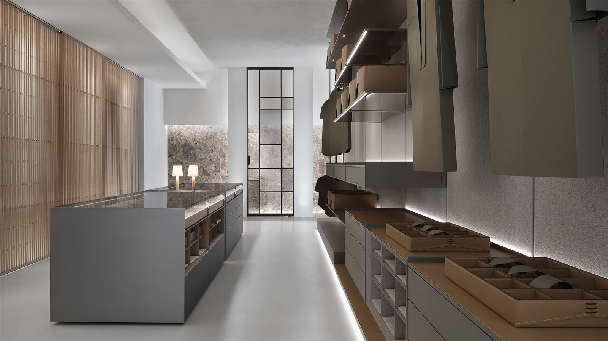

*图：Hedon 衣帽间系统的整体构成，通高墙板内隐藏带电导轨。图源：Rimadesio 官网新闻（Hedon）。*

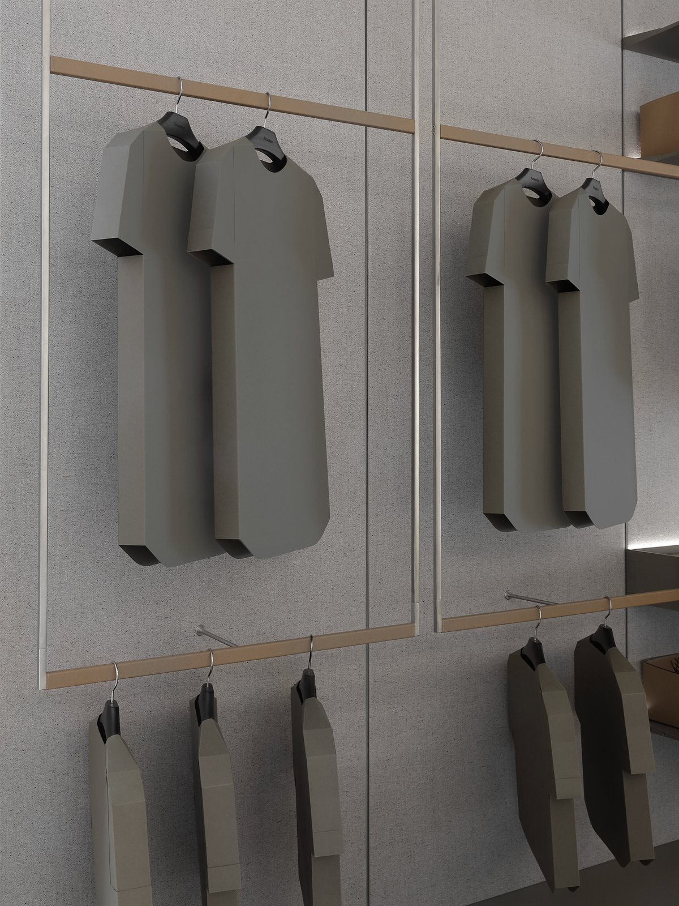

*图：Hedon 系统在米兰展厅中的展示，收纳组件沿导轨自由布置。图源：Rimadesio 官网新闻（Hedon）。*

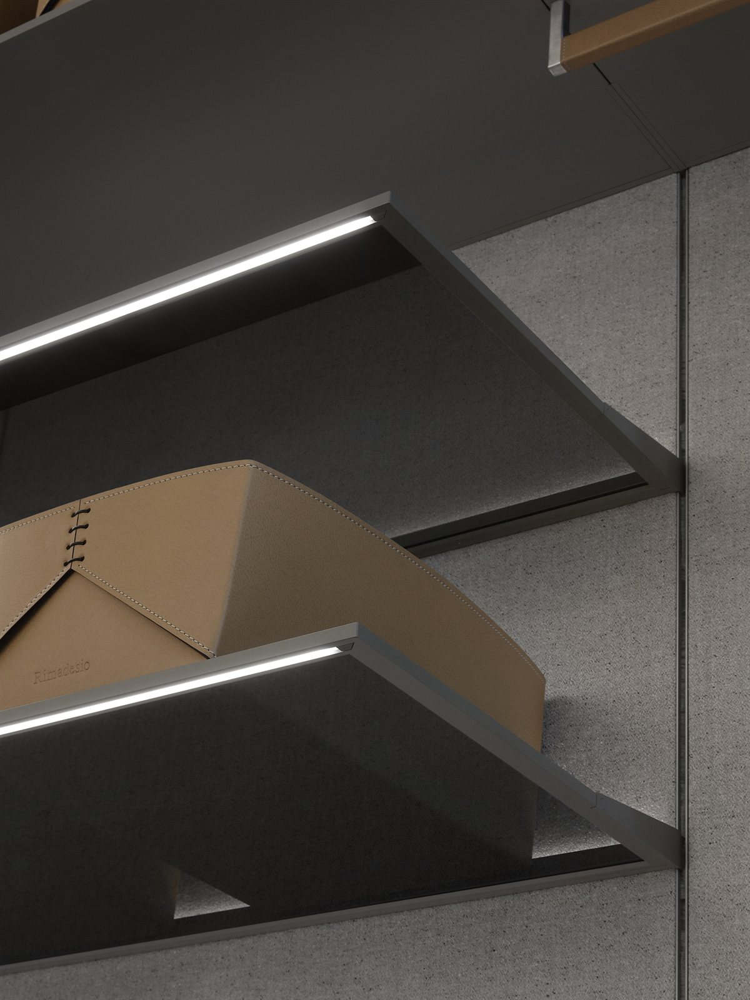

*图：Hedon 系统的层板、抽屉与内部照明细节。图源：Rimadesio 官网新闻（Hedon）。*

官方产品页：[https://www.rimadesio.it/it/prodotto/hedon/](https://www.rimadesio.it/it/prodotto/hedon/)

### 产品小结与第三方评价

把产品线放在一起看，Rimadesio 的策略是"一套语言、多种动作"：语言指铝型材、玻璃、极薄轮廓与统一色板；动作指平开、双向、滑动、折叠、同步移动与固定。产品之间的差别更多体现在开启方式与安装条件上，而不是风格。

第三方评价与此一致。AZURE 杂志的 AZ Awards、德国设计奖、ADI 设计索引、《Interior Design》的 Best of Year 等评审体系给出的奖项集中在系统的技术完成度与形式控制上；行业媒体在报道项目时，也习惯把 Rimadesio 的产品作为"整宅界面"的一部分来描述，而不是作为单件家具。

## 08 Aesthetics 美学：细边框、反射面与低声的设计

### 视觉识别与传播语言

品牌的视觉系统极为克制：字标不附加图形，产品摄影以建筑化的空间感为主，画册与线上杂志（杂志名为 Journal，2026 年推出新版）用大幅空间图与极短的文字构成。1995 年起负责形象与传播的 Paolo Mojoli 是这套语言的主要操盘者，设计师本人把这一点列为品牌成功的关键因素之一——在他看来，视觉与传播的质量和产品设计同等重要。

### 形态与比例：细到极限的边框

Rimadesio 的形态语言可以概括为"把结构压到最小可见面积"。门框、面板边框、柜体侧板与轨道盖板都倾向于做到极窄；门与墙之间不留挡边（Moon）；把手做成薄壁铝压铸件并嵌入与门同色的材料（Moon）；轨道与机械件做成与门体同色或与天花板同色（2017 年滑动系统升级）；柜体内部配件用卡接隐藏螺钉（Cover、Dress Bold）。当这些处理叠加时，空间中剩下的元素只有玻璃、饰面与线条。

### 色彩与材料情绪

品牌的色彩与材料体系围绕两条逻辑建立。第一条是玻璃与铝的物质感：玻璃提供透明、反射、磨砂、网格与彩色五类表达，铝材提供抛光、砂面、氧化与喷涂效果，两者配合可以覆盖从冷灰到暖铜的整段色阶。第二条是饰面与室内材料的同步：Modulor 把玻璃、漆面、岩板、织物、木皮与仿皮放在同一套模数下；2025 年 12 月发布的 Terrae 饰面更往前走一步——把大理石、石材、矿物、颜料与陶瓷碎片磨成粉末再重新组合，做成具有层次与色差的表面，代表色包括卡拉拉白、博蒂奇诺暖色、黄红陶土色、卡尔尼科灰、熔岩石与棕色氧化铁。

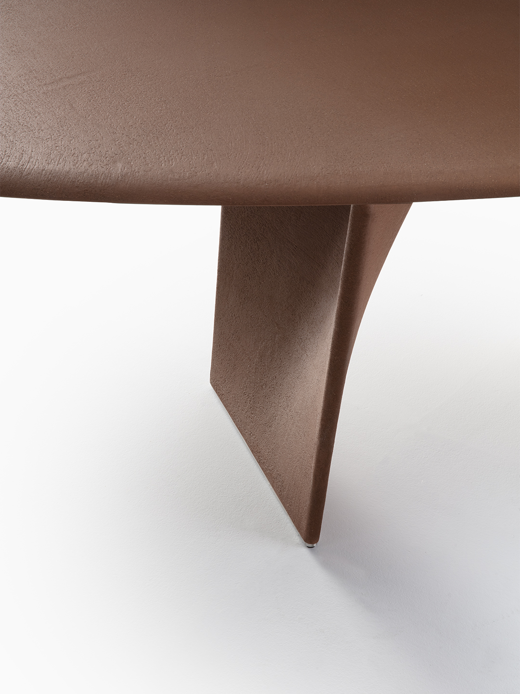

*图：Terrae 饰面样板，由回收天然材料的粉末混合叠层形成色差与肌理。图源：Rimadesio 官网新闻《Terrae，源于自然的饰面》。*

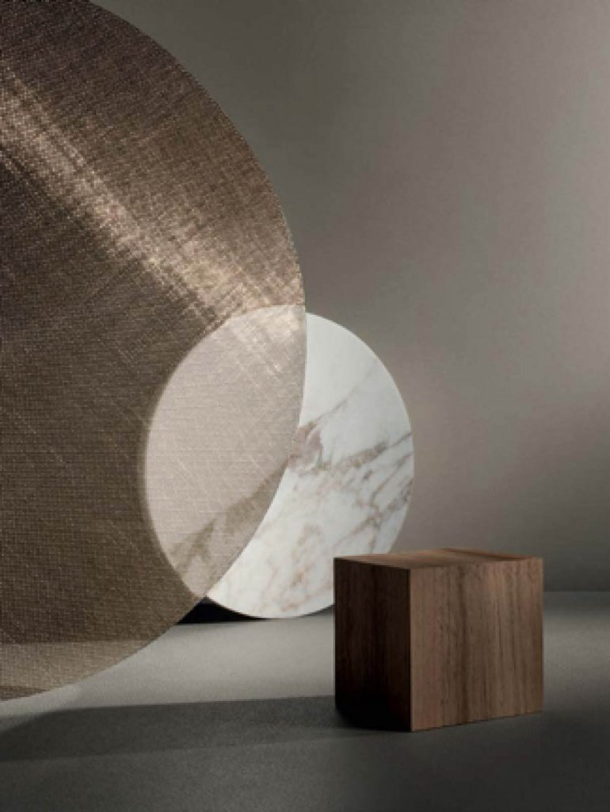

*图：官方发布的饰面与材料总览图。图源：Rimadesio 官网 Journal（Le superfici Rimadesio）。*

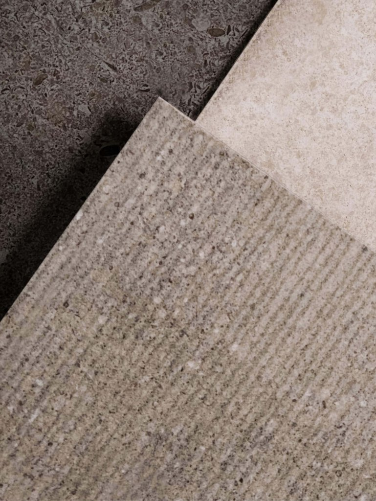

*图：Litech 灰色条纹饰面的表面效果，用于门扇与面板。图源：Rimadesio 官网 Journal（新饰面发布）。*

### 光与空间

光在品牌的产品里承担三种作用。第一是穿透：玻璃门与玻璃隔断把相邻空间的光线互相引入。第二是反射：漆面玻璃（reflex）与镜面玻璃把墙面变成光的二次表面，在小空间中制造纵深。第三是集成照明：酒店门系列 Modus 在门套内整合 LED 背光，Zenit 与 Dress Bold 在层板与背板内整合灯带，让柜体本身成为光源。

展示空间同样按建筑而非展厅来处理。米兰旗舰店使用 17 世纪的建筑外壳承载极简的产品；2025 年 10 月开业的迈阿密旗舰店（Biscayne 大道，300 平方米，由 R Studio 设计）使用吸音橡木与天然基底混凝土，把 Modulor 面板与织物、Litech、木材、藤编组合成背景；2026 年七十周年项目则把产品从展厅带进巴洛克宫殿的庭院与沉浸式影像空间。

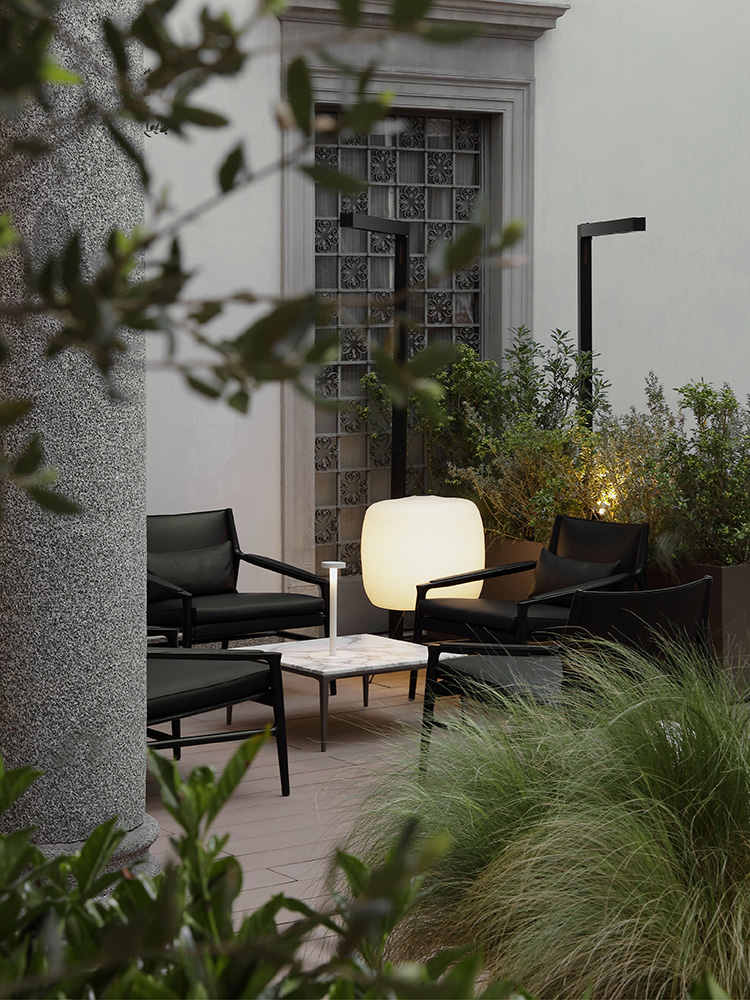

*图：品牌在展示空间中呈现的系统与家具组合。图源：Rimadesio 官网首页（2026 年）。*

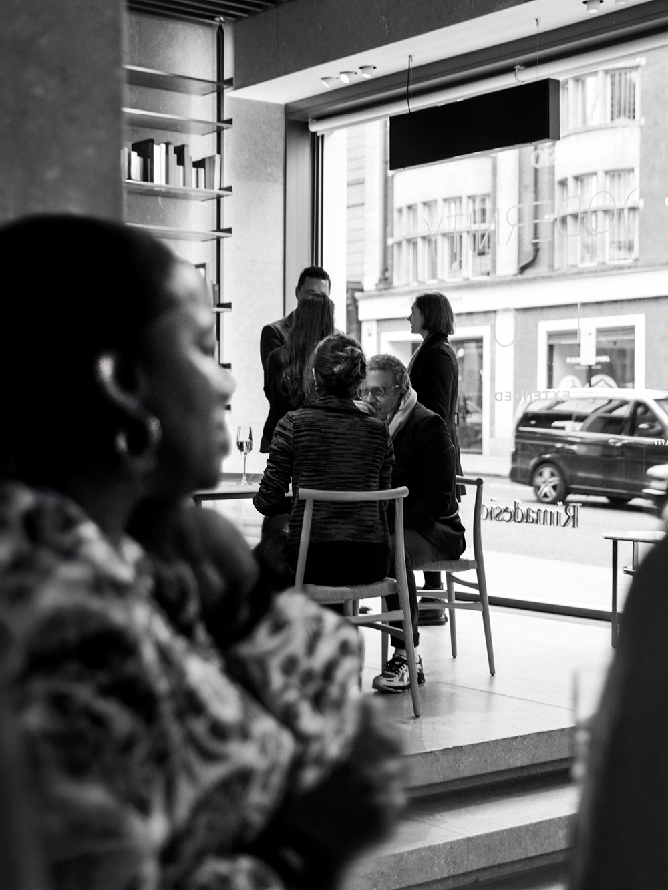

*图：Modernity Flow 活动的官方视觉，用于 2025—2026 年的国际展厅巡展。图源：Rimadesio 官网首页。*

### 叙事与情感基调

品牌的情感基调可以引设计师的原话来概括："我的设计不喧哗，而是低声说话；它内容饱满但并不想炫耀，目标是表达一种可居住而不是被展示的家。"这句话解释了产品的所有取舍：不用夸张的造型、不用强烈的色彩对比、不追求材料的稀有度，而是把注意力放在比例、接缝、表面处理与机构动作上。

> 术语注释：su misura——意大利语，意为按尺寸定制，在高端家具中指产品按项目尺寸单独生产。

### 美学评价

Rimadesio 的美学可以概括为"用工业精度制造安静的空间界面"。这种安静的代价是高的：极窄边框要求型材与玻璃的加工精度，齐平安装要求土建精度，隐藏五金要求可调结构，饰面统一要求工厂掌握多种材料工艺。反过来说，这也构成了它的辨识度来源——在一间走进去说不出哪里特别的房子里，把门、墙、柜、桌放在一起看，会发现它们出自同一个人、同一套型材与同一块色板。

## 09 Design 设计：一个设计师、一套系统与一座玻璃工厂

### 设计哲学：做系统，不做单件

Rimadesio 眼中的设计首先是解决空间问题的工具，其次才是形式的表达。公司对自身业务的定义写得很直接：它做的是"空间分隔与室内建筑化定义的系统"，产品线的组织方式也印证了这一点——门、墙板、柜体与配件被放在同一套型材、同一套模数与同一块色板下考虑。

这套哲学在 2022 年的一次获奖说明里被概括为三个关键词。当年 Maxi 系统入选 ADI 设计索引时，官方介绍写道，该届设计索引的主题是"系统、品质与自由"。这三个词恰好对应 Rimadesio 的设计优先级：先有系统（可组合、可扩展、可维护），再谈品质（材料与加工精度），最后追求自由（尺寸、饰面与配置的定制空间）。

### 站位：在功能、形式、情感与时间之间

把品牌的具体决定摊开看，它的站位由四条取舍构成。

第一，技术先于造型。产品的外观往往由结构决定：为了让玻璃成为视觉主体，边框就必须做薄；为了让门与墙齐平，挡边就必须取消。公司把大量研发投入放在机构而不是造型上——轨道系统、同步滑动、磁力锁、可逆隐形铰链、无孔固定、隐形带电导轨都属于这一类。

第二，可调整先于绝对极简。齐平门、隐藏轨道、通高柜体都需要在长期使用中保持精度，因此产品保留了调节与重组能力：Zenit 的附件可以重新布置，Dress Bold 的配件不依赖预打孔位，轨道与门体可以调整对位。

第三，定制先于标准化。所有产品按项目尺寸生产，Hedon 甚至把墙板高度做到毫米级可调。这决定了生产组织方式——必须内制、必须保留手工工序、必须让设计部门深度介入工程的实现。

第四，不向下妥协。2008 年金融危机后，面对经销商提出的降价诉求，公司选择了相反的路线。设计师在访谈中的原话是："我们从未有过怀疑，也从未做出妥协。"此后十五年的增长数据（从 2015 年的 3340 万欧元到 2024 年的约 8600 万欧元）是这一选择的直接结果。

### 信念的来源

这套设计观有三个来源。第一是布里安扎的产业环境：家具制造在这里高度分工，玻璃、铝、木作与机构各有专业供应商，品牌选择的是把关键工序收进厂内，而不是全部外包。第二是设计师本人的经历：Giuseppe Bavuso 的职业背景包含建筑、室内设计与汽车工业的工业设计，他在访谈中提到自己习惯把产品"从构思到工程化，再到传播层面"整体处理，这解释了他为什么能长期承担一个系统品牌的全线设计。第三是品牌对"耐用"的执念：官方把核心原则表述为品质、形式纯粹与耐久，并把可持续制造作为这套原则的延伸，而不是独立的营销议题。

### 一个设计师的组织方式

设计师本人在 2019 年的访谈里确认了两件事：他是品牌唯一的产品设计师，且这种关系已持续三十余年；1995 年他把 Paolo Mojoli 引荐给公司负责形象与传播，并认为这是品牌成功的关键因素之一。

这种安排的收益是显而易见的：几十个产品系列共享同一种几何语言与材料逻辑，产品之间可以互相组合，品牌不需要在设计师之间做风格调和。代价同样明确：产品方向高度依赖个人判断，一旦设计主导权发生变化，语言的一致性会面临风险；此外，单一设计师结构在市场营销层面缺少"联名话题"，品牌必须依靠产品与项目本身说话。

### CMF：色彩、材料与表面

品牌把色彩与涂装做成了一套体系，命名为 Ecolorsystem：以水性漆为基础的色彩与涂装方案，覆盖玻璃与铝两种基材，官方给出的选项是 34 种颜色，并同时提供铝本色、黑色、乳白、棕色与金属刮擦效果等基础处理。玻璃是另一个独立的色板体系，用数字编号管理（如 63 号灰色透明、62 号古铜色网格、102 号哑光黑），涵盖透明、酸蚀、反射、镜面、网格与彩色系列。

材料层面，产品的可见表面覆盖玻璃、漆面、岩板、织物（Lux 与 Material 两个系列）、木皮（核桃木与热处理橡木的 Sahara 波浪纹）、仿皮与金属；2025 年 12 月推出的 Terrae 饰面把大理石、石材、矿物、颜料与陶瓷碎片研磨后重新混合，做成带层次与色差的表面，把"再生材料"从概念变成了可触摸的质感。公司在这条线上的一个早期节点是 2006 年：它是意大利第一家只使用水性漆生产漆面玻璃的企业。

### 制造：30,000 平方米总部与内部玻璃工厂

品牌总部的占地为 30,000 平方米，生产、物流、商务、市场与传播集中在同一处，官方把这一安排的理由表述为"工作环境的质量、组织效率与持续培训是保证产品品质的前提"。产品全部在意大利生产，关键工序内制，其中最具分量的是玻璃：公司在 Giussano 建成了一座 6350 平方米的 4.0 玻璃工厂，把上料与分拣、机器人切割、水刀加工与钢化整合到一条自动化产线上，并配套污水微滤循环系统，官方称该系统的投用使自来水消耗降到生产需求的 2%。

包装同样是内制体系的一部分：两条自动化包装线分别处理面板与体积较大的家具件，包装材料 90% 使用回收纸板并可 100% 回收，符合欧盟 94/62/CE 指令要求。

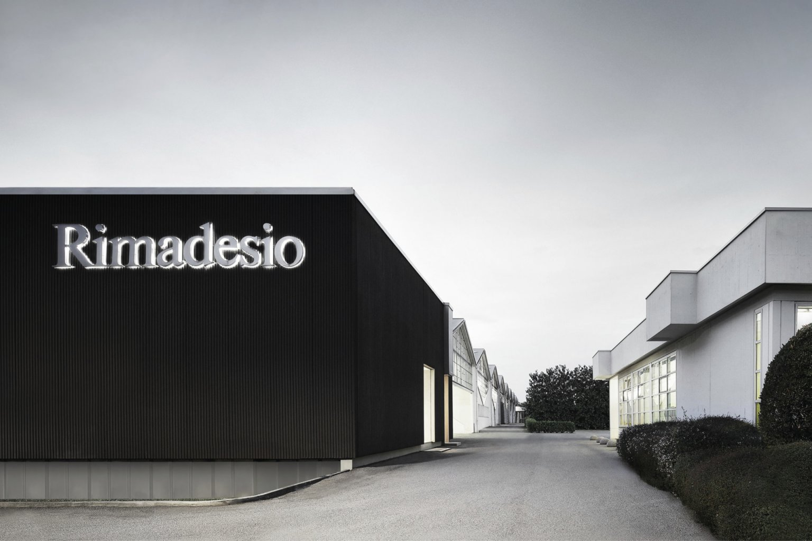

*图：总部（Headquarters）官方图片，展示生产与办公一体的空间组织。图源：Rimadesio 官网品牌介绍页。*

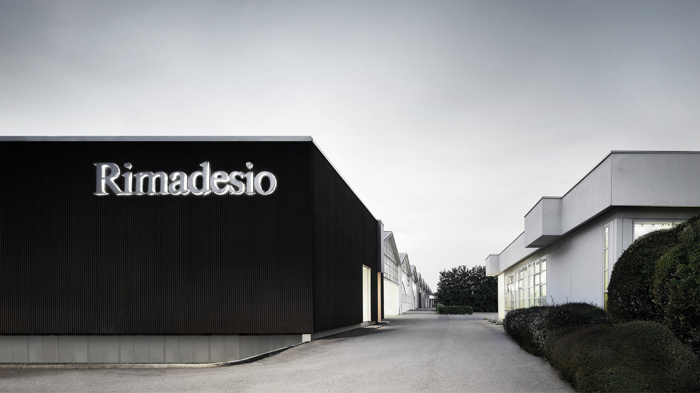

*图：Giussano 总部内的展厅空间，用于产品陈列与客户接待。图源：Rimadesio 官网总部页面。*

### 可持续：一条走了近二十年的技术路线

品牌的可持续工作有明确的时间线，这条线也解释了它为什么会被当作制造业样本。2006 年实现漆面玻璃的水性漆工艺；2008 年建成第一套大型光伏系统，装机 1664 块组件、功率 382.72 千瓦，当时公司称其为家具行业最大的光伏设施；2012 年与 2016 年两次扩容到 5242 块组件、1270 千瓦，官方称其为意大利家具行业最大的光伏电站；2015 年上线能耗监测软件；2016 年为铝材涂装建成水性漆产线；2017 年安装以热泵为基础的冷暖系统；2018 年完成全部生产区 LED 照明改造；2019 年 1 月起安装欧洲首批工业级储能系统，先用三星锂电池 100 千瓦，同年 7 月追加 LG 电池，总容量达到 237 千瓦。

最新的官方数据是：屋顶安装 10,637 块光伏组件，总功率 1.27 兆瓦，投资超过 380 万欧元；自 2008 年以来累计发电 42.9 吉瓦时，减少二氧化碳排放 2280 万公斤；每年回收铝废料 159 吨，所用铝材中 65% 为来自意大利铸造厂的再生铝；每年回收玻璃废料 552 吨，经 1600℃ 熔融后全部回用；用回收纸板替代聚苯乙烯，每年减少 9.7 吨石油基材料；纸板废料 175 吨打包后进入再生纸生产链。公司还通过了 SI Rating 的 ESG 评估，其中社区发展 88%、工作条件 81%、行为准则 93%。2021 年，BMW 意大利把 Rimadesio 收入其"可持续故事"视频专题，作为制造业样本对外传播。

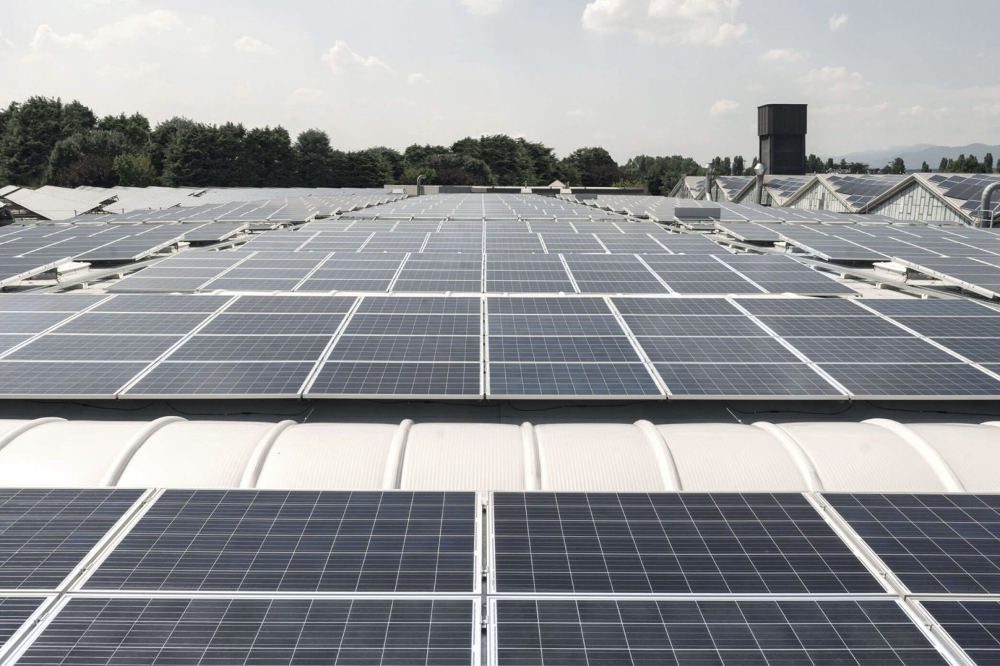

*图：总部建筑的可持续主题图，对应光伏系统与环保工艺的官方说明。图源：Rimadesio 官网可持续项目页面。*

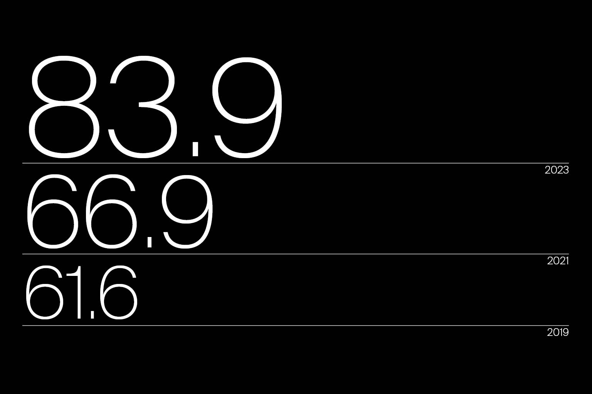

*图：官网"数据与报告"栏目的视觉封面，用于呈现投资、人力、分销与营业额数据。图源：Rimadesio 官网数据与报告页面。*

### 人机与工程：门窗里那一套看不见的机构

把工程细节集中起来看，可以看到四类反复出现的解法。

轨道与滑动：品牌自研轨道系统，覆盖墙面、天花板与嵌入式三种安装方式，强调"设计简单、集成彻底"；2017 年的升级把轨道与机械件做成黑色隐形饰面，并增加可现场喷涂的盖板型材，使轨道可以与门体或吊顶同色。Air Syncro 进一步做到多扇面板的同步移动，取消地面导向与地面轴，关闭时可完全重叠。

门机与五金：Spin 使用可逆的隐形铰链，可以在安装后改变开合方向；Moon 使用磁力锁并取消了门与门套之间的挡边；固定门板使用专利固定系统；Daimon 的装饰层被夹在双层夹胶玻璃内部，避免表面磨损。

柜体与安装：Dress Bold 采用不依赖预打孔的固定方式，让配件可以自由布置与后期调整；Hedon 把带电导轨隐藏在通高墙板内，收纳组件沿导轨自由定位；Modulor 支持把门、通行开口、悬浮书桌与柜体整合在同一套饰面里。

光与电子：Modus 系列在门套内整合 LED 背光（用于酒店项目并满足防火与声学规范）；Zenit 与 Dress Bold 在层板与背板内整合灯带；这些照明元素把"家具"与"电气工程"绑在了一起，也对前期布线与后期维护提出了新要求。

### 品牌侧依据与设计变量

| 品牌侧依据 | 对应的设计变量 | 产品证据 |
|---|---|---|
| 空间分隔应由系统而非单件完成 | 门、面板、柜体共用型材、模数与饰面 | Modulor 系统、Air 系列 |
| 玻璃与铝是品牌的材料主线 | 极薄边框、隐形机构、玻璃色板体系 | Velaria、Daimon、Moon |
| 设计不应喧哗 | 低饱和饰面、无可见五金、齐平安装 | Moon 把手、Cover 横梁、Daimon 夹层装饰 |
| 产品要能被长期使用与调整 | 可调轨道、可重组柜体、隐形带电导轨 | Zenit、Dress Bold、Hedon |
| 定制意味着生产必须内制 | 自有玻璃工厂、木作与铝加工、包装线 | Giussano 总部、4.0 玻璃工厂 |
| 环保承诺必须可量化 | 光伏与储能、水循环、材料回收、再生饰面 | 10,637 块组件、Terrae 饰面 |

## 10 Experience 体验：从 3D 图纸到十年之后

### 了解与选购

客户与设计师接触品牌的路径通常是三条：官网与画册、当地经销商或单一品牌展厅、以及米兰设计周等展会。官网的信息层级对专业用户友好——产品页提供饰面与结构说明，另设下载专区提供二维与三维文件、技术图册与安装说明，这对需要把产品写进施工图的建筑师而言是必要条件。价格不在公开渠道，产品按项目报价。

### 到店：90 多家单一品牌店与 R-Academy

按公司 2024 年披露的数据，全球有 90 多家以 Rimadesio 为品牌的展厅，另有 5 家旗舰店与一批精选经销商，单一品牌渠道贡献约一半营业额。展厅不仅是销售场所，也承担培训功能：R-Academy 设在旗舰店内部，面向客户、专业人士与记者讲解技术、材料与饰面，是品牌把"系统知识"传递给渠道与设计师的主要工具。

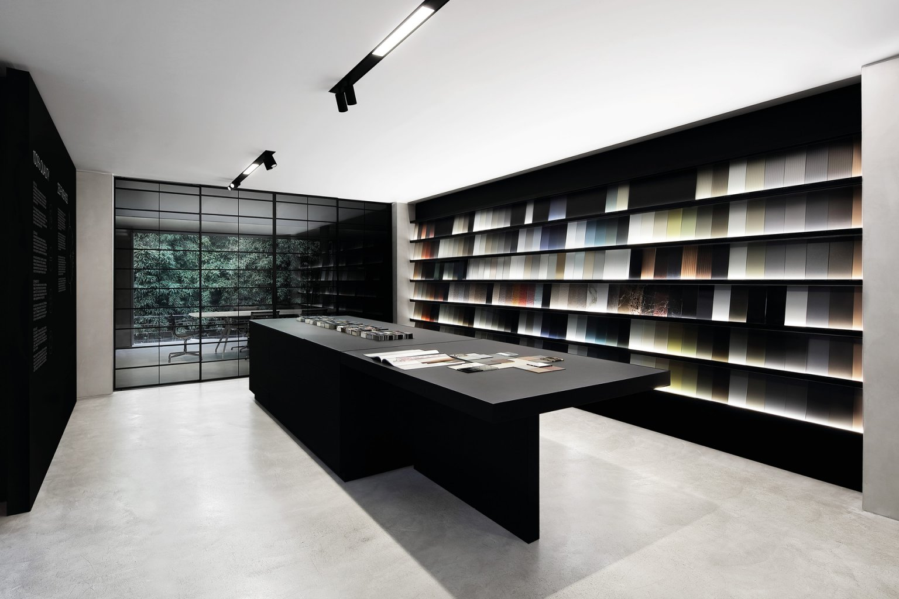

*图：R-Academy 空间，位于旗舰店内部，用于技术、材料与饰面培训。图源：Rimadesio 官网品牌介绍页。*

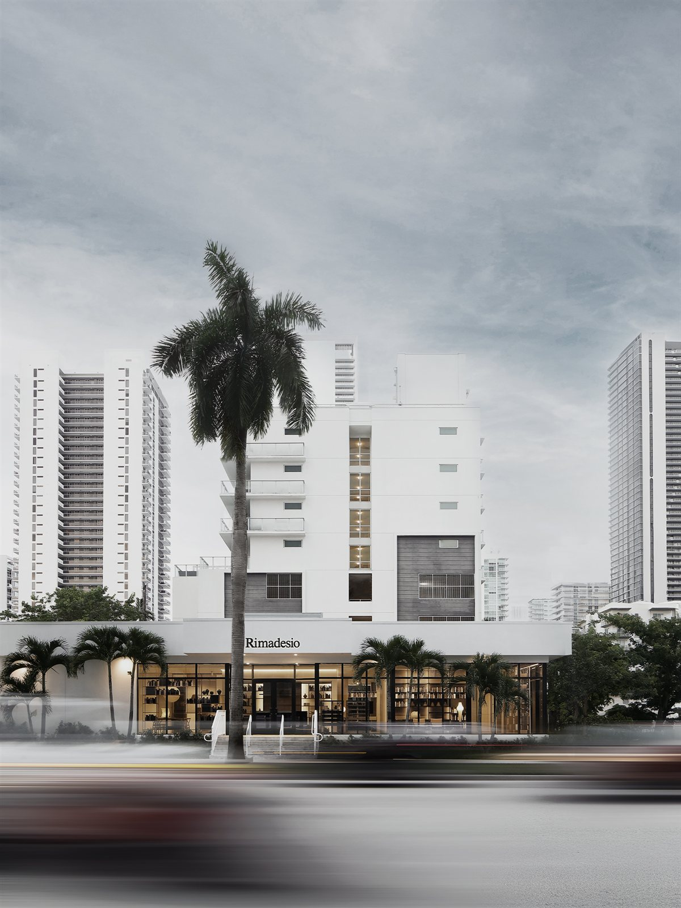

*图：2025 年 10 月开业的迈阿密旗舰店（Biscayne 大道，300 平方米，R Studio 设计）。图源：Rimadesio 官网新闻《迈阿密旗舰店》。*

*图：迈阿密旗舰店内部，Modulor 饰面系统作为空间主角。图源：Rimadesio 官网新闻《迈阿密旗舰店》。*

### 定制与交付的实际流程

产品的交付流程可以概括为四步：设计师与经销商确认尺寸、开启方式与饰面；总部按项目绘制并生产；物流发运到项目地；由当地合作方与品牌技术人员共同完成安装。由于产品必须与土建、地面与吊顶配合，前置条件比标准家具多：滑动系统需要预留轨道位置，隐形门需要门洞精度，嵌入式安装需要墙体结构配合，带电导轨与 LED 需要在土建阶段完成布线。

### 日常使用与维护

产品的日常维护相对简单：玻璃与铝材的清洁不需要特殊手段，机械系统以调节与润滑为主，柜体配件可以拆装重组。需要注意的是两个方向：一是电子与照明元素（带电导轨、LED 灯带、可能的电动机构）需要电气维护能力；二是定制件的更换依赖原厂，跨市场的配件周期长于标准家具。

### 体验断裂点

以下问题来自公开信息与产品结构，属于可验证的体验弱点。

价格与交期不透明是第一条：官网不公开价格，交期按项目排产，用户在决策阶段缺少可预期的锚点。第二条是渠道依赖：安装质量直接决定齐平门、隐形轨道与通高柜体的最终效果，若当地合作方经验不足，产品精度会被施工误差抵消。第三条是系统整合的复杂度：门、隔断、柜体与照明都依赖前期协调，任何一处条件不满足都会导致返工。第四条是与土建绑定的风险：产品一旦进入结构，后期调整的空间有限，翻新时拆除与复原成本较高。第五条是跨市场服务半径：品牌的展厅网络集中在主要城市与高端市场，项目地点偏远时响应速度会下降。

## 11 Competition 竞品：同一张牌桌上的系统供应商

### 品牌归属与行业坐标

Rimadesio 是一家独立的家族企业，没有可披露的集团母公司。它的行业坐标可以用三句话描述：在意大利本土，它与同在布里安扎产区的系统家具与门类品牌竞争，规模处于中上位置；在超高端住宅与工程项目里，它与国际一线家具品牌同台；在出口市场，它依靠单一品牌展厅与设计师渠道建立存在感，海外营收占比已达 68%。

### 品牌层：最接近的对手在同一条街上

最直接的竞争来自同在布里安扎的 Longhi。这家位于 Meda 的企业在官网用几乎相同的措辞介绍自己：以"铝制时尚"系列"生产空间分隔与室内建筑化定义的系统——门、滑动门、饰面墙板、模块化系统与衣帽间"，并强调内部铝加工能力。两家公司的产品结构、材料路线（铝与玻璃）、产地与客户群体高度重合，差异集中在设计语言与渠道深度上。

第二个竞争层是门类专业品牌。ADL Design 以室内门为核心，产品覆盖旋转平移门、滑动门、隐形门与电动门系统，官方强调无地面轨道、开启后释放超过 90% 通行空间的技术方案，并提供玻璃、木材、织物、复合材料与大理石等饰面。这一层品牌在门的机构与安装上积累深厚，是 Rimadesio 门类产品线的正面竞争者。

第三个竞争层是系统家具与衣柜品牌。Molteni&C、Poliform、Porro 等企业在高端住宅与工程项目中与 Rimadesio 争夺同一批订单，尤其在衣帽间与整宅定制领域。它们的优势是品类更宽（沙发、床、餐桌、厨房等）与品牌声量更大，Rimadesio 的优势是门与隔断这一界面系统的完整度。

### 产品层：四类直接对位

第一类是滑动门与隔断：Rimadesio 的 Velaria、Daimon、Maxi 与 Air 对位 ADL 的滑动与旋转平移系统、Longhi 的铝制滑动门系列。竞争点在边框宽度、轨道隐蔽程度、静音与顺滑度。

第二类是与墙齐平的门：Moon 对位各家的"filo parete"系列。竞争点在门扇与墙面的齐平精度、把手与锁具的隐形程度。

第三类是门墙一体系统：Modulor 在市场上属于少数派，Longhi 的饰面墙板与门类产品是最近的对位产品。

第四类是衣帽间与衣柜系统：Dress Bold、Self、Cover 与 Hedon 对位各家的衣柜系统。竞争点在配件自由度、照明整合与安装条件。

### 中国市场的对照

在中国市场，Rimadesio 的对手分成两类。一类是本地的高端整木定制与系统家具品牌，它们在交付速度、现场配合与价格上有明显优势，并已把玻璃门、金属线条与岩板饰面作为常规选项；另一类是同样来自意大利的高端品牌，通过展厅与设计周建立设计师认知。Rimadesio 的公开动作集中在设计师渠道：官网提供中文在内的多语言版本并把微信列为官方社交渠道，行业媒体报道过其在杭州等城市的展厅，公司也在米兰设计周期间接待国际设计师群体。它的短板同样明显——定制产品的跨境交付周期、安装依赖当地合作方、以及缺少本地生产带来的成本刚性。

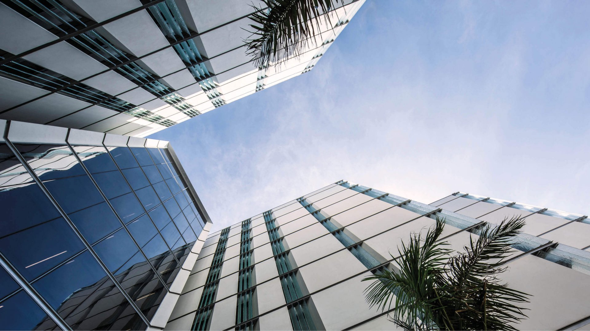

*图：迪拜棕榈岛 Muraba Residences（RCR Arquitectes 设计），Rimadesio 提供 320 组系统组合。图源：Rimadesio 官网新闻（项目报道）。*

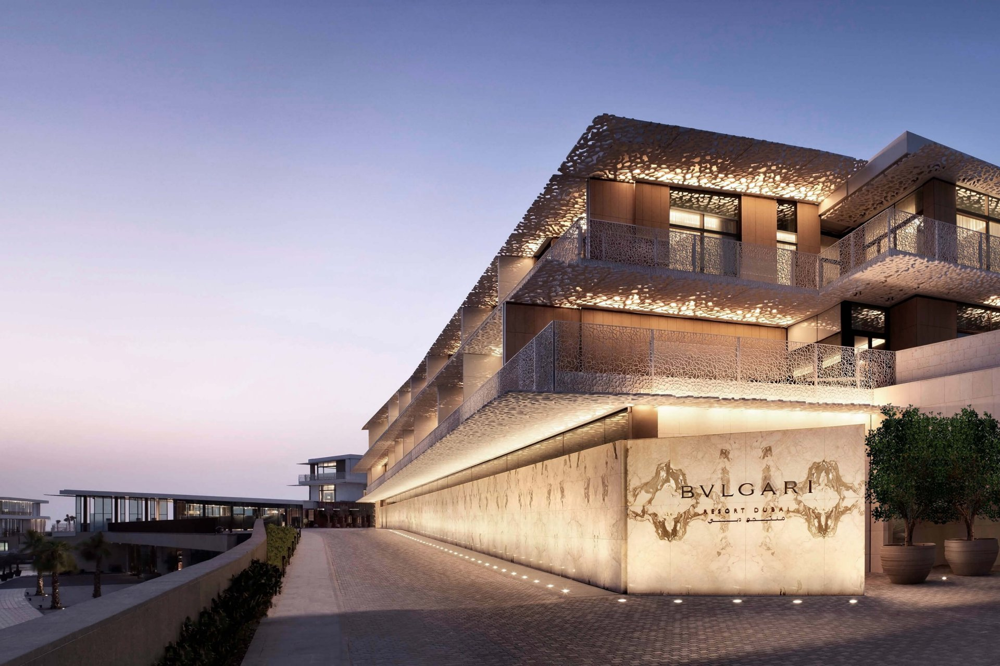

*图：迪拜 Bvlgari Resort（Antonio Citterio Patricia Viel 设计）项目内景，Rimadesio 提供整宅系统。图源：Rimadesio 官网新闻（项目报道）。*

### 竞争小结

Rimadesio 的护城河由三个互相依赖的部分组成：一是设计与材料的连续性（三十余年同一设计师与同一材料路线）；二是内制能力（玻璃工厂、铝加工、木作与包装线在同一厂区），这让极端定制成为可能；三是渠道（90 多家单一品牌店构成的体验与培训网络）。其中任何一项单独都不稀缺——Longhi 同样内制铝材，ADL 在门的机构上更专精，大型家具集团的渠道更广——但在同一家公司里同时具备，并且被同一套饰面语言串联起来，是它当前的位置所在。

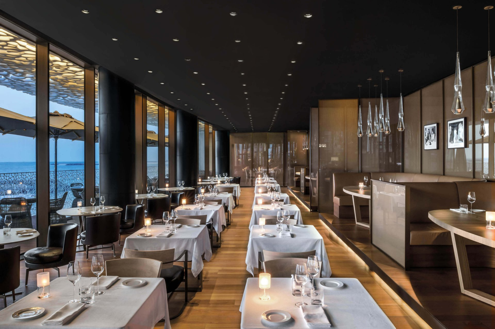

*图：酒店项目中的饰面、柜体与门体组合。图源：Rimadesio 官网新闻（项目报道）。*

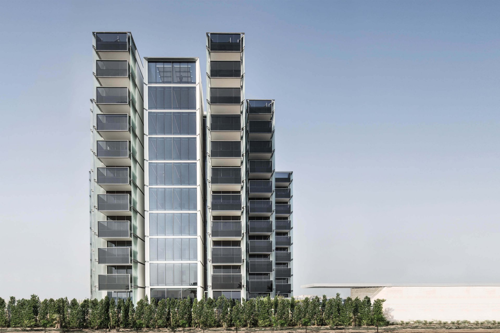

*图：住宅项目中滑动隔断与墙面、地面的关系。图源：Rimadesio 官网新闻（项目报道）。*

## 12 Strategy 战略：保护、改变、扩张与风险

### 保护：已经成立的高价值资产

**设计与形象的连续性（置信度：高）。** 三十余年由同一位设计师完成全系产品，加上 1995 年起稳定的形象负责人，使品牌拥有家具行业少见的语言一致性。这份一致性直接支撑了"整宅系统"的销售逻辑——客户买的不只是一件产品，而是一套可以互相拼接的空间语言。

**玻璃与铝的内制能力（置信度：高）。** 6350 平方米的 4.0 玻璃工厂、内部铝加工与木作、两条自动化包装线集中在同一处厂区，使极端定制（毫米级高度、超宽面板、隐形机构）能够稳定交付。这是纯组装型品牌难以复制的环节。

**系统化产品结构（置信度：高）。** Modulor、Air、Self、Cover、Hedon 之间可以互相整合，产品线覆盖门、隔断、柜体与配件，客单价与客户黏性都高于单件家具。

**渠道网络（置信度：高）。** 90 多家单一品牌店与 5 家旗舰店，贡献约一半营业额；米兰、迈阿密等直营店同时承担展示、培训与文化功能。零售网络既是销售渠道，也是定制产品的"体验解释器"。

**可持续资产（置信度：中高）。** 屋顶 10,637 块光伏组件、1.27 兆瓦装机、工业级储能、玻璃加工水循环（降至生产需求的 2%）、铝与玻璃回收体系，以及 2025 年的再生矿物饰面 Terrae。这些是可被第三方引用的事实，2021 年 BMW 意大利的"可持续故事"专题即为一例。

**奖项与专业认知（置信度：高）。** ADI 设计索引（Maxi、Modulor、Francis）、德国设计奖（Maxi 2023、Air System 2025、Lambda 2026）、AZ Awards 2020（Modulor）、NYCxDESIGN 2025（Lambda）、《Interior Design》Best of Year 2017（Daimon）等，构成设计专业圈的持续曝光。

### 改变：需要修正的环节

**价格与交期的可预期性（置信度：中）。** 产品按项目报价，官网不提供价格区间，交期依赖排产。对设计师客户而言，如果在方案阶段无法快速获得数量级判断，会削弱品牌在比选清单中的位置。可行的改进方向是提供配置层级与参考区间、以及典型交期说明。

**对单一设计师的依赖（置信度：中）。** 现任设计师与品牌的关系已持续三十余年，这既是资产也是单点风险。组织层面的对冲手段包括：把设计方法沉淀为内部规范、在特定品类引入合作设计师、以及建立更完整的产品档案与设计档案体系。

**数字化定制工具（置信度：中）。** 品牌提供二维与三维文件下载，但缺少在线配置器与实时效果预览。对以定制为核心卖点的产品而言，配置器可以显著降低前期沟通成本，也能减少因理解偏差导致的返工。

**电子与照明元素的服务承诺（置信度：中）。** 带电导轨、集成灯带与可能的电动机构把家具的维护责任扩展到电气领域，官方尚未公开这些部件的维护周期与长期备件承诺。

**市场认知的区域不均衡（置信度：中）。** 品牌的认知集中在欧洲、北美与中东的高端设计师圈层；在其他市场，认知更多依赖当地经销商与展厅，缺少本地化的内容资产与传播节奏。

### 扩张：增长方向与机会

**零售网络的持续扩张（置信度：高）。** 2025—2026 年的公开记录包括迈阿密旗舰店、洛杉矶首店、维也纳、华沙、比戈、毕尔巴鄂、帕尔马、河内、新德里、那不勒斯、科森扎等城市的新店或翻新，罗马展厅重新开业。公司把单一品牌店视为品牌价值与定制服务的载体，扩张节奏与营收增长同步。

**工程与酒店渠道（置信度：中高）。** 品牌已成为 Forbes International Tower（LEED 白金级、全生命周期负碳目标）的战略合作方，并在 Turnberry Ocean Club、Bvlgari Resort、Muraba Residences 等项目中被指定使用。工程渠道的客单规模大于零售，但对接周期长、竞争激烈。

**从系统到家居全案（置信度：中高）。** 品牌的产品线已从门与隔断扩展到桌、椅、几、地毯与置物架，2025 年的 Modernity Flow 系列巡回活动即以新家具配件线为主角。这条路径的终点是"整宅供应"，与大型家具集团的竞争正面化。

**七十周年品牌资产（置信度：中）。** 2026 年的 BECOMING 项目把品牌叙事从产品层面扩展为城市文化事件（Palazzo Isimbardi 装置与沉浸式影像空间），并延续到国际旗舰店的全年活动，属于可沉淀的品牌资产。

### 风险：可验证的威胁与约束

**增长节奏与宏观周期（置信度：中）。** 2024 年营收增长 3%、2023 年录得 8470 万欧元、2026 年上半年增长 6%，增长曲线趋稳；高端住宅与工程需求对利率与地产周期敏感，一旦周期下行，定制产品的订单取消与延期成本高于标准家具。

**出口依赖与跨境摩擦（置信度：中）。** 海外营收占比 68%，其中北美与中东是增长重点。关税、汇率与海运成本的变化会直接作用于价格竞争力，而定制产品难以通过库存调节对冲。

**单点生产与产能弹性（置信度：中）。** 全部生产集中在 Giussano 一处厂区（30,000 平方米）。这种集中保证了品质与协同，但在能源价格剧烈波动、意外停产或订单骤增时缺乏缓冲。

**竞争者定位趋同（置信度：中）。** 同在布里安扎的 Longhi 采用几乎相同的业务描述与材料路线（铝、玻璃、内部加工），并在门、滑动系统、饰面墙板与衣帽间上形成正面竞争。定位趋同意味着竞争将回到渠道效率、交期与价格这些更具体的维度。

**本地替代与价格压力（置信度：中）。** 在中国等市场，本地高端定制品牌在交付速度、现场配合与价格上具备优势，并且已经能提供玻璃门、金属线与岩板饰面等相似方案。Rimadesio 的应对依赖设计价值与整体系统的一致性，而非成本。

**设计语言的继承风险（置信度：低至中，方向性）。** 品牌当前的辨识度与设计师个人语言高度绑定，长期看需要把"如何设计"制度化，而非仅依赖个人。

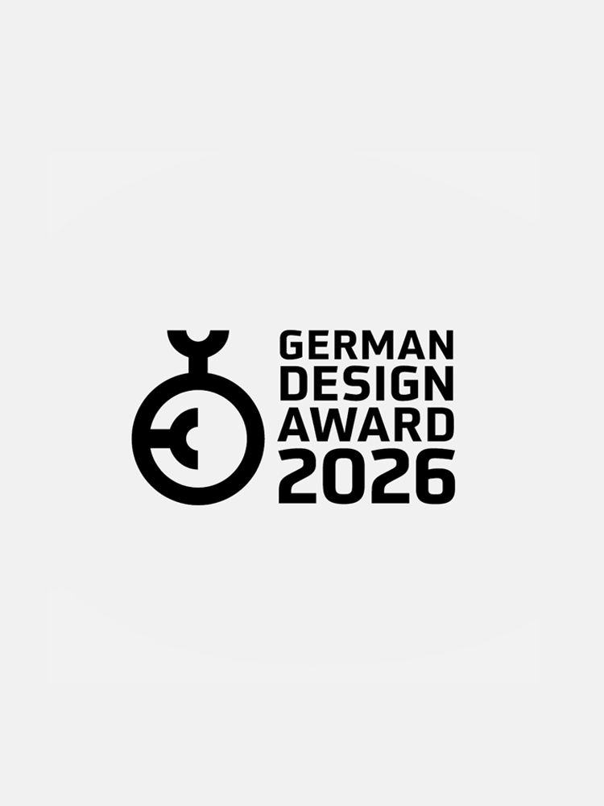

*图：Lambda 桌获 2026 年德国设计奖（优秀产品设计）的官方视觉。图源：Rimadesio 官网首页与新闻。*

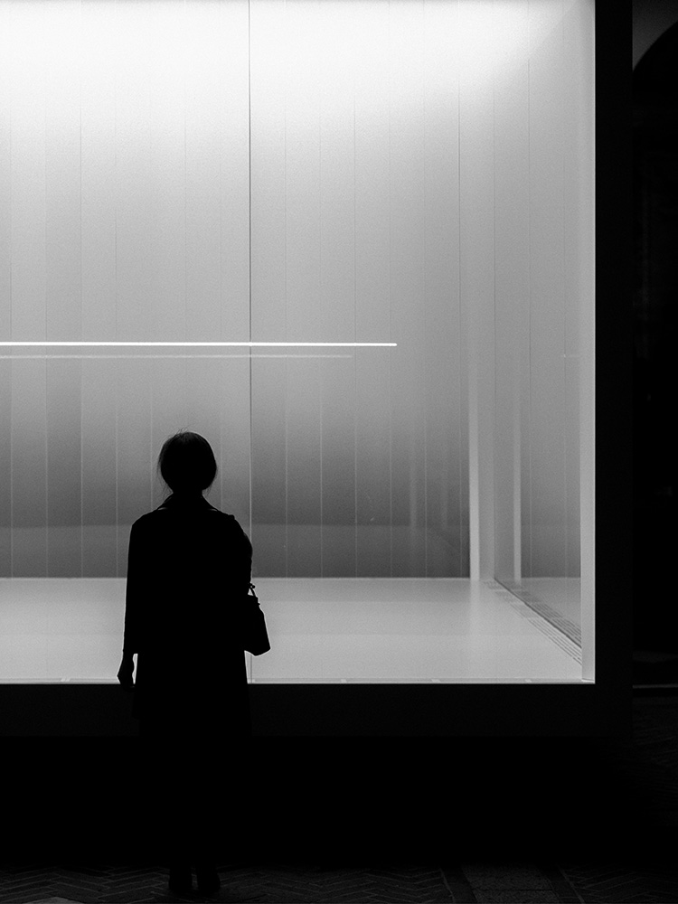

*图：BECOMING 项目在 Palazzo Isimbardi 的展陈现场，用于承接品牌七十年的叙事。图源：Rimadesio 官网新闻《Becoming — Palazzo Isimbardi》。*

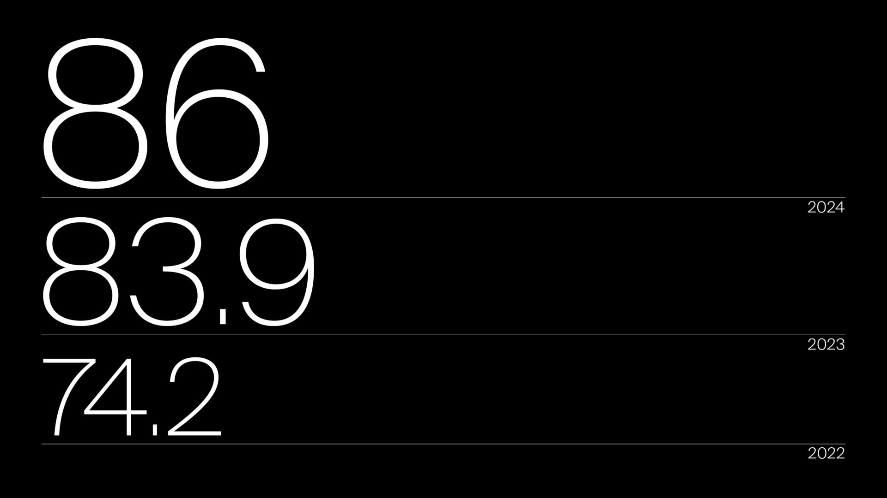

*图：官网发布的营业额数据视觉，用于说明 2024 年的经营结果。图源：Rimadesio 官网新闻《2024 财年业绩》。*

## 13 视频与访谈资料

官方的内容资产集中在网站 Journal 与展会现场，本次研究整理如下（视频多以内嵌形式发布在文章页中）：

- 《Conversation with Giuseppe Bavuso》（2019 年 1 月 8 日）：设计师回顾与品牌的合作起点、Siparium 的诞生、米兰旗舰店的开设过程与"设计不喧哗"的判断标准。https://www.rimadesio.it/it/journal/conversation-with-giuseppe-bavuso/
- 《Rimadesio 60 Storie, Sfide, Talenti》系列（2016 年）：品牌六十周年时在米兰展厅举办的四场对谈，嘉宾包括宇航员 Maurizio Cheli、帆船运动员 Giovanni Soldini、作家 Matteo Nucci 与音乐人 Joan As Police Woman。https://www.rimadesio.it/it/journal/sessantesimo-anniversario-rimadesio/
- 《Talking About》系列（2017—2024）：品牌邀请设计记者与建筑评论人进行的公开对谈，包括 Luca Solca、Marco Romanelli、Beppe Finessi、Michele Lupi 等参与者。
- 《BECOMING》与 R-Paradigm（2026 年）：七十周年项目的沉浸式影像空间，由 Juma 策展，配套影片与现场记录发布在官网新闻页。
- BMW《Storie di sostenibilità》（2021 年 12 月）：BMW 意大利拍摄的品牌可持续专题片，用于对外传播制造业环保实践。
- 《HEDON》《Modernity Flow》系列视频（2025—2026）：围绕衣帽间系统与新家具配件线的产品影片。
- 需要说明的是，本次研究未能直接访问品牌在 YouTube 等平台的官方频道列表，上述影片主要依据官网新闻页与页面内嵌视频确认存在；若需完整片源清单，建议向品牌新闻联络人或经销商索取媒体资料包。

## 14 来源与延伸阅读

### 官方资料

- 品牌官网（意大利语）：https://www.rimadesio.it/it/
- 品牌介绍（业务定义、总部、R-Academy、可持续、道德准则、数据与报告）：https://www.rimadesio.it/it/about-us/
- 总部与生产：https://www.rimadesio.it/it/about-us/headquarters/
- 环境可持续项目（含光伏、储能、水循环、材料回收的完整数据与时间线）：https://www.rimadesio.it/it/about-us/progetto-sostenibilita-ambientale/
- R-Academy 培训：https://www.rimadesio.it/it/about-us/r-academy/
- 数据与报告：https://www.rimadesio.it/it/about-us/report/
- 产品分类：门 https://www.rimadesio.it/it/categoria-prodotto/porte/ ；面板与隔断 https://www.rimadesio.it/it/categoria-prodotto/pannelli-scorrevoli/ ；日间系统 https://www.rimadesio.it/it/categoria-prodotto/sistemi-giorno/ ；夜间系统 https://www.rimadesio.it/it/categoria-prodotto/sistemi-notte/ ；办公系统 https://www.rimadesio.it/it/categoria-prodotto/sistemi-ufficio/ ；家具配件 https://www.rimadesio.it/it/categoria-prodotto/complementi-arredo/
- 代表产品页：Modulor Boiserie https://www.rimadesio.it/it/prodotto/modulor-boiserie/ ；Velaria https://www.rimadesio.it/it/prodotto/velaria/ ；Moon https://www.rimadesio.it/it/prodotto/moon/ ；Daimon https://www.rimadesio.it/it/prodotto/daimon/ ；Air https://www.rimadesio.it/it/prodotto/air/ ；Cover Freestanding https://www.rimadesio.it/it/prodotto/cover-freestanding-day/ ；Zenit https://www.rimadesio.it/it/prodotto/zenit/
- 关键新闻：2024 财年业绩 https://www.rimadesio.it/it/journal/risultati-finanziari-2024/ ；2021 财年业绩 https://www.rimadesio.it/it/journal/risultati-finanziari/ ；2018 财年业绩 https://www.rimadesio.it/it/journal/fatturato-2018/ ；Hedon 发布 https://www.rimadesio.it/it/journal/hedon/ ；Air Syncro https://www.rimadesio.it/it/journal/air-syncro-un-sistema-innovativo/ ；Terrae 饰面 https://www.rimadesio.it/it/journal/terrae-la-finitura/ ；BECOMING 项目 https://www.rimadesio.it/it/journal/becoming-palazzo-isimbardi/
- 项目服务与零售网络：https://www.rimadesio.it/it/rimadesio-project/ ；门店查询 https://www.rimadesio.it/it/punti-vendita/

### 设计与行业媒体

- Interni：品牌 2015 年业绩报道 https://www.internimagazine.it/news/people/rimadesio-un-2015-da-record/ ；人力资源投入报道 https://www.internimagazine.it/news/people/rimadesio-investe-nelle-risorse-umane/ ；Modulor 系统介绍 https://www.internimagazine.it/design/arredo/rimadesio-2/ ；2026 年米兰设计周活动 https://www.internimagazine.it/guida-fuorisalone-2026/evento-rimadesio-fs-2026/ ；门店与展厅报道（东京、洛杉矶、日内瓦、开普敦、杭州等）见 Interni 站内检索结果
- Pambianco News：企业报道存档（2011 年净利润增长 180%、2012 年米兰新展厅与贝鲁特、巴西门店开业等）https://www.pambianconews.com/?s=rimadesio
- Dezeen：2026 年伦敦设计节相关项目页（Becoming by Rimadesio）https://www.dezeen.com/?s=rimadesio

### 竞品官方资料

- Longhi（Meda，铝制系统与门类）https://www.longhi.it/
- ADL Design（室内门与滑动系统）https://adldesign.it/
- Molteni&C（系统家具与工程）https://www.molteni.it/
- Poliform（系统家具与衣柜）https://www.poliform.it/

### 中文资料

- 品牌官网提供中文入口与微信渠道（页脚标注 WeChat 微信），中文内容以产品与展厅信息为主，缺少中文版的企业沿革与财务数据
- 中文媒体对品牌的报道集中于设计周与展厅开业，未检索到系统性的品牌研究文章；如需面向中文读者的资料，建议以官网英文版与本文所列设计媒体为准

## 15 分析附录

### 产品组合矩阵

| 层级 | 代表产品 | 功能定位 | 关键技术点 | 备注 |
|---|---|---|---|---|
| 门 | Moon、Spin、Air、Modus | 平开、双向、齐平与酒店门 | 磁力锁、可逆隐形铰链、无挡边齐平 | Modus 面向酒店，含防火与声学规范 |
| 面板与隔断 | Velaria、Daimon、Maxi、Air Syncro | 滑动、同步滑动与固定隔断 | 自研轨道（墙／顶／嵌入）、同步机构、夹层装饰玻璃 | 全部按尺寸定制 |
| 门墙系统 | Modulor | 门、墙、柜体共用饰面 | 98 种饰面、五种材料、可整合滑动面板 | 2020 年 AZ Awards、2024 年 ADI 设计索引 |
| 日间系统 | Wind、Zenit、Daimon、Self、Abacus | 书架、组合柜、边柜、展示柜 | 立柱到顶、附件自由布置、玻璃与灯带整合 | 覆盖客厅与书房 |
| 夜间系统 | Dress Bold、Self、Cover、Hedon | 衣柜、衣帽间、抽屉柜 | 无孔固定、隐形带电导轨、毫米级高度 | Hedon 高度上限 3894 毫米 |
| 办公系统 | Flat System、Manta | 工作台、会议桌、隔断与柜体 | 铝型材结构、玻璃台面、模块配件 | 面向办公与公共空间 |
| 家具配件 | Lambda、Rialto、Koster 类系列、地毯与坐墩 | 桌、几、椅、镜、置物架 | 与系统共用饰面与色彩 | 2025—2026 年奖项集中于此 |

### CMF 与材料速查

| 类别 | 代表项 | 说明 |
|---|---|---|
| 涂装体系 | Ecolorsystem | 水性漆工艺，覆盖玻璃与铝，34 种颜色，含铝本色、黑、乳白、棕与金属刮擦效果 |
| 玻璃 | 透明、酸蚀、反射、镜面、网格、彩色系列（沿用数字色号） | 4.0 玻璃工厂内制，含机器人切割、水刀与钢化 |
| 岩板 | 岩板饰面（门扇、面板与柜体） | 2018 年起进入产品体系 |
| 织物 | Lux 与 Material 系列 | 用于柜体背板、门芯与吸音面板 |
| 木皮 | 核桃木、热处理橡木（Sahara 波浪纹） | 用于门、墙板与柜体 |
| 复合材料 | Litech（含灰色条纹版本） | 用于门扇、面板与把手嵌件 |
| 仿皮 | 多种色号 | 用于柜体内部与把手 |
| 金属 | 铝型材（多种表面处理）、钢与铜色漆 | 结构件与饰面 |
| 再生饰面 | Terrae（2025） | 大理石、石材、矿物、颜料与陶瓷碎片研磨混合，形成带色差的层叠表面 |

### 竞品对照

| 维度 | Rimadesio | Longhi | ADL Design | 大型系统家具品牌（Molteni&C／Poliform／Porro 等） |
|---|---|---|---|---|
| 主业 | 门与隔断系统、饰面墙、柜体与配件 | 铝制系统、门、饰面墙、衣帽间与软体家具 | 室内门与滑动系统 | 全屋系统家具（含沙发、床、厨柜与衣柜） |
| 材料路线 | 玻璃与铝为主，配套多种饰面 | 铝为主，配套玻璃与软体 | 玻璃、木、织物、复合材料与大理石 | 木作与复合材料为主 |
| 定制程度 | 全部按尺寸定制，毫米级 | 高度定制 | 高度定制（门类） | 高度定制（柜体类） |
| 界面系统完整度 | 门、墙、柜共用一套型材与饰面 | 门与饰面墙共用铝制体系 | 以门为核心 | 以柜体与家具为核心 |
| 渠道 | 90 多家单一品牌店 + 5 家旗舰店 | 全球经销商与展厅网络 | 经销商与工程渠道 | 全球旗舰店与经销商网络 |

### 定位图（表格化）

| 坐标维度 | 低 | 中 | 高 | Rimadesio 位置 |
|---|---|---|---|---|
| 定制深度 | 标准尺寸选型 | 尺寸与饰面可选 | 按项目全定制 | 高 |
| 界面整合度 | 单件家具 | 同系列搭配 | 门墙柜一体 | 高（Modulor） |
| 玻璃工艺 | 外购标准玻璃 | 外协加工 | 自有玻璃工厂与 4.0 产线 | 高 |
| 可持续投入 | 材料合规 | 部分认证 | 自有能源与循环体系 | 高 |
| 价格带 | 中高端 | 高端 | 超高端定制 | 超高端 |
| 出口依赖度 | 本地为主 | 出口 30—50% | 出口 60% 以上 | 高（68%） |

### 证据登记

| 结论 | 证据 | 来源 | 来源类型 | 置信度 |
|---|---|---|---|---|
| 1956 年成立于 Giussano，属布里安扎家具产区 | Interni 2015 年报道、官网 2016 年六十周年新闻 | Interni、官网 | 第三方 + 官方 | 高 |
| 1992 年推出首套玻璃与铝滑动面板系统 Siparium，至今在售 | 设计师访谈（2019） | 官网 Journal | 官方 | 高 |
| 1986 年与 Davide Malberti 相识，两年后提出滑动面板方案，此后为品牌唯一设计师 | 设计师访谈（2019） | 官网 Journal | 官方 | 高 |
| 2003 年首家米兰单一品牌店、2012 年米兰旗舰店（800 平方米，三个月完成） | 设计师访谈（2019） | 官网 Journal | 官方 | 高 |
| 2024 年营业额约 8600 万欧元（意大利 32%、海外 68%），同比增长 3%，订单增长 10% | 官网 2024 财年新闻（2025-02-21） | 官网 | 官方 | 高 |
| 2023 年营业额 8470 万欧元、EBITDA 1330 万欧元、EBIT 1030 万欧元 | 官网 2024 年上半年新闻（2024-07-18） | 官网 | 官方 | 高 |
| 2021 年营业额 6690 万欧元，EBIT 约 1040 万欧元，EBITDA 1250 万欧元 | 官网财务新闻（2022-09-08） | 官网 | 官方 | 高 |
| 2018 年营业额超 6100 万欧元，同比增长 22%，海外分销占 62% | 官网 2018 财年新闻（2019-03-20） | 官网 | 官方 | 高 |
| 2026 年上半年销售规模 4930 万欧元，同比增长约 6% | 官网新闻《Una crescita costante》 | 官网 | 官方 | 高 |
| 单一品牌展厅超 90 家、5 家旗舰店，贡献约 50% 营业额 | 数据与报告页 + 2024 财年新闻 | 官网 | 官方 | 高 |
| 总部 30,000 平方米；玻璃 4.0 工厂 6350 平方米；生产用水降至需求的 2% | 总部页与可持续页 | 官网 | 官方 | 高 |
| 屋顶 10,637 块光伏组件、1.27 兆瓦、自 2008 年发电 42.9 吉瓦时、减排 2280 万公斤 | 可持续页 | 官网 | 官方 | 高 |
| Modulor 于 2020 年获 AZ Awards 建筑产品类评委奖与公众选择奖 | 官网新闻（2020-09-24） | 官网 | 官方 | 高 |
| Daimon 于 2017 年获《Interior Design》Best of Year 建筑设计类产品奖 | 官网新闻（2018-01-12） | 官网 | 官方 | 高 |
| Air System 获 2026 年德国设计奖（2025-01 公布）；Maxi 入选 ADI 设计索引（2022-11 公布）；Lambda 获 NYCxDESIGN 2025 与德国设计奖 2026 | 官网奖项新闻 | 官网 | 官方 | 高 |
| Terrae 饰面于 2025 年 12 月发布，采用回收天然材料粉末混合 | 官网新闻（2025-12-20） | 官网 | 官方 | 高 |
| Longhi 使用与 Rimadesio 高度接近的业务描述（空间分隔与室内建筑化定义的系统） | Longhi 官网自述 | Longhi 官网 | 第三方（竞品自述） | 中高 |
| 2011 年净利润增长 180%，被财经媒体描述为"以利润对抗危机" | Pambianco News 2012 年报道 | Pambianco | 第三方 | 中 |
