更新于 2026-09-24  ·  基于 v4.4

# ABOUT ARTEMIDE

目录

|  |  |
|---|---|
| [01 开篇](#01-开篇) | [09 Design 设计：工程师的光](#09-design-设计工程师的光) |
| [02 品牌概述](#02-品牌概述) | [10 Experience 体验：可修的灯与不能修的板](#10-experience-体验可修的灯与不能修的板) |
| [03 Brand 品牌：从米兰一间工作室到 Human Light](#03-brand-品牌从米兰一间工作室到-human-light) | [11 Competition 竞品：意大利第一梯队与它的镜像](#11-competition-竞品意大利第一梯队与它的镜像) |
| [04 Category 品类与市场：高端设计照明的窄门](#04-category-品类与市场高端设计照明的窄门) | [12 Strategy 战略：家族制、长寿命与技术换道](#12-strategy-战略家族制长寿命与技术换道) |
| [05 User 用户与场景：买灯的人、定灯的人和被光照到的人](#05-user-用户与场景买灯的人定灯的人和被光照到的人) | [13 视频与访谈资料](#13-视频与访谈资料) |
| [06 Positioning 定位：光先于灯被设计](#06-positioning-定位光先于灯被设计) | [14 来源与延伸阅读](#14-来源与延伸阅读) |
| [07 Product 产品：结构、光与再版](#07-product-产品结构光与再版) | [15 分析附录](#15-分析附录) |
| [08 Aesthetics 美学：字标、铝与看不见的灯](#08-aesthetics-美学字标铝与看不见的灯) |  |

## 01 开篇

Richard Sapper 在设计 Tizio 的时候，没有先画灯，而是先找了一排玻璃果酱罐。他往罐子里加水、倒水，靠增减水量找出双臂的最佳平衡点——原型阶段的配重就是这样调出来的。后来这盏灯 1972 年投产，底座里藏着 12V 变压器，变压器本身就是配重；两根铝合金臂不只是臂，还兼作低压电流的导体，电流从底座穿过臂管到达灯头，臂之间没有一根外露电线。

灯头上那根带红圆球的小杆，也不是为了好看。它是后来为进入丹麦市场才加上去的——当地法规要求灯头翻转时不能直接烫到桌面，于是多了这根止摆杆。

一盏被写进 MoMA 馆藏、被称作"意大利设计符号"的台灯，它的两个最醒目的视觉特征——没有电线的双臂和头顶红球——一个来自工程妥协，一个来自市场准入。这大概就是 Artemide 这家公司最好的入口：它从不把"纯粹形式"当目的，形式是工程、法规、时间和成本谈完之后剩下的东西。

## 02 品牌概述

Artemide 是意大利高端设计师照明品牌，1960 年在米兰由航空工程师 Ernesto Gismondi 与设计师 Sergio Mazza 联合创立，总部位于米兰西北的 Pregnana Milanese。它横跨装饰性台灯与建筑照明两端，既出产 Tizio、Tolomeo 这类被博物馆收藏、五十年不衰的家用经典，也把光系统指定进酒店、办公楼与博物馆的图纸。它的核心主张是 1996 年提出的"The Human Light"——光服务于人及其需求，而不是反过来让人迁就灯。

| 项目 | 内容 |
|---|---|
| 品牌名 | Artemide · [https://www.artemide.com](https://www.artemide.com) |
| 国家/地区 | 意大利（总部与主厂 Pregnana Milanese；生产分布意大利、匈牙利、法国、加拿大） |
| 成立时间 | 1960 年（米兰创立；首灯 Alfa 设计于 1959） |
| 创始人 | Ernesto Gismondi（航空与导弹工程师、米兰理工副教授）与 Sergio Mazza（设计师） |
| 代表性设计人物 | 内部：Ernesto Gismondi、Carlotta de Bevilacqua（现任 President & CEO）；外部：Richard Sapper、Michele De Lucchi & Giancarlo Fassina、Vico Magistretti、Giancarlo Mattioli、Enzo Mari、Gio Ponti、Ettore Sottsass、Herzog & de Meuron、Issey Miyake、Zaha Hadid |
| 其他关键人物 | Carolina Gismondi de Bevilacqua（副总裁，Gismondi 与 de Bevilacqua 之女，2019 年起统管数字与建筑空间形象） |
| 官方理念 | "The Human Light"（1996 宣言；现扩展为"The Human & Responsible Light"） |
| 品牌归属 | Artemide Group S.p.A. + 18 家子公司；Gismondi 家族控制，无公开外部财务投资人；President & CEO Carlotta de Bevilacqua |
| 核心业务 | 住宅与建筑照明灯具设计制造、光环境服务与智能照明系统；自有吹制玻璃产能；持有 Danese Milano |
| 经典产品 | Tizio（1972）、Tolomeo（1987）、Eclisse（1967）、Nesso/Nessino（1967）、Alfa（1959）、Sintesi（1975）、Pipe（2004）、IN-EI（2012）、Discovery（2018） |

## 03 Brand 品牌：从米兰一间工作室到 Human Light

### 工程师与设计师的合伙

1960 年的米兰，设计工业正处在战后重建的高峰期。Ernesto Gismondi 那年 28 岁，刚拿到米兰理工航空工程学位，又去罗马补了导弹工程；他和比自己小一岁的设计师 Sergio Mazza 合伙开了一家公司，取名 Artemide。第一盏灯不是 Gismondi 设计的，是 Mazza 在 1959 年画的 Alfa——波纹乳白玻璃灯罩、手工车削镀镍金属件、黑色大理石底座。公司成立后的头几年，两人分工很清楚：Gismondi 管工程与商业，Mazza 管早期产品供给。

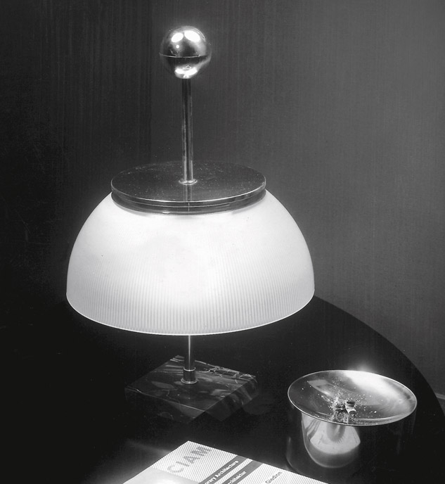

*图：Artemide 第一盏灯 Alfa（Sergio Mazza, 1959）的历史棚拍照。图源：[Artemide 官方品牌历史页](https://www.artemide.com/en/company/identity)。*

Gismondi 的工程师身份不是装饰。他 1964 年到 1984 年在米兰理工教火箭发动机与导弹工程，是孟菲斯运动的外围参与者，但他真正带进公司的是另一套东西：对结构、热管理与公差的工程师式敏感。Dezeen 在他 2020 年去世后的讣告里引用过他常说的一句话——"本想造导弹，最终没造成导弹"。这句话后来被反复提起，因为它准确概括了 Artemide 产品里那种工程派头：灯是按航空零件的精度标准来做的。

### 1960 年代：塑料与太空时代

公司前十年做对了一件关键的事：把当时刚能大规模注塑成型的 ABS 热塑性塑料，直接做成可以放在客厅里的家具物件。1965 年，Vico Magistretti 的 Eclisse 问世——一只可以旋转的半球形小灯，通过转动内罩控制直射、反射与漫射三种光；1967 年它拿下 Compasso d'Oro。同年，Giancarlo Mattioli 与他的 Gruppo Città Nuova 团队在 Artemide 与 Domus 出版社合办的设计竞赛中中标，提交了一件受水母启发的蘑菇形灯，投产时定名 Nesso，后来又出了缩小桌版 Nessino。

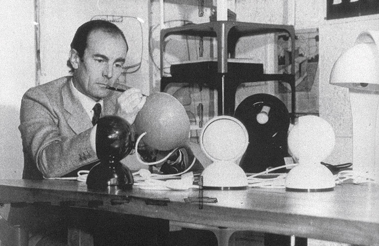

*图：Eclisse（Vico Magistretti, 1967）与设计师工作台的历史照。图源：[Artemide 官方品牌历史页](https://www.artemide.com/en/company/identity)。*

1969 年，Gio Ponti 设计了 Fato；1970 年公司做过压缩模塑塑料椅 Selene。这十年 Artemide 不把自己当灯具公司，而把自己当"用新材料做家用物件的设计实验室"。塑料不再是藏在结构里的材料，而是造型本身。

### 1972：Tizio 与 Pregnana 工厂

1972 年是公司的分水岭。这一年 Richard Sapper 的 Tizio 投产，同年第一座自有工厂在米兰西北约 15 公里的 Pregnana Milanese 启用，至今仍是总部。Tizio 的故事在 Product 章节展开，这里只说一件事：它让 Artemide 从"又一家意大利设计灯具厂"变成了被 MoMA 直接收藏的品牌。MoMA 1973 年就把 Tizio 收进永久馆藏（Object number 198.1973），这在灯具行业是很少见的速度——产品投产第二年就进了博物馆。

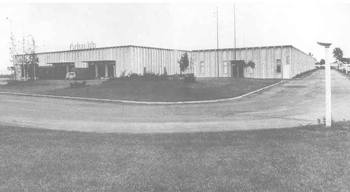

*图：1972 年启用的 Pregnana Milanese 工厂外景，至今为公司总部。图源：[Artemide 官方品牌历史页](https://www.artemide.com/en/company/identity)。*

1975 年 Gismondi 自己设计了 Sintesi，这是他第一款署名 Artemide 的产品；1976 年 Enzo Mari 的 Aggregato 落地，由 Artemide 技术部门负责人 Giancarlo Fassina 提供技术支持——Fassina 这个名字后来会和 Tolomeo 绑在一起。

### 1980 年代：海外扩张与 Tolomeo

1980 年 Artemide 在美国开第一家海外子公司，曼哈顿首店落成。1982 年 Ettore Sottsass 为它设计了 Callimaco——孟菲斯退潮期的一件过渡作品。1985 年的 Aton 轨道灯系统催生了 Litech 部门，这是后来 Artemide Architectural 的前身，意味着公司开始把业务从装饰性灯具伸到建筑照明。

1987 年，Michele De Lucchi 与 Fassina 合作的 Tolomeo 在米兰 Euroluce 照明展首发，两年后拿 Compasso d'Oro。它和 Tizio 一起，构成了 Artemide 此后近四十年的产品支柱。

### 1991：把玻璃厂买下来

1991 年公司收购了威尼斯历史玻璃厂 VeArt，开始自己吹制玻璃。这在当时是一笔不便宜的纵向整合——别人做玻璃件找穆拉诺供应商代工，Artemide 直接把产能握在手里。后来它持有 Vetrofond 玻璃厂 50% 股权，Empatia 等灯具的手工吹制扩散罩就来自这条自有产能。

1995 年，ADI 把 Compasso d'Oro 终身成就奖颁给了 Artemide 公司本身。

### 1996：Human Light 宣言

1996 年，公司发布了一份名为《The Human Light》的新宣言。这份文件把品牌的立场讲得很白：焦点不在产品，而在光的表现，以及光与经历它的人之间的关系。推动这份宣言的主要人物是 Carlotta de Bevilacqua——建筑师、LED 应用先驱，后来成为 Gismondi 的伴侣与公司的掌舵人。

> 术语注释：manifesto——品牌以公开宣言形式发布的立场文件，不是广告口号。

宣言之后，公司的技术路线明显向"光的质量"倾斜：2000 年推出最早的两盏 LED 灯 Sui（de Bevilacqua 设计）与 Kaio（Gismondi 设计），官方称之为"LED 革命"的开端；2006 年 My White Light 线把可调色温（TunableWhite）产品化；2016 年启动 Li-Fi 与 IoT 照明研究；2020 年推出把照明与消毒合一的 INTEGRALIS 专利光技术。"光为人服务"这句话，被一代一代的技术迭代兑现成了产品。

### 2020 年之后：家族第二代

2020 年 12 月 31 日，Gismondi 在米兰去世，享年 89 岁。de Bevilacqua 接任 President & CEO，他们的女儿 Carolina Gismondi de Bevilacqua 任副总裁。2023 年集团营收 1.115 亿欧元，595 名员工，产品销往 107 国，全球 14 家单品牌展厅。

需要说明的是，Gismondi 去世后市场上一直有"Artemide 是否会被私募基金收购"的猜测。检索 Investindustrial、CVC、Permira 等欧洲设计家居产业基金的公开交易记录，以及 2020–2026 年间的并购新闻，均未发现任何入股或收购 Artemide 的公开交易。公司至今仍是 Gismondi 家族控制的封闭股份公司。

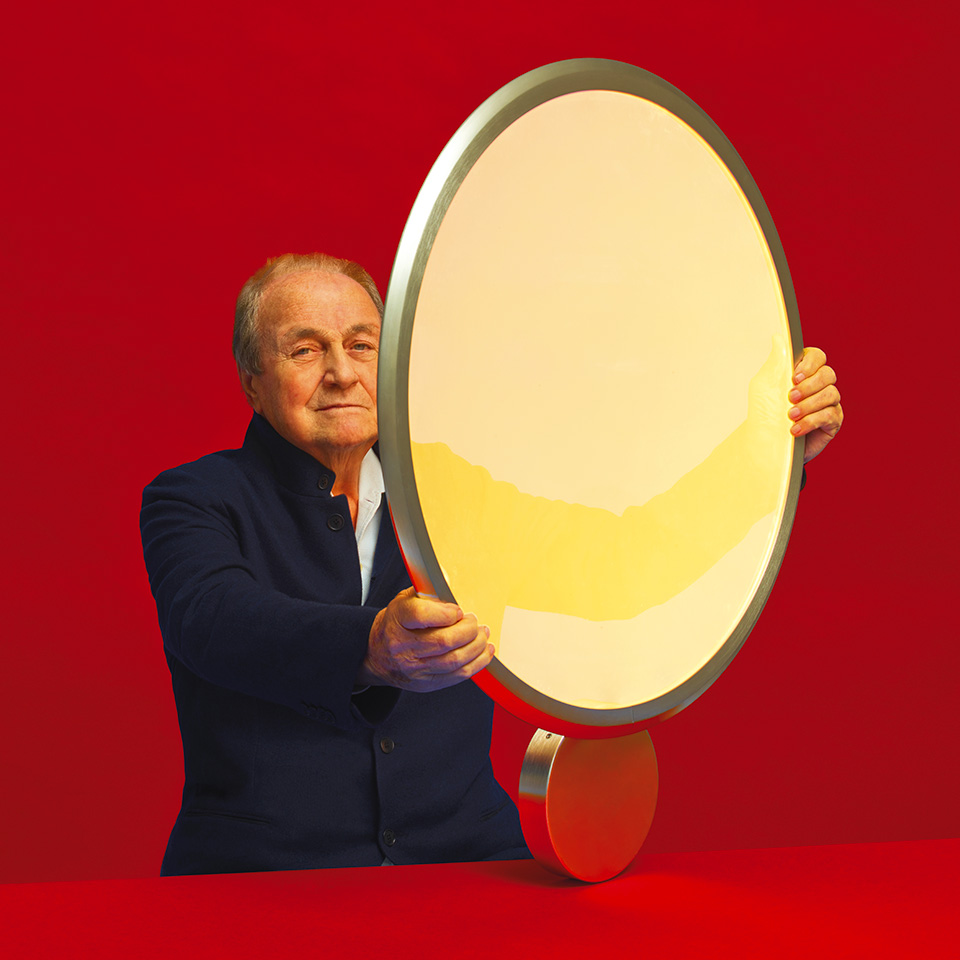

*图：Ernesto Gismondi 官方肖像，手持其设计的 Nur 灯。图源：[Artemide 官方设计师页](https://www.artemide.com/en/company/designers/231/ernesto-gismondi)。*

## 04 Category 品类与市场：高端设计照明的窄门

### 品类的两个口径

设计师照明在行业统计里通常被切进两个边界模糊的大类。一类是装饰性/设计师照明——台灯、落地灯、吊灯、壁灯，灯具本身就是陈设，Artemide 的 Tizio、Tolomeo、Nessino、Eclisse 属此列；另一类是建筑照明——嵌入式筒射灯、线性洗墙、轨道、户外立面，为空间提供基础光与氛围光，Artemide 的 Pipe、Alphabet of Light、LineaLed 属此列。

> 术语注释：category codes——品类心照不宣的设计惯例与符号。

Artemide 是少有的同时横跨两端的品牌。大多数意大利同行只做一端：Foscarini 偏装饰吊灯，Luceplan 偏建筑与工程线。Artemide 的产品线里，Tizio/Tolomeo 是设计商店的常客，Alphabet of Light 则走 spec sheet、调光协议与 IES 文件那套建筑工程语言。

### 市场规模的判断口径

各机构对"装饰照明"市场规模的估算差异接近一倍，因为统计范围不同——是否含光源、是否含户外、是否把义乌量产吊灯全算进去，结论就差很多。Mordor Intelligence 给 2025 年装饰照明市场约 759 亿美元、年增 4.1%；Straits Research 给约 722 亿美元；Market Research Future 给约 812 亿美元。建筑照明这块，Business Research Insights 给 2026 年约 125 亿美元、年增 5.9%。

这些数字都需要打"方向性"标签。可以确认的方向只有一个：全球装饰照明是一个七八百亿美元量级、年增约 4% 的大盘，建筑照明约一百多亿美元、年增 5–6%。但 Artemide 所在的"高端设计师照明"只是其中极窄的高价段，没有任何权威机构单独拆分。它不跟大盘容量竞争，而是在高溢价的设计收藏品段里竞争。

### 价格带

实际报价（2026 年 9 月检索）：Tizio LED 台灯北美官方店 630 美元，Tolomeo 台灯欧洲起价约 231 欧元、落地款 488–920 欧元，Nessino 官方在线店 210 欧元，Eclisse 约 215 欧元，建筑线性产品 Alphabet of Light W 约 1485 欧元，高端项目款 Arrival Floor LED 标价 3105 欧元。

> 术语注释：CEP（Category Entry Points）——用户首次意识到需求、接触品类的入口。

主力经典台灯落在 400–1200 美元 / 230–900 欧元，落地灯与建筑款上探到 2000–3000 美元以上。这个价位与 FLOS、Louis Poulsen 同档，明显高于大众灯具（宜家到中端电商 50–200 美元），低于 Ingo Maurer 的装置款。

### 品类惯例

设计师台灯这个品类有几条不成文规则，Artemide 几乎条条命中。悬臂平衡结构是"祖传结构"——从 George Carwardine 1930 年代为 Anglepoise 奠定的原型一路传下来，Tolomeo 的弹簧平衡机构就是这一脉络的现代版本；经典款普遍经历卤素到 LED 的换芯，Tizio 2008 年推出 LED 版外形不变，Tolomeo 同时保留可换灯口与集成 LED 两版；每款灯标配"设计师+年份"署名，进 MoMA、Met、Triennale 馆藏是品类地位的硬通货；经典款长期在售，再版是正常 catalog 生产而非"限量"，真正的限量只在周年与特别色（如 Nessino Ruby Red）上小批量出现。

### 渠道结构

Artemide 的销售是"单品牌展厅+经销商网络+建筑师指定"三轨并行。全球 14 家 monobrand showroom 既是零售店也是技术咨询中心；产品经 107 国分销；欧洲通过 light11、smow 这类设计灯具零售商出货。但真正的大单来自项目渠道——酒店、办公楼、博物馆的灯光设计师与建筑师在图纸阶段指定型号，业主照单采购。Artemide 官方案例页列了 Four Seasons 纽约、KPMG 多伦多、Vodafone 米兰、KPMG 伦敦、HSBC 纽约、Mar Adentro 洛斯卡沃斯（客房床头定制 Tolomeo）等项目。品牌对终端消费者的拉力，很大一部分是通过这条专业渠道"自上而下"实现的。

## 05 User 用户与场景：买灯的人、定灯的人和被光照到的人

这是一个三方分离的品类，理解谁在做决定比理解人口统计更重要。

> 术语注释：specify——设计师在图纸/清单阶段指定具体型号，业主照采。

**买者**是高净值住宅业主、酒店业主与项目总包。他们通常不亲自逛灯店，而是按设计师清单付款。**定者**是建筑师、室内设计师与专业灯光设计师——他们才是 Artemide 真正的营销对象，品牌为他们提供 spec sheet、IES 文件、定制与项目支持。**用者**是终端住客、酒店客人与办公室员工，他们可能叫不出 Tizio 的名字，但会在酒店床头、餐厅、画廊里"瞥见"它。

> 术语注释：JTBD（Jobs to Be Done）——用户"雇佣"产品完成的功能/情感/社会任务。

用户雇佣这些灯完成的任务分三层。功能层：在书桌上提供可精确指向工作面的高照度低眩光任务光，Tizio 设计初衷就是"一束光永远照在手上"；情感层：拥有或住进一件"被博物馆收藏、五十年不过时"的设计物件，获得耐用感与审美确定性；社会层：在客户与朋友面前传递"我懂意大利设计"的信号——酒店与餐厅里的 Artemide 是品味的公共宣言。

接触品类的入口（CEP）主要有四个：装修或新居决策节点、设计师在方案阶段的选型（权重最大）、逛设计展厅或米兰展、在酒店/餐厅/画廊/机场贵宾室"现场瞥见"某款灯后回家查牌下单。Mar Adentro、Four Seasons 这类项目本身就是 Artemide 的入口。

## 06 Positioning 定位：光先于灯被设计

Artemide 的定位可以一句话说清：它是"工程师美学"路线上的意大利高端设计师照明，把光学精度与机械可维修放在形式实验之前。

参照系有两个。一个是 FLOS——同属意大利第一梯队，但 FLOS 更偏雕塑与形式实验，Arco 的大理石底座、String Light 的吊灯线都是形式主导的产品；另一个是 Luceplan——同走建筑师理性照明路线，但 Luceplan 2010 年后并入 Philips/Signify，工业集团背景更重。Artemide 卡在两者之间：比 FLOS 更工程，比 Luceplan 更独立。

差异点（POD）有三条。第一，光的质量先行：1996 年 Human Light 宣言之后，Artemide 把竞争维度从"造型+机械平衡"推向眩光控制、色温可调、CRI 与 UGR 这些光学指标。第二，家族独立与超长在售周期：Tizio、Tolomeo、Eclisse、Nesso 上市数十年仍在目录里，备件长期供应，公司不被集团 KPI 逼着推新换代。第三，横跨装饰与建筑两端：同一家公司既做 Tizio 这种台灯，也做 Pipe 这种建筑吊灯与 LineaLed 这种户外洗墙系统。

> 术语注释：POD（Point of Difference）——品牌相对于竞品的差异点。
> 术语注释：POP（Points of Parity）——品类基准点，不具备就出局的入场券。

基准点（POP）则是这个品类所有人都有的东西：意大利制造、外部明星设计师合作、Compasso d'Oro 与 MoMA 馆藏、悬臂平衡结构、再版经典款。Artemide 在这些点上不缺项，但也不把它们当差异。

定位陈述落到证据链：品牌承诺"光服务于人"，证据是 2000 年 LED 革命、2006 年 TunableWhite、2016 年 Li-Fi 研究、2020 年 INTEGRALIS；品牌承诺"五十年不过时"，证据是 Tizio 1972 年至今在售、Tolomeo 1987 年至今在售、备件可买；品牌承诺"跨建筑项目渠道"，证据是 Pipe、Alphabet of Light、LineaLed 的 spec sheet 体系与酒店/办公项目案例。

## 07 Product 产品：结构、光与再版

### 产品组合的三层结构

Artemide 的产品线大致分三层。第一层是现代经典（Modern Classics）——Alfa、Eclisse、Nesso/Nessino、Tizio、Tolomeo、Sintesi 这些上市数十年仍在目录里的再版款，是品牌的门面与流量来源。第二层是当代设计线——Logico、Melampo、Rea、Aede、Empatia 等，由外部设计师或 de Bevilacqua 本人设计，覆盖台灯、壁灯、吊灯。第三层是建筑照明系统——Alphabet of Light、Pipe、LineaLed Wallwasher、A.24 等，走工程渠道，按调光协议与 LM-79 报告出货。

> 术语注释：halo product——为品牌带来光环与声望的产品，不一定走量。
> 术语注释：hero product——承担走量与利润主力的产品。

Tizio 是 halo product，Tolomeo 是 hero product——后者靠庞大的家族（Table/Mini/Micro/Mega/Terra/Braccio、布艺罩/铝罩/LED 化）成为酒店与办公室的默认阅读灯。

### Tizio（1972）：一根不用电线的摇臂

1960 年代末的工作台灯市场，平衡摇臂灯已经存在几十年，但问题一堆：外露电线、关节松垮、灯头笨重。卤素灯刚从汽车大灯进入民用，体积小、光束集中，但发热大、需要低压供电。Sapper 本人的自述把问题讲得很具体——MoMA 藏品页收录他的原话："我想要小灯头、长臂；我不想把灯夹在桌面上，因为那样很别扭；我还要能轻松地移动它。"

> 术语注释：halogen——卤素灯，一种小型高强度充气白炽灯。

构想来自 1970 年 Gismondi 与 Sapper 的一次对话。两人是朋友，也是航海伙伴，话题是"做一盏光束始终对准人手、把工作台面照得完美的灯"。Sapper 在原型阶段用装水的玻璃果酱罐找平衡点，正式投产时把变压器藏进底座——既提供 12V 低压，又靠变压器重量压重底座，免去桌面夹具。两根铝合金臂本身导电，低压电流经臂与关节传向灯头，臂之间没有外露电线。MoMA 在藏品页里写得很直接："1972 年 Tizio 投产时，用臂来传导电流在灯具设计中几乎没有先例。"

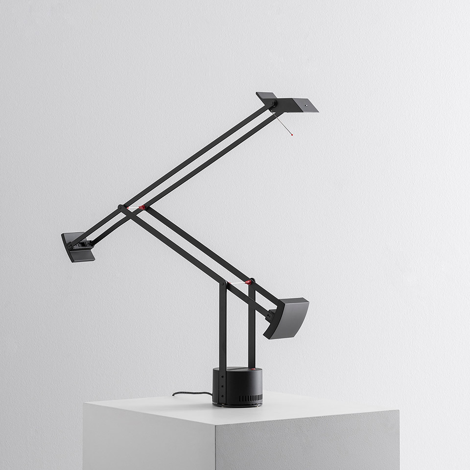

*图：Tizio（Richard Sapper, 1972）黑色款整体，斜向双臂平衡姿态与圆盘底座。图源：[Artemide Tizio 官方产品页](https://www.artemide.com/en/subfamily/18869/tizio)。*

平衡机构用配重而非弹簧，靠重量与比例定位，灯可以停在任意位置；关节做成可脱开的按钮式，万一跌落，关节先脱开而不是断裂。灯头黑色铸铝壳同时承担卤素灯散热职能。那根红球止摆杆是为丹麦市场后加的——当地法规要求灯头翻转时不能直接烫桌面。

Gismondi 在 Tizio 投产 42 年后回顾："我们推出它时，市场上没有任何东西像它，它是革命性的。Tizio 无论处于哪个姿态都好看，它是一个各部分都和谐的物体，你一只手就能移动它，而且始终极其精准。我们这些年不是因为做不到才什么都不改，而是它本来就该是这个样子。"

命名是 Gismondi 起的。他当时开玩笑说，既然项目这么好，可以接着做 Caio 和 Sempronio 作为系列延伸——Tizio、Caio、Sempronio 在意大利语里相当于"张三、李四、王五"。这个系列最终没有真的延展。

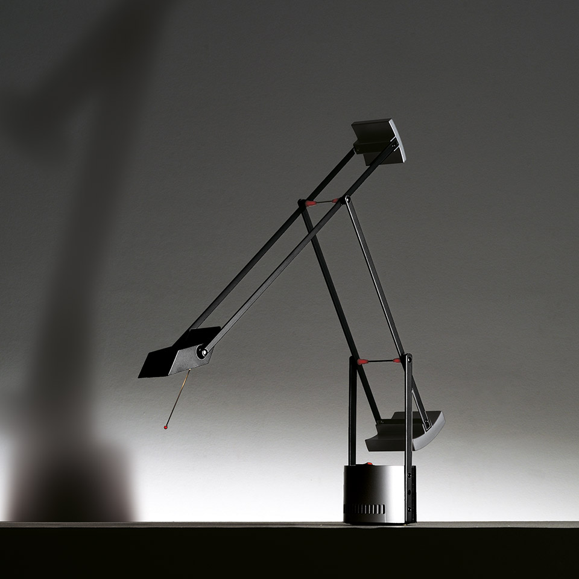

*图：Tizio 双平行臂结构与红色关节件特写。图源：[Artemide Tizio 官方产品页](https://www.artemide.com/en/subfamily/18869/tizio)。*

商业成功比产品本身晚了约十年。MoMA 记载它真正的爆发要等到 1980 年代初——"当它 sleek 的外观遇上华尔街繁荣"，成为年轻新贵公寓与高管办公室的标配。MoMA 1973 年入藏（Object 198.1973），大都会博物馆后来也入藏。需要澄清一个常见误解：**Tizio 并未获得 Compasso d'Oro**。Artemide 官方列出的金罗盘奖产品是 Eclisse（1967）、Tolomeo（1989）、Pipe（2004）、IN-EI（2014）、Discovery（2018），不含 Tizio。

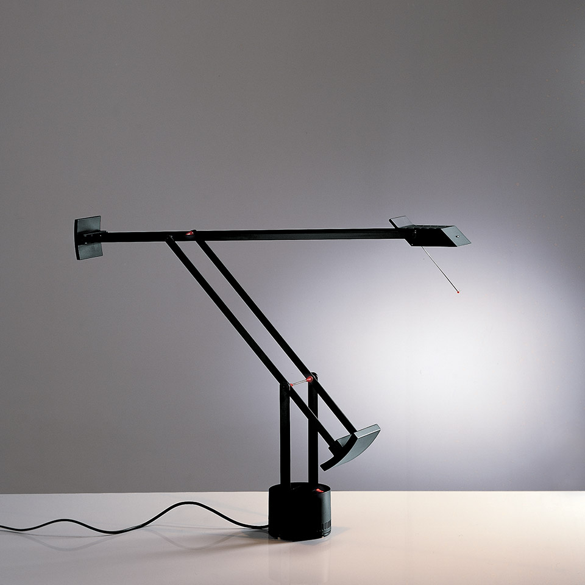

*图：Tizio 横置姿态，可见底座散热竖槽与电源线。图源：[Artemide Tizio 官方产品页](https://www.artemide.com/en/subfamily/18869/tizio)。*

后续迭代走"换芯不换形"路线：Tizio 35、Tizio Micro、Tizio Plus（灯头可额外倾斜）、加底座变落地款 Tizio Floor，以及 2008 年推出的 Tizio LED——外形几乎不变，但取消了红球杆、电源键由红改绿、光源从可换 GY6.35 卤素改为集成 LED。2022 年 50 周年时出过 5000 件红色限量版，丝印 Sapper 签名与编号。

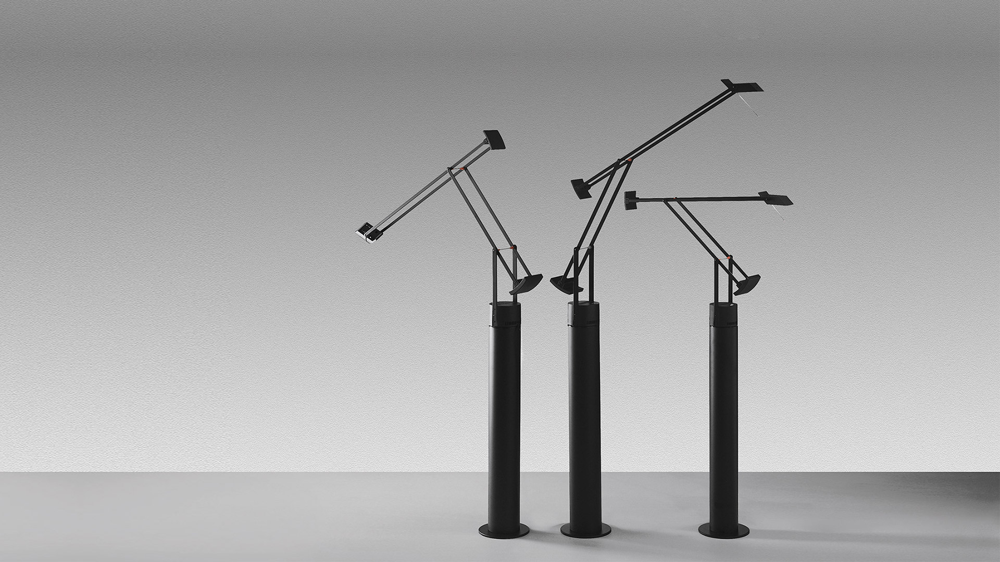

*图：Tizio Floor 加立柱底座的落地版本，三姿态并列。图源：[Artemide Tizio 官方产品页](https://www.artemide.com/en/subfamily/18869/tizio)。*

### Tolomeo（1987）：摇臂台灯的通用解

1980 年代中期，孟菲斯退潮，意大利设计重新走向克制与工程感。Michele De Lucchi 是孟菲斯创始成员之一，他为 Artemide 接下 Tolomeo 时，官方给他的任务是"把一个标志性的、家用的形式，与创新技术和材料结合，并适配尽可能广的使用场景"。他的搭档不是外部自由设计师，而是 Artemide 技术部门负责人 Giancarlo Fassina——设计师与内部工程主管的搭档。

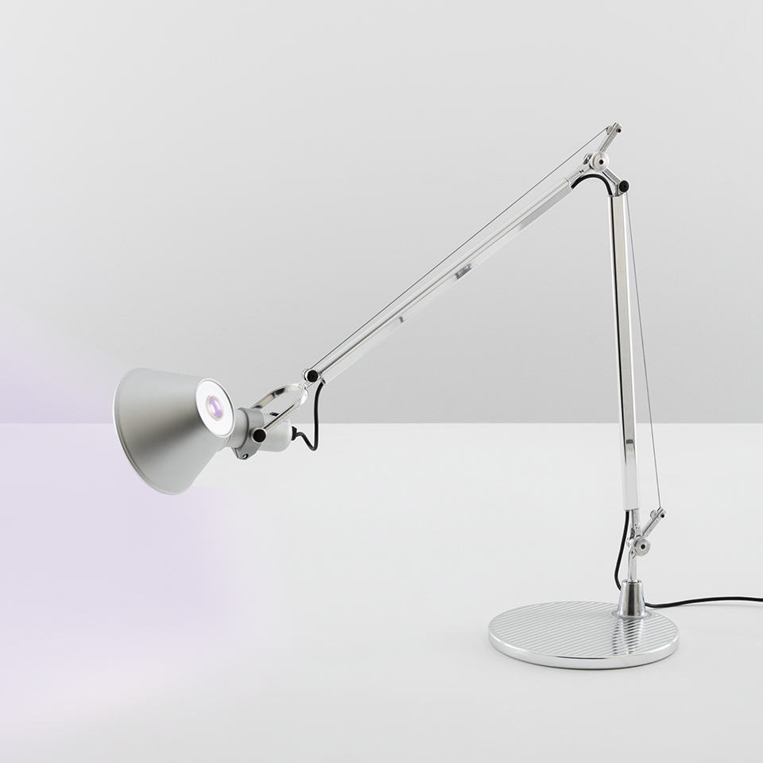

*图：Tolomeo（De Lucchi & Fassina, 1987）桌面镀铬款，条纹圆盘底座与锥形反光罩。图源：[Artemide Tolomeo Table 官方产品页](https://www.artemide.com/en/subfamily/1849546/tolomeo-table)。*

结构上，它用现代挤压铝合金臂、不锈钢拉索与弹簧平衡机构重做了传统悬臂原型——官方手册明确写"System of spring balancing"，灵感指向 Artemide 自己早年的 Naska Loris 以及 George Carwardine 奠定的 Anglepoise 谱系。灯罩可选布艺或铝制反光杯，使同一结构既能呈现柔和漫射，也能定向聚光。视觉上"technically heavy but visually light"——底座与臂都是铝，结构上很重，但看过去很轻。

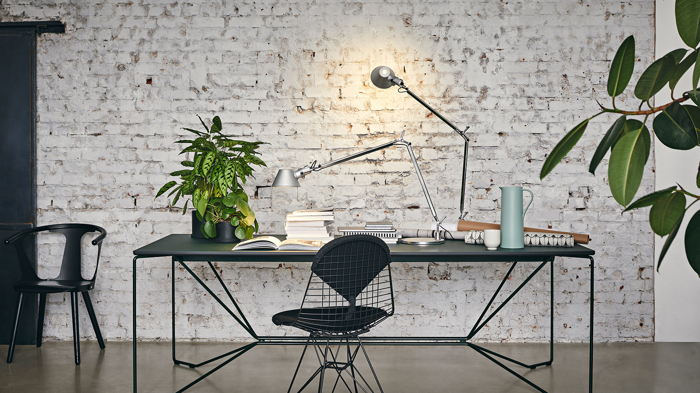

*图：Tolomeo 在办公场景中双臂展开，可见弹簧平衡臂与灯罩关系。图源：[Artemide Tolomeo Table 官方产品页](https://www.artemide.com/en/subfamily/1849546/tolomeo-table)。*

1987 年在米兰 Euroluce 首发即成 bestseller，两年后（1989 年 4 月 12 日）获 Compasso d'Oro。它后来发展为庞大的家族：Table、Mini、Micro、Mega、Terra/Floor、Diffusore Wall、Braccio，以及布艺/铝罩、LED 化版本，覆盖从床头柜到酒店大堂的全部尺度。Mohd 设计媒体称它为"office accessory par excellence"——办公室配件的典范。今天几乎每个设计酒店的书桌上都能见到它。

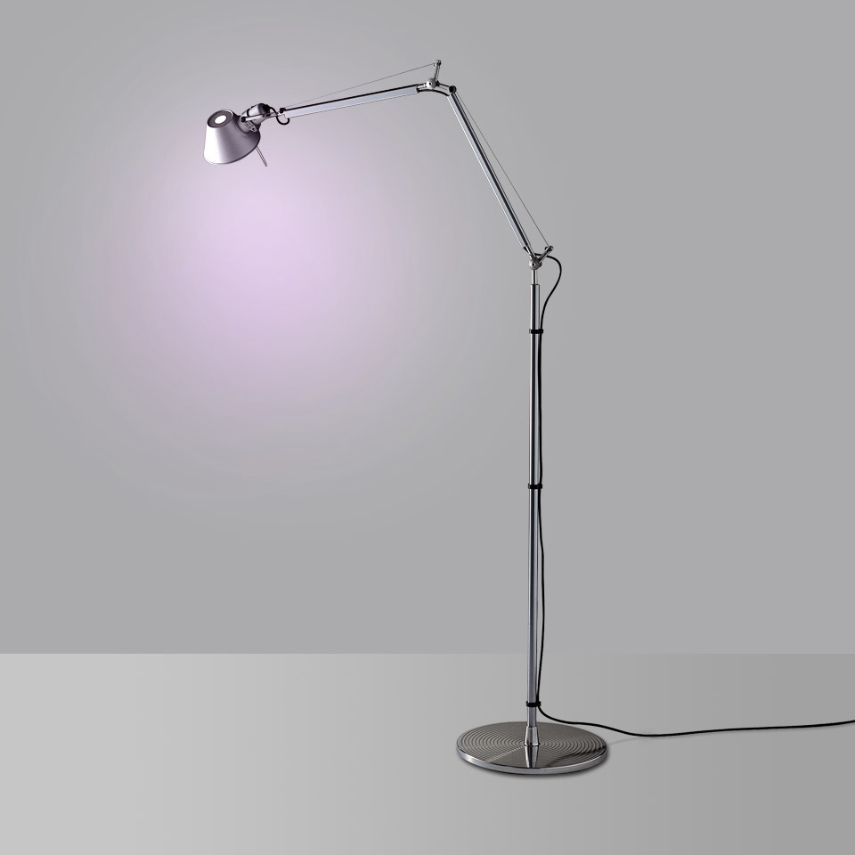

*图：Tolomeo Terra 镀铬落地款，高立杆与圆形底座。图源：[Artemide Tolomeo Floor 官方产品页](https://www.artemide.com/en/subfamily/1846322/tolomeo-floor)。*

它的短板也很具体：布艺灯罩版本积尘、不可拆洗，长期使用后织物边缘易泛黄；因为太成功，市场上出现大量仿制与致敬款，是被抄得最多的摇臂灯之一。

### Nessino / Nesso（1967）：太空时代的蘑菇

1965 年，Giancarlo Mattioli 与他 1961 年在博洛尼亚创立的 Gruppo Città Nuova，参加了 Artemide 与 Domus 合办的设计竞赛，提交了一件受水母启发的灯。竞赛中标，1967 年投产时定名 Nesso——一体式蘑菇形半球穹顶加短柱底座，无外露光源，光从穹顶内漫射而出。材料是注塑 ABS 热塑性塑料，这在当时是把工业材料直接搬进客厅的早期案例。

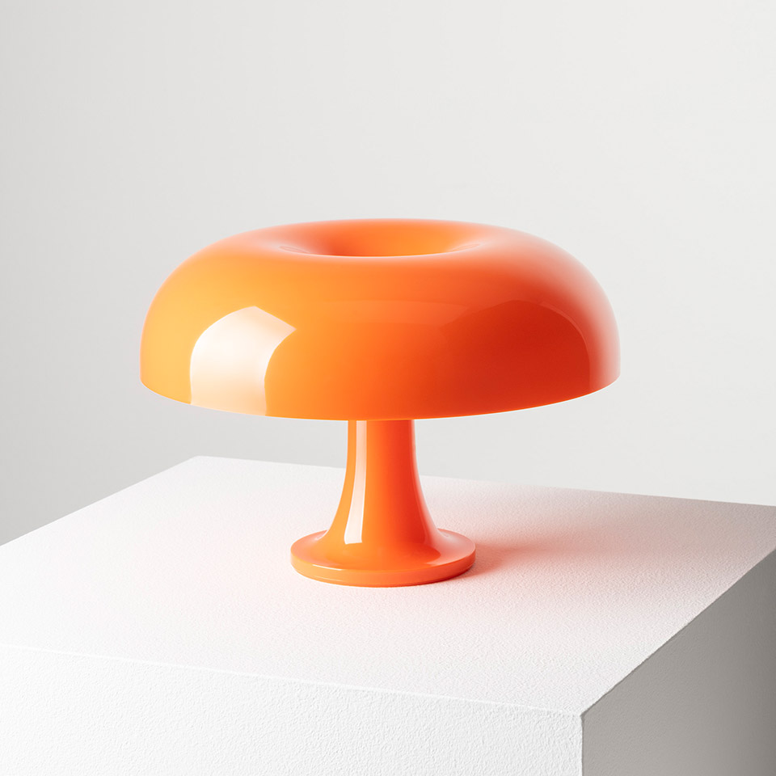

*图：Nessino（Mattioli / Gruppo Città Nuova, 1967）橙色 ABS 蘑菇形台灯。图源：[Artemide Nessino 官方产品页](https://www.artemide.com/en/subfamily/23264/nessino)。*

Nesso 之后出了缩小桌版 Nessino——同形、同 ABS 工艺，尺度更紧凑。Nesso 灯罩直径 54 厘米，Nessino 约 32 厘米。两个版本都进了 MoMA 与大都会博物馆永久馆藏。MoMA 设计商店的描述很直白："像一只天外飞来的蘑菇。"

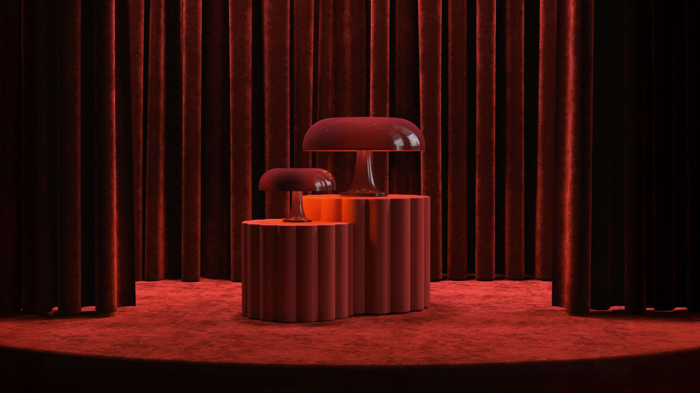

*图：Nessino Ruby Red 特别版场景，含小尺寸 Nessino 与大尺寸 Nesso 的尺度对比。图源：[Artemide Nessino 官方产品页](https://www.artemide.com/en/subfamily/23264/nessino)。*

从 1967 年到今天，Nessino 一直在目录里，颜色从标志性亮橙扩到白、红、绿、浅蓝、淡紫、黄，近年出了 Ruby Red 深红限定版。现行 Nessino 为 16W LED。需要注意：部分零售商把材料写成"聚碳酸酯"，但 Artemide 官方手册明确为 ABS，以官方为准。

### 其余经典

**Logico（Michele De Lucchi & Gerhard Reichert, 2001）**——手工吹制玻璃扩散罩，体量柔和不规则，铝质支架，CRI 100，覆盖 table/wall/ceiling/suspension，可三联组合，用于酒店与办公室项目。

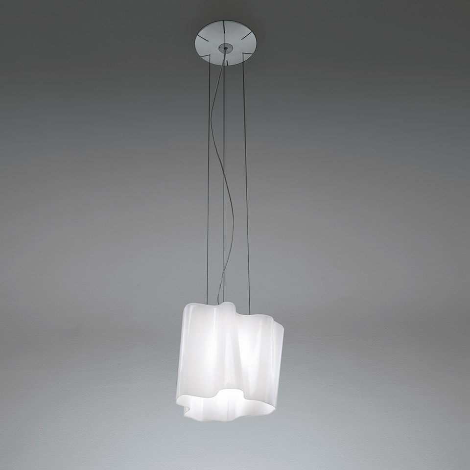

*图：Logico 手工吹制玻璃吊灯，波浪形乳白玻璃灯罩与细吊线。图源：[Artemide Logico 官方产品页](https://www.artemide.com/en/subfamily/22481/logico-sospensione)。*

**Rea（Neil Poulton, 2013）**——两块垂直相交的等大圆形涂漆铝板，一块贴墙作底座，一块内置 LED 光学，以 90% 效率做间接洗光。Poulton 自己调侃它像"企业号星舰"的小反光。

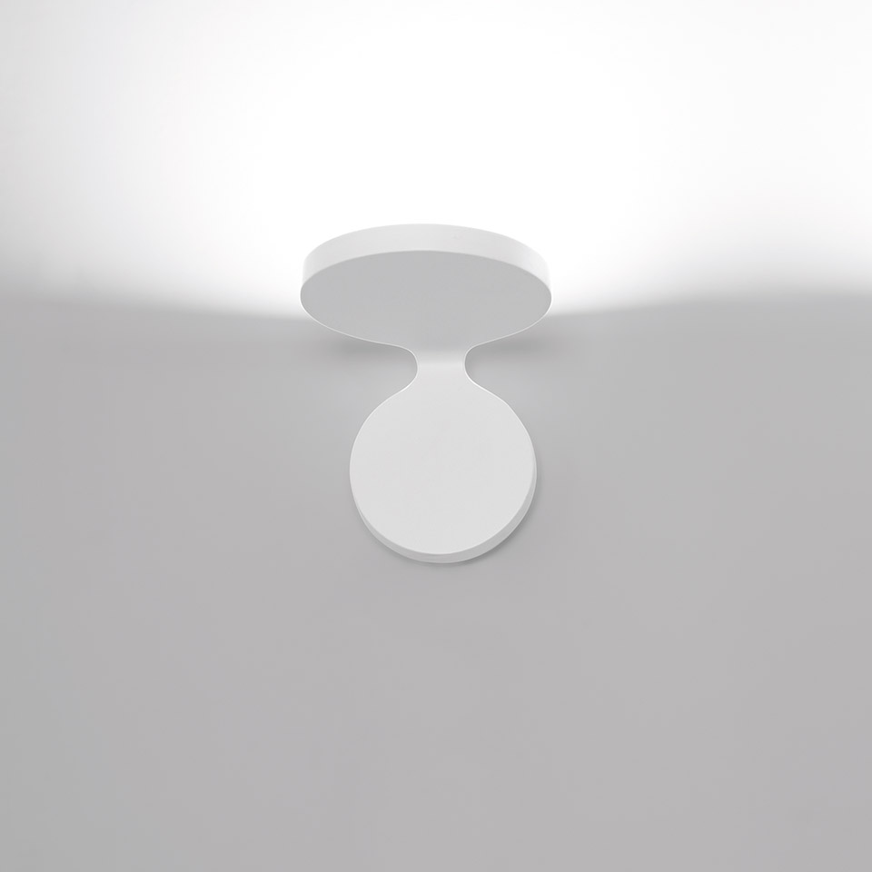

*图：Rea（Neil Poulton, 2013）白色双盘壁灯，两片垂直圆盘做间接洗光。图源：[Artemide Rea 官方产品页](https://www.artemide.com/en/subfamily/1551572/rea)。*

**Melampo（Adrien Gardère, 2000）**——玻璃扩散罩可通过手柄扳动定向，开关在臂上，含桌灯、床头小灯、落地灯等型号。

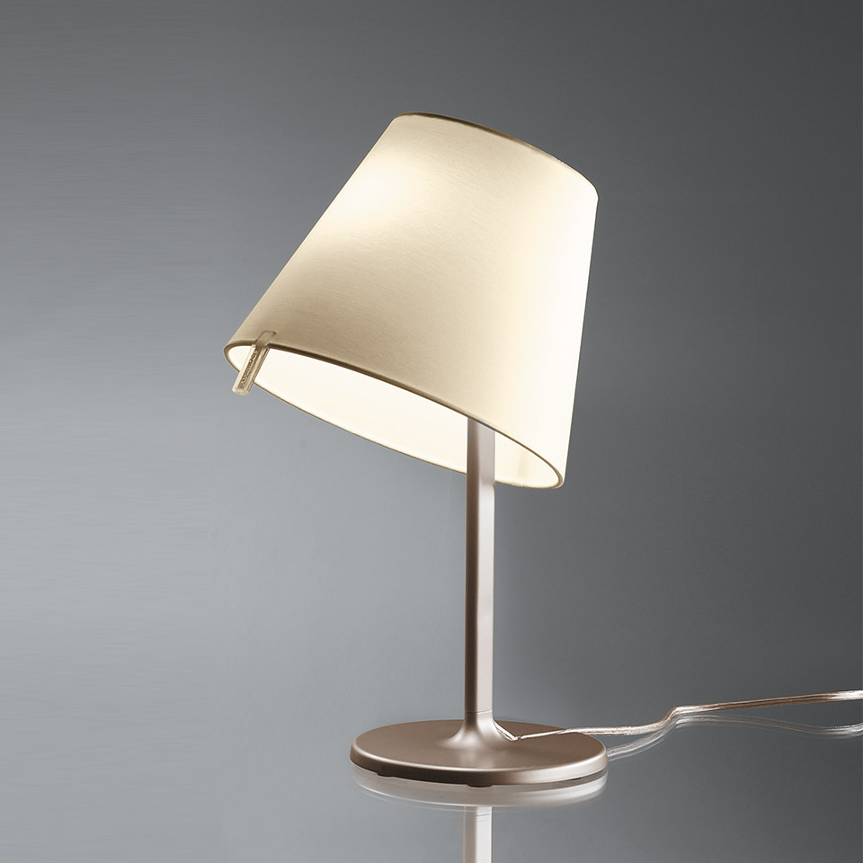

*图：Melampo（Adrien Gardère, 2000）台灯，倾斜丝绸灯罩与青铜色底座。图源：[Artemide Melampo Table 官方产品页](https://www.artemide.com/de/subfamily/23472/melampo-table)。*

另外几款值得一提但本轮未单独配图：Eclisse（Vico Magistretti, 1967，Compasso d'Oro，旋转半球控制三种光）、Sintesi（Gismondi, 1975，他本人第一款署名产品）、Pipe（Herzog & de Meuron, 2004，Compasso d'Oro，建筑吊灯）、IN-EI（Issey Miyake, 2012，2014 年 Compasso d'Oro，折纸式可展开 LED 灯）、Discovery Suspension（Gismondi, 2018，当年金罗盘）。

> 需要澄清：任务书最初提到的"Mezzaluna 半月形洗墙灯"经核实**不是 Artemide 产品**——它是 Bruno Gecchelin 1974 年为 Skipper Milano 设计、后由 DCW éditions 再版的落地灯。Artemide 体系内对应"洗墙/间接光"命题的是 Carlotta de Bevilacqua 设计的 LineaLed Wallwasher（2011）、A.24 Wall Washer 与 Empatia 等建筑线产品。

## 08 Aesthetics 美学：字标、铝与看不见的灯

### 字标与视觉识别

Artemide 的字标由 Emilio Fioravanti 设计，定稿于 1960 年 1 月 11 日。现行标识是全小写的"artemide"，没有独立图形符号——品牌识别几乎完全靠字标本身与产品。这在意大利设计品牌里是少见的克制：FLOS 有花体签名，Foscarini 有手写体，但 Artemide 连图形 logo 都省了。

这种克制延伸到产品本身。产品本体以铝银、哑光黑、哑光白为主色，不染色，不做纹饰。宣传摄影近年用高饱和红或蓝纯色背景衬托金属灯体（Gismondi 那张手持 Nur 灯的官方肖像就是红底），但灯体本身保持原色。

### 光先于灯被设计

Artemide 的美学主张不是"灯长什么样"，而是"光长什么样"。间接光与漫射是它的系统语言：Empatia 的手工吹制玻璃从透到磨砂渐变，目的是"高效扩散而不眩光"；LineaLed Wallwasher、A.24 把光投到墙面或地面再反射；TunableWhite（2006）把色温可调作为情绪载体。它追求的最终状态是"不看见灯，只看见光"。

> 术语注释：CRI——显色指数，衡量光源还原物体真实颜色的能力，满分 100。
> 术语注释：UGR——统一眩光值，CIE 视觉舒适度量指标，越小越不刺眼。

落到光学指标上，这套美学不是形容词：Helgoland 六边形蜂巢屏罩住圆形透镜，官方标 UGR<19、CRI 90；Rea 用两块铝板以 90% 效率做间接洗光；Logico 玻璃扩散罩 CRI 100。

### 材料情绪

铝在 Artemide 的美学里不是"一种材料"，而是"结构+散热+轻量"三职合一的存在。挤压铝做臂身与线性型材，压铸铝做关节、张力旋钮、灯头与 LED 散热座，铝涂层钢板做 Tolomeo 的配重底座。抛光压铸铝、阳极氧化铝臂、喷漆黑/白——表面处理本身就是情绪，不再叠加纹饰。Artemide 官方 Architectural 目录有一句话可以当美学纲领："products do not conform to trends or fads"（产品不追随潮流或风尚）。

玻璃走两端。一端是硼硅玻璃与 PMMA 的工程件，另一端是 1991 年收购 VeArt 后保留的穆拉诺式吹制玻璃手工线——Empatia 的扩散罩就是这条线的产物。这种"数百年手工技艺与前沿科技并置"的做法，在意大利设计照明里是 Artemide 独有的纵向整合。

### 空间与展厅

米兰旗舰店在 Brera 区 Corso Monforte 19，是米兰设计周的主展场之一；纽约 Soho 展厅在 Greene Street；全球 14 家单品牌展厅。2021 年 Pregnana 总部新开的 Exhibition Centre 由 Mario Cucinella Architects 设计，永久陈列但持续更新。Euroluce 展位近年由 OBR 等建筑事务所操刀——展厅不是卖货的背景板，而是品牌美学的延伸。

## 09 Design 设计：工程师的光

### 品牌眼中的"设计"

Artemide 把设计理解为"把光当成人的需求来工程化"，而不是"把灯具当成造型对象"。1996 年的 The Human Light 宣言是这条哲学的正式文本，由 Carlotta de Bevilacqua 主导提出。2008 年目录对它的展开定义是：设计光以陪伴人的日常活动、顺应情绪、贡献个体福祉，同时以最高的视觉精度、最低的环境资源消耗为约束。

> 术语注释：téchne——古希腊词，指技艺与制作的艺术，区别于知识（episteme）。

de Bevilacqua 在 2023 年可持续报告卷首写："Artemide 六十年来一直在设计和生产光设计……正是'意大利'这个词把我们带回到设计诞生的地方。设计意味着一个项目，它总是诞生于科学研究、人文视野、制造与'téchne'（制作的技艺）的综合。"

### 站队：技术先行，形式让路

Artemide 在功能、形式、情感、技术、时间之间的站队可以概括为：技术与光学精度先行，形式为光让路，情感来自"被照顾"而非装饰，时间维度以超长在售周期和可维修为承诺。

这个站位落到具体产品决定：Tizio 用 12V 低压安全换结构极简——臂作导体取消外露电线，用配重换桌面干净（免夹具）；Tolomeo 用弹簧+钢缆平衡机构换"任意位置悬停"的机械体验，而不是 Tizio 式的纯配重；de Bevilacqua 的洗墙体系用悬挑挡板遮住灯具内部、把光导向被照面，追求"不看见灯、只看见光"。

Gismondi 的航空工程背景是这套哲学的根源。他持有航空工程与导弹工程两个学位，1964–1984 年在米兰理工教火箭发动机。2018 年 ADI 给他颁 Compasso d'Oro 终身成就奖时的授奖词原文是："Aerospace engineer, university lecturer and entrepreneur, in short: man of multifaceted talent."（航空工程师、大学讲师与企业家，简言之：多才多艺之人。）这种背景在产品上留下了痕迹：官方称 2016 年单年即申请 10 项发明专利；LED 时代用压铸/挤压铝同时做臂、关节、外壳和散热片；光学与电子的原型和认证全部在米兰总部的国际认证测试实验室完成。

### CMF 的决策逻辑

| 材料 | 典型用途 | 决策逻辑 |
|---|---|---|
| 挤压铝 | Tolomeo 臂身、LineaLed 线性型材、A.24 本体 | 结构+刚性+轻量+散热 |
| 压铸铝 | 关节、张力旋钮、灯头、LED 散热座 | 复杂形状一次成型+散热 |
| 铝涂层钢板 | Tolomeo 配重底座 | 重量压舱，外观仍铝 |
| ABS 注塑 | Nessino（1967） | 一体化大造型，工业材料进家居 |
| 手工吹制威尼斯玻璃 | VeArt/Vetrofond、Empatia 扩散罩 | 自有产能，手工质感 |
| 布艺灯罩 | Tolomeo 经典版 | 柔和漫射 |

铝在 LED 时代获得了额外的正当性：官方技术页原话是"integral heat sink made of die-cast or extruded aluminum for optimal heat dissipation"（由压铸或挤压铝制成的整体散热座，实现最佳散热）。也就是说，铝不再只是"看起来高级"，而是 LED 长寿的前提。

### 制造与质量

生产布局以意大利为核心：Pregnana 总部（含 Innovation & Design Center、研发、产品开发与国际认证实验室）、Telgate（Bergamo 省）工厂、Vetrofond 玻璃厂（Casale sul Sile，Artemide 持股 50%）；海外有匈牙利 Paks、法国 Saint Florent、加拿大 Montreal。595 名员工中约 50 人做研发与产品开发。2023 年研发投入占营收 4.7%。

手工环节集中在玻璃吹制与高端组装；金属件以压铸、挤压、阳极氧化为主。2015 年开放的新 Innovation Center 配备经国际认证机构认可的测试实验室，集中式产品开发流程在米兰总部完成。北美消费者享 5 年质保（需购买后 2 个月内注册）。

### 可持续与备件

2019 年发布首份可持续发展报告，遵循 GRI 标准，同年再次签署联合国 Global Compact。Tolomeo LED 官方自述为"可持续符号：长寿命、使用再生与可回收材料、易于维护和拆解"。更实际的承诺在备件体系——德国 light11 等经销商明确把"原厂备件"当卖点，Tolomeo 的臂、关节、弹簧、钢缆、底座都能单独买到；Tizio 的备件在 light11.de 也有专页。机械部分按"维修而非更换"设计，这在快消灯具行业很少见。

### 品牌主张与产品落点

| 品牌主张（一句式） | 对应产品落点 |
|---|---|
| 光服务于人，而非产品本身 | The Human Light 宣言（1996）；Sui/Kaio LED（2000）；TunableWhite（2006）；INTEGRALIS（2020） |
| 用低压安全换结构极简 | Tizio（1972）：12V 臂作导体，无外露电线 |
| 任意位置悬停的机械体验 | Tolomeo（1987）：弹簧+钢缆平衡机构 |
| 不追随潮流，材料即情绪 | 全产品线：铝银/哑光黑/白，无纹饰；官方 Architectural 目录明言 |
| 长寿命与可维修 | Tizio/Tolomeo 备件长期供应；北美 5 年质保；Tolomeo LED 易拆解设计 |
| 手工玻璃与工程科技并置 | VeArt/Vetrofond 自有玻璃厂（1991 起）；Empatia 吹制扩散罩 |
| 光质量先于造型 | Helgoland UGR<19、CRI 90；Rea 90% 间接洗光效率；Logico CRI 100 |

## 10 Experience 体验：可修的灯与不能修的板

### 品牌体验观

The Human Light 主张光应回应人的情境、时间与使用场景。落到产品体验上，这不是一句空话：Tizio 的两段亮度开关对应"全亮工作/半亮氛围"；Tolomeo 的弹簧平衡让一只手就能把灯头放到任何位置；TunableWhite 把色温从暖到冷作为场景切换。

### 具体机制

选购端，单品牌展厅与建筑项目渠道并重，民用线通过 light11、smow、2Modern 这类授权设计灯具经销商销售。安装端，Tizio/Tolomeo 为插电式即插即用，建筑线为嵌入式/导轨系统。调光端，经典卤素 Tizio 为底座两段式开关，不可外接调光；LED 版 Tizio 底座调光；Tolomeo 用标准 E26/E27 灯口，用户可自换高显色 LED 灯泡。

兑现点有证据。机械可维修：Tolomeo 的弹簧与钢缆作为备件出售，德国维修站 clavino.de 评价"Artemide 供应绳索与弹簧备件，机械是按维修而非更换设计的"。老款长售：Eclisse、Tizio、Nesso、Tolomeo 自上市数十年仍在售。5 年质保在北美注册后生效。

### 断裂点

但 LED 化也带来了新的断裂。德国维修站 lampen-reparatur.com 指出，LED 版本的 Tizio 电路板与驱动多不单卖，备件采购更难、更贵；常见故障点是底座变压器与灯座。也就是说，机械部分按可维修设计，电子部分却走向了"坏了整灯换"。官方说明书还要求更换电源线必须联系 Artemide 服务中心，用户不可自换——这与"长寿命可维修"的品牌主张之间存在张力。

另一个断裂是价格与认知门槛。作为设计奢侈品，民用购买主要走展厅与经销商，线上直选体验弱；Tolomeo 本体不带智能调光，airank.jp 的用户评价称它"是对设计性的投资而非技术"。这不是缺陷，而是定位——品牌没有打算和智能台灯竞争——但确实构成了购买决策上的摩擦。

## 11 Competition 竞品：意大利第一梯队与它的镜像

### 品牌归属

Artemide 不属于任何大型家居集团。它是 Gismondi 家族控制的封闭 S.p.A.，2014 年起持有丹纳塞米兰（Danese Milano），但集团母体本身没有被私募基金或产业资本收购过。这一点在意大利高端照明圈里很突出——它最大的对手 FLOS 2018 年起属于 Flos B&B Italia Group（私募 Investindustrial 与 Carlyle 共有）；Foscarini 2022 年收购了 Ingo Maurer 90%；Luceplan 2010 年起并入 Philips Lighting（今 Signify）；Louis Poulsen 2018 年并入 Flos B&B Italia Group，2026 年 9 月刚被卖给丹麦基金会 Chr. Augustinus Fabrikker。

### 直接竞品

**FLOS** 是最直接的同档对手。1962 年由 Dino Gavina 与 Castiglioni 兄弟以 cocoon 工艺起家，招牌是 Arco（1962，大理石底座摇臂落地灯，底座开孔穿杆以便两人抬运）、String Light、Shot。价格带与 Artemide 几乎完全重叠，Arco 是它的价格天花板。关系：同一梯队里"更偏雕塑/形式实验"的那家，与 Artemide"更偏工程与光技术"互为镜像。

**Luceplan** 与 Artemide 理念最近。1978 年由三位建筑师在米兰创立，传承自 Gino Sarfatti（Arteluce 创始人）一脉，招牌 Costanza 台灯（Rizzatto, 1986）。它更偏建筑师理性照明，2010 年后并入 Signify，工业集团背景更重。

**Foscarini** 1981 年创立于穆拉诺岛，从 contract 工程定制吹玻灯起家，招牌 Twiggy（Marc Sadler, 2006）、Mite。风格更感性、更偏吹玻与有机形态。2022 年收购 Ingo Maurer 90% 股权。

**Oluce** 1945 年创立，自称意大利现存最老的设计灯具公司，Vico Magistretti 任艺术总监，招牌 Atollo（1977，圆柱+圆锥+半球三几何台灯）。体量比 Artemide 小，走老派几何再版路线。

**Nemo Lighting** 1993 年创立，招牌是把 Le Corbusier、Charlotte Perriand、Vico Magistretti 当年为特定建筑画的灯具首次量产，走"现代主义大师未投产图纸的官方出版方"路线，与 Artemide 错位。

### 同场景关联品牌

**Ingo Maurer**（德国慕尼黑，2022 年起 Foscarini 持股 90%）人称"光之诗人"，招牌 YaYaHo、Lucellino、Zettel'z，语言极实验、装置感强，价格常高于 Artemide 量产款。**Louis Poulsen**（丹麦，2026 年 9 月起属 Chr. Augustinus Fabrikker 基金会）是"北欧半遮光/无眩光哲学"代表，PH 三层消光系统，与 Artemide 的意大利雕塑+直接光美学形成对照。**Tom Dixon**（英国）走工业手工与材料实验路线，入门款比 Artemide 略低。**Moooi**（荷兰）走折衷戏剧与叙事装饰路线，是同展厅里的风格反差项。

### 竞品矩阵

| 品牌 | 国家/归属 | 招牌经典 | 与 Artemide 的定位差异 |
|---|---|---|---|
| FLOS | 意大利 · Flos B&B Italia Group | Arco(1962)、String Light | 同档，更偏雕塑/形式实验 |
| Foscarini | 意大利 · Urbinati/Vecchiato | Twiggy(2006)、Mite | 更感性，穆拉诺吹玻与有机形态 |
| Luceplan | 意大利 · 2010 起属 Signify | Costanza(1986)、Mesh | 建筑师理性照明，理念最近 |
| Oluce | 意大利 · Verderi 家族 | Atollo(1977)、Spider(1967) | 体量小，老派几何再版 |
| Nemo | 意大利 · Palazzari | Le Corbusier Applique de Marseille | 大师图纸官方量产，错位 |
| Ingo Maurer | 德国 · 2022 起 Foscarini 持股 90% | YaYaHo、Lucellino、Zettel'z | 实验/装置语言，价格更高 |
| Louis Poulsen | 丹麦 · 2026 起 Chr. Augustinus | PH Artichoke、PH 5 | 北欧半遮光/无眩光哲学 |
| Tom Dixon | 英国 · 独立 | Melt(2015)、Beat(2005) | 工业手工，入门略低 |
| Moooi | 荷兰 · Wanders 主导 | Random Light、Raimond | 折衷戏剧，风格反差 |

## 12 Strategy 战略：家族制、长寿命与技术换道

### 技术路线与产品规划

Artemide 的技术换道节奏清晰：1972 年把卤素灯从汽车大灯引进民用（Tizio）；2000 年推出最早两盏 LED 灯 Sui 与 Kaio，官方称"LED 革命"；2006 年 TunableWhite 可调色温；2016 年启动 Li-Fi 与 IoT 照明研究，2017 年发布 Artemide App；2020 年推出把照明与消毒合一的 INTEGRALIS。这条路线的逻辑是：每一代光源更替时，Artemide 都不是被动跟进，而是把新产品线变成"Human Light"理念的新证据。2023 年研发投入占营收 4.7%，对一家 1.1 亿欧元营收的公司来说不算低。

### 定位与品类路线的演进

从 1960 年代的"新材料家居物件"，到 1970–80 年代的"平衡臂工程台灯"，到 1996 年后的"光的质量与人体工学"，再到 2000 年后的"LED 智能照明系统"，Artemide 的定位一直在向"光的科学"一端移动，但从未放弃经典再版这条现金流与声望线。它横跨装饰与建筑两端的结构，在意大利同行里几乎独一份——这意味着它同时吃住宅设计零售与酒店/办公项目两块饭，抗单一周期风险。

### 设计语言与材料体系的演进

早期是塑料（Nessino 的 ABS）与吹制玻璃；1970 年代后转向铝（Tizio 臂、Tolomeo 臂）；LED 时代铝获得"散热结构件"的正当性，压铸铝与挤压铝成为绝对主力；1991 年收购 VeArt 后，手工吹制玻璃作为第二条材料线保留下来。设计语言从 1960 年代太空时代的有机塑料形，转向 1970 年代后的精密工业形，再转向 2000 年后的"看不见灯"的洗墙与间接光系统。

### 品牌影响力与行业坐标

自 1960 年累计获 306 项设计奖。Compasso d'Oro 获奖清单：1967 Eclisse、1989 Tolomeo、1995 公司终身成就、2004 Pipe、2014 IN-EI、2018 Gismondi 终身成就 + Discovery。MoMA、The Met、Vitra Design Museum 均有馆藏。全球 14 家单品牌展厅，产品销往 107 国，海外收入占 77.2%。Four Seasons、KPMG、Vodafone、HSBC 等项目案例构成了项目渠道的标杆背书。

### 关键取舍与风险（置信度：中）

Artemide 的核心战略取舍是"不被集团收购、坚持家族独立"。这让它能按自己的节奏做超长在售周期与备件体系，但也意味着它必须靠自有现金流支持研发——2023 年营收 1.115 亿欧元、同比略降（2022 年为 1.13 亿），在欧洲设计家居行业普遍承压的背景下，独立性既是护城河也是财务约束。

另一个风险是 LED 化后的电子维修问题。机械部分按可维修设计，驱动与电路板却走向"坏了整灯换"，这与品牌"长寿命、可拆解"的主张存在张力。第三个风险是经典款的仿制——Tolomeo 是被抄得最多的摇臂灯之一，二级市场上大量致敬款以零头价格分流预算敏感客户。Artemide 的应对不是法律战，而是靠品牌声望、备件体系与项目渠道维持溢价，这个策略在高端段有效，但在中端市场会持续承压。

## 13 视频与访谈资料

- Tizio 50 周年官方专题（含 Sapper 设计故事与 Gismondi 回顾）：[Artemide Journal: Tizio 50 Years](https://www.artemide.com/en/journal/55/tizio-50-years)
- Ernesto Gismondi 官方设计师页（官方肖像与作品年表）：[Artemide Designers: Ernesto Gismondi](https://www.artemide.com/en/company/designers/231/ernesto-gismondi)
- Carlotta de Bevilacqua 官方设计师页：[Artemide Designers: Carlotta de Bevilacqua](https://www.artemide.com/en/company/designers/19607/carlotta-de-bevilacqua)
- Dezeen 讣告：Ernesto Gismondi 去世（2021-01-02）：[Dezeen 报道](https://www.dezeen.com/2021/01/02/artemide-group-founder-ernesto-gismondi-dies-89/)
- MoMA Tizio 馆藏页（含 Sapper 原话与 Object number）：[MoMA Collection: Tizio](https://www.moma.org/collection/works/2599)
- Tolomeo 设计史（Mohd Inspire）：[Artemide's Tolomeo: A History of Italian Design](https://inspire.mohd.it/en/artemides-tolomeo-a-history-of-italian-design/)
- Carlotta de Bevilacqua《Interni》访谈（2018 年 11 月，PDF）：[Artemide Benelux 存档](https://www.artemide-benelux.com/contents/documenti/static/designer/Interni_Novembre_2018.pdf)
- 2023 可持续发展报告（含 Human Light 宣言原文、治理架构、生产布局）：[Artemide Sustainability Report 2023](https://www.artemide.it/es/publications/downloadFile?id=100)

## 14 来源与延伸阅读

### 官方资料

- Artemide 官网公司史时间线：[artemide.com/en/company/identity](https://www.artemide.com/en/company/identity)
- Artemide 北美站关于我们：[artemide.net/en/about-us](https://www.artemide.net/en/about-us/)
- Tizio 官方产品页：[artemide.com/en/subfamily/18869/tizio](https://www.artemide.com/en/subfamily/18869/tizio)
- Tolomeo Table 官方产品页：[artemide.com/en/subfamily/1849546/tolomeo-table](https://www.artemide.com/en/subfamily/1849546/tolomeo-table)
- Nessino 官方产品页：[artemide.com/en/subfamily/23264/nessino](https://www.artemide.com/en/subfamily/23264/nessino)
- 2023 可持续发展报告：[artemide.it publications](https://www.artemide.it/es/publications/downloadFile?id=100)
- Tizio 50 周年官方专题：[artemide.com/en/journal/55/tizio-50-years](https://www.artemide.com/en/journal/55/tizio-50-years)

### 集团与公司治理

- Carlotta de Bevilacqua 设计师页：[artemide.com](https://www.artemide.com/en/company/designers/19607/carlotta-de-bevilacqua)
- Carolina Gismondi de Bevilacqua 设计师页：[artemide.com](https://www.artemide.com/en/company/designers/4673789/carolina-gismondi-de-bevilacqua)

### 设计媒体与奖项

- Dezeen：Ernesto Gismondi 讣告：[dezeen.com](https://www.dezeen.com/2021/01/02/artemide-group-founder-ernesto-gismondi-dies-89/)
- Dezeen：Genesy by Zaha Hadid for Artemide (2009)：[dezeen.com](https://www.dezeen.com/2009/04/27/genesy-by-zaha-hadid-for-artemide/)
- Mohd Inspire：Tolomeo 设计史：[inspire.mohd.it](https://inspire.mohd.it/en/artemides-tolomeo-a-history-of-italian-design/)
- Design Diffusion：Ernesto Gismondi 回顾：[designdiffusion.com](https://designdiffusion.com/en/2021/01/02/ernesto-gismondi-artemide-and-the-revolution-of-light/)

### 博物馆馆藏

- MoMA Tizio 藏品页（Object 198.1973）：[moma.org/collection/works/2599](https://www.moma.org/collection/works/2599)
- MoMA 馆藏检索（Artemide）：[moma.org search](http://www.moma.org/search/?bucket=2&query=artemide)

### 第三方测评与口碑

- Hertfordshire Lighting：Tolomeo 评测：[hertfordshire-lighting.com](https://hertfordshire-lighting.com/artemide-desk-lamps-a-review-of-the-italian-designed-tolomeo-lamp/)
- lampen-reparatur.com：Tizio LED 常见故障点与维修：[lampen-reparatur.com](https://www.lampen-reparatur.com/2026/02/12/reparatur-einer-artemide-tizio-lampe-typische-schwachstellen/)
- clavino.de：Tolomeo 备件与可维修性：[clavino.de](https://clavino.de/zuhause/schreibtischlampe-design/)
- airank.jp：Tolomeo 用户评价聚合（C 级）：[airank.jp](https://airank.jp/product/lighting/artemide-tolomeo)

### 市场与行业数据

- Mordor Intelligence：Decorative Lighting Market：[mordorintelligence.it](https://www.mordorintelligence.it/industry-reports/decorative-lighting-market)
- Straits Research：Decorative Lighting Market：[straitsresearch.com](https://straitsresearch.com/report/decorative-lighting-market)
- Business Research Insights：Architectural Lighting Market：[businessresearchinsights.com](https://www.businessresearchinsights.com/market-reports/architectural-lighting-market-124061)

### 竞品来源

- FLOS 品牌史：[flos.com/en/us/about-us-heritage](https://flos.com/en/us/about-us-heritage.html)
- Foscarini 品牌史：[foscarini.com/en/essere-foscarini](https://www.foscarini.com/en/essere-foscarini/)
- Oluce 品牌史：[oluce.com/en/story](https://www.oluce.com/en/story/)
- Ingo Maurer 媒体资料：[ingo-maurer.com/en/info/press](https://www.ingo-maurer.com/en/info/press/)
- Louis Poulsen 品牌史：[louispoulsen.com](https://www.louispoulsen.com/en/private/about-us/heritage)
- Kromann Reumert：Flos B&B Italia Group 出售 Louis Poulsen 交易记录：[kromannreumert.com](https://kromannreumert.com/en/deals-cases/flos-bb-italia-group-sells-lighting-manufacturer-louis-poulsen)

## 15 分析附录

### A. 产品组合矩阵

| 层级 | 代表产品 | 角色 | 价格带（量级） | 在售状态 |
|---|---|---|---|---|
| 现代经典 | Tizio(1972) | halo / 声望 | $630–1,205 | 长期在售，LED 化 |
| 现代经典 | Tolomeo(1987) | hero / 走量 | €231–2,185 | 家族化，长期在售 |
| 现代经典 | Eclisse(1967) | 经典/收藏 | €215 | 长期在售 |
| 现代经典 | Nesso/Nessino(1967) | 经典/入门设计款 | €210–375 | 长期在售，特别色版 |
| 现代经典 | Alfa(1959) | 历史符号 | — | 再版 |
| 现代经典 | Sintesi(1975) | 经典 | — | 2025 再版 |
| 当代设计 | Logico(2001) | 项目/酒店 | 中高 | 在售 |
| 当代设计 | Melampo(2000) | 住宅 | 中 | 在售 |
| 当代设计 | Rea(2013) | 建筑壁灯 | 中 | 在售 |
| 当代设计 | Empatia / A.24 / LineaLed | 建筑洗墙 | 高 | 在售 |
| 建筑系统 | Pipe(2004) | 项目/金罗盘 | 高 | 在售 |
| 建筑系统 | Alphabet of Light | 工程线性 | €1,485 | 在售 |
| 合作旗舰 | IN-EI(2012, 三宅一生) | halo/金罗盘 | 高 | 在售 |
| 合作旗舰 | Discovery(2018, Gismondi) | 金罗盘 | 高 | 在售 |

### B. CMF 速查

| 材料 | 表面处理 | 典型产品 | 感知 |
|---|---|---|---|
| 挤压铝 | 阳极氧化/喷漆黑白 | Tolomeo 臂、LineaLed | 精密、轻、技术 |
| 压铸铝 | 抛光/喷塑 | 关节、灯头、散热座 | 厚重、工业 |
| ABS 注塑 | 光面彩色 | Nessino/Nesso | 太空时代、趣味 |
| 手工吹制玻璃 | 透明/磨砂渐变 | Empatia、Logico、Vetrofond 线 | 手工、诗意 |
| 布艺 | 半透织物 | Tolomeo 布艺罩 | 柔和、居家 |
| 钢材（铝涂层） | — | Tolomeo 底座配重 | 稳定、压舱 |

### C. 定位对照（简化）

| 维度 | Artemide | FLOS | Luceplan | Ingo Maurer |
|---|---|---|---|---|
| 核心方法 | 工程+光质量 | 雕塑+形式实验 | 建筑师理性照明 | 装置+诗意 |
| 结构归属 | Gismondi 家族独立 | Flos B&B Italia Group | Signify | Foscarini 持股 90% |
| 招牌产品 | Tizio/Tolomeo/Eclisse | Arco/String Light | Costanza | YaYaHo/Zettel'z |
| 装饰 vs 建筑 | 两端横跨 | 偏装饰 | 偏建筑 | 偏装置 |
| 再版策略 | 超长在售+备件 | 经典再版 | 经典再版 | 限量/装置 |

### D. 证据登记

| 结论 | 证据 | 来源 | 来源类型 | 置信度 |
|---|---|---|---|---|
| 1960 年创立于米兰，1972 年 Pregnana 工厂启用 | 官方时间线原文 | artemide.com/en/company/identity | 官方 | 高 |
| Tizio 臂作 12V 低压导体 | MoMA 藏品页+官方 50 周年文 | moma.org / artemide.com | 官方+博物馆 | 高 |
| Tizio 未获 Compasso d'Oro | 官方获奖清单不含 Tizio | artemide.com | 官方 | 高 |
| Mezzaluna 非 Artemide 产品 | 多轮检索无 Artemide 同名产品；DCW/Gecchelin 再版页 | designboom / 1stdibs | 第三方媒体 | 高 |
| Gismondi 家族控制，无外部 PE | 多轮检索无收购记录；2023 可持续报告治理章 | artemide.com 2023 报告 | 官方+检索排除 | 高 |
| Carlotta de Bevilacqua 任 President & CEO | 官网公司页署名+2023 报告扉页 | artemide.com | 官方 | 高 |
| 2023 年营收 1.115 亿欧元 | 2023 可持续报告 | artemide.it | 官方 | 高 |
| Tolomeo 1989 年获 Compasso d'Oro | 官方+Mohd 日期细节 | artemide.net / inspire.mohd.it | 官方+设计媒体 | 高 |
| LED 版 Tizio 电子件难维修 | 德国维修站具体故障点 | lampen-reparatur.com | 专家/维修站 | 中 |
| 全球装饰照明约 700–800 亿美元 | Mordor/Straits/MRF 估算（口径不一） | 第三方机构 | 市场数据 | 方向性 |
| Luceplan 2010 年起属 Signify | 2015/2016 产品目录 | berhin.be 目录 PDF | 第三方目录 | 中（近年是否易手待核） |
| Ron Arad 未与 Artemide 合作 | Archiproducts 设计师页无 Artemide 条目 | archiproducts.com | 第三方数据库 | 中 |
