# ABOUT MUUTO

更新于 2026-09-24  ·  基于 v4.4

目录

|  |  |
|---|---|
| [01 开篇](#01-开篇) | [09 Design 设计：五种原则落到材料与结构](#09-design-设计五种原则落到材料与结构) |
| [02 品牌概述](#02-品牌概述) | [10 Experience 体验：从展厅到十年使用](#10-experience-体验从展厅到十年使用) |
| [03 Brand 品牌：从一个芬兰语单词开始](#03-brand-品牌从一个芬兰语单词开始) | [11 Competition 竞品：同价位带上的北欧设计](#11-competition-竞品同价位带上的北欧设计) |
| [04 Category 品类与市场：价位带与口径](#04-category-品类与市场价位带与口径) | [12 Strategy 战略：产品与品牌层面的判断](#12-strategy-战略产品与品牌层面的判断) |
| [05 User 用户与场景：谁在决定一件北欧家具](#05-user-用户与场景谁在决定一件北欧家具) | [13 视频与访谈资料](#13-视频与访谈资料) |
| [06 Positioning 定位：熟悉但不同](#06-positioning-定位熟悉但不同) | [14 来源与延伸阅读](#14-来源与延伸阅读) |
| [07 Product 产品：一把椅子引出的产品线](#07-product-产品一把椅子引出的产品线) | [15 分析附录](#15-分析附录) |
| [08 Aesthetics 美学：光、曲线与克制](#08-aesthetics-美学光曲线与克制) |  |

## 01 开篇

一款卖得最好的单人椅，外壳里 80% 的塑料来自眼镜厂的废料。不是回收饮料瓶，也不是海洋塑料——是镜架研磨与注塑过程中剩下的工业边角料，被 Muuto 拿去和 FSC 认证的木纤维混在一起，压成一把椅子的坐壳。眼镜厂的废料并不比别处的废料更干净，选它需要多一道工序：把来源单一、成分稳定的工业废料分类收集，再与木纤维的配比重新标定。品牌愿意付这笔成本，是因为这把椅子每年的销量足够大——只有量大的产品，材料替换才真的能改变一家公司的碳账本。

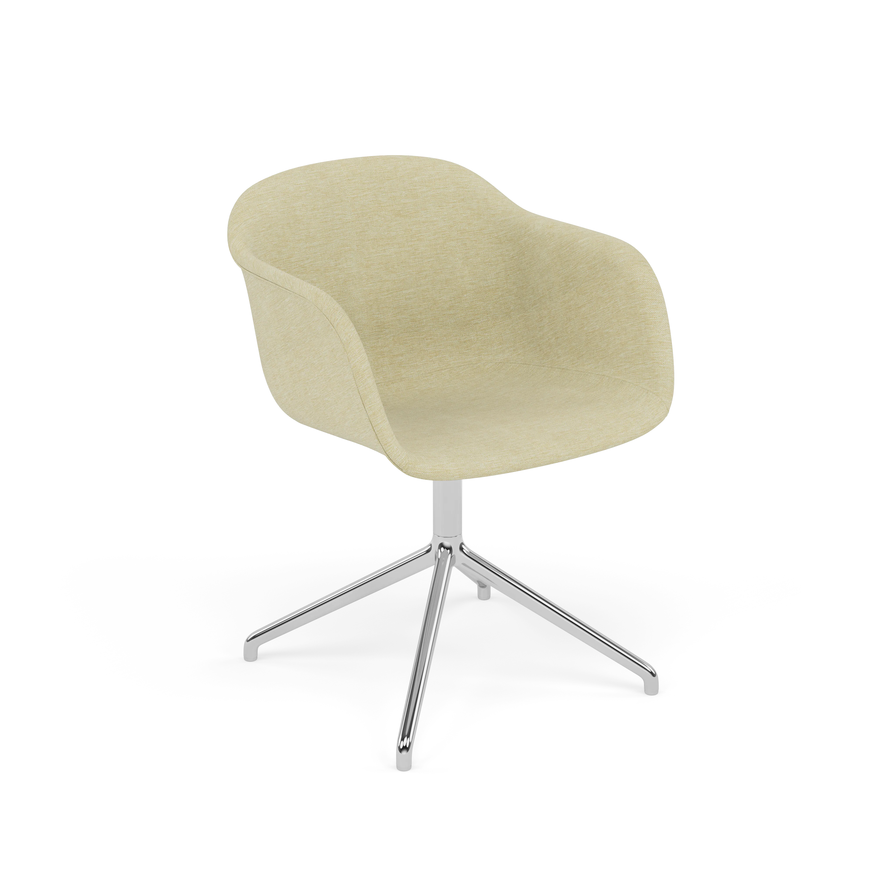

*图：Fiber Armchair 旋转底座款（黏土色外壳、抛光铝底座），外壳由回收塑料与木纤维复合压制。图源：[MUUTO 官网 Fiber 系列页](https://muuto.com/product/Fiber-Armchair-Swivel-Base/)。*

## 02 品牌概述

Muuto 是丹麦哥本哈根的设计品牌，2006 年成立，用芬兰语单词 muutos（新视角）命名，做家具、灯具与家居配件。它的位置可以这样概括：把北欧设计的语言——浅色木材、克制的形体、可长期使用——当作起点而不是答案，然后用新材料、新工艺和更明确的色彩把"熟悉"往前推一步，让产品在住宅与项目市场里同时可用。

| 项目 | 内容 |
|---|---|
| 品牌名 | MUUTO（穆托）· [https://muuto.com](https://muuto.com) |
| 国家/地区 | 丹麦（总部与设计团队位于哥本哈根） |
| 成立时间 | 2006 年由 Kristian Byrge 与 Peter Bonnen 创立 |
| 创始人 | Kristian Byrge（此前参与创办哥本哈根餐厅 Noma）、Peter Bonnen |
| 代表性设计人物 | Anderssen & Voll、Iskos-Berlin、Thomas Bentzen、TAF Studio、Cecilie Manz、Lars Tornøe、Mika Tolvanen、Julien De Smedt、Benjamin Hubert（Layer）、Earnest Studio、Normal Studio、Form Us With Love、David Geckeler |
| 其他关键人物 | Line Brockmann Juhl（首席营销官，负责设计竞赛与品牌表述）；Susan Magsamen（约翰霍普金斯大学 International Arts + Mind Lab 执行主任，品牌神经美学研究的长期合作者） |
| 官方理念 | "new perspectives on Scandinavian design"（北欧设计的新视角）；产品须"既熟悉又新" |
| 品牌归属 | MillerKnoll（美国上市公司；旗下同时拥有 Knoll、HAY、Design Within Reach、Maharam 等品牌） |
| 核心业务 | 坐具、沙发与模块系统、桌几、收纳系统、灯具、家居配件、户外家具 |
| 经典产品 | Fiber Chair（2014）、Cover 系列、Nerd Chair（2012）、Stacked Storage System、The Dots、Outline 系列、Unfold 灯具、Strand（2019）、In Situ 模块沙发（2020）、Kink 花瓶（2020） |

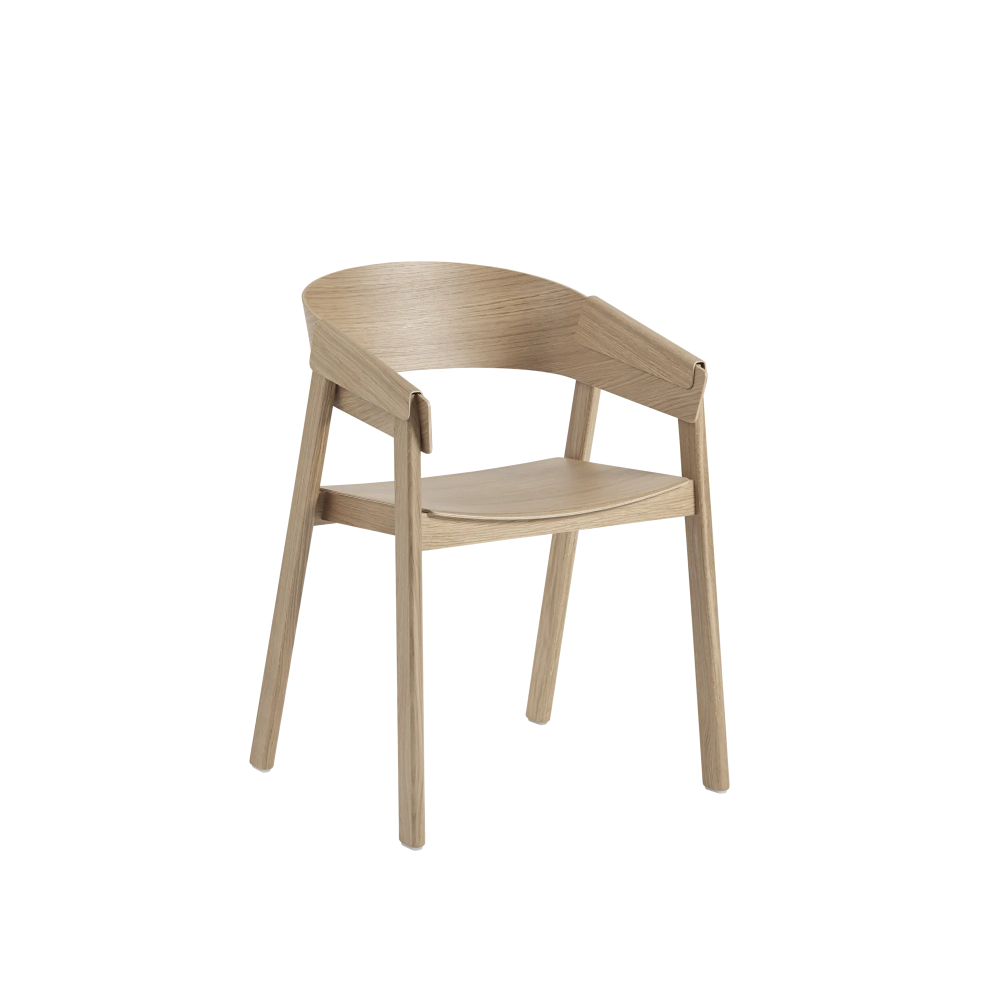

*图：Cover Armchair 橡木款，靠背与扶手由整片木皮折过椅腿折包成型，表面看不到螺钉。图源：[MUUTO 官网 Cover Armchair 产品页](https://muuto.com/product/Cover-Armchair/)。*

## 03 Brand 品牌：从一个芬兰语单词开始

### 2006：丹麦品牌，芬兰语命名

Muuto 成立于 2006 年，两位创始人 Kristian Byrge 与 Peter Bonnen 都不是家具制造出身。品牌名取自芬兰语的 muutos，意思是"新的视角"——官方对这段来历的表述是：他们要找的设计师必须能"用当代的方式重新解读传统"，而不只是复刻北欧经典。这决定了它从第一天起就不是一家工艺传承型公司，而是一家把北欧设计当作材料库来使用的公司。

### 2014–2018：两次资本转折

2014 年 8 月，丹麦投资机构 Maj Invest Equity 买入公司 45% 的股份，用于推动国际化；同年品牌的公开数据是产品经由 1,300 家经销商进入 52 个国家。2017 年 12 月，美国办公家具集团 Knoll 宣布以 3 亿美元收购 Muuto，交易自 2018 年 1 月起生效。这次易主把 Muuto 从一家北欧设计公司变成集团矩阵里的"生活方式品牌"——它的产品从此要同时向住宅零售与集团的项目渠道供货。

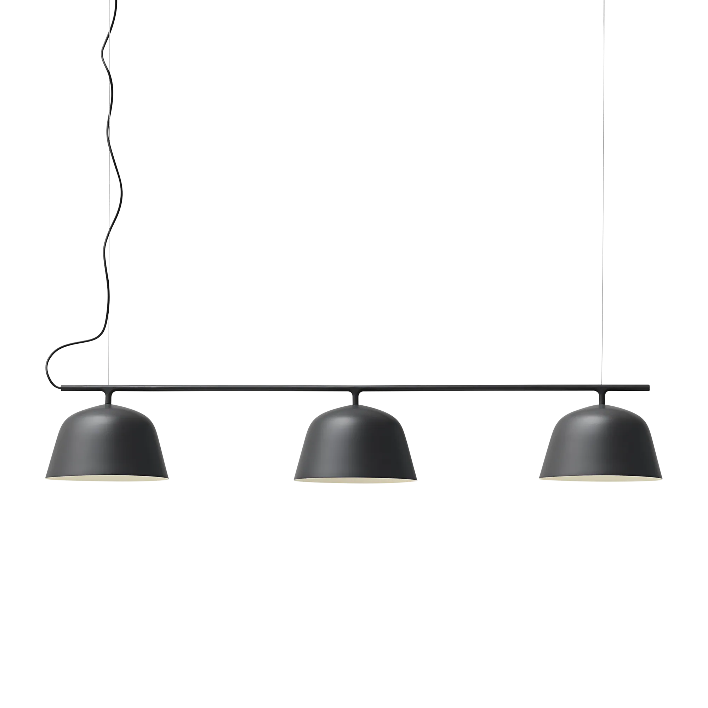

*图：Ambit Rail Lamp（黑色款），灯罩由手工旋压铝制成，内侧白色涂层用于柔化出光。图源：[MUUTO 官网 Ambit Rail Lamp 产品页](https://muuto.com/product/Ambit-Rail-Lamp/)。*

### 2020 年代：材料叙事与项目渠道并行

被并入集团之后，Muuto 的产品线同时向两个方向扩张：一是对外部设计师的持续引入，二是把可持续指标做成可查的数字。2022 年它把最畅销的 Fiber Chair 换成回收塑料外壳，并公开了这款椅子单品的碳足迹变化；2024 年，品牌办了一场面向全球的设计竞赛，评委里出现了 Google 硬件设计副总裁 Ivy Ross 这样的非家具行业名字。在渠道端，它以"Muuto Space"的形式在欧洲、北美与亚洲铺开十几处展示空间，其中上海以预约制接待。

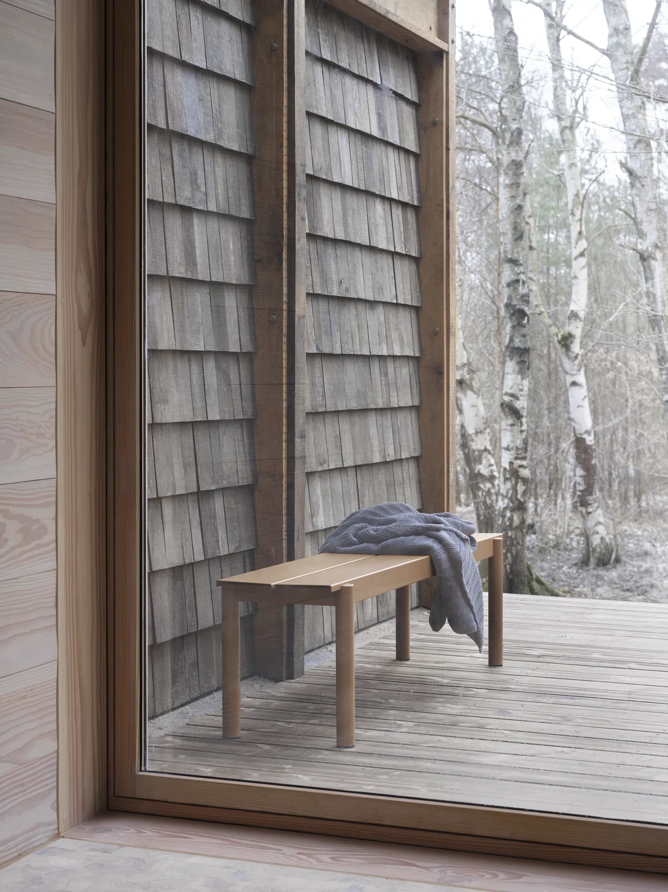

*图：Linear Steel 长凳（橙锈色，170 cm），折边与半圆交叉腿构成座面结构，座板留缝便于排水。图源：[MUUTO 官网 Linear Steel Bench 产品页](https://muuto.com/product/Linear-Steel-Bench/)。*

### 20 年：把周年做成一次全球发行

2026 年是品牌成立二十周年。官方把这一年的动作集中在 3daysofdesign 期间：哥本哈根总部与 Other Circle 两处同时开放，用新发布、编号限量作品、空间装置与对谈把"下一章"作为主题。限量作品不做线上铺货，而是按城市分批落到巴黎、东京、首尔、台北等地的门店，每站数量、开售日期都公开——这是一次典型的品牌动作：不靠降价拉动零售，靠稀缺性与到场体验维持话题。

## 04 Category 品类与市场：价位带与口径

### 品类的定义与边界

Muuto 所在的品类通常被称为"北欧设计家具"（Scandinavian design furniture）：以丹麦、瑞典、芬兰、挪威的设计传统为共同语言，覆盖坐具、桌几、收纳、灯具与配件，价格卡在快销家具之上、经典设计名著之下。这个品类的边界由渠道划出来：它既要出现在设计家具零售店里，也要能进入办公、酒店与教育项目的采购清单。Muuto 的官方产品分区也印证了这一点——坐具、桌、收纳、灯具、配件、户外，每个大类下面都同时存在家用尺寸与项目规格。

### 价位带与产品分层

Muuto 的价格带可以用官方公开的零售价锚定：二十周年限量款中的铝型材椅子定价 995 欧元，手工吹制玻璃器物 795 欧元；常规产品里，木质单人椅、咖啡桌落在数百到两千欧元区间，模块沙发与整面收纳系统按配置计价。品牌的分层方式是"场景宽度"而不是价格档位：入门靠配件与灯具（挂钩、托盘、小灯），中段靠椅子与桌子，高价段靠模块沙发、系统收纳与项目定制。这种结构让它既有能被单件购买的入口产品，也有必须按项目报价的整间方案。

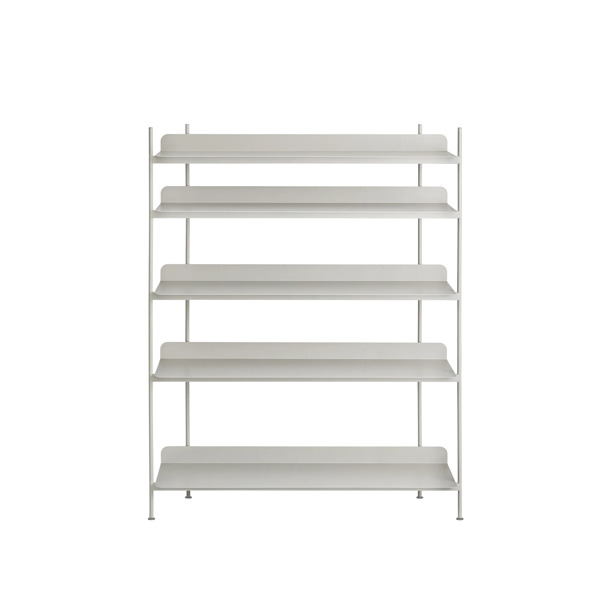

*图：Compile 收纳系统的三种基础配置，立柱与层板可自由增减。图源：[MUUTO 官网 Compile 系列页](https://muuto.com/products/shop-by-family/compile-shelving-system/)。*

### 品类惯例：设计师合作与版税制

这个品类的通行做法是品牌不自建设计团队的全部产能，而是与独立设计师或工作室签长期合作，设计费以版税（royalty，按销售额抽成的设计报酬）结算。Muuto 明确采用了这套机制，设计师名单横跨丹麦、挪威、芬兰、英国、比利时、法国与美国。版税制决定了品牌的产品策略：它必须持续开发能长期销售的型号，而不是一次性主题款——一款椅子卖十年，设计师与品牌才同时受益。

> 术语注释：版税（royalty）——按产品销售额或产量向设计方支付的报酬，与一次性设计费相对。

### 材料与合规趋势

欧洲市场的准入门槛这几年从"设计"转向"合规+材料"。Muuto 公开的应对方式是把几件事做成可核查的数字：新设计用木必须以 FSC 认证为前提（品牌持有 FSC-C028824 认证）；纺织、室内家具、配件与灯具不再有意添加 PFAS；家具按北美 ANSI/BIFMA 标准做耐久测试（官方称 77% 的家具通过该测试，99.7% 满足欧标）。这些指标在采购端有实际作用——项目招标常把它们写成硬性条件。

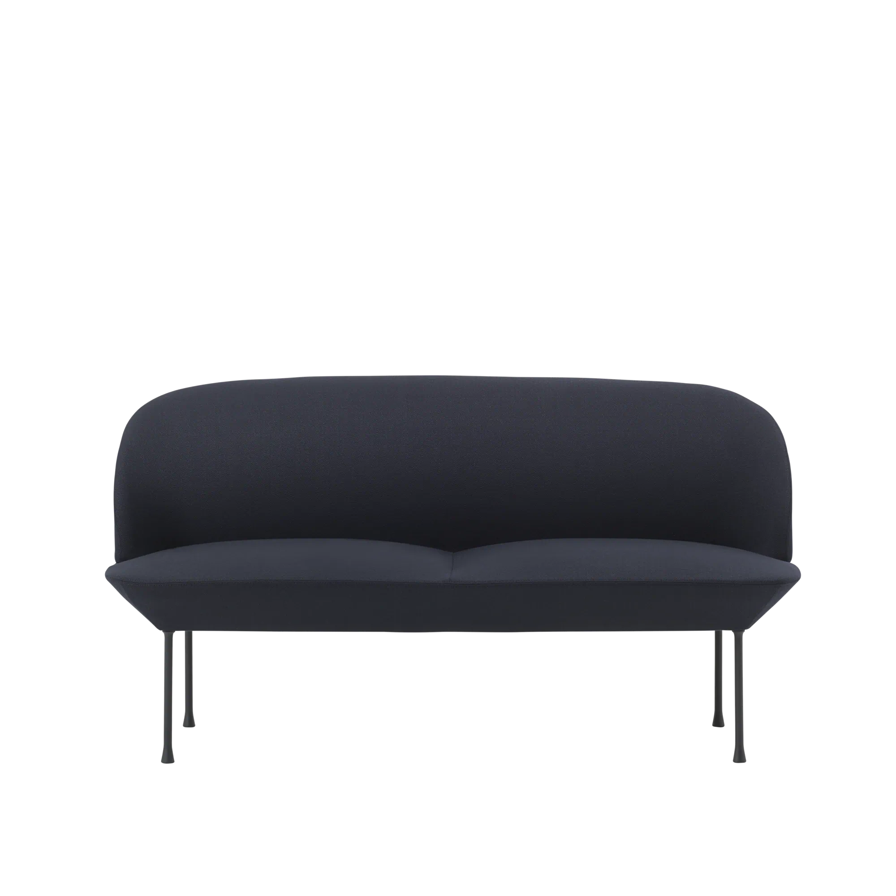

*图：Oslo 双人沙发（Vidar 羊毛面料），是品牌把羊毛、皮革与回收面料放进同一套座体结构的例子。图源：[MUUTO 官网 Oslo 系列页](https://muuto.com/products/shop-by-family/oslo-family/)。*

### 渠道结构

渠道分三层：自营的 Muuto Space 与旗舰店（哥本哈根、巴黎、东京、首尔、台北等，上海的 Muuto Space 采用预约制），覆盖欧洲、北美与亚洲的设计家具零售商，以及面向办公、酒店与教育项目的 contract 渠道。

> 术语注释：contract——面向酒店、办公、教育等项目的定制供货渠道，通常按项目报价并提供规格文件。

## 05 User 用户与场景：谁在决定一件北欧家具

### 决策链：设计师、业主、经销商与项目采购

一件北欧设计家具很少由使用者单独决定。典型的链条是：室内设计师或建筑师在方案阶段挑定系列与配色；业主确认预算与风格；设计家具零售商负责配置、报价与交期；如果是办公或酒店项目，采购方还会把合同条款、交货批次与验收标准一起写进订单。Muuto 的产品结构对这种链条做了三点回应——模块化（同一系列提供多种尺寸与配置组合）、规格化（绝大多数产品提供 2D/3D 与 Revit 文件、测试证书、装柜与包装数据）、以及面向项目方的专门渠道。对设计师来说，真正省时间的不是好看的图，而是能直接进图纸的模型与参数；这正是它把技术资料开放到产品页上的原因。

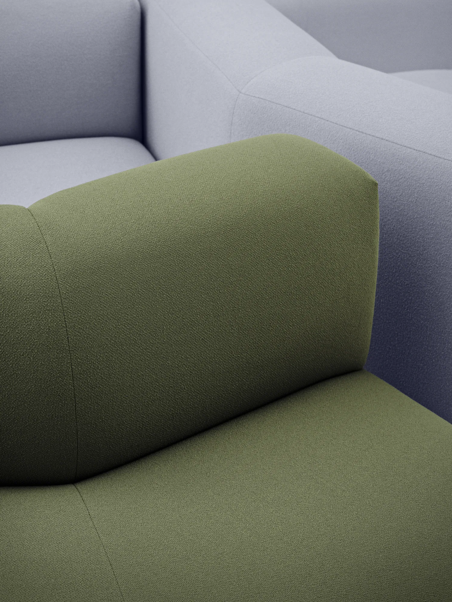

*图：Connect 模块沙发，14 种模块可按空间与使用方式重新组合，底部小脚让座体离地。图源：[MUUTO 官网 Connect 模块沙发产品页](https://muuto.com/product/Connect-Modular-Sofa-Modules/)。*

### 用户分层与核心任务

三层使用者最清楚：一是愿意为设计付费的城市住宅用户，任务是把家做成"看起来对"的样子并且用得久；二是设计从业者与小型工作室，任务是为客户的方案找到能落地、有品牌背书的产品；三是项目采购方（办公、酒店、教育），任务是以可验收的标准一次配齐大量家具。三者的共同点是"不想返工"——颜色要能对上、配件要能补、损坏的部件要能换。品牌给出的回应是把备件做成体系：官方公开提供 1,600 件以上备件，用于延长产品寿命。

> 术语注释：JTBD（Jobs To Be Done）——用户"雇佣"一件产品去完成的具体任务，而非人口统计标签。

### 场景与项目案例

从官方场景图与产品规格可以看出它的三个高频场景：开放的客厅与餐区（沙发、咖啡桌、吊灯组合），餐厅与咖啡馆（可堆叠、易清洁的椅子与长凳），以及办公与公共空间（工位系统、会议桌与模块沙发）。其中堆叠椅与户外长凳都按高强度使用来设计——Cover Side Chair 可堆叠，Linear Steel 长凳留有排水缝，座体比例被设计成能塞进配套长桌下方。这不是把家用的产品稍作加固，而是把项目场景的物理条件当作设计输入。

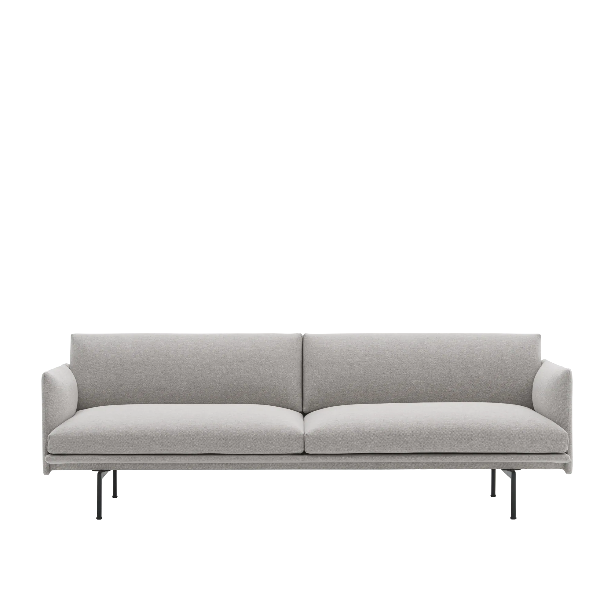

*图：Outline 三人沙发（黏土色布面、黑色铝脚），外部线条干净、内部座深与软垫加厚。图源：[MUUTO 官网 Outline Sofa 产品页](https://muuto.com/product/Outline-Sofa-3-Seater/)。*

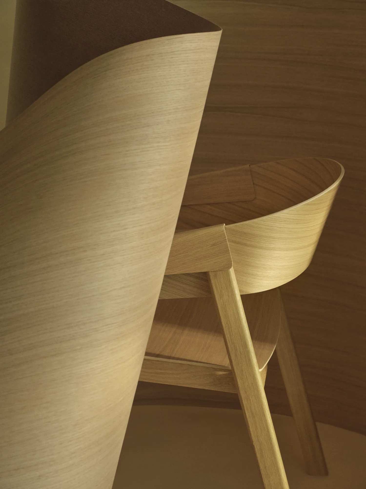

*图：Cover 系列概念图，可见木皮沿椅腿折包、包裹靠背的结构关系。图源：[MUUTO 官网 Cover Armchair 产品页](https://muuto.com/product/Cover-Armchair/)。*

### 购买与使用入口

用户在三种情境下进入这个品牌：搬新家或改造某个房间时被某件家具的样子吸引；在餐厅、酒店或办公室里先用到、之后去查品牌；以及做方案时在图纸库、材料样本或经销商展厅里遇到它。第三种入口最能解释 Muuto 为什么把"可下载的规格文件"放在产品页的显眼位置——它把一次性购买行为转换成设计流程中的默认选项。使用阶段的入口则更隐蔽：备件、清洁与保养说明、面料与皮革的来源说明，都写在同一页上。

> 术语注释：CEP（Customer Entry Point）——触发用户进入某个品类的具体情境与入口。

## 06 Positioning 定位：熟悉但不同

### 参照系与目标人群

Muuto 的参照系不是"高端家具"这个大池子，而是北欧设计传统本身。官方写法是"rooted in the Scandinavian design tradition"，并明确列出四项：经久的美感、功能性、工艺与诚实的表达。它要争取的人也很具体：认可北欧设计但觉得经典款过于稳妥的设计消费者，以及在方案里需要一点辨识度但不想冒险的设计师。二者共同的要求是"不会出错，但也不普通"。

### 差异点与基准点

差异点有四条，都能落到具体产品上。第一是材料替代的决心：Fiber Chair 的外壳由 100% 回收塑料与木纤维复合而成，其中塑料部分 80% 来自眼镜制造产生的工业废料，而不是市面上更常见的饮料瓶回收料；官方称这一改动让该款椅子的碳足迹降低约 30%。

第二是工艺路线的"反直觉"：Strand 吊灯的灯罩不是成型塑料壳，而是把纤维状聚合物喷附在轻钢骨架上，硬化后由材料本身充当扩散罩——用更少的材料做出更大的体量。

第三是把小件做成系统：The Dots 挂钩有木质、金属与陶瓷三种材质、多个尺寸，可以按任意排布组合成墙面图案，官方把它称为"功能性的雕塑"。

第四是模块化被"藏起来"：In Situ 模块沙发的各单元由粉末喷涂钢制框架连接，设计与结构都在削弱模块之间的接缝感。

基准点同样清楚：FSC 认证木材、无 PFAS 的纺织与表面处理、符合欧标与北美耐久测试、可更换备件、原厂面料与皮革来源可查。缺任何一项，都进不了欧洲设计师的常规备选清单。

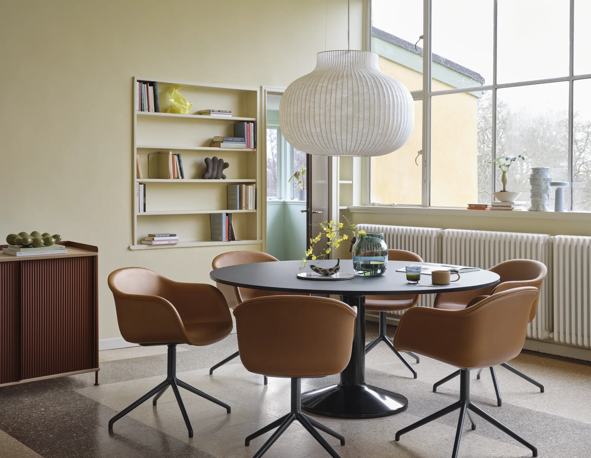

*图：Fiber 系列椅子（皮革坐垫与金属底座）在餐区中的使用场景，外壳为回收塑料与木纤维复合材料。图源：[MUUTO 官网 Fiber 系列页](https://muuto.com/product/Fiber-Armchair-Swivel-Base/)。*

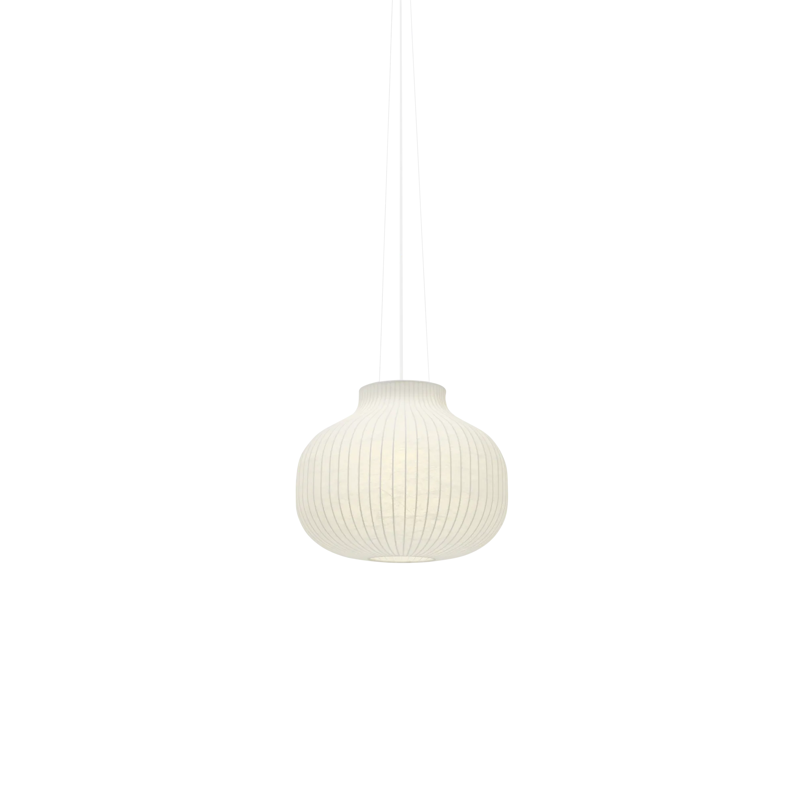

*图：Strand 吊灯（45 cm 款），纤维材料喷附在轻钢骨架上硬化成罩，光线经材料本体扩散。图源：[MUUTO 官网 Strand 吊灯产品页](https://muuto.com/product/Strand-Pendant-Lamp/)。*

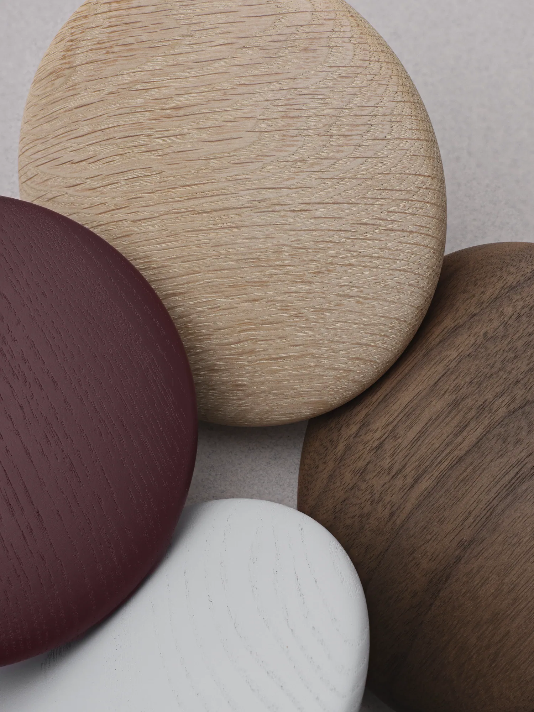

*图：The Dots 木质挂钩的概念组合，三种尺寸与多色可按任意排布上墙。图源：[MUUTO 官网 The Dots 产品页](https://muuto.com/product/Dots-Wood/)。*

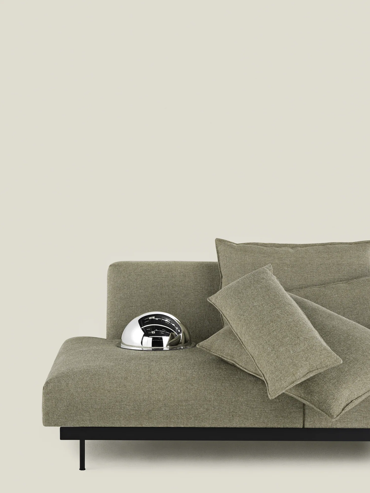

*图：In Situ 模块沙发概念图，模块之间由钢制框架连接，接缝被刻意弱化。图源：[MUUTO 官网 In Situ 模块沙发产品页](https://muuto.com/product/In-Situ-Modular-Sofa-3-Seater-Configurations/)。*

> 术语注释：POD（Points of Difference）——差异点，品牌相对竞品被感知到的独特优势。

> 术语注释：POP（Points of Parity）——基准点，该品类中必须达到的行业共识项。

### 定位陈述与证据链

把以上压缩成一句话：Muuto 是"以新材料与工艺重写北欧设计语言的家具品牌"，服务那些既要稳妥的耐用性、又要一点新鲜感的设计消费者与设计师。承诺与证据的对应关系是：材料承诺对应回收塑料外壳与 FSC 木材；工艺承诺对应木皮折包、手工旋压铝、玻璃手工吹制；耐用承诺对应 BIFMA 测试与 1,600 件以上备件；感官承诺对应与约翰霍普金斯大学合作的神经美学研究——这一点在第八章展开。

## 07 Product 产品：一把椅子引出的产品线

### 产品组合与命名逻辑

Muuto 的产品线按场景与物件类型划分：坐具（椅、凳、吧椅、长凳、休闲椅）、沙发（含模块系统）、桌（餐桌、咖啡桌、边几、办公桌）、收纳（模块收纳、书架、边柜、玄关、办公收纳）、灯具（吊灯、落地灯、台灯、壁灯）、配件（挂钩、托盘、花瓶、镜子、地毯、靠垫）与户外家具。命名方式有两类：一类是直接描述物件（Cover、Outline、Linear、Compile、Stacked），一类是意象命名（The Dots、Ambit、Strand、Unfold、Under The Bell、Nerd）。同系列靠尺寸与底座变体区分（如 Fiber 的各种底座、Outline 的二/三人位与 Studio 紧凑版），而不是靠数字后缀堆型号——这既降低了检索成本，也让零售端更容易按空间报价。

### Fiber Chair（2014）：把最畅销的椅子换掉塑料

Fiber Chair 由挪威工作室 Iskos-Berlin 设计，2014 年发布，出发点是对"壳体椅"这一经典原型的当代重写：壳体用塑料与木纤维复合，表面呈现哑光手感，形体上则把扶手与靠背连成一条包裹的曲线。2022 年，Muuto 用回收塑料替换了这款椅子的原生塑料，并保留原有配色与底座选项。品牌对外解释这次改动的口径是：作为最畅销的单品之一，材料替换才有实际影响——"从原生塑料跨到回收塑料，是我们走向循环消费的一个雄心起点。"设计师也给出了他们对这类产品的标准："设计中最难也最高贵的功课，是做简单、好用、几乎平常，却仍有强烈识别度的物件。"

外壳的塑料里有 80% 来自眼镜制造过程中产生的工业废料，木纤维为 FSC 认证材；材料混合比例需要重新标定，才能在保持原有哑光质感的同时满足强度要求——回收料来源单一、成分稳定，是这次替换能成立的前提。配色与底座保持与原版一致（橡木、金属、旋转底座等），品牌称这样做的目的是降低用户的重新决策成本。

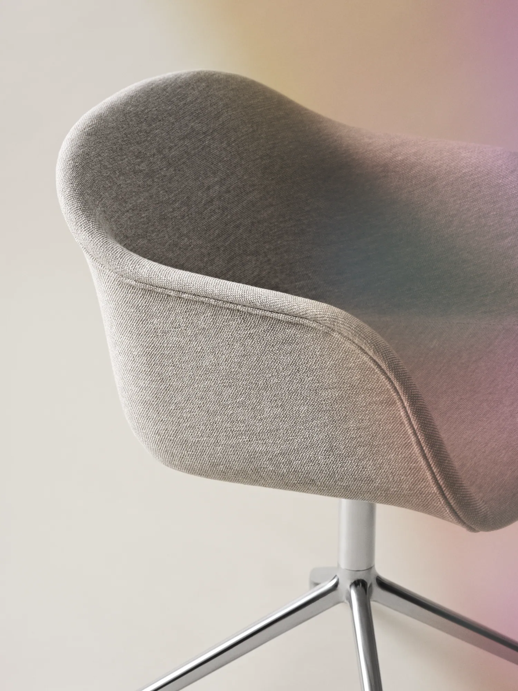

*图：Fiber Armchair（旋转底座）的哑光复合外壳，形体上扶手与靠背连成一条包裹曲线。图源：[MUUTO 官网 Fiber 系列页](https://muuto.com/product/Fiber-Armchair-Swivel-Base/)。*

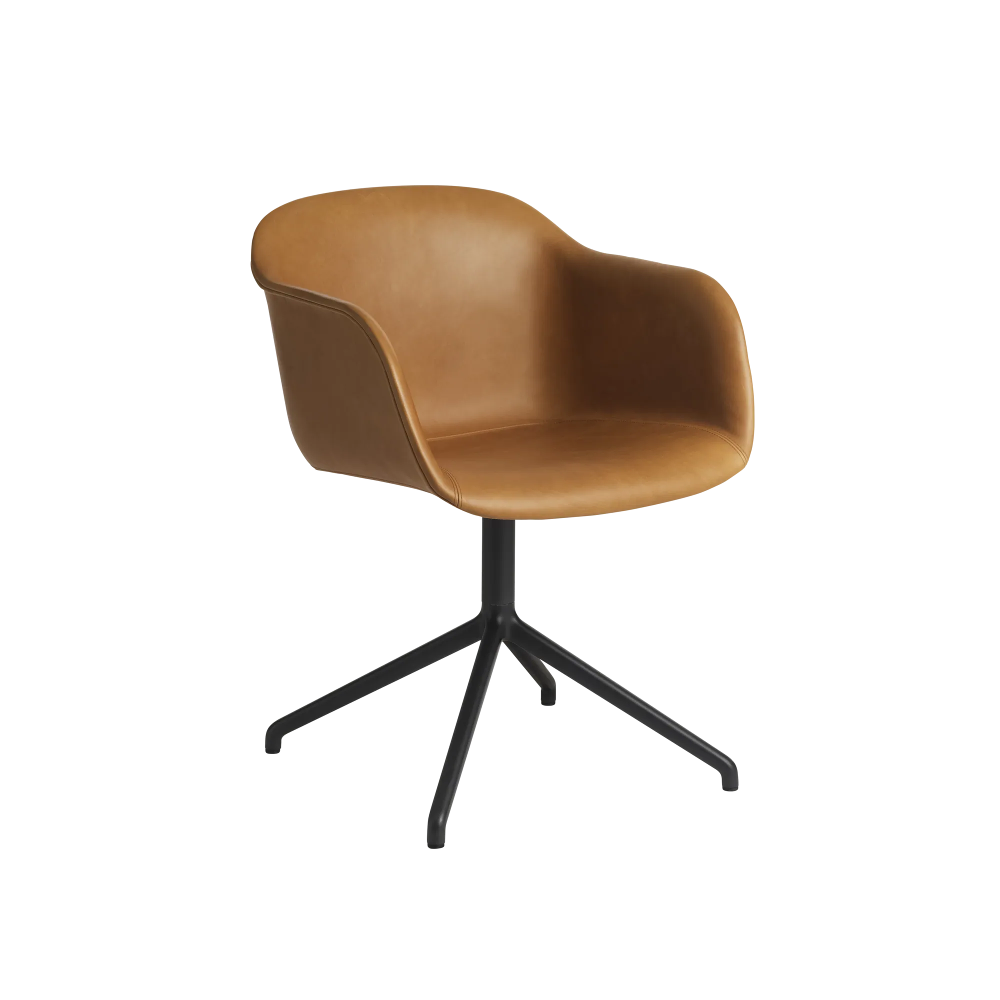

*图：Fiber 椅与收纳、灯具同框的客厅场景，可见品牌在同一空间里用木色与暖灰统一质感。图源：[MUUTO 官网 Fiber 系列页](https://muuto.com/product/Fiber-Armchair-Swivel-Base/)。*

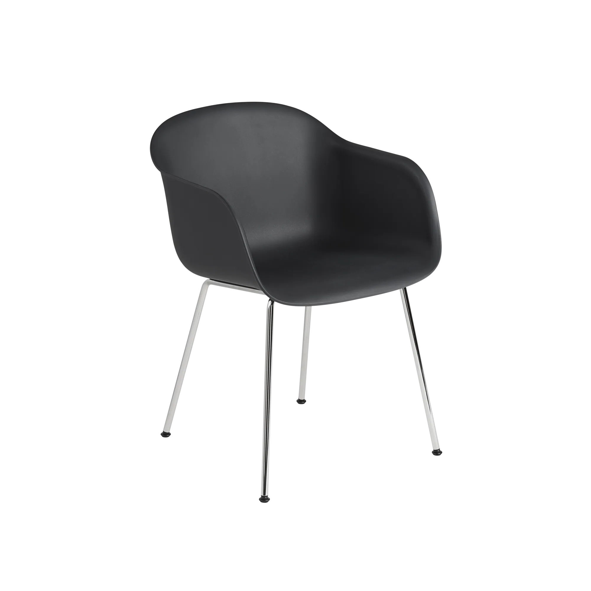

*图：Fiber 椅管式底座款，同一壳体可与木腿、金属管脚与旋转底座组合。图源：[MUUTO 官网可持续发展页](https://muuto.com/our-sustainable-perspectives/)。*

### Strand（2019）：把钢结构裹进纤维

Strand 是英国工作室 Layer（创始人 Benjamin Hubert）为 Muuto 做的第一件产品，2019 年在伦敦设计节发布，也是品牌第一次与英国设计师合作。它的工艺逻辑来自蚕茧：先用轻钢做成骨架，再把纤维状聚合物喷涂在骨架上，硬化后由这层材料本身充当灯罩与扩散器。四个尺寸的吊灯都追求"体量大、用料少"——外层纤维极薄但强度足够，从而在减少材料的同时得到柔和的出光。

设计师对这次合作的表述是："我们想做的是能改善使用者情绪健康、并至少反映其生活方式的设计。"对品牌侧，Hubert 的说法也很直接："Muuto 与我们'做多数人买得起、能自然融入家的简单设计'的目标是一致的。"这盏灯之后成为品牌在照明线里的辨识度来源：它的形体不依赖贵金属与复杂结构，靠材料工艺本身建立形象。

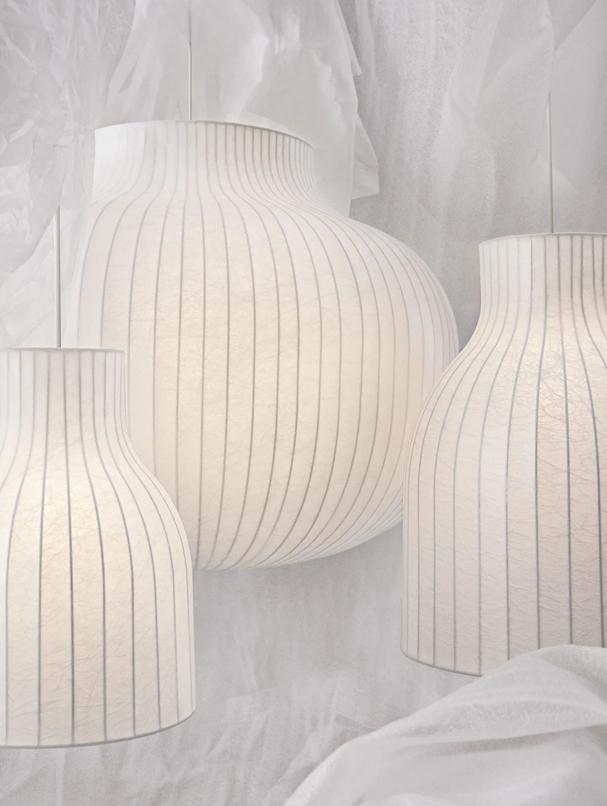

*图：Strand 吊灯概念图，可看到纤维材料在钢骨架上的覆层与厚度差异。图源：[MUUTO 官网 Strand 吊灯产品页](https://muuto.com/product/Strand-Pendant-Lamp/)。*

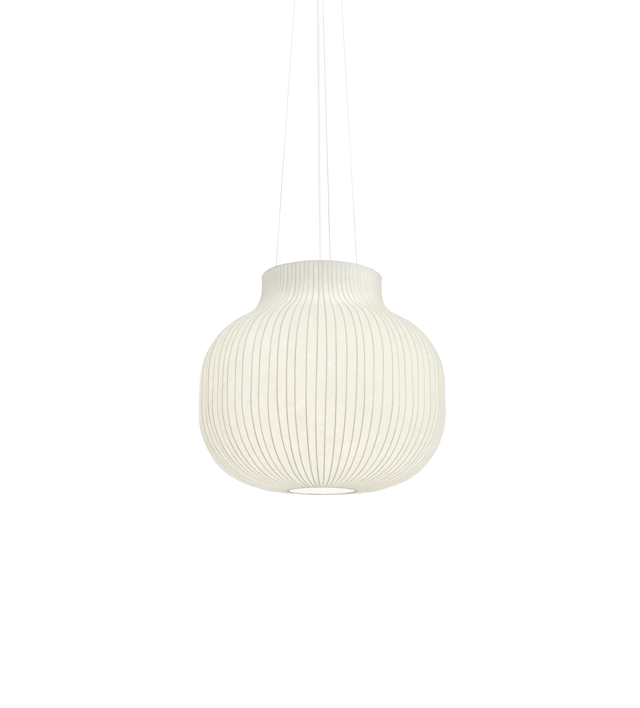

*图：Strand 吊灯 60 cm 款，同一工艺在大尺寸下的体量感。图源：[MUUTO 官网 Strand 吊灯产品页](https://muuto.com/product/Strand-Pendant-Lamp/)。*

### Post 落地灯与 Kink 花瓶（2020）：磁吸与数字塑形

这两件产品都出自 Earnest Studio（设计师 Rachel Griffin），是工作室为品牌做的首组作品。Post 落地灯把"灯头位置"变成可变参数：一根中心立柱、若干圆形灯体，灯体通过磁吸接头固定在立柱任意高度，各自可调角度、独立调光，电力经中心集线器分配，线缆用磁性卡扣贴在立柱上——同一套逻辑还派生出一面壁装版本。花瓶 Kink 的出发点相反，是把简单形体做数字化的变形：把两个筒形在数字模型里"折"在一起形成双开口，再用陶瓷烧成并上缎面釉，官方称它在不装花时也是一件雕塑。

设计师对 Post 的解释是"从磁吸接点的可能性出发，把灯体位置与亮度的决定权交给使用者"；对 Kink 则是"探索如何通过简单形体的数字操作生成新形态"。两件产品放在一起，可以看出品牌对"新视角"的具体定义：不是发明新功能，而是把已有功能里的一个参数交还给使用者。

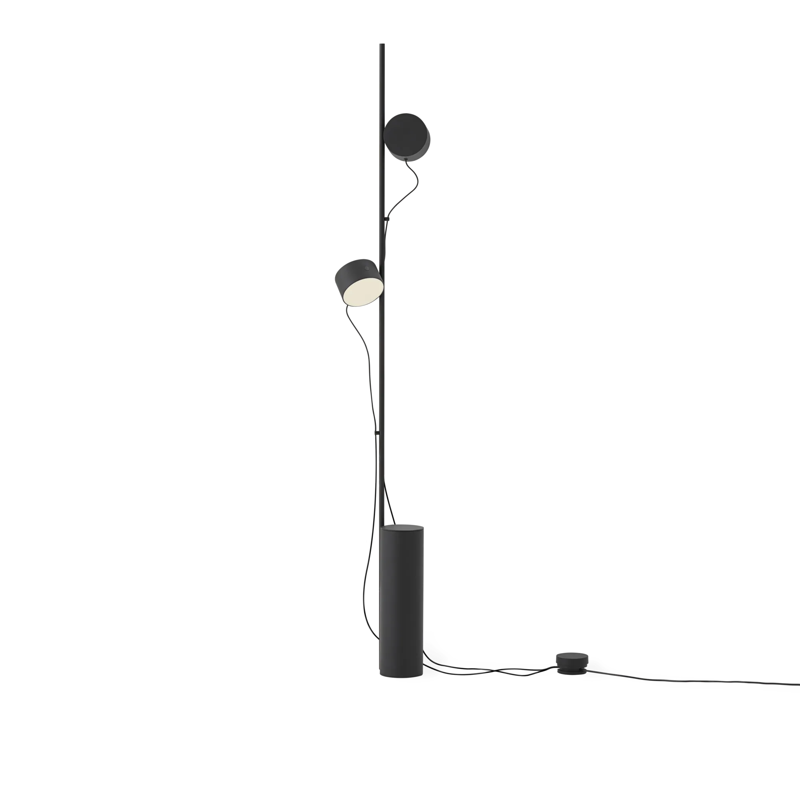

*图：Post 落地灯（黑色），圆形灯体通过磁吸接点固定在立柱任意高度，各自独立调光。图源：[MUUTO 官网 Post 落地灯产品页](https://muuto.com/product/Post-Floor-Lamp/)。*

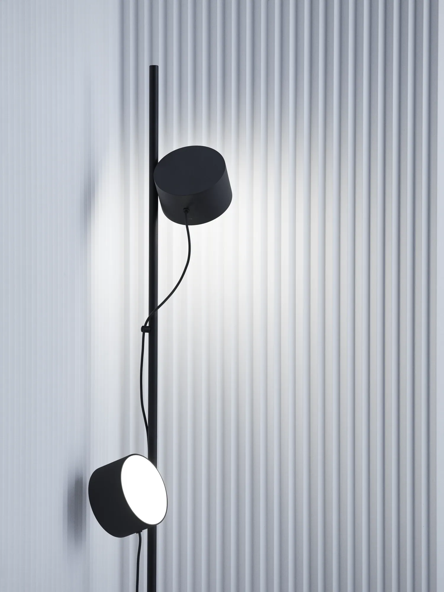

*图：Post 灯的概念图，可见中心立柱、集线器与灯体的连接关系。图源：[MUUTO 官网 Post 落地灯产品页](https://muuto.com/product/Post-Floor-Lamp/)。*

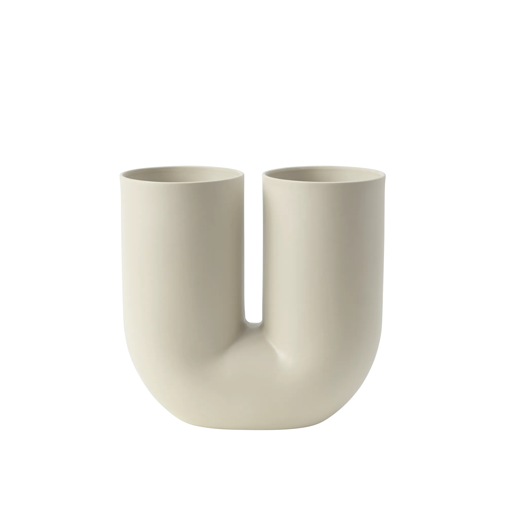

*图：Kink 花瓶（沙色），两个筒形在数字模型里折叠相并形成双开口，表面为缎面釉。图源：[MUUTO 官网 Kink 花瓶产品页](https://muuto.com/product/Kink-Vase/)。*

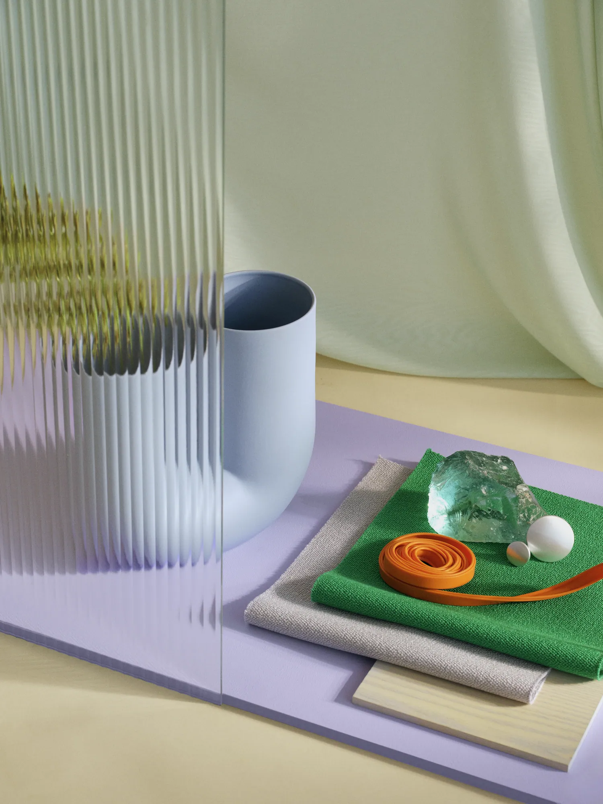

*图：Kink 花瓶浅蓝色款，可见两个筒形相交处的折面与开口关系。图源：[MUUTO 官网 Kink 花瓶产品页](https://muuto.com/product/Kink-Vase/)。*

### In Situ 模块沙发（2020）：藏起来的模块缝

In Situ 由 Anderssen & Voll 设计，2020 年发布，思路是把模块化的功能与"看起来不像模块"的外观放在一起：各单元用粉末喷涂钢制框架连接，一条连续的裙边沿座面与靠背绕行，把模块之间的视觉接缝遮住，使整组沙发在视觉上像一个整体。设计师的表述是："我们想做出既能自由组合、又保留简洁优雅线条与深坐感的沙发。"

它的商业意义在于把品牌的沙发线从固定尺寸推向按空间配置——模块可以按房间形状、使用人数与朝向重新排布，颜色与面料则参考品牌的常规面料体系。对项目市场来说，这比单件沙发更容易进入方案；对住宅用户来说，它把"以后可能搬家"的问题变成了可调整的配置。

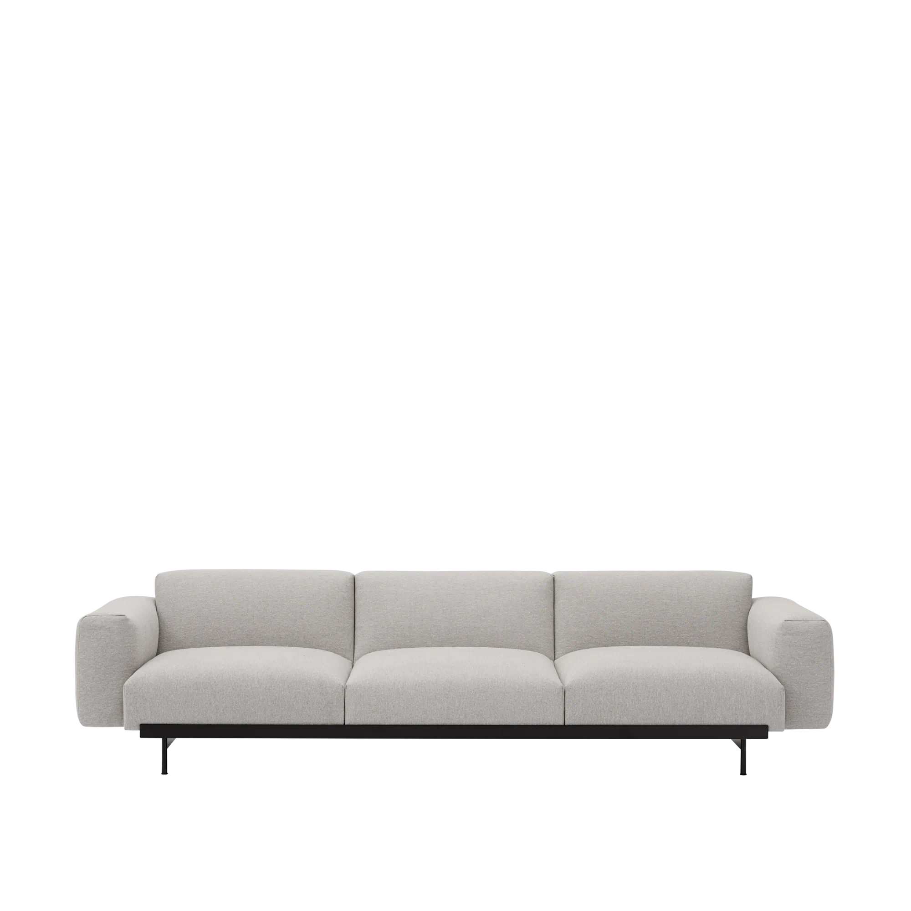

*图：In Situ 三人位配置（黏土色面料），连续裙边遮住模块接缝。图源：[MUUTO 官网 In Situ 模块沙发产品页](https://muuto.com/product/In-Situ-Modular-Sofa-3-Seater-Configurations/)。*

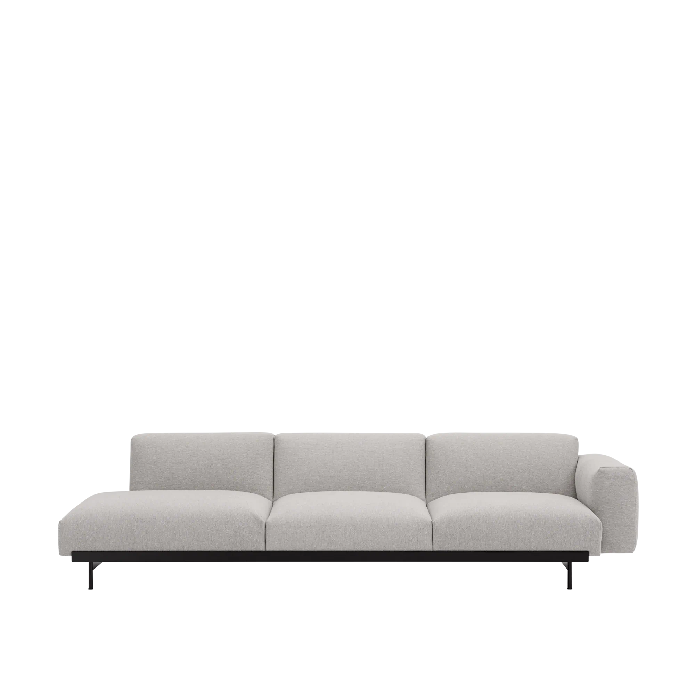

*图：In Situ 第二组三人位配置，可看出同一套模块在长度与座深上的变化。图源：[MUUTO 官网 In Situ 模块沙发产品页](https://muuto.com/product/In-Situ-Modular-Sofa-3-Seater-Configurations/)。*

### Nerd Chair（2012）：一场学生竞赛变成产品

Nerd Chair 的出身是品牌的青年设计机制。Muuto 自 2010 年起举办面向北欧学生的设计奖项，2012 年的首奖颁给了当时就读于丹麦皇家美术学院的 David Geckeler，作品就是 Nerd Chair——靠背与座面一体成型，边缘圆润，形体带有一种不严肃的当代感。它随后进入量产序列，并在之后扩展出吧椅与中岛椅，成为品牌最早一批"竞赛—量产"路径的产品。

这条路径后来被品牌制度化：2024 年它把奖项升级为面向全球的 Muuto Design Contest，征集小件家具与配件，外部评审包括 Google 硬件设计副总裁 Ivy Ross、哥本哈根饰面品牌 File Under Pop 创始人 Josephine Akvama Hoffmeyer，以及设计师 Jamie Wolfond。首席营销官 Line Brockmann Juhl 对外的说法是："寻找新视角是 Muuto 的一部分基因，我们想挑战自己，也想和全世界的创作者合作。"

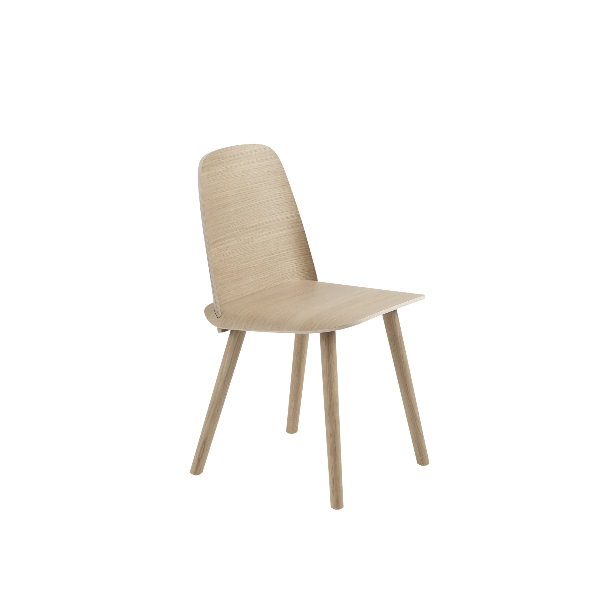

*图：Nerd Chair 橡木款，靠背与座面一体成型、边缘圆润。图源：[MUUTO 官网 Nerd Chair 产品页](https://muuto.com/product/Nerd-Chair/)。*

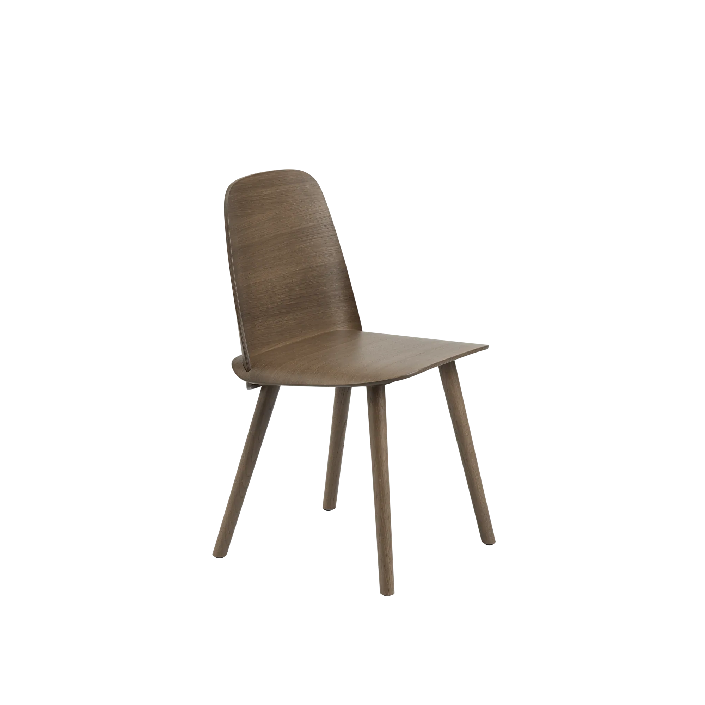

*图：Nerd Chair 深棕染色款，同一形体下的木材染色与表面处理变化。图源：[MUUTO 官网 Nerd Chair 产品页](https://muuto.com/product/Nerd-Chair/)。*

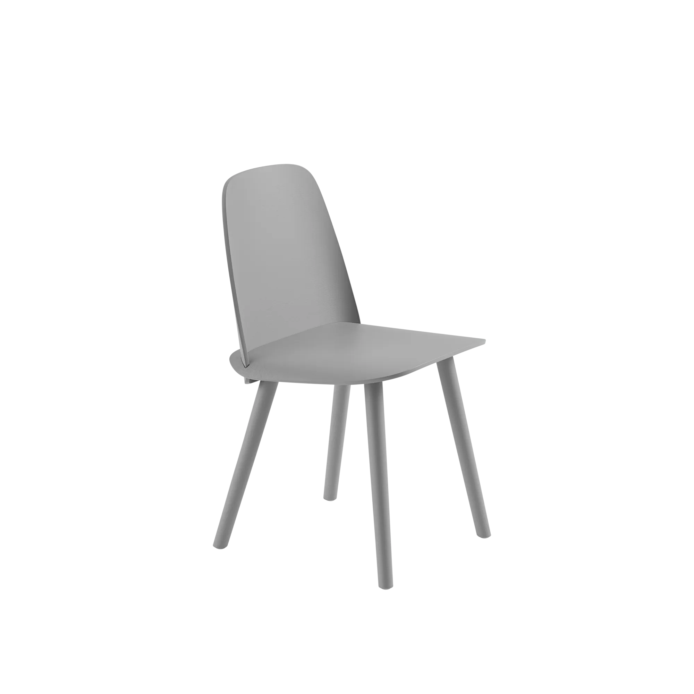

*图：Nerd Chair 灰色款，说明这条线从单色扩展到多色体系。图源：[MUUTO 官网 Nerd Chair 产品页](https://muuto.com/product/Nerd-Chair/)。*

### 第三方评价与产品小结

产品的外部评价集中在两点：一是"不冒险但有辨识度"的设计判断，二是材料与合规的扎实程度。设计媒体对 Fiber Chair 的复材外壳、Strand 的纤维喷涂工艺、Cover 的木皮折包都做过专门报道；品牌自身则把耐久测试（BIFMA）、低挥发（VOC）、无 PFAS 与可回收比例写进公开指标。评价的分歧也存在：追求原木手感与手工感的用户会觉得复合材料外壳"离木作远了一些"，而环保指标更看重可回收的比例与来源。两条评价都成立，但指向的是不同的价值排序。

## 08 Aesthetics 美学：光、曲线与克制

### 视觉识别与传播语言

Muuto 的品牌识别几乎不做图形符号：一个无衬线的字标，加上极度克制的版式，把注意力全部让给产品摄影。官方的产品图以浅灰或暖白背景为主，光位统一，尽量让材质本身成为主角；场景图则偏自然光与室内真实环境。这种"把图像当作品集"的做法，直接影响它在设计媒体中的可传播性——图片不需要解释就能被引用。二十周年时，品牌又把传播重心放到线下：展览、对谈与限量发行，媒体内容由现场产生。

### 形态与比例：圆与折线

Muuto 的形体语言可以分成两支：一支是圆与包裹（Fiber 的扶手曲线、Under The Bell 的钟形、Wrap 的围合），另一支是折与直（Cover 的木皮折包、Linear 的折边、Stacked 的直角体块）。两支并不冲突，因为比例被统一在"轻"上：座体离地、立柱细、边缘薄。它的视觉秩序不靠装饰，而靠几个反复出现的处理——边缘倒角、无可见螺钉、把结构关系简化成一条线。

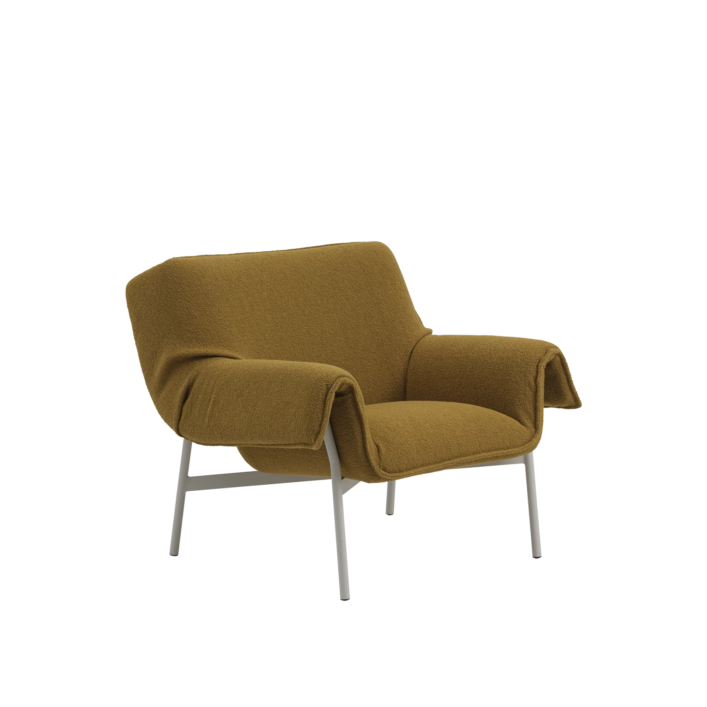

*图：Wrap 休闲椅（灰调），围合形体把使用者包在座体内，对应五原则里的"形体"与"触感"。图源：[MUUTO 官网 Wrap 休闲椅产品页](https://muuto.com/product/Wrap-Lounge-Chair/)。*

### 色彩与材料情绪

颜色被当成材料问题处理：木材分橡木、白蜡、深棕染色；金属分抛光铝、哑光喷涂；织物与皮革按一套固定面料体系提供，色号彼此能相互搭配。品牌的说法是"邀请人、直觉上有吸引力、又不压制环境"，落到操作层就是低饱和为主、每季引入少量高饱和（橙、深红、浅蓝）作为变化点。这种配色策略让不同系列放在同一空间里不容易打架，也让零售端的搭配推荐变得简单。

### 光与空间

光是 Muuto 少数明确写成方法论的领域。品牌把"光作为工具"列为神经美学五原则之一，理由来自生理节律：偏冷的色温让人更清醒，偏暖的光让人放松。落到产品上，Ambit 系列的白色内壁、Under The Bell 的钟形反射、Post 的可调角度与调光，都是同一逻辑的不同表达——灯具的作用不只是照明，而是改变一个空间在一天中的状态。

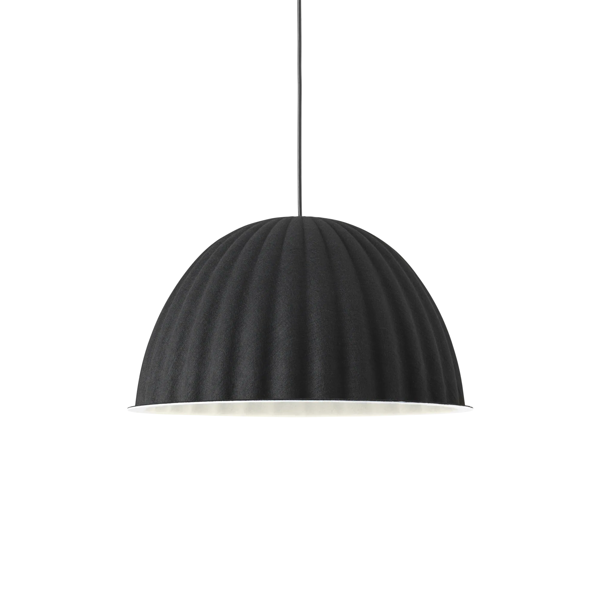

*图：Under The Bell 吊灯（55 cm，黑色），钟形内壁把光反回桌面，同时吸收环境声。图源：[MUUTO 官网 Under The Bell 吊灯产品页](https://muuto.com/product/Under-The-Bell-Pendant-Lamp/)。*

### 感官与情感基调

品牌把感受力写成了可执行的研究：它与约翰霍普金斯大学 International Arts + Mind Lab 执行主任 Susan Magsamen 长期合作，把神经美学（neuroaesthetics，研究审美体验如何影响大脑与身体的学科）归纳为五条设计原则——自然、光、形体、色彩、触感，其中形体一条直接引用研究结论："人天然偏好平滑曲线。"Magsamen 对审美体验的描述是："当你获得高度审美体验时，它会改变你——改变你的生理、情绪与感受。"

> 术语注释：神经美学（neuroaesthetics）——研究审美体验如何影响大脑、身体与情绪的学科。

这套表述的价值在于它把"舒服"这种模糊感受拆成了可以检查的项目：把自然引入室内、控制色温、用圆角、让颜色不冲突、让手感可被触摸。对设计师而言，这比"北欧风格"这种整体印象更有用；对品牌来说，它也是一条把住宅、办公与酒店场景统一起来的主张——三种空间要的其实是同一种感受。

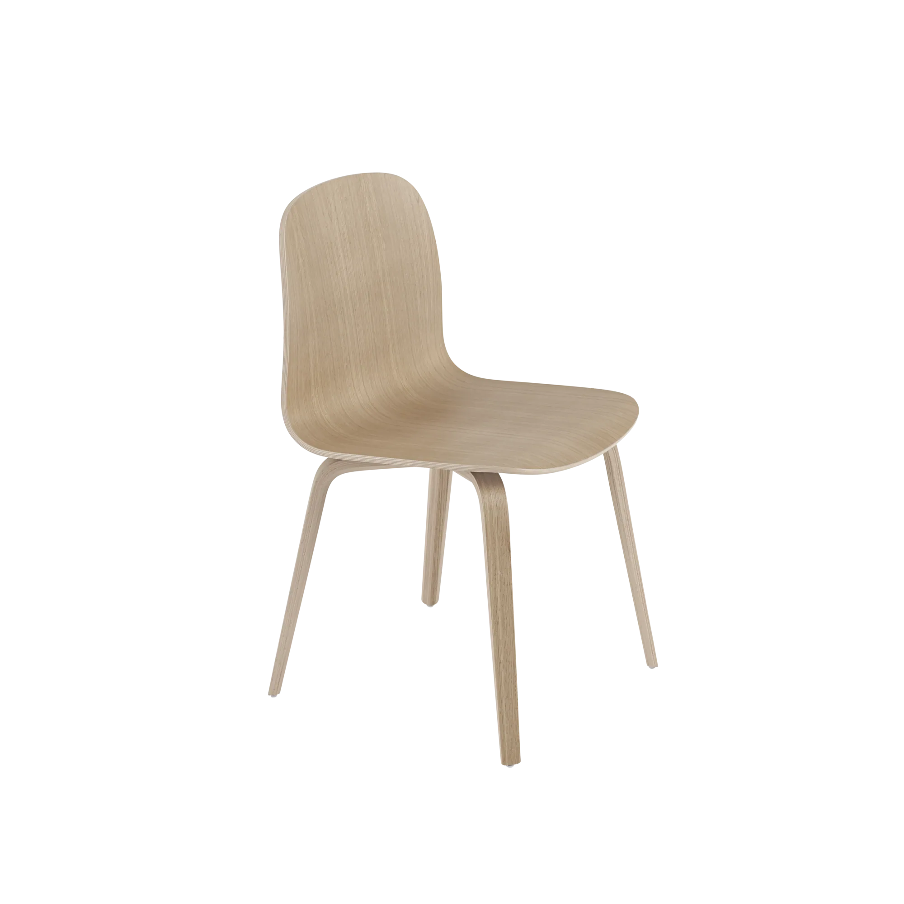

*图：Visu 椅橡木款，座面与靠背的圆角处理对应"平滑曲线更令人愉悦"的设计原则。图源：[MUUTO 官网 Visu 椅产品页](https://muuto.com/product/Visu-Chair-Wood-Base/)。*

### 美学评价

Muuto 的美学不靠单一符号取胜，而是靠一致性：形体、颜色、光线与手感被同一套逻辑约束，因此不同设计师的作品能并置在同一个空间里。缺点也来自同一处——它的辨识度需要"看一组"才成立，单件产品放进别的空间里常常显得安静到没有个性。这是它的取舍：优先让产品适应环境，而不是让环境服从产品。美学判断，置信度：中。

## 09 Design 设计：五种原则落到材料与结构

### 设计哲学：熟悉但不同

品牌对设计的定义写在官方文本里：设计要让人"倾向靠近既熟悉又新的东西"，并且"邀请人、直觉上有吸引力、不压制环境"。它没有宣称任何形而上的理念，而是把判断标准写成了可检验的三条：是否在前人基础上有推进；是否在功能与耐久上过关；是否能在不同空间里成立。由此推导出的取舍很清楚——在形式与材料之间，它选择用材料工艺换取形式的新鲜感；在手工与量产之间，它选择可复制的量产工艺（木皮折包、复合材料压制、旋压铝、玻璃吹制），因为可复制才能进入项目渠道；在个性与适应之间，它优先适应环境。

### 组织：内部团队与外部设计师

产品开发由内部创意团队主导，设计由外部设计师或工作室完成，报酬以版税结算，设计师名单长期稳定（Anderssen & Voll、Iskos-Berlin、Thomas Bentzen、TAF Studio、Cecilie Manz 等合作多年）。这种"内部定标准、外部出方案"的结构带来两个结果：产品线在风格上高度一致；同时设计师的行业声誉会反过来给品牌带来专业背书。品牌还用竞赛机制补充新血——2010 年起的北欧学生奖项，到 2024 年扩展成全球设计竞赛。

### CMF：木皮、回收复合材与手工旋压铝

材料体系的骨架是三类工艺。其一是木材与木皮：Cover 系列把整片木皮折过椅腿折包成型，官方称这种叠层方式同时把椅子各部"锁"在一起，代价是成形良率与工匠经验——设计师本人说过，最终形态只有靠生产端的手艺才能实现。其二是复合材料：Fiber 椅的外壳用回收塑料与 FSC 木纤维混压，哑光表面来自木纤维在表面层的分布，难点在回收料来源的稳定性与配比标定。其三是金属与玻璃：Ambit 的灯罩为手工旋压铝，Kink 与二十周年的玻璃器物为手工吹制，前者追求均匀出光，后者接受每件的色差与亮度差异作为特征。

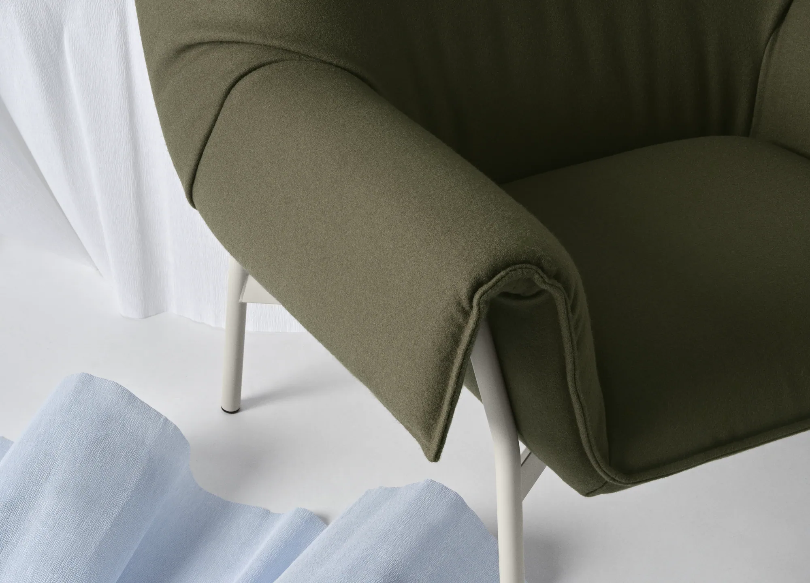

*图：Wrap 休闲椅概念场景，围合座体与面料之间的结构关系。图源：[MUUTO 官网 Wrap 休闲椅产品页](https://muuto.com/product/Wrap-Lounge-Chair/)。*

*图：Compile 收纳系统的完整配置，立柱与层板按模数组合，体现"可复制工艺"的产品逻辑。图源：[MUUTO 官网 Compile 系列页](https://muuto.com/products/shop-by-family/compile-shelving-system/)。*

### 制造与合规：把指标做成数字

Muuto 不自建工厂，靠欧洲供应链代工，因此它的设计必须迁就供应商的工艺窗口；这也解释了它为什么偏好可复制的成形方式。它选择把合规做成公开数据来建立信任：已评估 99% 产品的 CO₂e 排放（涵盖范围 1、2、3）；77% 的家具按 ANSI/BIFMA 标准测试、99.7% 满足欧标；自 2022 年起新设计中使用的木材 100% 为 FSC 认证；纺织、室内家具、配件与灯具不再有意添加 PFAS；87% 的家具系列通过低挥发（VOC）测试；超过一半的家具销售额来自持有一类生态标签（如 EU Ecolabel）的产品；备件超过 1,600 件。这些数字里最值得注意的是最后一类——它把可持续从材料话题推进到了"可维修"与"可长期使用"。

### 人机与工程：磁吸、排水与座高

工程细节上有三个典型处理。一是磁吸与可调：Post 灯的灯体与线缆卡扣都用磁吸，目的是让"位置"成为可调参数；二是排水与户外：Linear Steel 长凳在座板留缝、边缘折起，避免积水，户外系列按防腐与耐候选材；三是人体尺度：Cover 椅的靠背曲线、In Situ 的座深与裙边高度、Visu 的座面倾角，都在家用舒适与项目强度之间取平衡。Muuto 在工程上的策略不是堆参数，而是把少数几个动作（高度、角度、连接方式）做成可调的。

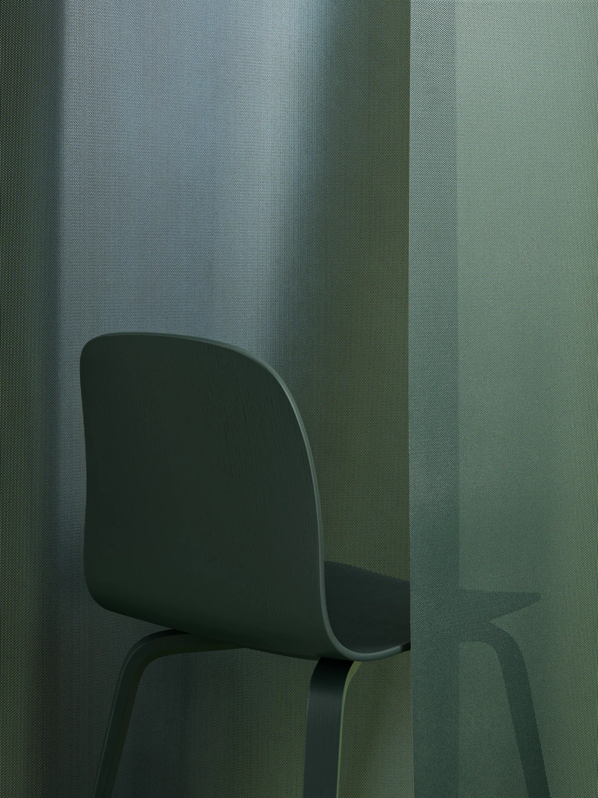

*图：Visu 椅概念图，可看到靠背与座面的角度关系与圆角处理。图源：[MUUTO 官网 Visu 椅产品页](https://muuto.com/product/Visu-Chair-Wood-Base/)。*

### 品牌主张与产品落点

| 品牌主张（从官方信息提炼） | 产品落点 |
|---|---|
| 熟悉但不同：在既有原型上前进一步 | Fiber 椅重写壳体椅；Nerd 椅重写木椅；Cover 椅重写木皮工艺 |
| 用材料工艺换形式新鲜感 | 回收塑料+木纤维复合外壳；纤维喷涂灯罩；木皮折包；手工旋压铝 |
| 光塑造空间状态 | Ambit 内白出光；Under The Bell 钟形反射；Post 可调角度与调光 |
| 让用户掌握一部分决定权 | Post 灯体位置与亮度可调；In Situ 模块可重排；Compile 层板可增减 |
| 经久使用优先 | BIFMA 耐久测试；1,600+ 备件；可拆换面料；一类生态标签 |
| 适应环境而非主导环境 | 低饱和配色体系；无可见螺钉；细腿与离地座体 |

## 10 Experience 体验：从展厅到十年使用

### 体验观：让空间"感觉对"

Muuto 对体验的理解写在官方文本里：家是"真实而可触的经验的场所"，颜色唤起记忆、材料触发感受、形体作用于潜意识；品牌把目标说成"让一个空间感觉刚好合适（feel just right）"。这句话在操作层面意味着两件事：体验的对象是空间而不是单件产品；体验的检验标准是感受而不是参数。它也解释了品牌为什么把研究精力放在神经美学上——如果目标是"感觉对"，就需要一套比"好看"更具体的判断依据。

### 机制：体验落在哪些触点

体验被拆成几个可执行的触点。视觉层：低饱和配色与统一光位，让不同系列能并置；触感层：木皮的折边、复合外壳的哑光、羊毛与皮革的织物结构，都鼓励直接触摸；光层：可调角度与调光、内白灯罩、钟形反射，让同一盏灯在一天里改变空间状态；空间层：Muuto Space 与旗舰店按"居家场景"布置而不是按 SKU 陈列，参观者看到的是组合而不是单品；服务层：上海等地的 Muuto Space 采用预约制，把到店变成一次有讲解的会面，而不是自助选购。

### 兑现与断裂：承诺与现实的距离

兑现得比较好的部分是材料与耐用：测试标准、备件数量与生态标签都可查，家具的面料与皮革也提供原厂清洁保养指引。断裂点主要有三处。第一是交付节奏：品牌以欧洲供应链生产、按项目排产，热门面料与定制版本的交期通常以周计，与本地现货渠道相比没有优势。第二是可维修的实际体验：备件目录公开，但更换服务依赖各地经销商的能力，跨地区购买时这一层会变薄。第三是"体验观"与零售现实的落差：品牌想让人"进入一个感觉对的空间"，但多数市场里消费者第一次接触它仍然是在别人的餐厅、酒店或办公室，而不是自家的陈列空间。体验判断，置信度：中。

## 11 Competition 竞品：同价位带上的北欧设计

### 品牌归属与行业坐标

Muuto 现属美国 MillerKnoll 集团。这个归属有两层含义：一是它获得了集团级别的采购、物流与项目渠道支持；二是它的姊妹品牌里直接包含 HAY——同样是北欧设计家具、同样面向设计零售与项目市场。也就是说，Muuto 与最直接的竞争者之一同属一个母公司，集团在内部做品牌分层（HAY 更偏大众与快节奏上新，Muuto 更偏材料与耐久叙事），对外则共享部分渠道资源。行业坐标判断，置信度：高。

### 品牌层：三类对手

第一类是北欧设计同侪：HAY、&Tradition、Normann Copenhagen、ferm LIVING、Audo Copenhagen（原 MENU）、Gubi。它们的定位相近、价格带重叠、渠道几乎完全重合，差别在语言：&Tradition 与 Gubi 更强调经典设计师档案的重推，Normann 与 ferm 更偏色彩与生活趣味，Audo 更偏整体空间方案；Muuto 的差异化落在材料工艺与合规指标上。第二类是高端功能主义的欧洲品牌：Vitra、USM、Flos、Kartell 等，价格更高、建筑属性更强，争夺的是同一批设计师的方案预算。第三类是快速跟进的区域品牌：以更低价格复制同类形体与配色，主要影响入门产品的比价。

### 产品层：四类直接对位

椅与凳：Fiber、Cover、Visu、Nerd 对位 HAY 的 About A Chair 系列、&Tradition 的 In Between 与 Rely、Normann 的 Form 系列，竞争点在壳体的材料叙事与堆叠、强度等实用属性。

沙发与模块系统：Outline、In Situ、Connect 对位 HAY 的 Mags、&Tradition 的 Cloud 与 Develius，竞争点除面料与舒适度外，还有模块的重排自由度与项目交付能力。

灯具：Ambit、Strand、Under The Bell、Leaf、Unfold 对位 &Tradition 的 Flowerpot 与 P376、Normann 的 Amp、Gubi 的 Multi-Lite、Flos 的高端系列；Muuto 的差异在材料工艺（纤维喷涂、手工旋压铝）与"改变空间状态"的定位。

配件与小件：The Dots、Kink、Restore 系列对位 HAY 与 Normann 的配件线，这一层最容易被比价，品牌靠材质组合（木、金属、陶瓷）与系统化排布维持溢价。

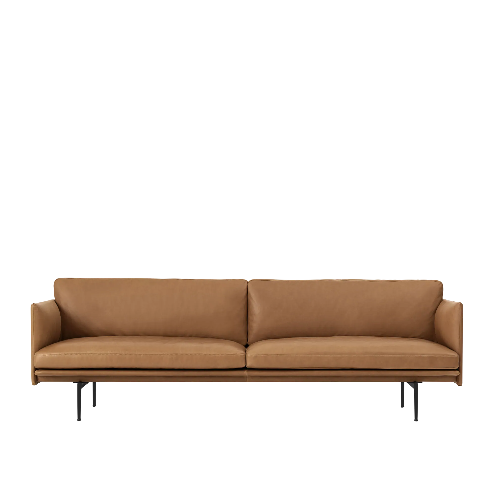

*图：Outline 三人沙发（皮革款），同一形体通过面料与皮革区分价位与场景。图源：[MUUTO 官网 Outline Sofa 产品页](https://muuto.com/product/Outline-Sofa-3-Seater/)。*

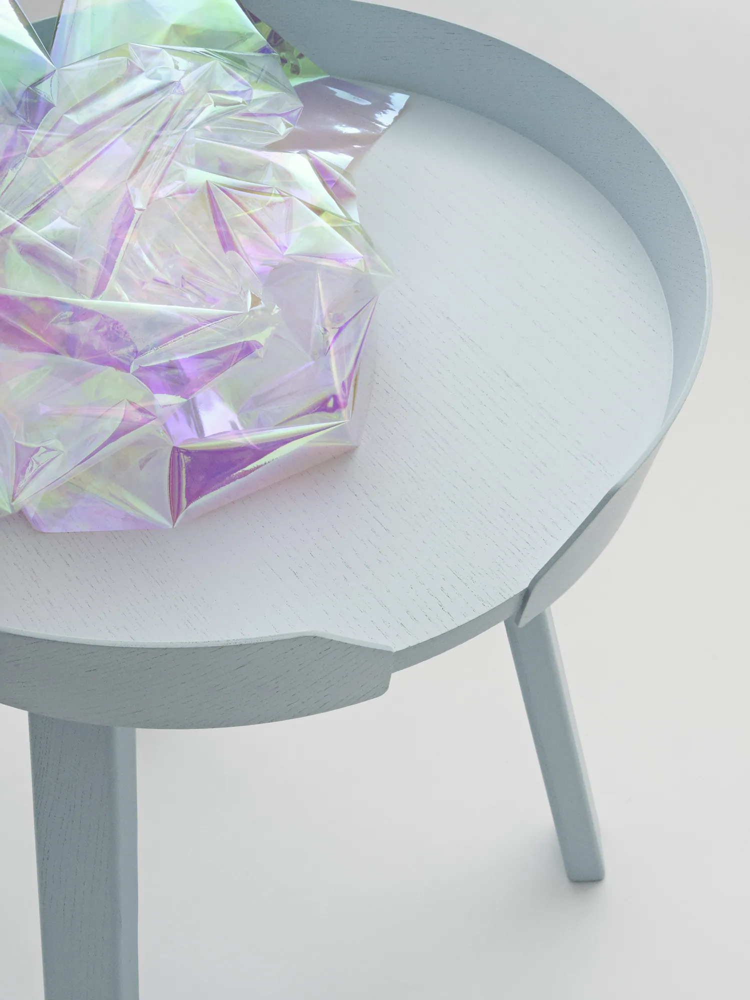

*图：Around 咖啡桌（浅蓝），桌腿与桌面的一体处理是品牌在桌类产品上的典型做法。图源：[MUUTO 官网可持续发展页](https://muuto.com/our-sustainable-perspectives/)。*

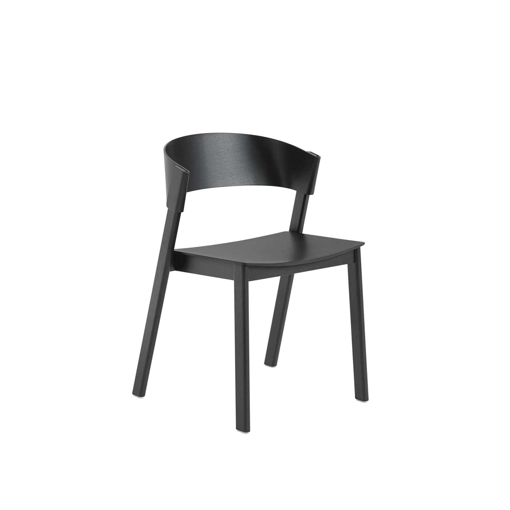

*图：Cover Side Chair（黑色），可堆叠、无软包版本持有 EU Ecolabel 认证。图源：[MUUTO 官网 Cover Armchair 产品页](https://muuto.com/product/Cover-Armchair/)。*

### 中国市场的对照

品牌在中国没有大量铺开零售网点，已知的自营触点是与全球同步的 Muuto Space Shanghai（预约制），产品主要通过设计家具零售商、项目代理与跨境电商进入；官方站点没有中文版本，也没有公开的本地价格表。它的机会在于高端住宅、酒店与办公项目对北欧设计与合规材料的认可，以及中国设计师群体对 FSC、无 PFAS 这类指标的接受度；挑战在于交期与售后由进口链条决定，而本土与代理渠道的设计家具品牌在价格与响应速度上更有优势。中国市场判断，置信度：中。

### 竞争小结

Muuto 的护城河不在单件产品，而在三处：一是把北欧设计的语言、材料工艺与合规指标绑成一条完整叙事，让"好看"变成可核查的采购理由；二是与固定设计师群体的长期合作，保证产品线在审美上不掉队；三是集团渠道带来的项目可见度。它最脆弱的地方是产品形体的可复制性——一旦同价位品牌在材料与认证上追平，竞争会回到价格与交期。

## 12 Strategy 战略：产品与品牌层面的判断

### 技术路线与产品规划

Muuto 的技术路线可以概括为"可复制的材料工艺 + 可配置的系统"。第一条主线是材料替代与工艺升级：木皮折包、回收塑料与木纤维复合、纤维喷涂灯罩、手工旋压铝与手工吹制玻璃，全部要求能在欧洲供应链上稳定复现。第二条主线是系统化：收纳（Stacked、Compile、Linear System）、沙发（Connect、In Situ、Outline）、桌（Midst、Workshop）与灯具都在做"可增减的配置"，而不是单件型号，这与项目渠道的采购方式直接对接。第三条是合规前置：FSC、无 PFAS、BIFMA、生态标签被写进产品定义阶段，而不是事后补证。

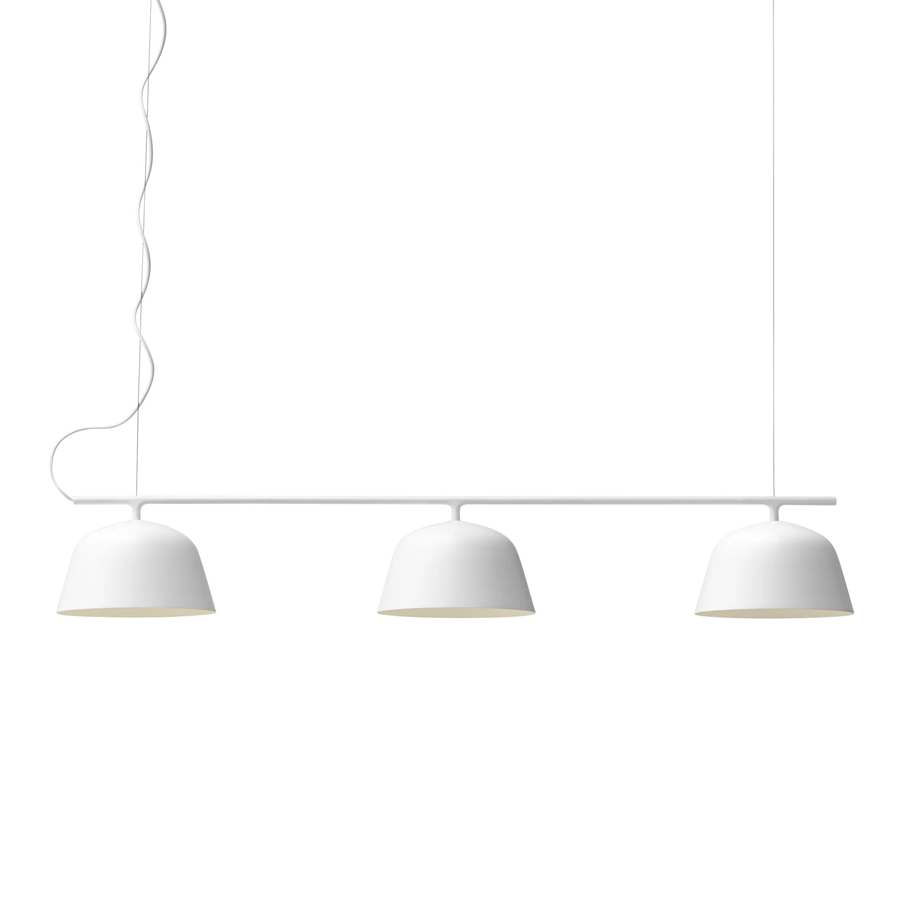

*图：Ambit 灯具白色款，手工旋压铝灯罩与内白涂层是品牌在金属工艺上的代表处理。图源：[MUUTO 官网 Ambit Rail Lamp 产品页](https://muuto.com/product/Ambit-Rail-Lamp/)。*

### 定位与品类路线的演进

品牌定位经历三次位移：2006 至 2013 年是"新北欧"的生活方式品牌，靠灯具与配件进入市场；2014 至 2018 年在资本注入与集团并购后转向更宽的品类与项目市场，开始做模块沙发与系统收纳；2019 年以后把"神经美学"与"可持续指标"作为叙事核心，把产品从"好看的家居"推进到"有依据的空间设计"。每一次位移都伴随品类扩张：从配件到灯、从灯到椅、从椅到沙发与整间系统。

### 设计语言与材料体系的演进

设计语言的骨架没有大改——圆角、细腿、无可见螺钉、低饱和配色——变化发生在材料层：木从实木扩展到木皮折包与染色木材；塑料从原生扩展到回收复合；金属从通用件扩展到手工旋压与粉末喷涂；陶瓷与玻璃进入配件与限量作品。这条路径把"北欧"从材料印象（浅色木）改写成工艺清单，好处是设计师可以核对，代价是叙事门槛提高——它的卖点需要解释，而不像颜色那样一眼可见。

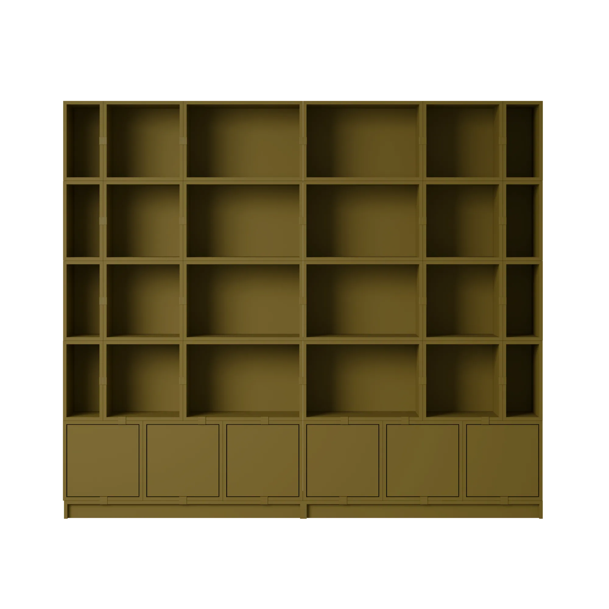

*图：Stacked 收纳系统的书柜配置，模块按需叠加，是品牌最早的系统化产品线之一。图源：[MUUTO 官网 Stacked 收纳系统产品页](https://muuto.com/product/Stacked-Storage-System-Bookcase/)。*

### 品牌影响力与行业坐标

影响力可以从四条线看。奖项与机制：早期靠北欧学生设计奖项发掘新人，2012 年获奖的 Nerd Chair 进入量产，2024 年升级为面向全球的设计竞赛，评审引入设计与科技行业的跨界人物。媒体：设计媒体对其材料与工艺更新持续报道，2022 年的回收塑料版本是报道最集中的一次。渠道：欧洲、北美与亚洲布局十几处 Muuto Space 与旗舰店，其中巴黎、东京、首尔、台北为核心，上海以预约制运行。文化与项目：二十周年（2026）把周年做成跨城市的限量发行与对谈，品牌把"下一章北欧设计"作为公共话题来经营，这一动作把营销预算换成了行业话题度。

### 关键取舍与风险

三个关键取舍：一是用"适应环境"换辨识度，代价是单件产品的存在感弱；二是用可复制的工艺换手工感，代价是高端用户对"手作价值"的期待部分落空；三是用集团渠道换独立性，代价是品牌在集团内部要与 HAY 等姊妹品牌区分定位，容易出现产品与价格的重叠。

四条可验证风险：材料成本（回收料来源单一、FSC 木材与欧洲制造的价格波动直接影响毛利）；交期与产能（依赖欧洲供应链，跨洲交付在项目招标中容易被本地现货品牌挤掉）；可复制性（形体与配色门槛不高，材料与合规一旦被追平，竞争回到价格）；叙事依赖（神经美学与合规指标需要持续投入研究、测试与传播，一旦停止更新，品牌的差异化理由会迅速变薄）。另有两条信息层面的弱点：集团不单独披露 Muuto 的经营数据，外部难以评估其真实增长；中文市场缺少本地化内容与价格体系，削弱了在中文项目中的说服力。战略结论，置信度：中。

## 13 视频与访谈资料

本次检索未取得可直接引用的官方影片页面或完整访谈视频条目：品牌的内容主要以官网故事页、可持续页、神经美学长文与设计媒体的采访报道形式存在，官方社交渠道为 Instagram（@muutodesign）、Pinterest（pinterest.com/muuto）、Facebook 与 LinkedIn。以下是可追溯到原文的访谈与报道线索：

- Fiber Chair 回收塑料版本：品牌对材料转向的完整表述见 Dezeen 报道（2022 年 2 月）；
- Strand 灯具：设计师 Benjamin Hubert 对合作与产品的表述见 Dezeen 报道（2019 年 9 月）；
- In Situ 模块沙发：Anderssen & Voll 的设计说明见 Dezeen 报道（2020 年 4 月）；
- 设计竞赛：首席营销官 Line Brockmann Juhl 的表述与评审名单见 Dezeen 报道（2024 年 6 月）。

视频类的资料缺口在此如实标注，未以图片或转述替代。

## 14 来源与延伸阅读

### 官方资料

- MUUTO 官网：[https://muuto.com](https://muuto.com)
- 品牌故事（Our Story）：[https://muuto.com/content/about/our-story-a-space-that-just-feels-right/](https://muuto.com/content/about/our-story-a-space-that-just-feels-right/)
- 可持续发展页（含各项公开指标）：[https://muuto.com/our-sustainable-perspectives/](https://muuto.com/our-sustainable-perspectives/)
- 神经美学专题（五项原则与合作研究）：[https://muuto.com/neuroaesthetics/](https://muuto.com/neuroaesthetics/)
- 二十周年活动与限量发行：[https://muuto.com/20-years-activations/](https://muuto.com/20-years-activations/)
- 设计竞赛：[https://muuto.com/about-design-contest/](https://muuto.com/about-design-contest/)
- 媒体与新闻联络页：[https://muuto.com/content/contact2/press/](https://muuto.com/content/contact2/press/)
- 产品与系列页（示例）：[Fiber Armchair Swivel Base](https://muuto.com/product/Fiber-Armchair-Swivel-Base/)、[Cover Armchair](https://muuto.com/product/Cover-Armchair/)、[Strand Pendant Lamp](https://muuto.com/product/Strand-Pendant-Lamp/)、[Post Floor Lamp](https://muuto.com/product/Post-Floor-Lamp/)、[Kink Vase](https://muuto.com/product/Kink-Vase/)、[In Situ Modular Sofa](https://muuto.com/product/In-Situ-Modular-Sofa-3-Seater-Configurations/)、[Nerd Chair](https://muuto.com/product/Nerd-Chair/)、[Stacked Storage System](https://muuto.com/product/Stacked-Storage-System-Bookcase/)

### 集团与母公司档案

- MillerKnoll 2026 财年 Form 10-K（美国证券交易委员会）：[https://www.sec.gov/Archives/edgar/data/66382/000006638226000092/mlkn-20260530.htm](https://www.sec.gov/Archives/edgar/data/66382/000006638226000092/mlkn-20260530.htm)
- MillerKnoll 公司页：[https://www.millerknoll.com](https://www.millerknoll.com)

### 设计媒体与报道

- Dezeen｜Muuto 以回收塑料重启 Fiber Chair（2022-02-23）：[https://www.dezeen.com/2022/02/23/mutto-relaunches-fiber-chair-recycled-plastic/](https://www.dezeen.com/2022/02/23/mutto-relaunches-fiber-chair-recycled-plastic/)
- Dezeen｜Earnest Studio 的 Post 灯与 Kink 花瓶（2020-02-01）：[https://www.dezeen.com/2020/02/01/muuto-earnest-studio-post-lamp-kink-vase-design/](https://www.dezeen.com/2020/02/01/muuto-earnest-studio-post-lamp-kink-vase-design/)
- Dezeen｜In Situ 模块沙发（2020-04-28）：[https://www.dezeen.com/2020/04/28/in-situ-modular-sofa-anderssen-voll-muuto-launches-vdf-products-fair/](https://www.dezeen.com/2020/04/28/in-situ-modular-sofa-anderssen-voll-muuto-launches-vdf-products-fair/)
- Dezeen｜Cover Side Chair 与 Thomas Bentzen 的工艺表述（2020-03-05）：[https://www.dezeen.com/2020/03/05/muuto-cover-side-chair-thomas-bentzen/](https://www.dezeen.com/2020/03/05/muuto-cover-side-chair-thomas-bentzen/)
- Dezeen｜Layer 的 Strand 吊灯（2019-09-03）：[https://www.dezeen.com/2019/09/03/layer-benjamin-hubert-pendant-lamps-muuto/](https://www.dezeen.com/2019/09/03/layer-benjamin-hubert-pendant-lamps-muuto/)
- Dezeen｜Muuto 设计竞赛与评审（2024-06-12）：[https://www.dezeen.com/2024/06/12/muuto-design-competition-new-perspectives/](https://www.dezeen.com/2024/06/12/muuto-design-competition-new-perspectives/)
- Dezeen｜Muuto 标签页（历年报道汇总）：[https://www.dezeen.com/tag/muuto/](https://www.dezeen.com/tag/muuto/)

### 百科与档案

- Wikipedia｜Muuto（含 2006 年创立、2014 年股权变更、2017 年 Knoll 收购等信息）：[https://en.wikipedia.org/wiki/Muuto](https://en.wikipedia.org/wiki/Muuto)
- Wikipedia｜MillerKnoll（子公司清单含 Muuto 与 HAY）：[https://en.wikipedia.org/wiki/MillerKnoll](https://en.wikipedia.org/wiki/MillerKnoll)
- Internet Archive CDX（用于核对早期产品页是否存在）：[https://web.archive.org/cdx/search/cdx?url=muuto.com&matchType=domain&filter=original:.*stacked.*](https://web.archive.org/cdx/search/cdx?url=muuto.com&matchType=domain&filter=original:.*stacked.*)

### 官方社交渠道

- Instagram：[https://www.instagram.com/muutodesign/](https://www.instagram.com/muutodesign/)
- Pinterest：[https://pinterest.com/muuto/](https://pinterest.com/muuto/)
- LinkedIn：[https://www.linkedin.com/company/muuto/](https://www.linkedin.com/company/muuto/)

## 15 分析附录

### 产品组合矩阵

| 类别 | 代表系列 | 主要设计师 | 角色与说明 |
|---|---|---|---|
| 椅与凳 | Fiber、Cover、Visu、Nerd、Workshop | Iskos-Berlin、Thomas Bentzen、Mika Tolvanen、David Geckeler、Cecilie Manz | 覆盖家用与合同场景，可堆叠、可多底座，是品牌的走量基础 |
| 沙发与模块系统 | Outline、In Situ、Connect、Oslo、Settle、Wrap | Anderssen & Voll、Normal Studio | 高价段与项目入口，强调配置自由度与座深 |
| 桌几 | Midst、Couple、Around、Soft Table、Workshop Table、Earnest | TAF Studio、Sylvain Willenz、John Tree、Cecilie Manz | 与沙发、椅子成套销售，材料从实木到大理石 |
| 收纳系统 | Stacked、Compile、Linear System | Julien De Smedt、Cecilie Manz、Thomas Bentzen | 系统化产品，按模数增减，项目与办公场景的主力 |
| 灯具 | Ambit、Strand、Under The Bell、Unfold、Post、Leaf、Set、Calm | TAF Studio、Benjamin Hubert、Iskos-Berlin、Form Us With Love、Earnest Studio、Jamie Wolfond、Aleksej Iskos | 品牌最早建立辨识度的品类，材料工艺差异最集中 |
| 配件 | The Dots、Kink、Restore、Ridge、Pebble、Mingle | Lars Tornøe、Earnest Studio、Mika Tolvanen、Kaksikko、Margrethe Odgaard | 入门价格带与礼品场景，靠材质组合与系统排布维持溢价 |
| 户外 | Linear Steel、Settle、Outdoor Cover | Thomas Bentzen | 按防腐与排水设计，对接景观与泳池配套 |

### CMF 与工艺速查

| 材料／工艺 | 做法 | 代表产品 | 备注 |
|---|---|---|---|
| 木皮折包 | 整片木皮折过椅腿折包成型，同时锁合部件 | Cover 系列 | 无可见螺钉；无软包版本持 EU Ecolabel |
| 回收复合外壳 | 回收塑料（80% 来自眼镜制造废料）＋FSC 木纤维混压 | Fiber Chair | 官方称该款碳足迹下降约 30% |
| 纤维喷涂 | 纤维聚合物喷附轻钢骨架，硬化后充当扩散罩 | Strand | 体量大、材料薄 |
| 手工旋压铝 | 铝板旋压成罩，内壁白色涂层 | Ambit 系列 | 出光均匀，系列含挂灯、落地与吊灯 |
| 陶瓷与手工玻璃 | 缎面釉陶瓷；穆拉诺手工吹制玻璃 | Kink 花瓶；二十周年限量器物 | 玻璃件接受色差与亮度差异 |
| 面料与皮革 | 固定面料体系＋原厂皮革，提供清洁保养指引 | Outline、Oslo、Wrap 等 | 沙发与椅子共用面料库 |

### 竞品对照

| 品牌 | 归属 | 定位差异 | 直接对位产品 |
|---|---|---|---|
| HAY | MillerKnoll（同集团） | 北欧设计＋更快的新品节奏与更宽的价格带 | About A Chair、Mags 沙发、配件线 |
| &Tradition | 独立（丹麦） | 经典档案重推＋当代合作 | In Between、Rely、Flowerpot、P376 |
| Normann Copenhagen | 独立（丹麦） | 色彩与生活趣味，设计语言更外向 | Form 系列、Amp 灯具 |
| ferm LIVING | 独立（丹麦） | 生活方式延展，软装与配件比重高 | 配件与软装线 |
| Audo Copenhagen | 独立（丹麦） | 整体空间方案与酒店项目 | 收纳、桌与软装系统 |
| Gubi | 独立（丹麦） | 设计史档案与奢侈品化定位 | Multi-Lite、Beetle 等 |
| Vitra／USM／Flos | 独立（瑞士／意大利） | 高端功能主义与建筑属性 | 办公系统、灯具与椅类高端段 |

### 定位图（表格化）

| 维度 | 品牌取值 |
|---|---|
| 价格带 | 中高端设计家具：配件数十至数百欧元，椅子与桌数百至两千欧元，沙发与系统按配置计价 |
| 设计来源 | 外部设计师＋版税制，内部团队定标准 |
| 材料主张 | FSC 木材、回收塑料复合、无 PFAS、可维修备件 |
| 场景定位 | 住宅 + 合同项目双轨（办公、酒店、餐饮、教育） |
| 语言风格 | 低饱和、圆角与折线并用、无可见螺钉、适应环境 |
| 体验主张 | 让空间"感觉刚好合适"，以神经美学五原则为方法 |

### 证据登记

| 结论 | 证据 | 来源 | 来源类型 | 置信度 |
|---|---|---|---|---|
| 品牌创立于 2006 年，创始人为 Byrge 与 Bonnen | 维基百科条目与官方品牌故事 | Wikipedia／muuto.com | 第三方百科＋官方 | 高 |
| 2017 年宣布被 Knoll 以 3 亿美元收购，2018 年 1 月起生效 | 维基百科引丹麦 RetailNews 报道 | Wikipedia（引 RetailNews） | 第三方媒体 | 高 |
| 现属 MillerKnoll，与 HAY 同集团 | MillerKnoll 子公司清单；SEC 10-K | Wikipedia（引 SEC 10-K） | 集团档案 | 高 |
| Fiber Chair 2014 年发布，2022 年改用回收塑料 | Dezeen 报道明确写"originally launched the chair in 2014" | dezeen.com | 第三方媒体 | 高 |
| Fiber 外壳塑料 80% 来自眼镜制造废料 | Dezeen 报道与官方可持续页 | dezeen.com／muuto.com | 媒体＋官方 | 高 |
| 99% 产品已评估 CO₂e、77% 家具通过 BIFMA、1,600+ 备件等指标 | 官方可持续页 | muuto.com | 官方 | 高 |
| Strand 2019 年伦敦设计节发布，是首位英国设计师合作 | Dezeen 报道与维基百科 | dezeen.com／Wikipedia | 媒体＋百科 | 高 |
| Post 灯与 Kink 花瓶为 Earnest Studio 首批作品，2020 年发布 | Dezeen 报道 | dezeen.com | 第三方媒体 | 高 |
| In Situ 模块沙发 2020 年发布，设计者为 Anderssen & Voll | Dezeen 报道 | dezeen.com | 第三方媒体 | 高 |
| Nerd Chair 出自 2012 年品牌学生竞赛首奖 | 维基百科（2012 年获奖名单） | Wikipedia | 第三方百科 | 中（量产年份未见官方条目，仅能确认 2014 年已在产品线） |
| 上海设有 Muuto Space，采用预约制 | 官方展厅页 | muuto.com | 官方 | 高 |
| 品牌未公开单列经营数据 | 集团层面未单独披露；检索未见公开财报 | muuto.com／SEC 文件 | 官方／集团档案 | 中（信息缺口） |
